# Message Queue Systems

## Introduction

Message queues are fundamental building blocks of asynchronous communication in distributed systems. They act as intermediaries between producers (senders) and consumers (receivers), providing reliable message delivery, load balancing, and decoupling of system components.

## Core Concepts

### Message Queue Fundamentals

A message queue is a form of asynchronous service-to-service communication where messages are stored in a queue until they are processed and deleted.

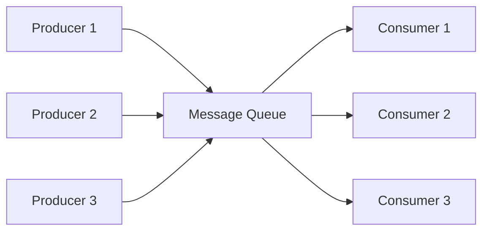

### Key Components

- **Producer**: Service that sends messages to the queue
- **Queue**: Storage mechanism for messages
- **Consumer**: Service that receives and processes messages
- **Message**: Data payload with metadata
- **Broker**: System that manages queues and message routing

## Message Queue Patterns

### Point-to-Point (Queue Model)

Each message is consumed by exactly one consumer.

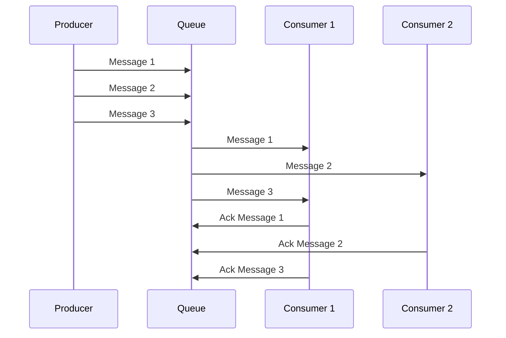

**Characteristics:**
- One-to-one message delivery
- Load balancing across consumers
- Message consumed only once
- Good for work distribution

### Work Queue Pattern

Multiple workers process tasks from a shared queue.

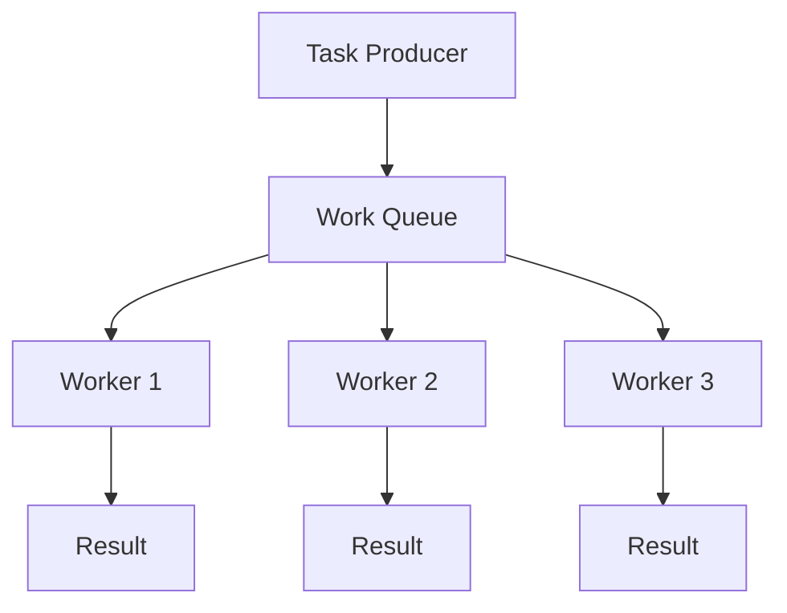

**Use Cases:**
- Image processing
- Email sending
- Report generation
- Data processing jobs

## Message Delivery Guarantees

### At-Most-Once Delivery

Messages are delivered zero or one time. No duplicates, but messages may be lost.

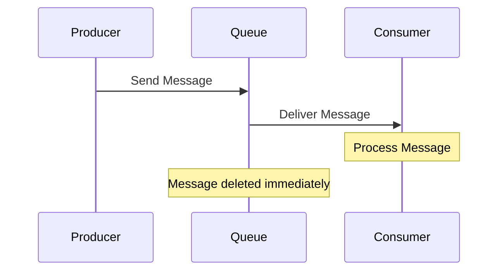

**Pros:** No duplicates, simple implementation
**Cons:** Possible message loss
**Use Case:** Metrics, logs where occasional loss is acceptable

### At-Least-Once Delivery

Messages are delivered one or more times. No message loss, but duplicates possible.

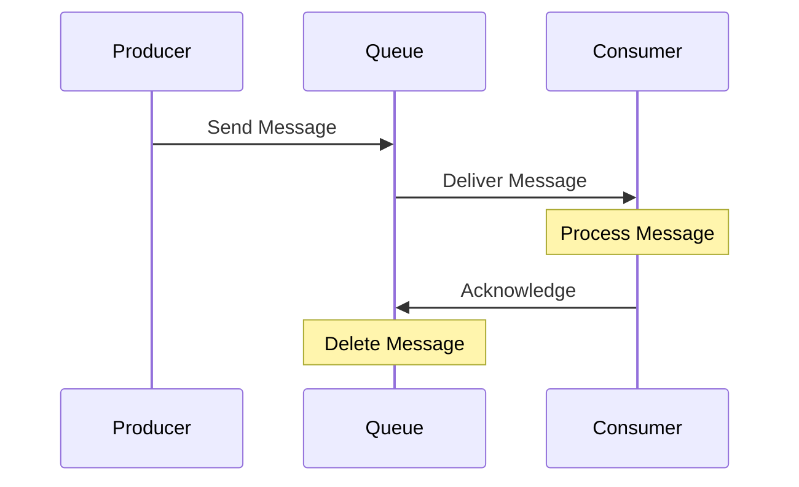

**Pros:** No message loss, reliable delivery
**Cons:** Possible duplicates, requires idempotent processing
**Use Case:** Order processing, payment notifications

### Exactly-Once Delivery

Messages are delivered exactly one time. No loss, no duplicates.

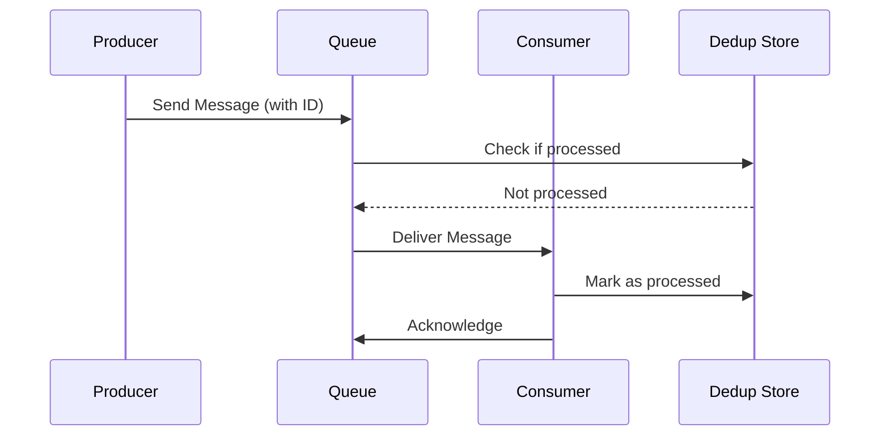

**Pros:** Perfect delivery guarantee
**Cons:** Complex implementation, performance overhead
**Use Case:** Financial transactions, critical business operations

## Popular Message Queue Technologies

### RabbitMQ

**Type:** Traditional message broker
**Protocol:** AMQP (Advanced Message Queuing Protocol)

#### Key Features
- Multiple messaging patterns (queues, topics, routing)
- Message persistence and durability
- Clustering and high availability
- Management UI and monitoring
- Plugin ecosystem

#### Architecture
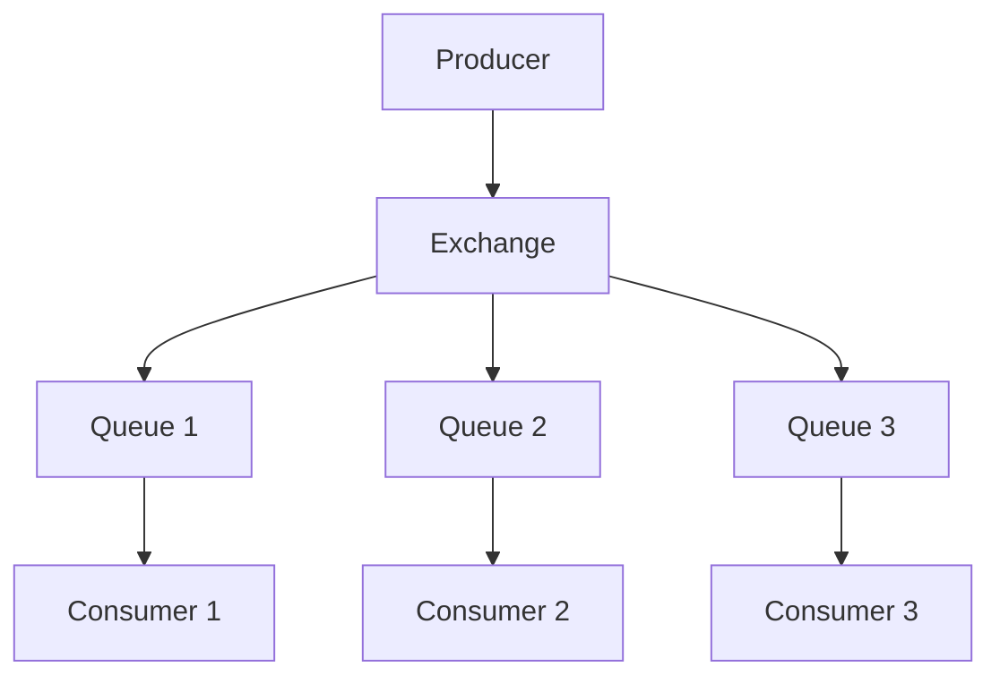

#### Use Cases
- Complex routing requirements
- Traditional enterprise applications
- Moderate throughput requirements
- Strong consistency needs

#### Pros and Cons
| Pros | Cons |
|------|------|
| Rich feature set | Lower throughput than Kafka |
| Easy to set up | Single point of failure |
| Flexible routing | Memory-based storage |
| Strong consistency | Limited horizontal scaling |

### Apache Kafka

**Type:** Distributed streaming platform
**Protocol:** Custom TCP protocol

#### Key Features
- High throughput and low latency
- Horizontal scalability
- Message persistence and replay
- Stream processing capabilities
- Distributed architecture

#### Architecture
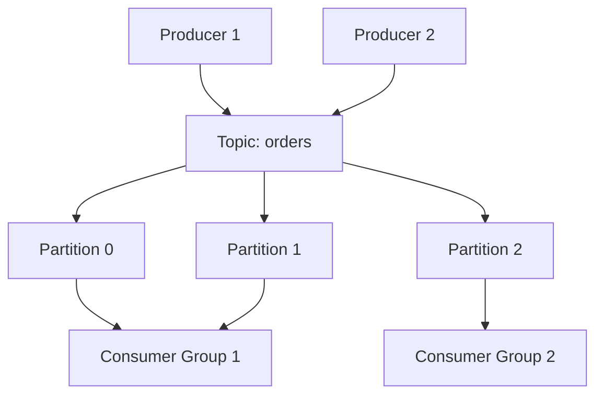

#### Use Cases
- High-throughput data streaming
- Event sourcing and CQRS
- Real-time analytics
- Log aggregation
- Microservices communication

#### Pros and Cons
| Pros | Cons |
|------|------|
| Very high throughput | Complex setup and operations |
| Horizontal scaling | Steep learning curve |
| Message replay capability | Over-engineered for simple use cases |
| Stream processing | Requires ZooKeeper (pre-2.8) |

### Amazon SQS

**Type:** Fully managed cloud service
**Protocol:** HTTP/HTTPS REST API

#### Key Features
- Fully managed (no infrastructure)
- Automatic scaling
- Dead letter queues
- Message visibility timeout
- FIFO and standard queues

#### Queue Types

**Standard Queues:**
- Nearly unlimited throughput
- At-least-once delivery
- Best-effort ordering

**FIFO Queues:**
- Exactly-once processing
- First-in-first-out delivery
- Limited throughput (300 TPS)

#### Use Cases
- AWS-native applications
- Variable workloads
- Simple messaging needs
- Serverless architectures

#### Pros and Cons
| Pros | Cons |
|------|------|
| No infrastructure management | AWS vendor lock-in |
| Automatic scaling | Limited customization |
| Pay-per-use pricing | Network latency for API calls |
| Integration with AWS services | Limited advanced features |

### Redis Pub/Sub

**Type:** In-memory data structure store
**Protocol:** Redis protocol (RESP)

#### Key Features
- In-memory performance
- Simple pub/sub model
- Pattern-based subscriptions
- Lua scripting support
- Clustering capabilities

#### Use Cases
- Real-time notifications
- Chat applications
- Live updates
- Caching with notifications

#### Pros and Cons
| Pros | Cons |
|------|------|
| Very low latency | No message persistence |
| Simple to use | Limited scalability |
| High performance | Fire-and-forget delivery |
| Multiple data structures | Single-threaded processing |

## Technology Comparison Matrix

| Feature | RabbitMQ | Apache Kafka | Amazon SQS | Redis Pub/Sub |
|---------|----------|--------------|------------|---------------|
| **Throughput** | Medium | Very High | High | High |
| **Latency** | Low | Low | Medium | Very Low |
| **Persistence** | Yes | Yes | Yes | No |
| **Ordering** | Yes | Yes | FIFO only | No |
| **Scalability** | Vertical | Horizontal | Auto | Limited |
| **Complexity** | Medium | High | Low | Low |
| **Message Replay** | Limited | Yes | No | No |
| **Multi-tenancy** | Yes | Yes | Yes | Limited |
| **Monitoring** | Excellent | Good | AWS CloudWatch | Basic |
| **Cost** | Self-hosted | Self-hosted | Pay-per-use | Self-hosted |

## Message Queue Design Patterns

### Dead Letter Queue (DLQ)

Handle messages that cannot be processed successfully.

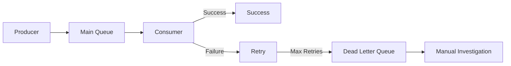

**Implementation Example:**
```python
def process_message(message):
    try:
        # Process message
        business_logic(message)
        acknowledge_message(message)
    except RetryableError as e:
        if message.retry_count < MAX_RETRIES:
            message.retry_count += 1
            requeue_message(message)
        else:
            send_to_dlq(message, str(e))
    except FatalError as e:
        send_to_dlq(message, str(e))
```

### Priority Queues

Process high-priority messages first.

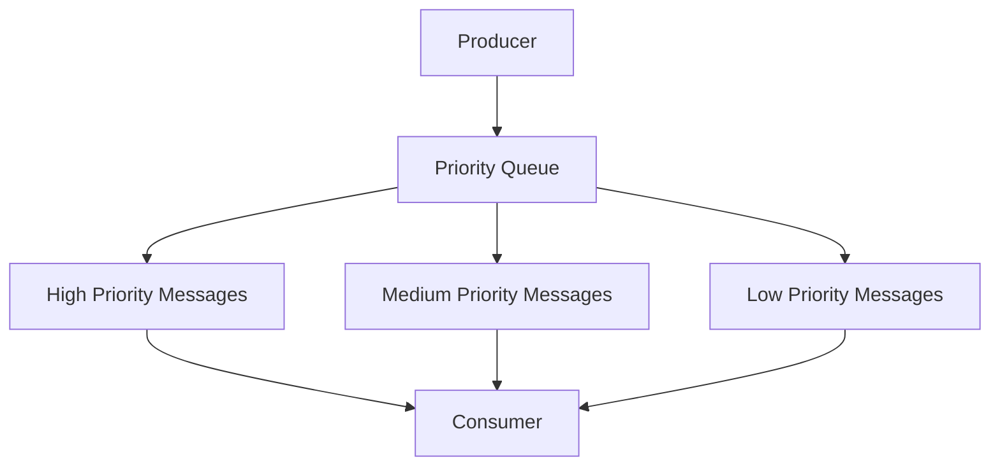

### Message Routing

Route messages based on content or metadata.

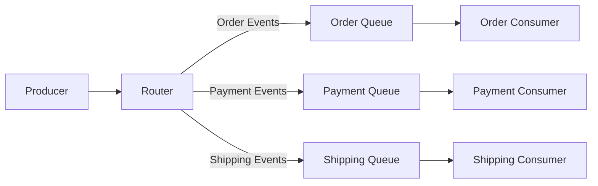

## Best Practices

### Message Design

1. **Keep messages small and focused**
   - Include only necessary data
   - Use references for large payloads
   - Consider message size limits

2. **Use structured formats**
   - JSON for flexibility
   - Avro/Protobuf for performance
   - Include schema versioning

3. **Add metadata**
   - Message ID for deduplication
   - Timestamp for ordering
   - Correlation ID for tracing

### Queue Configuration

1. **Set appropriate timeouts**
   - Visibility timeout for processing time
   - Message TTL to prevent accumulation
   - Connection timeouts for reliability

2. **Configure dead letter queues**
   - Set maximum retry attempts
   - Monitor DLQ for issues
   - Implement DLQ processing

3. **Monitor queue metrics**
   - Queue depth and age
   - Processing rates
   - Error rates and patterns

### Consumer Implementation

1. **Design for idempotency**
   ```python
   def process_order(order_id):
       if is_already_processed(order_id):
           return  # Skip duplicate
       
       # Process order
       result = process_business_logic(order_id)
       mark_as_processed(order_id)
       return result
   ```

2. **Implement graceful shutdown**
   ```python
   def graceful_shutdown():
       stop_accepting_new_messages()
       wait_for_current_messages_to_complete()
       close_connections()
   ```

3. **Handle backpressure**
   - Limit concurrent message processing
   - Implement circuit breakers
   - Scale consumers based on queue depth

## Monitoring and Observability

### Key Metrics

1. **Queue Metrics**
   - Messages in queue
   - Message age
   - Queue growth rate

2. **Processing Metrics**
   - Messages processed per second
   - Processing latency
   - Error rates

3. **Consumer Metrics**
   - Consumer lag
   - Active consumers
   - Processing time distribution

### Alerting Strategies

```yaml
alerts:
  - name: HighQueueDepth
    condition: queue_depth > 1000
    action: scale_consumers
    
  - name: HighErrorRate
    condition: error_rate > 5%
    action: investigate_and_alert
    
  - name: ConsumerLag
    condition: consumer_lag > 60s
    action: check_consumer_health
```

## Common Pitfalls and Solutions

### Message Loss
**Problem:** Messages disappear without processing
**Solutions:**
- Use persistent queues
- Implement proper acknowledgments
- Monitor dead letter queues

### Message Duplication
**Problem:** Same message processed multiple times
**Solutions:**
- Design idempotent consumers
- Use exactly-once delivery when available
- Implement deduplication logic

### Queue Buildup
**Problem:** Messages accumulate faster than processing
**Solutions:**
- Scale consumers horizontally
- Optimize message processing
- Implement backpressure handling

### Ordering Issues
**Problem:** Messages processed out of order
**Solutions:**
- Use single-threaded consumers for strict ordering
- Partition messages by key
- Design for eventual consistency

## Real-World Implementation Example

### E-commerce Order Processing System

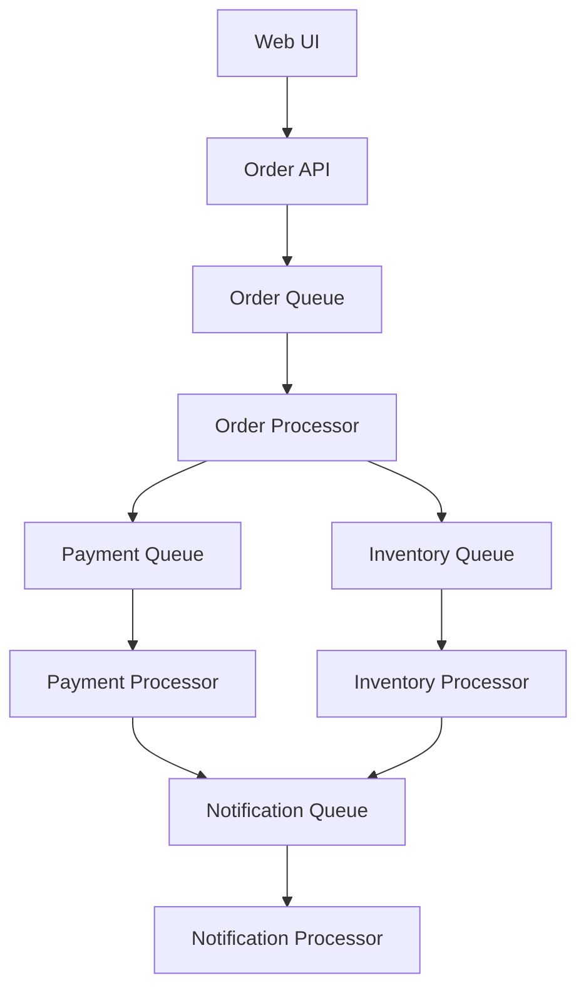

**Queue Configuration:**
- **Order Queue**: High throughput, at-least-once delivery
- **Payment Queue**: FIFO, exactly-once processing
- **Inventory Queue**: Priority queue for stock updates
- **Notification Queue**: Standard queue, at-most-once delivery

This architecture provides:
- Loose coupling between services
- Independent scaling of components
- Resilience to service failures
- Audit trail through message logs

Message queues are essential for building scalable, resilient distributed systems. Choose the right technology based on your specific requirements for throughput, consistency, and operational complexity.