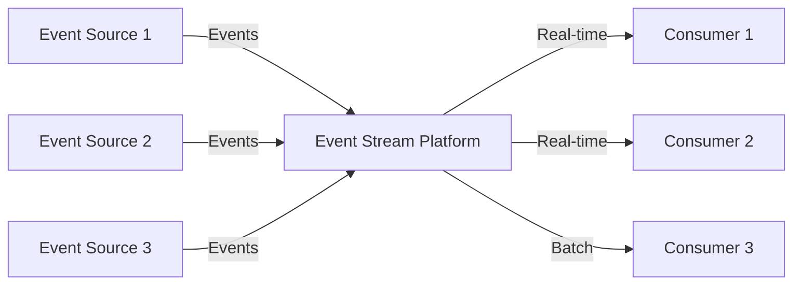
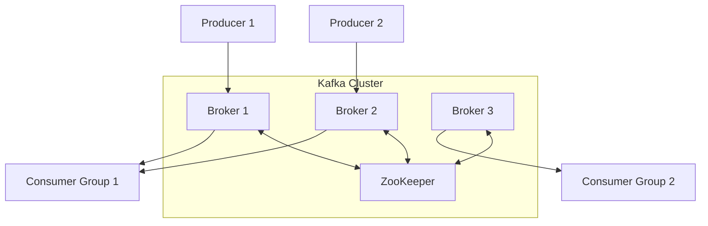
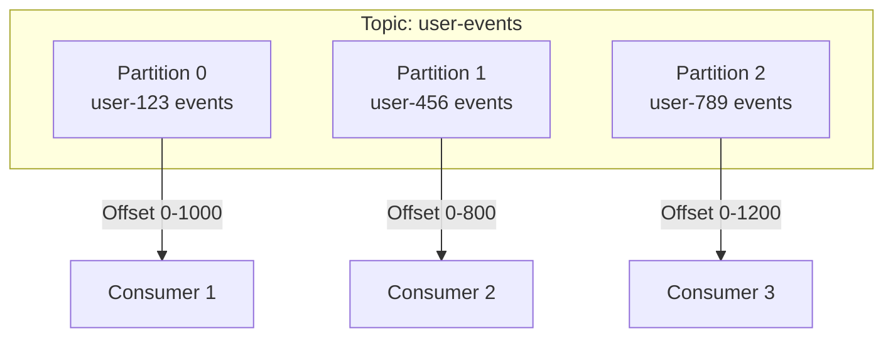
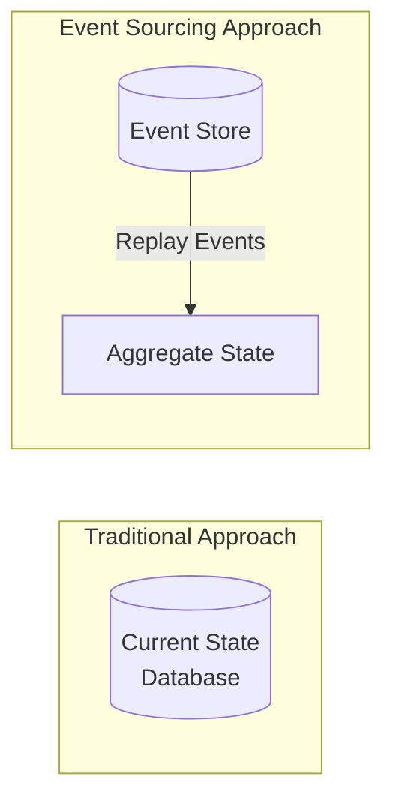
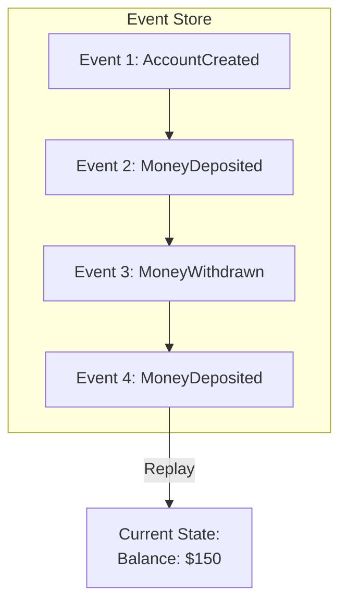
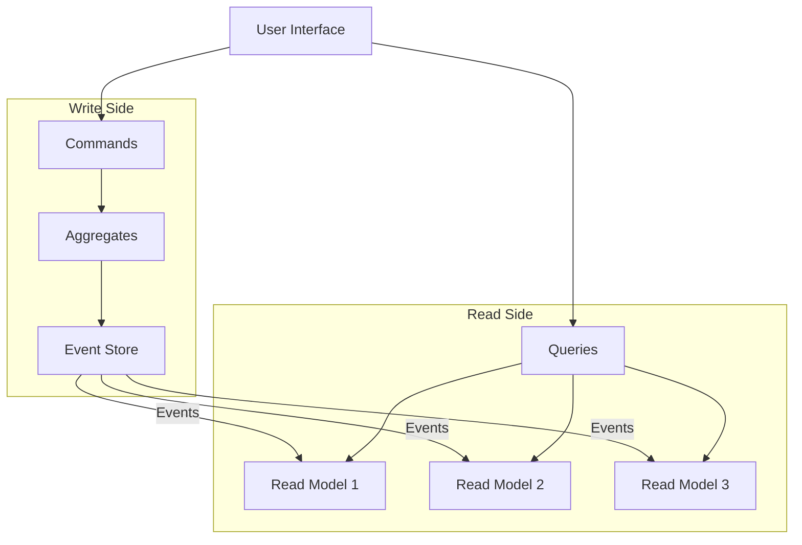
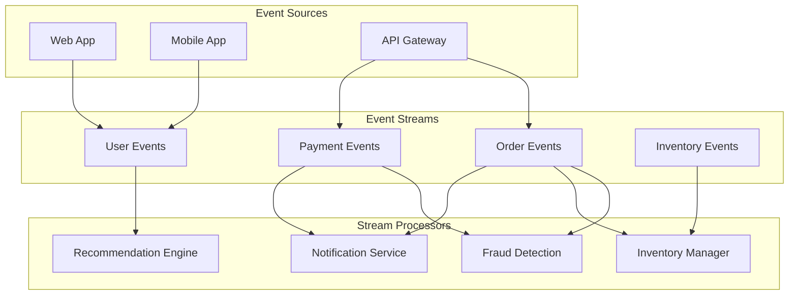
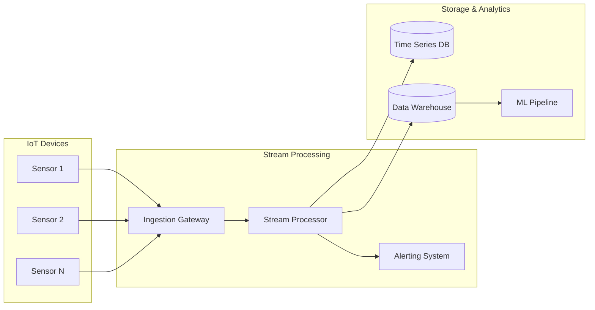

# Event Streaming & Event Sourcing

## Introduction

Event streaming represents a paradigm shift from traditional request-response communication to event-driven architectures. Instead of asking for data when needed, systems react to events as they occur, enabling real-time processing and better scalability.

Event sourcing takes this further by storing all changes as a sequence of events, providing a complete audit trail and enabling powerful capabilities like time travel and replay.

## Event Streaming Fundamentals

### What is Event Streaming?

Event streaming is the practice of capturing data in real-time from event sources like databases, sensors, mobile devices, and applications in the form of streams of events.



### Key Concepts

**Event**: An immutable record of something that happened
**Stream**: A continuous flow of events
**Topic**: A category or feed name to which events are published
**Partition**: A subset of a topic for parallel processing
**Offset**: A unique identifier for each event in a partition

### Event Anatomy

```json
{
  "eventId": "uuid-12345",
  "eventType": "OrderCreated",
  "timestamp": "2024-01-15T10:30:00Z",
  "source": "order-service",
  "version": "1.0",
  "data": {
    "orderId": "order-789",
    "customerId": "customer-456",
    "amount": 99.99,
    "items": [...]
  },
  "metadata": {
    "correlationId": "trace-abc123",
    "causationId": "command-xyz789"
  }
}
```

## Apache Kafka Deep Dive

### Kafka Architecture



### Topics and Partitions



### Producer Configuration

```python
from kafka import KafkaProducer
import json

producer = KafkaProducer(
    bootstrap_servers=['localhost:9092'],
    value_serializer=lambda v: json.dumps(v).encode('utf-8'),
    key_serializer=lambda k: k.encode('utf-8'),
    # Delivery guarantees
    acks='all',  # Wait for all replicas
    retries=3,
    # Performance tuning
    batch_size=16384,
    linger_ms=10,
    compression_type='gzip'
)

# Send event with key for partitioning
event = {
    "eventType": "UserRegistered",
    "userId": "user-123",
    "timestamp": "2024-01-15T10:30:00Z",
    "data": {"email": "user@example.com"}
}

producer.send(
    topic='user-events',
    key='user-123',  # Ensures all user-123 events go to same partition
    value=event
)
```

### Consumer Implementation

```python
from kafka import KafkaConsumer
import json

consumer = KafkaConsumer(
    'user-events',
    bootstrap_servers=['localhost:9092'],
    group_id='user-processor-group',
    value_deserializer=lambda m: json.loads(m.decode('utf-8')),
    # Offset management
    auto_offset_reset='earliest',
    enable_auto_commit=False,  # Manual commit for reliability
    # Performance tuning
    fetch_min_bytes=1024,
    max_poll_records=100
)

for message in consumer:
    try:
        event = message.value
        process_user_event(event)
        # Commit offset after successful processing
        consumer.commit()
    except Exception as e:
        logger.error(f"Failed to process event: {e}")
        # Handle error (retry, DLQ, etc.)
```

## Event Sourcing Pattern

### Core Principles

Event sourcing stores all changes to application state as a sequence of events. Instead of storing current state, we store the events that led to that state.



### Event Store Structure



### Implementation Example

```python
class BankAccount:
    def __init__(self, account_id):
        self.account_id = account_id
        self.balance = 0
        self.version = 0
        self.uncommitted_events = []
    
    def deposit(self, amount):
        if amount <= 0:
            raise ValueError("Amount must be positive")
        
        event = MoneyDepositedEvent(
            account_id=self.account_id,
            amount=amount,
            timestamp=datetime.utcnow(),
            version=self.version + 1
        )
        
        self.apply_event(event)
        self.uncommitted_events.append(event)
    
    def withdraw(self, amount):
        if amount <= 0:
            raise ValueError("Amount must be positive")
        if amount > self.balance:
            raise ValueError("Insufficient funds")
        
        event = MoneyWithdrawnEvent(
            account_id=self.account_id,
            amount=amount,
            timestamp=datetime.utcnow(),
            version=self.version + 1
        )
        
        self.apply_event(event)
        self.uncommitted_events.append(event)
    
    def apply_event(self, event):
        if isinstance(event, AccountCreatedEvent):
            self.balance = 0
        elif isinstance(event, MoneyDepositedEvent):
            self.balance += event.amount
        elif isinstance(event, MoneyWithdrawnEvent):
            self.balance -= event.amount
        
        self.version = event.version

class EventStore:
    def save_events(self, aggregate_id, events, expected_version):
        # Optimistic concurrency control
        current_version = self.get_current_version(aggregate_id)
        if current_version != expected_version:
            raise ConcurrencyException()
        
        for event in events:
            self.append_event(aggregate_id, event)
    
    def get_events(self, aggregate_id, from_version=0):
        return self.load_events(aggregate_id, from_version)
    
    def replay_aggregate(self, aggregate_class, aggregate_id):
        events = self.get_events(aggregate_id)
        aggregate = aggregate_class(aggregate_id)
        
        for event in events:
            aggregate.apply_event(event)
        
        return aggregate
```

### Benefits of Event Sourcing

✅ **Complete Audit Trail**
- Every change is recorded
- Perfect for compliance and debugging
- Temporal queries possible

✅ **Time Travel**
- Reconstruct state at any point in time
- Analyze historical trends
- Debug production issues

✅ **Event Replay**
- Rebuild projections from events
- Test new business logic on historical data
- Recover from data corruption

✅ **Scalability**
- Read models can be optimized separately
- Multiple projections from same events
- Natural partitioning by aggregate

### Challenges of Event Sourcing

❌ **Complexity**
- Learning curve for developers
- More complex than CRUD operations
- Event versioning challenges

❌ **Storage Requirements**
- Events accumulate over time
- Snapshots needed for performance
- Archival strategies required

❌ **Eventual Consistency**
- Projections may lag behind events
- Complex queries across aggregates
- Coordination between bounded contexts

## CQRS (Command Query Responsibility Segregation)

Event sourcing often pairs with CQRS to separate read and write models.



### CQRS Implementation

```python
# Command Side
class CreateOrderCommand:
    def __init__(self, customer_id, items):
        self.customer_id = customer_id
        self.items = items

class OrderCommandHandler:
    def handle(self, command):
        order = Order.create(command.customer_id, command.items)
        self.event_store.save_events(
            order.id, 
            order.uncommitted_events, 
            order.version
        )

# Query Side
class OrderProjection:
    def __init__(self):
        self.orders = {}
    
    def handle_order_created(self, event):
        self.orders[event.order_id] = {
            'id': event.order_id,
            'customer_id': event.customer_id,
            'status': 'created',
            'items': event.items,
            'total': event.total
        }
    
    def handle_order_shipped(self, event):
        if event.order_id in self.orders:
            self.orders[event.order_id]['status'] = 'shipped'

class OrderQueryHandler:
    def get_order(self, order_id):
        return self.projection.orders.get(order_id)
    
    def get_orders_by_customer(self, customer_id):
        return [order for order in self.projection.orders.values() 
                if order['customer_id'] == customer_id]
```

## Stream Processing Patterns

### Event Transformation

Transform events as they flow through the system.

```python
from kafka import KafkaConsumer, KafkaProducer

def transform_user_events():
    consumer = KafkaConsumer('raw-user-events')
    producer = KafkaProducer()
    
    for message in consumer:
        raw_event = json.loads(message.value)
        
        # Transform event
        enriched_event = {
            'eventId': raw_event['id'],
            'eventType': 'UserActionEnriched',
            'userId': raw_event['user_id'],
            'action': raw_event['action'],
            'timestamp': raw_event['timestamp'],
            'userSegment': get_user_segment(raw_event['user_id']),
            'location': get_user_location(raw_event['user_id'])
        }
        
        producer.send('enriched-user-events', enriched_event)
```

### Event Aggregation

Combine multiple events into summary events.

```python
def aggregate_user_activity():
    consumer = KafkaConsumer('user-events')
    producer = KafkaProducer()
    
    user_activity = {}
    
    for message in consumer:
        event = json.loads(message.value)
        user_id = event['userId']
        
        if user_id not in user_activity:
            user_activity[user_id] = {
                'page_views': 0,
                'clicks': 0,
                'purchases': 0
            }
        
        # Aggregate based on event type
        if event['eventType'] == 'PageViewed':
            user_activity[user_id]['page_views'] += 1
        elif event['eventType'] == 'ButtonClicked':
            user_activity[user_id]['clicks'] += 1
        elif event['eventType'] == 'PurchaseCompleted':
            user_activity[user_id]['purchases'] += 1
        
        # Emit aggregated event every 100 events
        if sum(user_activity[user_id].values()) % 100 == 0:
            summary_event = {
                'eventType': 'UserActivitySummary',
                'userId': user_id,
                'activity': user_activity[user_id],
                'timestamp': datetime.utcnow().isoformat()
            }
            producer.send('user-activity-summary', summary_event)
```

### Event Filtering

Filter events based on criteria.

```python
def filter_high_value_orders():
    consumer = KafkaConsumer('order-events')
    producer = KafkaProducer()
    
    for message in consumer:
        event = json.loads(message.value)
        
        if (event['eventType'] == 'OrderCreated' and 
            event['data']['total'] > 1000):
            
            high_value_event = {
                'eventType': 'HighValueOrderCreated',
                'orderId': event['data']['orderId'],
                'customerId': event['data']['customerId'],
                'total': event['data']['total'],
                'timestamp': event['timestamp']
            }
            
            producer.send('high-value-orders', high_value_event)
```

## Real-World Use Cases

### E-commerce Platform



**Event Types:**
- User events: page views, searches, clicks
- Order events: created, updated, cancelled, shipped
- Payment events: initiated, completed, failed
- Inventory events: stock updated, low stock alerts

### IoT Data Processing



## Best Practices

### Event Design

1. **Make events immutable**
   - Never modify published events
   - Use event versioning for schema changes
   - Include all necessary context

2. **Use meaningful event names**
   - Past tense verbs (OrderCreated, not CreateOrder)
   - Domain-specific language
   - Consistent naming conventions

3. **Include correlation IDs**
   - Trace requests across services
   - Enable distributed debugging
   - Support audit requirements

### Stream Processing

1. **Design for idempotency**
   ```python
   def process_order_event(event):
       order_id = event['orderId']
       
       # Check if already processed
       if is_already_processed(order_id, event['eventId']):
           return
       
       # Process event
       result = process_order(event)
       
       # Mark as processed
       mark_as_processed(order_id, event['eventId'])
   ```

2. **Handle late-arriving events**
   - Use event timestamps, not processing time
   - Implement windowing strategies
   - Consider out-of-order processing

3. **Monitor stream health**
   - Track processing lag
   - Monitor error rates
   - Alert on stream failures

### Event Store Management

1. **Implement snapshotting**
   ```python
   class SnapshotStore:
       def save_snapshot(self, aggregate_id, snapshot, version):
           self.store[aggregate_id] = {
               'data': snapshot,
               'version': version,
               'timestamp': datetime.utcnow()
           }
       
       def get_snapshot(self, aggregate_id):
           return self.store.get(aggregate_id)
   
   def load_aggregate_with_snapshot(aggregate_id):
       snapshot = snapshot_store.get_snapshot(aggregate_id)
       
       if snapshot:
           aggregate = deserialize_snapshot(snapshot['data'])
           events = event_store.get_events(
               aggregate_id, 
               from_version=snapshot['version']
           )
       else:
           aggregate = create_new_aggregate(aggregate_id)
           events = event_store.get_events(aggregate_id)
       
       for event in events:
           aggregate.apply_event(event)
       
       return aggregate
   ```

2. **Archive old events**
   - Define retention policies
   - Implement cold storage
   - Maintain snapshots for quick recovery

## Monitoring and Observability

### Key Metrics

1. **Stream Metrics**
   - Events per second
   - Processing latency
   - Consumer lag

2. **Event Store Metrics**
   - Storage growth rate
   - Query performance
   - Snapshot frequency

3. **Business Metrics**
   - Event types distribution
   - Processing success rates
   - Domain-specific KPIs

### Alerting Examples

```yaml
alerts:
  - name: HighConsumerLag
    condition: consumer_lag > 10000
    severity: warning
    
  - name: StreamProcessingFailure
    condition: error_rate > 1%
    severity: critical
    
  - name: EventStoreGrowth
    condition: storage_growth > 10GB/day
    severity: info
```

Event streaming and event sourcing enable powerful, scalable architectures that can handle real-time data processing and provide complete audit trails. While they add complexity, the benefits of loose coupling, scalability, and auditability make them valuable patterns for modern distributed systems.