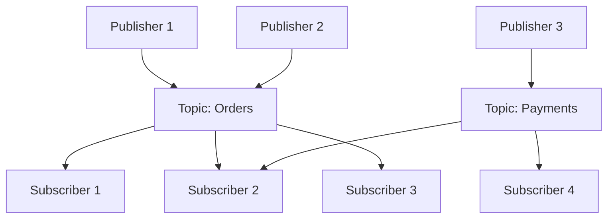
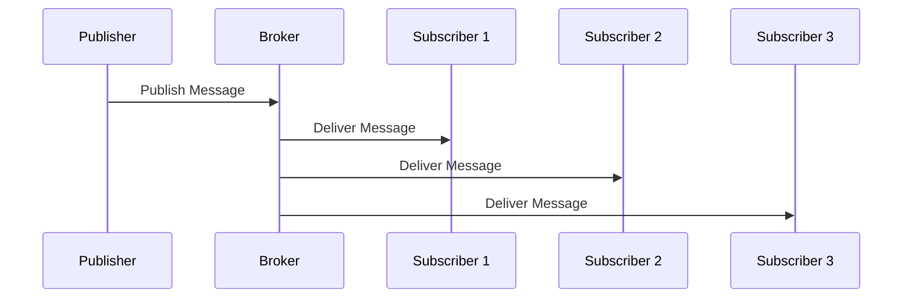
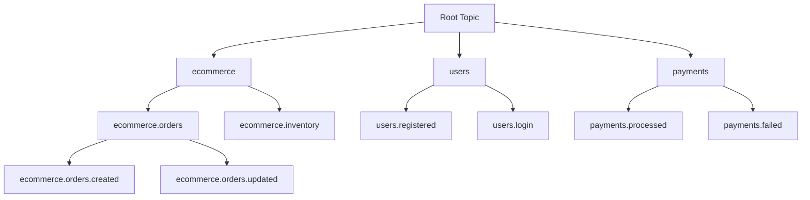
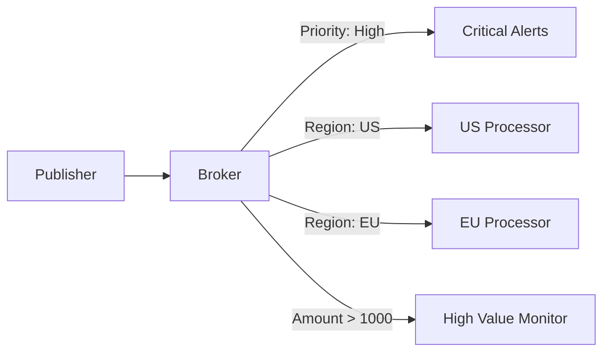
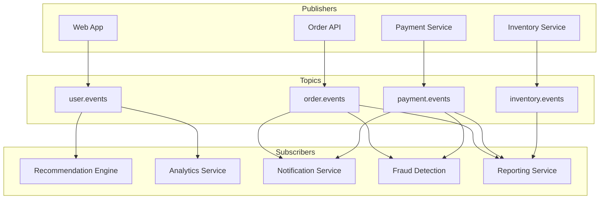
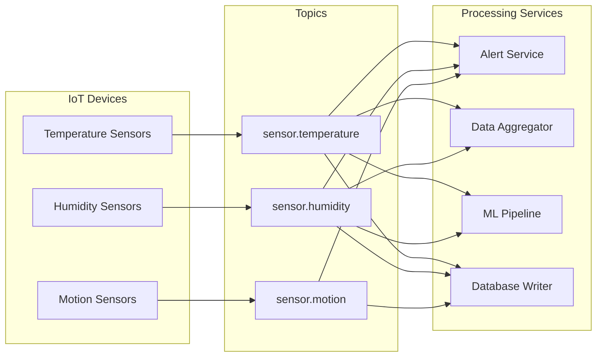

# Publish-Subscribe Patterns

## Introduction

The Publish-Subscribe (Pub/Sub) pattern is a messaging paradigm where publishers send messages without knowing who will receive them, and subscribers receive messages without knowing who sent them. This decoupling enables highly scalable, flexible architectures where components can be added or removed without affecting others.

## Core Concepts

### Pub/Sub Fundamentals

In the pub/sub pattern, messages are published to topics or channels, and multiple subscribers can listen to these topics to receive relevant messages.



### Key Components

- **Publisher**: Sends messages to topics
- **Subscriber**: Receives messages from topics
- **Topic/Channel**: Named communication channel
- **Message Broker**: Routes messages between publishers and subscribers
- **Subscription**: Relationship between subscriber and topic

### Benefits of Pub/Sub

✅ **Loose Coupling**
- Publishers don't know about subscribers
- Easy to add/remove components
- Independent scaling and deployment

✅ **Scalability**
- Multiple subscribers per topic
- Horizontal scaling of publishers and subscribers
- Load distribution across subscribers

✅ **Flexibility**
- Dynamic subscription management
- Topic-based message routing
- Support for multiple message patterns

## Pub/Sub vs Message Queues

| Aspect | Pub/Sub | Message Queues |
|--------|---------|----------------|
| **Message Delivery** | One-to-many | One-to-one |
| **Coupling** | Loose | Moderate |
| **Subscribers** | Multiple per topic | Single consumer per message |
| **Message Persistence** | Varies by implementation | Usually persistent |
| **Use Case** | Event notifications | Work distribution |
| **Ordering** | Topic-level | Queue-level |

## Pub/Sub Patterns

### Fan-Out Pattern

One message published to multiple subscribers.



**Use Cases:**
- Event notifications
- Cache invalidation
- Real-time updates

### Topic Hierarchies

Organize topics in hierarchical structures for fine-grained subscriptions.



**Subscription Examples:**
- `ecommerce.*` - All ecommerce events
- `ecommerce.orders.*` - All order events
- `*.failed` - All failure events across domains

### Content-Based Routing

Route messages based on message content or metadata.



## Technology Implementations

### Redis Pub/Sub

**Simple, fast, in-memory pub/sub system**

#### Basic Implementation

```python
import redis
import json
import threading

# Publisher
class RedisPublisher:
    def __init__(self, host='localhost', port=6379):
        self.redis_client = redis.Redis(host=host, port=port)
    
    def publish(self, channel, message):
        message_json = json.dumps(message)
        return self.redis_client.publish(channel, message_json)

# Subscriber
class RedisSubscriber:
    def __init__(self, host='localhost', port=6379):
        self.redis_client = redis.Redis(host=host, port=port)
        self.pubsub = self.redis_client.pubsub()
    
    def subscribe(self, channels, callback):
        self.pubsub.subscribe(*channels)
        
        for message in self.pubsub.listen():
            if message['type'] == 'message':
                try:
                    data = json.loads(message['data'])
                    callback(message['channel'].decode(), data)
                except Exception as e:
                    print(f"Error processing message: {e}")

# Usage Example
def handle_order_event(channel, data):
    print(f"Received on {channel}: {data}")
    
    if data['event_type'] == 'order_created':
        process_new_order(data)
    elif data['event_type'] == 'order_cancelled':
        process_cancelled_order(data)

# Publisher
publisher = RedisPublisher()
publisher.publish('orders', {
    'event_type': 'order_created',
    'order_id': 'order-123',
    'customer_id': 'customer-456',
    'amount': 99.99
})

# Subscriber
subscriber = RedisSubscriber()
subscriber.subscribe(['orders', 'payments'], handle_order_event)
```

#### Pattern Subscriptions

```python
# Subscribe to patterns
pubsub = redis_client.pubsub()
pubsub.psubscribe('ecommerce.*', 'users.*')

for message in pubsub.listen():
    if message['type'] == 'pmessage':
        channel = message['channel'].decode()
        pattern = message['pattern'].decode()
        data = json.loads(message['data'])
        
        print(f"Pattern {pattern} matched channel {channel}")
        handle_event(channel, data)
```

**Pros:**
- Very low latency
- Simple to implement
- Pattern-based subscriptions
- High performance

**Cons:**
- No message persistence
- Fire-and-forget delivery
- Limited scalability
- No message ordering guarantees

### Apache Kafka Pub/Sub

**Distributed, persistent pub/sub system**

#### Producer (Publisher)

```python
from kafka import KafkaProducer
import json

class KafkaPublisher:
    def __init__(self, bootstrap_servers=['localhost:9092']):
        self.producer = KafkaProducer(
            bootstrap_servers=bootstrap_servers,
            value_serializer=lambda v: json.dumps(v).encode('utf-8'),
            key_serializer=lambda k: k.encode('utf-8') if k else None,
            acks='all',  # Wait for all replicas
            retries=3
        )
    
    def publish(self, topic, message, key=None):
        future = self.producer.send(topic, value=message, key=key)
        return future.get(timeout=10)  # Synchronous send
    
    def publish_async(self, topic, message, key=None, callback=None):
        future = self.producer.send(topic, value=message, key=key)
        if callback:
            future.add_callback(callback)
        return future

# Usage
publisher = KafkaPublisher()

# Publish order event
order_event = {
    'event_type': 'order_created',
    'order_id': 'order-123',
    'customer_id': 'customer-456',
    'timestamp': '2024-01-15T10:30:00Z',
    'data': {
        'items': [{'sku': 'item-1', 'quantity': 2}],
        'total': 99.99
    }
}

publisher.publish('ecommerce.orders', order_event, key='order-123')
```

#### Consumer (Subscriber)

```python
from kafka import KafkaConsumer
import json

class KafkaSubscriber:
    def __init__(self, topics, group_id, bootstrap_servers=['localhost:9092']):
        self.consumer = KafkaConsumer(
            *topics,
            bootstrap_servers=bootstrap_servers,
            group_id=group_id,
            value_deserializer=lambda m: json.loads(m.decode('utf-8')),
            auto_offset_reset='earliest',
            enable_auto_commit=False
        )
    
    def subscribe(self, callback):
        for message in self.consumer:
            try:
                callback(message.topic, message.value, message.key)
                self.consumer.commit()
            except Exception as e:
                print(f"Error processing message: {e}")
                # Handle error (retry, DLQ, etc.)

# Multiple subscribers for same topic
def order_processor(topic, message, key):
    print(f"Order Processor: {message['event_type']}")
    # Process order logic

def analytics_processor(topic, message, key):
    print(f"Analytics: Recording event {message['event_type']}")
    # Analytics logic

def notification_processor(topic, message, key):
    print(f"Notifications: Sending alert for {message['event_type']}")
    # Notification logic

# Each subscriber in different consumer group
order_subscriber = KafkaSubscriber(['ecommerce.orders'], 'order-processing-group')
analytics_subscriber = KafkaSubscriber(['ecommerce.orders'], 'analytics-group')
notification_subscriber = KafkaSubscriber(['ecommerce.orders'], 'notification-group')

# Start subscribers (typically in separate processes/threads)
order_subscriber.subscribe(order_processor)
analytics_subscriber.subscribe(analytics_processor)
notification_subscriber.subscribe(notification_processor)
```

**Pros:**
- Message persistence and replay
- High throughput and scalability
- Ordering guarantees within partitions
- Consumer groups for load balancing

**Cons:**
- More complex setup and operations
- Higher latency than Redis
- Requires ZooKeeper (pre-2.8)
- Steeper learning curve

### Google Cloud Pub/Sub

**Fully managed pub/sub service**

#### Publisher

```python
from google.cloud import pubsub_v1
import json

class GCPPublisher:
    def __init__(self, project_id):
        self.project_id = project_id
        self.publisher = pubsub_v1.PublisherClient()
    
    def publish(self, topic_name, message, attributes=None):
        topic_path = self.publisher.topic_path(self.project_id, topic_name)
        
        # Convert message to bytes
        message_bytes = json.dumps(message).encode('utf-8')
        
        # Publish with attributes
        future = self.publisher.publish(
            topic_path, 
            message_bytes, 
            **(attributes or {})
        )
        
        return future.result()  # Wait for publish to complete

# Usage
publisher = GCPPublisher('my-project-id')

message = {
    'event_type': 'user_registered',
    'user_id': 'user-123',
    'email': 'user@example.com'
}

attributes = {
    'event_source': 'user-service',
    'event_version': '1.0'
}

message_id = publisher.publish('user-events', message, attributes)
print(f"Published message ID: {message_id}")
```

#### Subscriber

```python
from google.cloud import pubsub_v1
import json

class GCPSubscriber:
    def __init__(self, project_id, subscription_name):
        self.project_id = project_id
        self.subscription_name = subscription_name
        self.subscriber = pubsub_v1.SubscriberClient()
        self.subscription_path = self.subscriber.subscription_path(
            project_id, subscription_name
        )
    
    def subscribe(self, callback):
        def wrapper(message):
            try:
                # Decode message
                data = json.loads(message.data.decode('utf-8'))
                attributes = dict(message.attributes)
                
                # Process message
                callback(data, attributes)
                
                # Acknowledge message
                message.ack()
            except Exception as e:
                print(f"Error processing message: {e}")
                message.nack()  # Negative acknowledgment
        
        # Start listening
        streaming_pull_future = self.subscriber.subscribe(
            self.subscription_path, 
            callback=wrapper,
            flow_control=pubsub_v1.types.FlowControl(max_messages=100)
        )
        
        try:
            streaming_pull_future.result()  # Keep listening
        except KeyboardInterrupt:
            streaming_pull_future.cancel()

# Usage
def process_user_event(data, attributes):
    print(f"Processing: {data['event_type']}")
    print(f"Attributes: {attributes}")
    
    if data['event_type'] == 'user_registered':
        send_welcome_email(data['user_id'])

subscriber = GCPSubscriber('my-project-id', 'user-events-subscription')
subscriber.subscribe(process_user_event)
```

**Pros:**
- Fully managed (no infrastructure)
- Automatic scaling
- Global availability
- Dead letter topics
- Message ordering (in order keys)

**Cons:**
- Vendor lock-in
- Cost for high volume
- Limited customization
- Network latency for API calls

## Advanced Pub/Sub Patterns

### Message Filtering

Filter messages at the broker level to reduce network traffic.

```python
# Google Cloud Pub/Sub with filtering
from google.cloud import pubsub_v1

# Create subscription with filter
subscriber = pubsub_v1.SubscriberClient()
project_path = subscriber.common_project_path('my-project')

subscription = subscriber.create_subscription(
    request={
        "name": subscriber.subscription_path('my-project', 'high-value-orders'),
        "topic": subscriber.topic_path('my-project', 'orders'),
        "filter": 'attributes.order_value > "1000"'
    }
)
```

### Dead Letter Topics

Handle messages that cannot be processed successfully.

```python
class PubSubWithDLQ:
    def __init__(self, main_topic, dlq_topic):
        self.main_topic = main_topic
        self.dlq_topic = dlq_topic
        self.publisher = KafkaPublisher()
    
    def process_message(self, message):
        try:
            # Attempt to process message
            business_logic(message)
        except RetryableError as e:
            if message.get('retry_count', 0) < MAX_RETRIES:
                message['retry_count'] = message.get('retry_count', 0) + 1
                # Republish to main topic with delay
                self.schedule_retry(message)
            else:
                # Send to dead letter queue
                self.send_to_dlq(message, str(e))
        except FatalError as e:
            # Send directly to DLQ
            self.send_to_dlq(message, str(e))
    
    def send_to_dlq(self, message, error_reason):
        dlq_message = {
            'original_message': message,
            'error_reason': error_reason,
            'timestamp': datetime.utcnow().isoformat(),
            'original_topic': self.main_topic
        }
        self.publisher.publish(self.dlq_topic, dlq_message)
```

### Message Deduplication

Ensure exactly-once processing of messages.

```python
import hashlib
import redis

class DeduplicatingSubscriber:
    def __init__(self, redis_client):
        self.redis = redis_client
        self.ttl = 3600  # 1 hour deduplication window
    
    def process_message(self, message):
        # Generate message hash
        message_hash = self.generate_message_hash(message)
        
        # Check if already processed
        if self.redis.exists(f"processed:{message_hash}"):
            print("Duplicate message, skipping")
            return
        
        try:
            # Process message
            result = business_logic(message)
            
            # Mark as processed
            self.redis.setex(
                f"processed:{message_hash}", 
                self.ttl, 
                "processed"
            )
            
            return result
        except Exception as e:
            # Don't mark as processed on failure
            raise e
    
    def generate_message_hash(self, message):
        # Create hash from message content
        message_str = json.dumps(message, sort_keys=True)
        return hashlib.sha256(message_str.encode()).hexdigest()
```

## Real-World Use Cases

### E-commerce Event-Driven Architecture



**Event Examples:**

```json
// User Event
{
  "event_type": "page_viewed",
  "user_id": "user-123",
  "page": "/product/laptop-xyz",
  "timestamp": "2024-01-15T10:30:00Z",
  "session_id": "session-abc"
}

// Order Event
{
  "event_type": "order_created",
  "order_id": "order-456",
  "customer_id": "user-123",
  "items": [...],
  "total": 999.99,
  "timestamp": "2024-01-15T10:35:00Z"
}

// Payment Event
{
  "event_type": "payment_completed",
  "payment_id": "pay-789",
  "order_id": "order-456",
  "amount": 999.99,
  "method": "credit_card",
  "timestamp": "2024-01-15T10:36:00Z"
}
```

### IoT Sensor Data Processing



### Real-Time Chat Application

```python
# Chat message publisher
class ChatPublisher:
    def __init__(self):
        self.redis_client = redis.Redis()
    
    def send_message(self, room_id, user_id, message):
        chat_event = {
            'event_type': 'message_sent',
            'room_id': room_id,
            'user_id': user_id,
            'message': message,
            'timestamp': datetime.utcnow().isoformat()
        }
        
        # Publish to room-specific channel
        self.redis_client.publish(f"chat.room.{room_id}", json.dumps(chat_event))
        
        # Also publish to user's personal channel for notifications
        self.redis_client.publish(f"user.{user_id}.notifications", json.dumps({
            'type': 'message_sent',
            'room_id': room_id
        }))

# Chat message subscriber
class ChatSubscriber:
    def __init__(self, user_id):
        self.user_id = user_id
        self.redis_client = redis.Redis()
        self.pubsub = self.redis_client.pubsub()
    
    def join_room(self, room_id):
        self.pubsub.subscribe(f"chat.room.{room_id}")
    
    def leave_room(self, room_id):
        self.pubsub.unsubscribe(f"chat.room.{room_id}")
    
    def listen_for_messages(self, callback):
        for message in self.pubsub.listen():
            if message['type'] == 'message':
                data = json.loads(message['data'])
                callback(data)
```

## Best Practices

### Topic Design

1. **Use hierarchical naming**
   ```
   company.domain.entity.action
   ecommerce.orders.created
   ecommerce.orders.updated
   ecommerce.inventory.low_stock
   ```

2. **Keep topics focused**
   - Single responsibility per topic
   - Avoid overly broad topics
   - Consider message volume

3. **Plan for evolution**
   - Version your message schemas
   - Use backward-compatible changes
   - Implement schema registry

### Message Design

1. **Include essential metadata**
   ```json
   {
     "event_id": "uuid-12345",
     "event_type": "order_created",
     "event_version": "1.0",
     "timestamp": "2024-01-15T10:30:00Z",
     "source": "order-service",
     "correlation_id": "trace-abc123",
     "data": { ... }
   }
   ```

2. **Keep messages self-contained**
   - Include all necessary context
   - Avoid requiring additional lookups
   - Consider message size limits

### Subscriber Implementation

1. **Design for idempotency**
   ```python
   def process_order_event(event):
       order_id = event['data']['order_id']
       event_id = event['event_id']
       
       # Check if already processed
       if is_processed(order_id, event_id):
           return
       
       # Process event
       result = process_order(event['data'])
       
       # Mark as processed
       mark_processed(order_id, event_id)
   ```

2. **Handle failures gracefully**
   - Implement retry logic
   - Use dead letter queues
   - Monitor error rates

3. **Scale subscribers appropriately**
   - Monitor processing lag
   - Scale based on message volume
   - Use consumer groups for load balancing

### Monitoring and Alerting

```python
# Monitoring metrics
class PubSubMonitor:
    def __init__(self):
        self.metrics = {}
    
    def record_publish(self, topic, success=True):
        key = f"publish.{topic}.{'success' if success else 'failure'}"
        self.metrics[key] = self.metrics.get(key, 0) + 1
    
    def record_processing_time(self, topic, duration):
        key = f"processing.{topic}.duration"
        if key not in self.metrics:
            self.metrics[key] = []
        self.metrics[key].append(duration)
    
    def get_metrics(self):
        return {
            'publish_rates': self.get_publish_rates(),
            'processing_times': self.get_processing_times(),
            'error_rates': self.get_error_rates()
        }
```

### Security Considerations

1. **Authentication and Authorization**
   - Secure publisher/subscriber authentication
   - Topic-level access control
   - Message encryption for sensitive data

2. **Message Validation**
   - Validate message schemas
   - Sanitize message content
   - Rate limiting for publishers

3. **Audit and Compliance**
   - Log all publish/subscribe activities
   - Implement message retention policies
   - Ensure data privacy compliance

## Common Pitfalls and Solutions

### Message Ordering Issues

**Problem:** Messages processed out of order
**Solutions:**
- Use message keys for partitioning
- Single-threaded processing for strict ordering
- Design for eventual consistency

### Subscriber Overload

**Problem:** Subscribers can't keep up with message volume
**Solutions:**
- Implement backpressure handling
- Scale subscribers horizontally
- Use message batching

### Message Loss

**Problem:** Messages lost during failures
**Solutions:**
- Use persistent message brokers
- Implement proper acknowledgments
- Monitor dead letter queues

### Duplicate Processing

**Problem:** Same message processed multiple times
**Solutions:**
- Design idempotent operations
- Use message deduplication
- Implement exactly-once semantics

Pub/Sub patterns enable building highly scalable, loosely coupled systems that can handle real-time event processing and communication. Choose the right implementation based on your requirements for performance, persistence, and operational complexity.