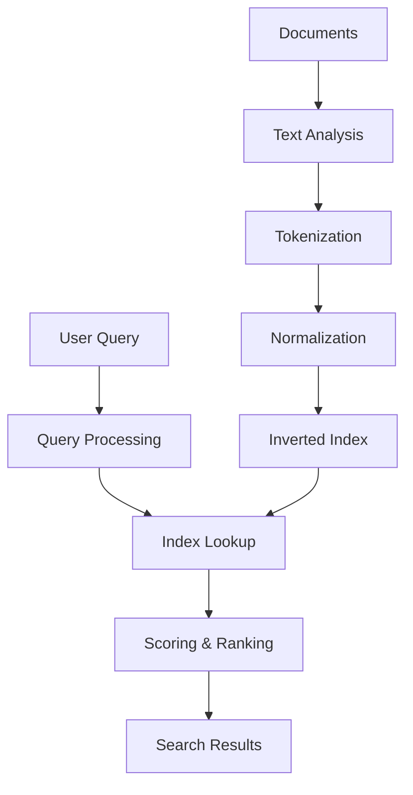

# Full-Text Search

## Introduction

Full-text search enables users to find documents or records by searching for specific words or phrases within the content. Unlike database queries that match exact values, full-text search provides flexible, relevance-based results that can handle typos, synonyms, and natural language queries.

Modern applications rely heavily on search functionality - from e-commerce product search to document management systems. Understanding how search engines work is crucial for building scalable, user-friendly applications.

## Key Concepts

### What is Full-Text Search?

Full-text search is the capability to search through the entire content of documents, not just metadata or specific fields. It involves:

- **Text Analysis**: Breaking down documents into searchable terms
- **Indexing**: Creating efficient data structures for fast retrieval
- **Querying**: Processing user search queries and returning relevant results
- **Ranking**: Scoring results by relevance to the query

### Search Engine Architecture



### Core Components

**1. Text Analysis Pipeline**
- **Tokenization**: Split text into individual terms
- **Normalization**: Convert to lowercase, handle punctuation
- **Stemming/Lemmatization**: Reduce words to root forms
- **Stop Word Removal**: Filter out common words (the, and, or)

**2. Inverted Index**
The core data structure that maps terms to documents:

```
Term → [Document IDs containing the term]

"search" → [doc1, doc5, doc12, doc23]
"engine" → [doc1, doc8, doc15, doc23]
"algorithm" → [doc5, doc12, doc15]
```

**3. Query Processing**
- Parse user queries
- Apply same text analysis as indexing
- Handle operators (AND, OR, NOT, phrases)
- Expand queries (synonyms, fuzzy matching)

## Popular Search Technologies

### Elasticsearch

**Overview**: Distributed, RESTful search engine built on Apache Lucene

**Key Features**:
- Real-time indexing and search
- Distributed architecture with automatic sharding
- Rich query DSL with JSON-based queries
- Built-in analytics and aggregations
- RESTful API

**Use Cases**:
- Log analysis and monitoring
- E-commerce product search
- Content management systems
- Real-time analytics

**Example Query**:
```json
{
  "query": {
    "bool": {
      "must": [
        {"match": {"title": "system design"}},
        {"range": {"publish_date": {"gte": "2020-01-01"}}}
      ],
      "should": [
        {"match": {"tags": "distributed systems"}}
      ]
    }
  },
  "highlight": {
    "fields": {
      "title": {},
      "content": {}
    }
  }
}
```

### Apache Solr

**Overview**: Enterprise search platform built on Apache Lucene

**Key Features**:
- Powerful full-text search capabilities
- Faceted search and filtering
- Rich document handling (PDF, Word, etc.)
- Extensive caching mechanisms
- Admin UI for configuration

**Use Cases**:
- Enterprise search applications
- E-commerce with complex filtering
- Digital libraries and archives
- Business intelligence

### Amazon CloudSearch

**Overview**: Managed search service in AWS

**Key Features**:
- Fully managed with automatic scaling
- Simple setup and configuration
- Built-in high availability
- Pay-per-use pricing model

**Use Cases**:
- Small to medium applications
- Rapid prototyping
- Applications already on AWS

### Technology Comparison

| Feature | Elasticsearch | Solr | CloudSearch | Lucene |
|---------|---------------|------|-------------|---------|
| **Deployment** | Self-managed/Cloud | Self-managed | Managed | Library |
| **Scalability** | Excellent | Excellent | Good | Manual |
| **Learning Curve** | Moderate | Steep | Easy | Steep |
| **Real-time** | Yes | Yes | Limited | Manual |
| **Cost** | Infrastructure | Infrastructure | Pay-per-use | Development |
| **Customization** | High | Very High | Limited | Complete |

## Implementation Examples

### Basic Elasticsearch Setup

**1. Index Creation**
```json
PUT /products
{
  "mappings": {
    "properties": {
      "title": {
        "type": "text",
        "analyzer": "standard"
      },
      "description": {
        "type": "text",
        "analyzer": "english"
      },
      "category": {
        "type": "keyword"
      },
      "price": {
        "type": "float"
      },
      "tags": {
        "type": "keyword"
      }
    }
  }
}
```

**2. Document Indexing**
```json
POST /products/_doc/1
{
  "title": "Wireless Bluetooth Headphones",
  "description": "High-quality wireless headphones with noise cancellation",
  "category": "Electronics",
  "price": 199.99,
  "tags": ["wireless", "bluetooth", "audio", "noise-cancellation"]
}
```

**3. Search Query**
```json
GET /products/_search
{
  "query": {
    "multi_match": {
      "query": "wireless headphones",
      "fields": ["title^2", "description"]
    }
  },
  "filter": {
    "range": {
      "price": {
        "lte": 300
      }
    }
  }
}
```

### Application Integration Example (Python)

```python
from elasticsearch import Elasticsearch

class ProductSearch:
    def __init__(self):
        self.es = Elasticsearch([{'host': 'localhost', 'port': 9200}])
    
    def search_products(self, query, filters=None, page=1, size=10):
        body = {
            "query": {
                "bool": {
                    "must": [
                        {
                            "multi_match": {
                                "query": query,
                                "fields": ["title^2", "description"],
                                "fuzziness": "AUTO"
                            }
                        }
                    ]
                }
            },
            "highlight": {
                "fields": {
                    "title": {},
                    "description": {}
                }
            },
            "from": (page - 1) * size,
            "size": size
        }
        
        # Add filters if provided
        if filters:
            body["query"]["bool"]["filter"] = []
            
            if "category" in filters:
                body["query"]["bool"]["filter"].append({
                    "term": {"category": filters["category"]}
                })
            
            if "price_range" in filters:
                body["query"]["bool"]["filter"].append({
                    "range": {
                        "price": {
                            "gte": filters["price_range"]["min"],
                            "lte": filters["price_range"]["max"]
                        }
                    }
                })
        
        return self.es.search(index="products", body=body)
    
    def get_suggestions(self, query):
        body = {
            "suggest": {
                "product_suggest": {
                    "prefix": query,
                    "completion": {
                        "field": "suggest",
                        "size": 5
                    }
                }
            }
        }
        
        return self.es.search(index="products", body=body)
```

## Best Practices

### Index Design

**1. Field Mapping Strategy**
- Use appropriate field types (`text` vs `keyword`)
- Configure analyzers based on content type
- Set up proper tokenization for different languages
- Consider storage requirements vs search needs

**2. Performance Optimization**
```json
{
  "settings": {
    "number_of_shards": 3,
    "number_of_replicas": 1,
    "refresh_interval": "30s",
    "index": {
      "max_result_window": 50000
    }
  }
}
```

### Query Optimization

**1. Use Filters When Possible**
```json
{
  "query": {
    "bool": {
      "must": [
        {"match": {"title": "search query"}}
      ],
      "filter": [
        {"term": {"status": "published"}},
        {"range": {"date": {"gte": "2023-01-01"}}}
      ]
    }
  }
}
```

**2. Implement Query Caching**
- Use filter context for cacheable queries
- Implement application-level caching for frequent searches
- Configure index-level caching appropriately

### Monitoring and Maintenance

**1. Key Metrics to Monitor**
- Query latency and throughput
- Index size and growth rate
- Memory and CPU usage
- Cache hit rates

**2. Regular Maintenance Tasks**
- Index optimization and merging
- Mapping updates and reindexing
- Performance tuning based on usage patterns
- Backup and disaster recovery procedures

## Common Challenges and Solutions

### 1. Relevance Tuning

**Problem**: Search results not relevant to user intent

**Solutions**:
- Implement custom scoring functions
- Use boosting for important fields
- Analyze user behavior and click-through rates
- A/B test different ranking algorithms

### 2. Performance at Scale

**Problem**: Slow search performance with large datasets

**Solutions**:
- Proper index sharding strategy
- Use appropriate hardware resources
- Implement result pagination
- Cache frequent queries

### 3. Multi-language Support

**Problem**: Handling content in multiple languages

**Solutions**:
- Use language-specific analyzers
- Implement separate indexes per language
- Configure proper tokenization for each language
- Handle right-to-left languages appropriately

## Summary

Full-text search is a critical component of modern applications that enables users to find relevant information quickly. Key takeaways:

- **Choose the right technology** based on your specific requirements (Elasticsearch for flexibility, Solr for enterprise features, managed services for simplicity)
- **Design indexes carefully** with proper field mappings and analyzers
- **Optimize for performance** through proper sharding, caching, and query design
- **Monitor and maintain** your search infrastructure regularly
- **Focus on relevance** by tuning scoring algorithms and analyzing user behavior

Understanding these fundamentals will help you build effective search systems that scale with your application's growth and provide excellent user experiences.
