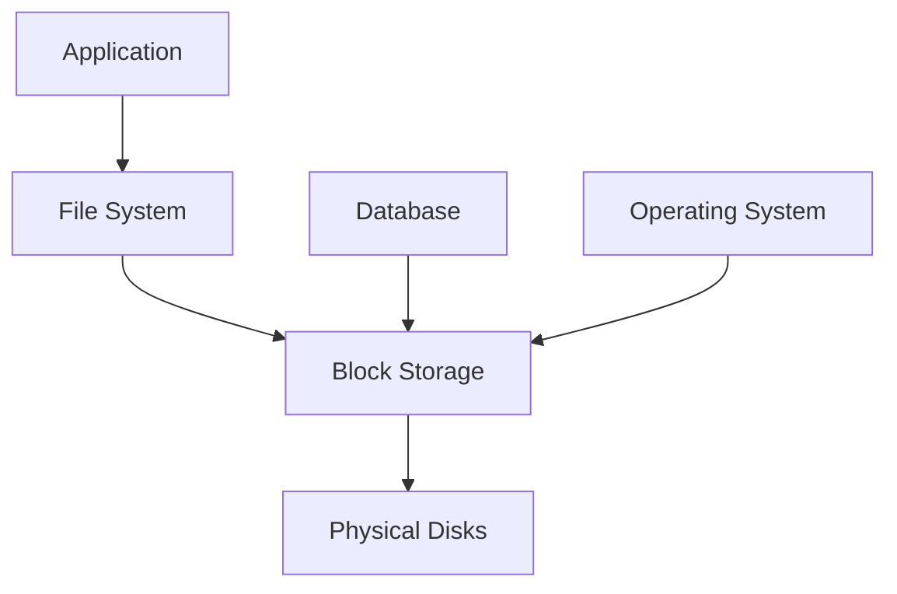
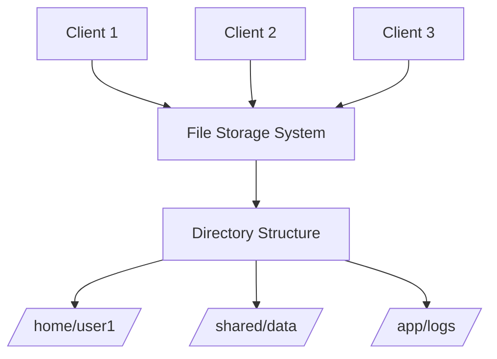
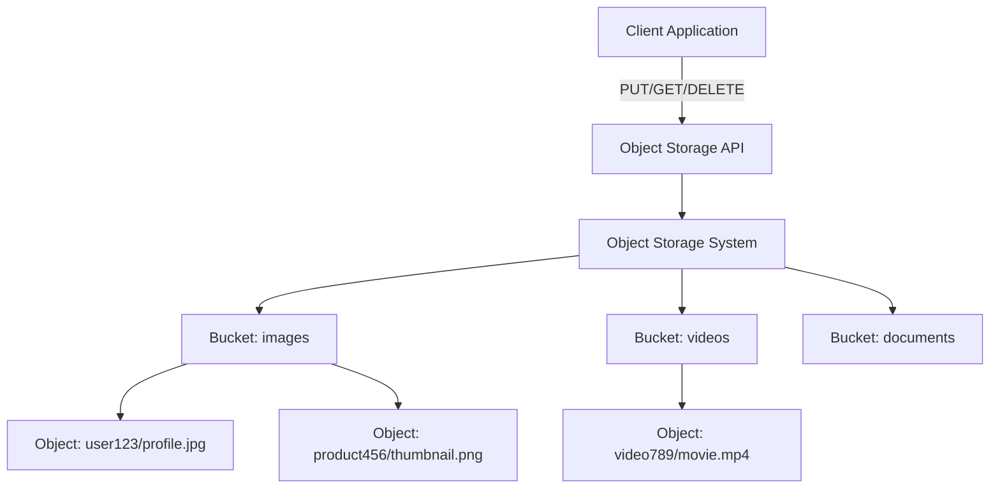
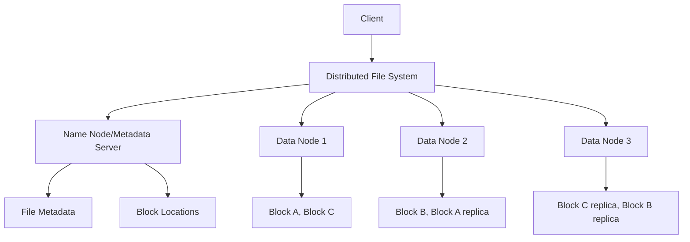
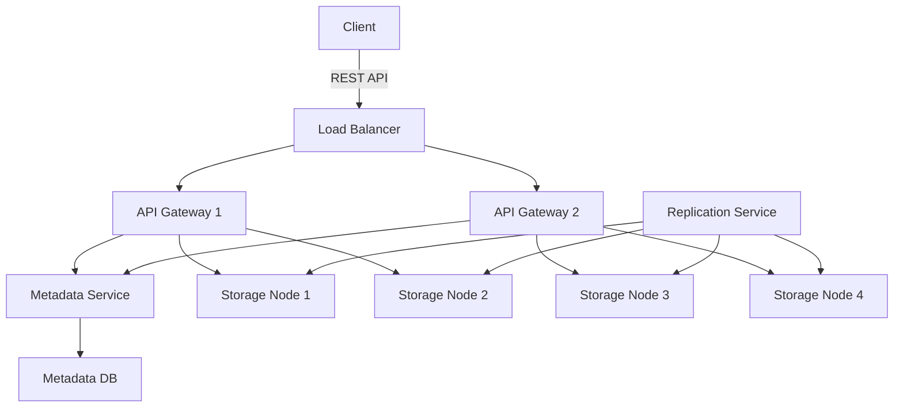
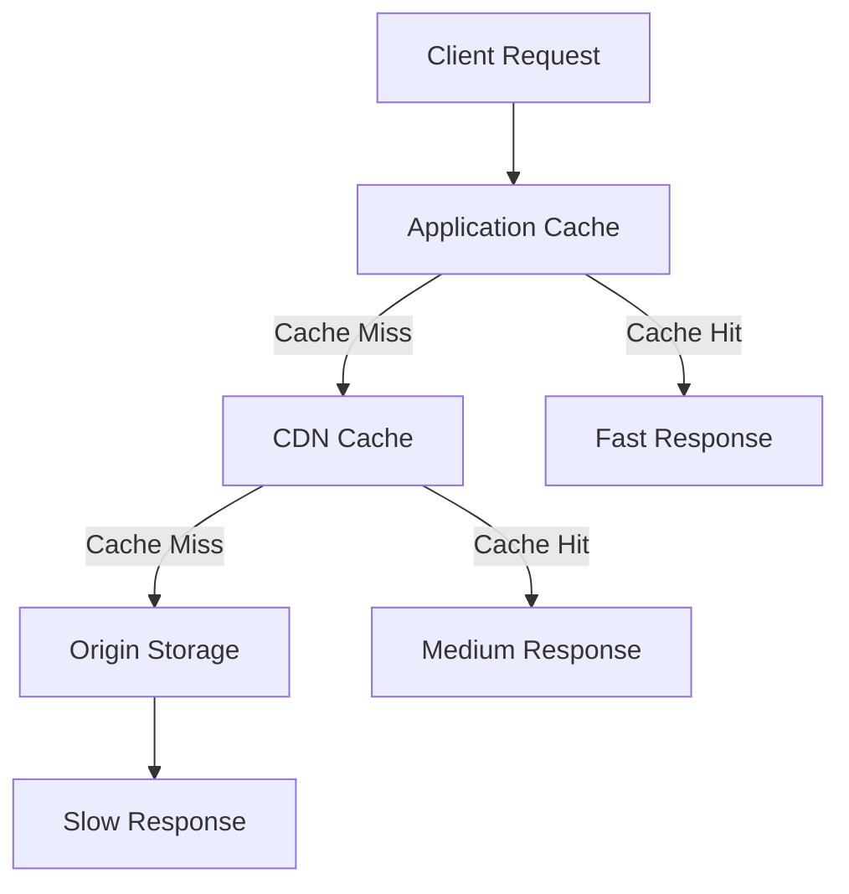
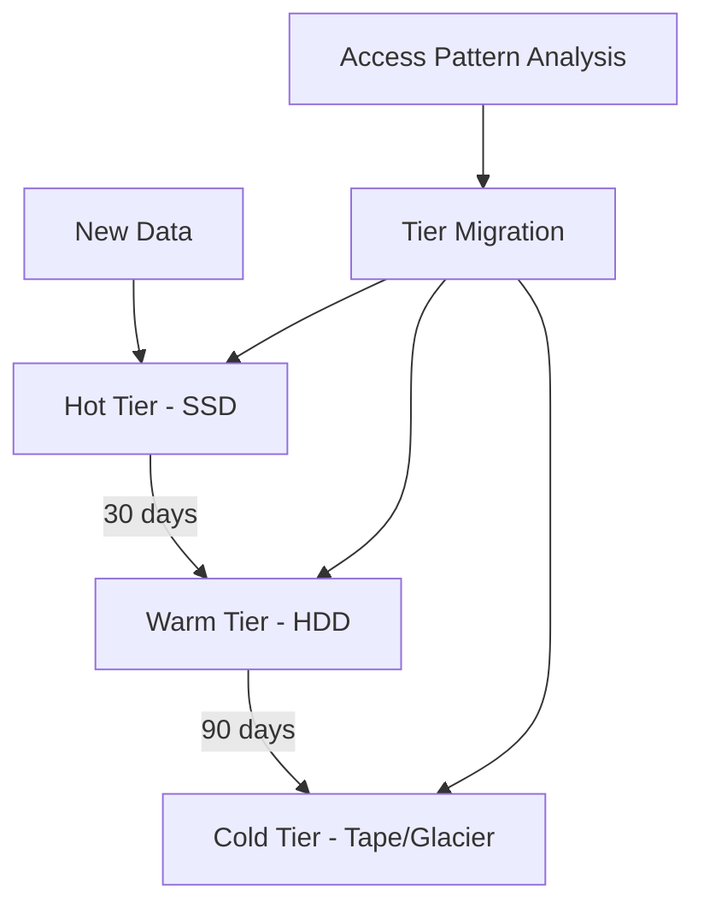
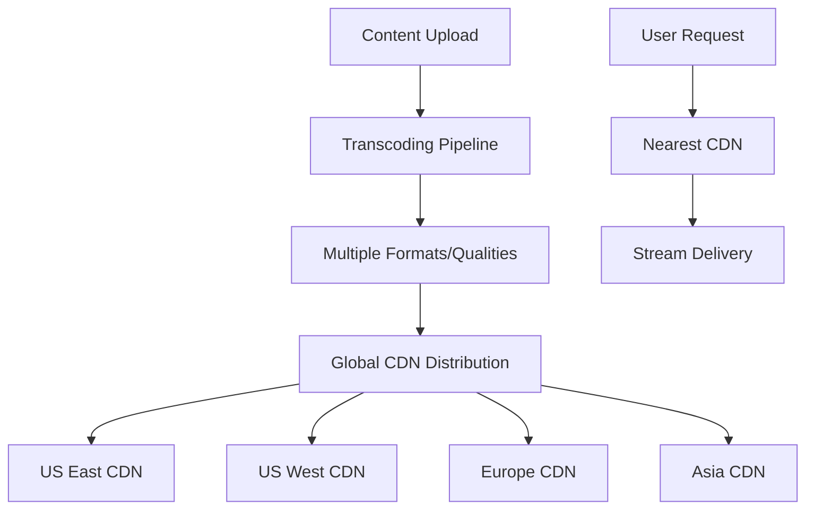
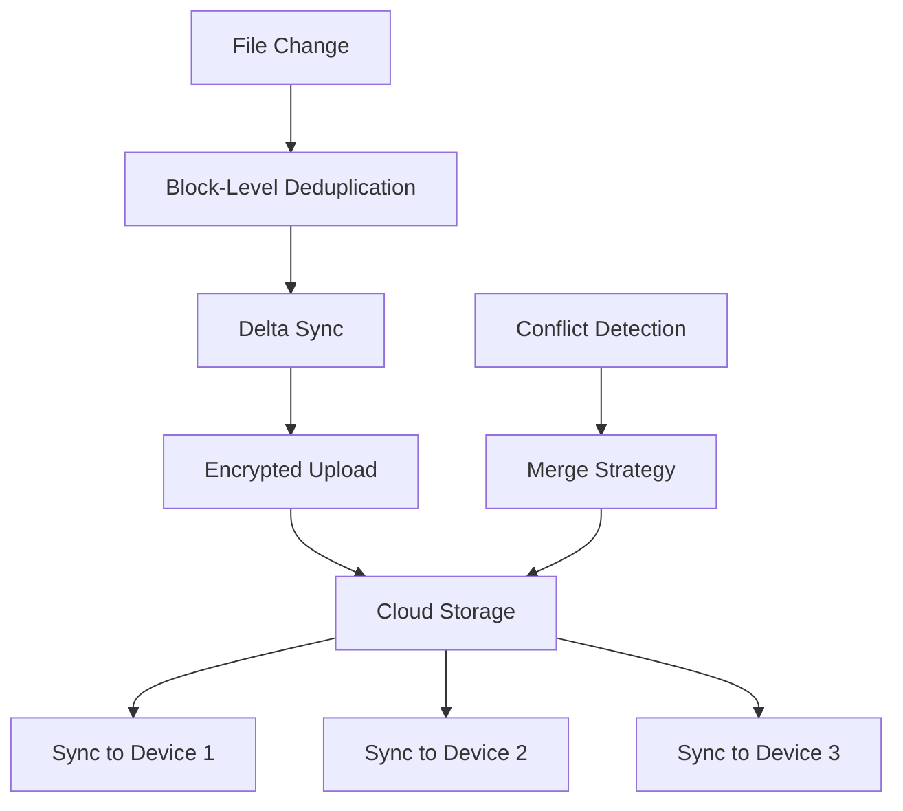

# File Storage Systems

## Introduction

File storage systems are the foundation of modern applications, handling everything from user uploads to application data, logs, and backups. Understanding different storage architectures and their trade-offs is crucial for designing scalable systems that can handle growing data volumes while maintaining performance and reliability.

Modern storage systems must address several challenges:
- **Scale**: Handle petabytes of data across thousands of servers
- **Durability**: Ensure data is never lost, even with hardware failures
- **Performance**: Provide fast access for both reads and writes
- **Cost**: Balance performance with storage costs
- **Global Access**: Serve data efficiently to users worldwide

## Storage System Types

### Block Storage

Block storage provides raw block-level access to storage devices, similar to traditional hard drives. It's the foundation for file systems and databases.

**Characteristics:**
- Low-level access to storage blocks
- High performance and low latency
- Typically used for databases and file systems
- Can be attached to virtual machines

**Use Cases:**
- Database storage (MySQL, PostgreSQL)
- File system storage for operating systems
- High-performance computing applications
- Boot volumes for virtual machines

**Examples:**
- Amazon EBS (Elastic Block Store)
- Google Persistent Disks
- Azure Managed Disks



### File Storage

File storage provides a hierarchical file system interface with directories and files, similar to traditional network file systems.

**Characteristics:**
- Hierarchical directory structure
- POSIX-compliant file operations
- Shared access across multiple clients
- Network-based access protocols (NFS, SMB)

**Use Cases:**
- Shared application data
- Content management systems
- Development environments
- Legacy application migration

**Examples:**
- Amazon EFS (Elastic File System)
- Google Cloud Filestore
- Azure Files



### Object Storage

Object storage manages data as objects in a flat namespace, accessed via REST APIs. Each object contains data, metadata, and a unique identifier.

**Characteristics:**
- Flat namespace (no hierarchical directories)
- REST API access (HTTP/HTTPS)
- Rich metadata support
- Highly scalable and durable
- Eventually consistent

**Use Cases:**
- Web applications and mobile apps
- Content distribution and media files
- Data archiving and backup
- Big data analytics
- Static website hosting

**Examples:**
- Amazon S3
- Google Cloud Storage
- Azure Blob Storage



## Storage System Architecture Comparison

### Performance Characteristics

| Storage Type | Latency | Throughput | IOPS | Scalability |
|--------------|---------|------------|------|-------------|
| Block Storage | Very Low (< 1ms) | High | Very High | Moderate |
| File Storage | Low (1-10ms) | Moderate | Moderate | Moderate |
| Object Storage | Moderate (10-100ms) | Very High | Low | Very High |

### Cost and Durability

| Storage Type | Cost | Durability | Availability | Consistency |
|--------------|------|------------|--------------|-------------|
| Block Storage | High | 99.999% | 99.99% | Strong |
| File Storage | Medium | 99.999% | 99.9% | Strong |
| Object Storage | Low | 99.999999999% | 99.99% | Eventual |

## Distributed Storage Systems

### Distributed File Systems

Distributed file systems spread data across multiple servers while presenting a unified file system interface.

**Key Features:**
- Data replication for fault tolerance
- Load balancing across multiple servers
- Transparent failover
- Consistent metadata management

**Examples:**
- **HDFS (Hadoop Distributed File System)**
  - Designed for big data processing
  - Write-once, read-many access pattern
  - High throughput for large files

- **GlusterFS**
  - Scale-out network-attached storage
  - No metadata servers (fully distributed)
  - POSIX-compliant interface



### Object Storage Architecture

Modern object storage systems use distributed architectures to achieve massive scale and durability.

**Core Components:**
- **API Gateway**: Handles client requests and authentication
- **Metadata Service**: Manages object metadata and locations
- **Storage Nodes**: Store actual object data
- **Replication Service**: Ensures data durability



## Storage Performance Optimization

### Caching Strategies

**Multi-Level Caching:**


**Cache Policies:**
- **LRU (Least Recently Used)**: Evict least recently accessed data
- **LFU (Least Frequently Used)**: Evict least frequently accessed data
- **TTL (Time To Live)**: Evict data after specified time

### Data Partitioning

**Horizontal Partitioning (Sharding):**
```python
# Example: Partition by user ID
def get_shard(user_id, num_shards):
    return hash(user_id) % num_shards

# Route to appropriate storage node
shard_id = get_shard("user123", 4)  # Returns 0-3
storage_node = f"storage-node-{shard_id}"
```

**Vertical Partitioning:**
```python
# Separate hot and cold data
class UserData:
    # Hot data - frequently accessed
    profile_info = "storage-tier-1"  # SSD storage
    
    # Cold data - rarely accessed  
    historical_logs = "storage-tier-2"  # HDD storage
    archived_data = "storage-tier-3"   # Tape/Glacier
```

### Storage Tiering

**Automatic Tiering Strategy:**


## Real-World Storage System Examples

### Netflix Content Storage

Netflix stores and delivers petabytes of video content globally:



**Key Strategies:**
- Pre-position popular content at edge locations
- Use multiple encoding formats for different devices
- Implement intelligent caching based on viewing patterns
- Employ adaptive bitrate streaming for optimal quality

### Dropbox File Synchronization

Dropbox synchronizes files across multiple devices efficiently:



**Optimization Techniques:**
- Block-level deduplication to minimize data transfer
- Delta synchronization for large files
- Intelligent conflict resolution
- Bandwidth throttling and prioritization

## Storage System Design Patterns

### Write-Heavy Workloads

**Log-Structured Storage:**
```python
class LogStructuredStorage:
    def write(self, key, value):
        # Append-only writes for high throughput
        log_entry = {
            'timestamp': time.now(),
            'key': key,
            'value': value
        }
        self.append_to_log(log_entry)
        self.update_index(key, log_position)
    
    def compact(self):
        # Periodic compaction to reclaim space
        self.merge_log_segments()
        self.rebuild_index()
```

### Read-Heavy Workloads

**Read Replicas with Caching:**
```python
class ReadOptimizedStorage:
    def __init__(self):
        self.master = MasterStorage()
        self.replicas = [ReplicaStorage() for _ in range(3)]
        self.cache = LRUCache(capacity=10000)
    
    def read(self, key):
        # Check cache first
        if key in self.cache:
            return self.cache.get(key)
        
        # Load balance across read replicas
        replica = self.select_replica()
        value = replica.read(key)
        self.cache.put(key, value)
        return value
```

## Best Practices

### Storage Selection Guidelines

**Choose Block Storage When:**
- You need high IOPS and low latency
- Running databases or file systems
- Require strong consistency
- Working with structured data

**Choose File Storage When:**
- Multiple clients need shared access
- You have existing applications expecting POSIX interface
- Need hierarchical organization
- Migrating legacy applications

**Choose Object Storage When:**
- Building web/mobile applications
- Storing unstructured data (images, videos, documents)
- Need massive scalability
- Cost is a primary concern
- Building data lakes or analytics platforms

### Performance Optimization

1. **Right-Size Your Storage**
   ```python
   # Monitor and adjust based on usage patterns
   def optimize_storage_tier(access_pattern):
       if access_pattern.frequency > 100:  # requests/day
           return "hot_tier"
       elif access_pattern.frequency > 10:
           return "warm_tier"
       else:
           return "cold_tier"
   ```

2. **Implement Intelligent Caching**
   ```python
   class IntelligentCache:
       def should_cache(self, object_metadata):
           # Cache based on access patterns
           return (
               object_metadata.access_count > 5 or
               object_metadata.size < 1_MB or
               object_metadata.content_type in ['image/*', 'text/*']
           )
   ```

3. **Use Compression and Deduplication**
   ```python
   def store_with_optimization(data):
       # Compress data before storage
       compressed_data = compress(data)
       
       # Check for duplicates
       content_hash = hash(compressed_data)
       if not exists(content_hash):
           store(content_hash, compressed_data)
       
       return content_hash
   ```

### Security Considerations

1. **Encryption at Rest and in Transit**
   ```python
   class SecureStorage:
       def store(self, data):
           # Encrypt before storing
           encrypted_data = self.encrypt(data, self.encryption_key)
           return self.storage.put(encrypted_data)
       
       def retrieve(self, key):
           encrypted_data = self.storage.get(key)
           return self.decrypt(encrypted_data, self.encryption_key)
   ```

2. **Access Control and Auditing**
   ```python
   def access_control_check(user, resource, action):
       if not has_permission(user, resource, action):
           audit_log.record_access_denied(user, resource, action)
           raise AccessDeniedError()
       
       audit_log.record_access_granted(user, resource, action)
       return True
   ```

## Summary

File storage systems are fundamental to modern application architecture. Key takeaways:

- **Storage Types**: Block storage for high performance, file storage for shared access, object storage for scalability
- **Architecture Patterns**: Distributed systems provide scalability and fault tolerance
- **Performance**: Use caching, partitioning, and tiering for optimization
- **Selection Criteria**: Choose based on access patterns, consistency requirements, and scale needs
- **Best Practices**: Right-size storage, implement intelligent caching, ensure security

Understanding these concepts enables you to design storage solutions that can scale from gigabytes to petabytes while maintaining performance, durability, and cost-effectiveness.
