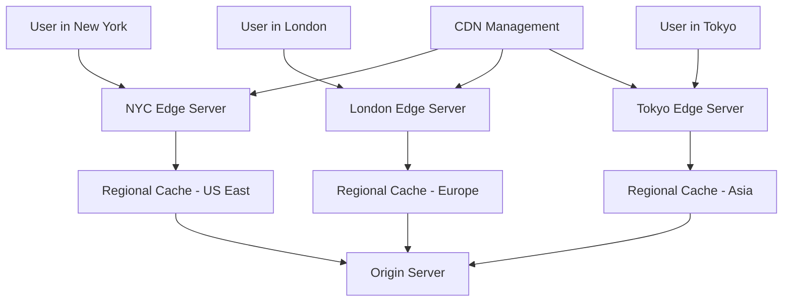
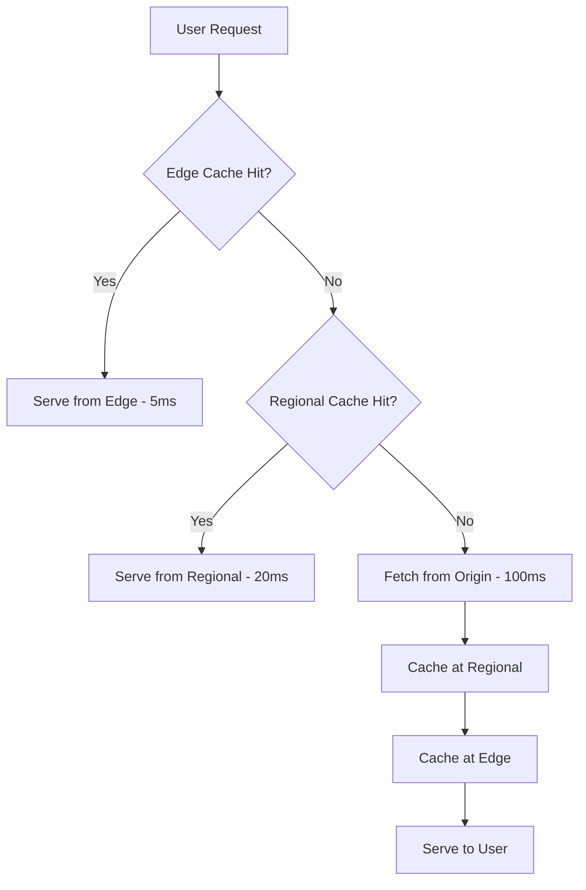
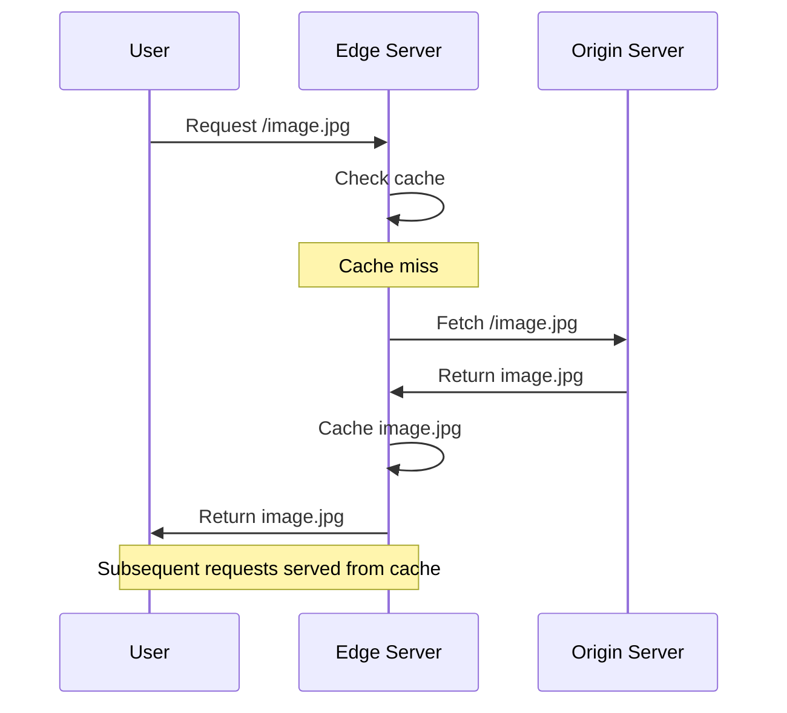
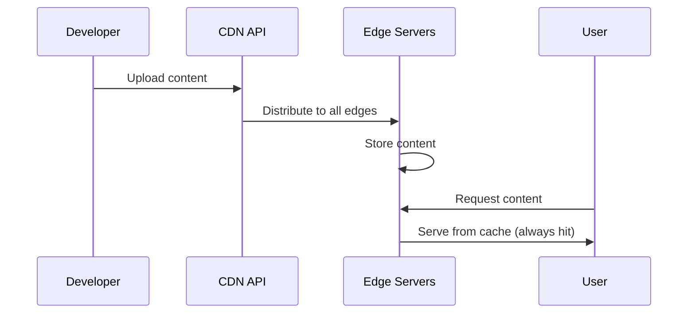

# Content Delivery Networks (CDNs)

## Introduction

Content Delivery Networks (CDNs) are geographically distributed networks of servers that cache and deliver content to users from the nearest location. CDNs dramatically improve performance, reduce latency, and decrease the load on origin servers by serving content from edge locations closer to end users.

Modern applications rely heavily on CDNs to deliver static assets (images, CSS, JavaScript), dynamic content, video streams, and API responses with optimal performance worldwide.

## CDN Architecture and Components

### Basic CDN Architecture



### Core CDN Components

**1. Edge Servers (Points of Presence - PoPs)**
- Geographically distributed cache servers
- Serve content directly to end users
- Typically located in major cities and internet exchange points

**2. Regional Caches**
- Mid-tier caches between edge servers and origin
- Serve multiple edge servers in a region
- Reduce load on origin servers

**3. Origin Servers**
- Source of truth for all content
- Generate dynamic content
- Serve as fallback when content not cached

**4. CDN Management System**
- Controls cache behavior and policies
- Monitors performance and health
- Manages content distribution and purging

## CDN Performance Optimization Strategies

### Cache Hit Ratio Optimization

**Cache Hierarchy Strategy:**


**Cache Key Optimization:**
```python
# Effective cache key design
def generate_cache_key(request):
    # Include relevant parameters only
    key_components = [
        request.path,
        request.query_params.get('version'),
        request.headers.get('Accept-Language'),
        request.headers.get('User-Agent-Type')  # mobile/desktop
    ]
    
    # Normalize to improve hit ratio
    normalized_key = normalize_cache_key(key_components)
    return hash(normalized_key)

# Example cache keys
# Good: /api/products?category=electronics&lang=en
# Bad:  /api/products?category=electronics&lang=en&timestamp=1234567890&session_id=abc123
```

### Content Optimization Techniques

**1. Compression and Minification**
```javascript
// Automatic compression configuration
const compressionConfig = {
    gzip: {
        enabled: true,
        level: 6,  // Balance between compression ratio and CPU
        types: ['text/html', 'text/css', 'application/javascript', 'application/json']
    },
    brotli: {
        enabled: true,
        level: 4,
        types: ['text/html', 'text/css', 'application/javascript']
    }
};

// Minification for static assets
const minificationRules = {
    css: { removeComments: true, removeWhitespace: true },
    js: { mangle: true, compress: true },
    html: { removeComments: true, collapseWhitespace: true }
};
```

**2. Image Optimization**
```python
class ImageOptimizer:
    def optimize_image(self, image_url, user_agent, viewport):
        # Determine optimal format
        format = self.select_format(user_agent)  # WebP, AVIF, JPEG
        
        # Calculate optimal dimensions
        width, height = self.calculate_dimensions(viewport)
        
        # Generate optimized URL
        return f"{image_url}?format={format}&w={width}&h={height}&q=80"
    
    def select_format(self, user_agent):
        if 'Chrome' in user_agent and self.supports_avif(user_agent):
            return 'avif'  # Best compression
        elif self.supports_webp(user_agent):
            return 'webp'  # Good compression, wide support
        else:
            return 'jpeg'  # Fallback
```

### Smart Caching Strategies

**1. Cache-Control Headers**
```python
def set_cache_headers(response, content_type, is_static=False):
    if is_static:
        # Static assets - long cache with versioning
        response.headers['Cache-Control'] = 'public, max-age=31536000, immutable'
        response.headers['ETag'] = generate_etag(response.content)
    elif content_type == 'application/json':
        # API responses - short cache with revalidation
        response.headers['Cache-Control'] = 'public, max-age=300, must-revalidate'
    else:
        # Dynamic content - no cache
        response.headers['Cache-Control'] = 'no-cache, no-store, must-revalidate'
    
    return response
```

**2. Intelligent Prefetching**
```javascript
class IntelligentPrefetcher {
    constructor() {
        this.userBehaviorModel = new UserBehaviorModel();
        this.prefetchQueue = new PriorityQueue();
    }
    
    analyzePage(currentPage) {
        // Predict next likely pages based on user behavior
        const predictions = this.userBehaviorModel.predict(currentPage);
        
        predictions.forEach(prediction => {
            if (prediction.probability > 0.7) {
                this.prefetchQueue.add({
                    url: prediction.url,
                    priority: prediction.probability,
                    resources: prediction.criticalResources
                });
            }
        });
        
        this.executePrefetch();
    }
    
    executePrefetch() {
        // Prefetch during idle time
        if (navigator.connection.effectiveType !== 'slow-2g') {
            requestIdleCallback(() => {
                const item = this.prefetchQueue.pop();
                if (item) this.prefetch(item.url);
            });
        }
    }
}
```

## CDN Types and Use Cases

### Traditional CDNs

**Pull CDN (Origin Pull)**


**Push CDN**


### Modern CDN Architectures

**Edge Computing CDN**
```python
# Edge function example - runs at CDN edge
def edge_function(request):
    # A/B testing at the edge
    if request.cookies.get('user_segment') == 'premium':
        return serve_premium_content(request)
    
    # Personalization at the edge
    location = get_user_location(request.ip)
    if location.country == 'US':
        return add_us_specific_content(request)
    
    # Default processing
    return process_standard_request(request)

# Real-time content modification
def dynamic_content_optimization(request, response):
    # Optimize images based on connection speed
    if request.headers.get('Save-Data') == 'on':
        response = compress_images(response, quality=60)
    
    # Inject region-specific content
    response = inject_regional_ads(response, request.geo.country)
    
    return response
```

## Performance Monitoring and Analytics

### Key CDN Metrics

**1. Performance Metrics**
```python
class CDNMetrics:
    def __init__(self):
        self.metrics = {
            'cache_hit_ratio': 0.0,
            'origin_offload': 0.0,
            'avg_response_time': 0.0,
            'bandwidth_savings': 0.0,
            'error_rate': 0.0
        }
    
    def calculate_cache_hit_ratio(self, period='1h'):
        cache_hits = self.get_metric('cache_hits', period)
        total_requests = self.get_metric('total_requests', period)
        return (cache_hits / total_requests) * 100
    
    def calculate_origin_offload(self, period='1h'):
        cdn_bandwidth = self.get_metric('cdn_bandwidth', period)
        origin_bandwidth = self.get_metric('origin_bandwidth', period)
        total_bandwidth = cdn_bandwidth + origin_bandwidth
        return (cdn_bandwidth / total_bandwidth) * 100
```

**2. Real-User Monitoring (RUM)**
```javascript
class CDNPerformanceMonitor {
    constructor() {
        this.performanceObserver = new PerformanceObserver(this.handlePerformanceEntries.bind(this));
        this.performanceObserver.observe({ entryTypes: ['navigation', 'resource'] });
    }
    
    handlePerformanceEntries(entries) {
        entries.getEntries().forEach(entry => {
            if (entry.name.includes('cdn.example.com')) {
                this.trackCDNPerformance({
                    url: entry.name,
                    loadTime: entry.responseEnd - entry.requestStart,
                    cacheHit: entry.transferSize === 0,
                    region: this.getUserRegion(),
                    timestamp: Date.now()
                });
            }
        });
    }
    
    trackCDNPerformance(data) {
        // Send performance data to analytics
        fetch('/analytics/cdn-performance', {
            method: 'POST',
            body: JSON.stringify(data)
        });
    }
}
```

## CDN Security Features

### DDoS Protection

**Rate Limiting at Edge**
```python
class EdgeRateLimiter:
    def __init__(self):
        self.rate_limits = {
            'per_ip': {'requests': 100, 'window': 60},  # 100 req/min per IP
            'per_path': {'requests': 1000, 'window': 60},  # 1000 req/min per path
            'global': {'requests': 100000, 'window': 60}  # 100k req/min global
        }
    
    def check_rate_limit(self, request):
        ip = request.remote_addr
        path = request.path
        
        # Check IP-based limit
        if self.is_rate_limited('ip', ip):
            return self.create_rate_limit_response()
        
        # Check path-based limit
        if self.is_rate_limited('path', path):
            return self.create_rate_limit_response()
        
        # Check global limit
        if self.is_rate_limited('global', 'all'):
            return self.create_rate_limit_response()
        
        return None  # No rate limit hit
```

### Web Application Firewall (WAF)

```python
class EdgeWAF:
    def __init__(self):
        self.rules = [
            SQLInjectionRule(),
            XSSRule(),
            CSRFRule(),
            BotDetectionRule()
        ]
    
    def process_request(self, request):
        for rule in self.rules:
            result = rule.evaluate(request)
            if result.action == 'block':
                return self.create_block_response(result.reason)
            elif result.action == 'challenge':
                return self.create_captcha_challenge()
        
        return None  # Request passes all rules

class SQLInjectionRule:
    def evaluate(self, request):
        suspicious_patterns = [
            r"union\s+select",
            r"drop\s+table",
            r"exec\s*\(",
            r"script\s*>"
        ]
        
        content = f"{request.query_string} {request.body}"
        for pattern in suspicious_patterns:
            if re.search(pattern, content, re.IGNORECASE):
                return RuleResult('block', f'SQL injection detected: {pattern}')
        
        return RuleResult('allow', '')
```

## CDN Implementation Examples

### Multi-CDN Strategy

```python
class MultiCDNManager:
    def __init__(self):
        self.cdns = {
            'primary': CloudFlareCDN(),
            'secondary': CloudFrontCDN(),
            'video': FastlyCDN()  # Specialized for video
        }
        self.health_checker = CDNHealthChecker()
    
    def route_request(self, request):
        # Route based on content type and CDN health
        if request.path.endswith(('.mp4', '.webm')):
            return self.route_to_best_cdn('video', request)
        
        # Check primary CDN health
        if self.health_checker.is_healthy('primary'):
            return self.cdns['primary'].handle(request)
        else:
            # Failover to secondary
            return self.cdns['secondary'].handle(request)
    
    def route_to_best_cdn(self, cdn_type, request):
        user_location = self.get_user_location(request)
        best_cdn = self.select_best_cdn(cdn_type, user_location)
        return self.cdns[best_cdn].handle(request)
```

### Dynamic Content Caching

```python
class DynamicContentCDN:
    def __init__(self):
        self.cache = EdgeCache()
        self.personalizer = ContentPersonalizer()
    
    def handle_api_request(self, request):
        # Generate cache key including user context
        cache_key = self.generate_dynamic_cache_key(request)
        
        # Check cache first
        cached_response = self.cache.get(cache_key)
        if cached_response and not self.is_stale(cached_response):
            return self.personalize_response(cached_response, request)
        
        # Fetch from origin
        response = self.fetch_from_origin(request)
        
        # Cache with appropriate TTL
        ttl = self.calculate_ttl(request, response)
        self.cache.set(cache_key, response, ttl)
        
        return self.personalize_response(response, request)
    
    def generate_dynamic_cache_key(self, request):
        # Include relevant user attributes for personalization
        user_attributes = [
            request.user.subscription_tier,
            request.user.location.country,
            request.user.language_preference
        ]
        
        return f"{request.path}:{hash(tuple(user_attributes))}"
```

## CDN Best Practices

### Cache Strategy Optimization

**1. Cache Hierarchy Design**
```python
def design_cache_hierarchy():
    return {
        'browser_cache': {
            'static_assets': '1 year',
            'api_responses': '5 minutes',
            'user_content': 'no-cache'
        },
        'cdn_edge': {
            'static_assets': '1 year',
            'api_responses': '1 hour',
            'dynamic_content': '5 minutes'
        },
        'cdn_regional': {
            'static_assets': '1 year',
            'popular_content': '1 day',
            'long_tail_content': '1 hour'
        }
    }
```

**2. Cache Invalidation Strategy**
```python
class SmartCacheInvalidation:
    def __init__(self):
        self.dependency_graph = ContentDependencyGraph()
    
    def invalidate_content(self, content_id):
        # Find all dependent content
        dependent_content = self.dependency_graph.get_dependencies(content_id)
        
        # Invalidate in order of dependency
        for content in dependent_content:
            self.invalidate_single_content(content)
        
        # Use surrogate keys for efficient purging
        surrogate_keys = self.get_surrogate_keys(content_id)
        self.cdn.purge_by_surrogate_key(surrogate_keys)
    
    def get_surrogate_keys(self, content_id):
        # Group related content for efficient purging
        return [
            f"content:{content_id}",
            f"category:{self.get_content_category(content_id)}",
            f"author:{self.get_content_author(content_id)}"
        ]
```

### Performance Optimization

**1. Critical Resource Prioritization**
```html
<!-- Prioritize critical resources -->
<link rel="preload" href="/critical.css" as="style">
<link rel="preload" href="/hero-image.jpg" as="image">
<link rel="dns-prefetch" href="//cdn.example.com">
<link rel="preconnect" href="//api.example.com">

<!-- Defer non-critical resources -->
<script src="/analytics.js" defer></script>

```

**2. Adaptive Loading**
```javascript
class AdaptiveLoader {
    constructor() {
        this.connection = navigator.connection || {};
        this.deviceMemory = navigator.deviceMemory || 4;
    }
    
    loadContent() {
        const strategy = this.determineLoadingStrategy();
        
        switch (strategy) {
            case 'high-performance':
                this.loadHighQualityContent();
                break;
            case 'balanced':
                this.loadBalancedContent();
                break;
            case 'data-saver':
                this.loadLightweightContent();
                break;
        }
    }
    
    determineLoadingStrategy() {
        if (this.connection.saveData || this.connection.effectiveType === 'slow-2g') {
            return 'data-saver';
        } else if (this.deviceMemory >= 8 && this.connection.effectiveType === '4g') {
            return 'high-performance';
        } else {
            return 'balanced';
        }
    }
}
```

## Summary

CDNs are essential for modern web applications, providing:

- **Performance**: Reduced latency through geographic distribution
- **Scalability**: Handle traffic spikes and global scale
- **Reliability**: Improved availability through redundancy
- **Security**: DDoS protection and WAF capabilities
- **Cost Optimization**: Reduced origin server load and bandwidth costs

Key implementation strategies:

- **Smart Caching**: Use appropriate cache headers and invalidation strategies
- **Content Optimization**: Compress, minify, and optimize images
- **Performance Monitoring**: Track metrics and optimize based on real user data
- **Security**: Implement rate limiting, WAF, and DDoS protection
- **Multi-CDN**: Use multiple CDNs for redundancy and performance optimization

Understanding CDN architecture and optimization techniques enables you to deliver fast, reliable, and secure content to users worldwide.
