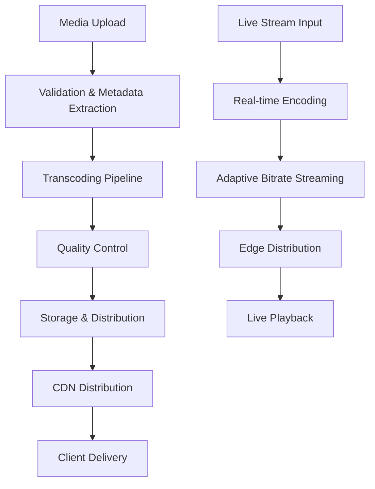
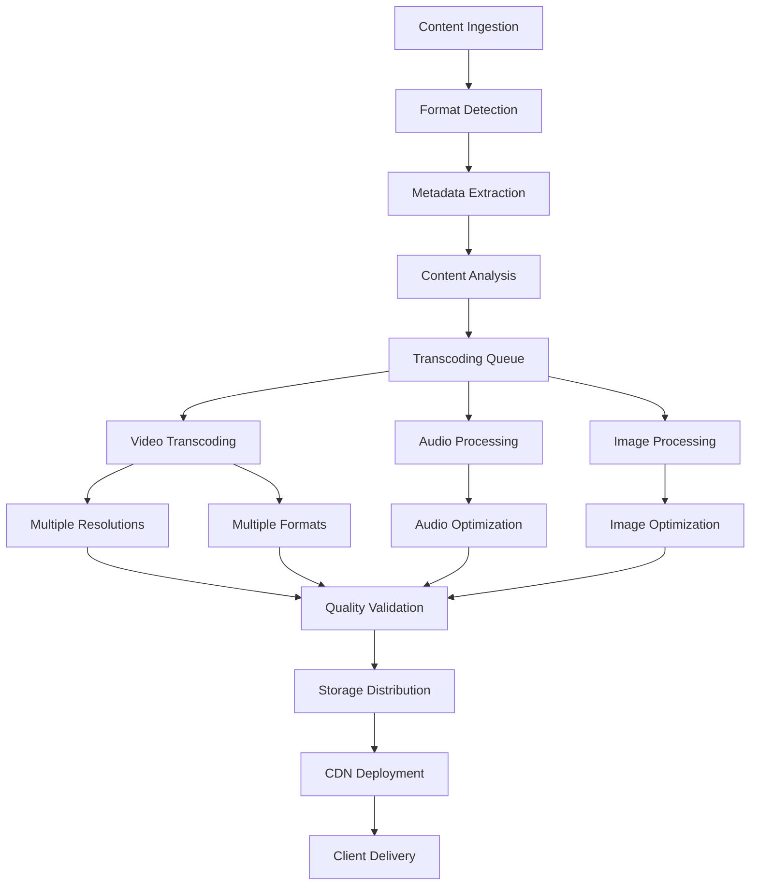
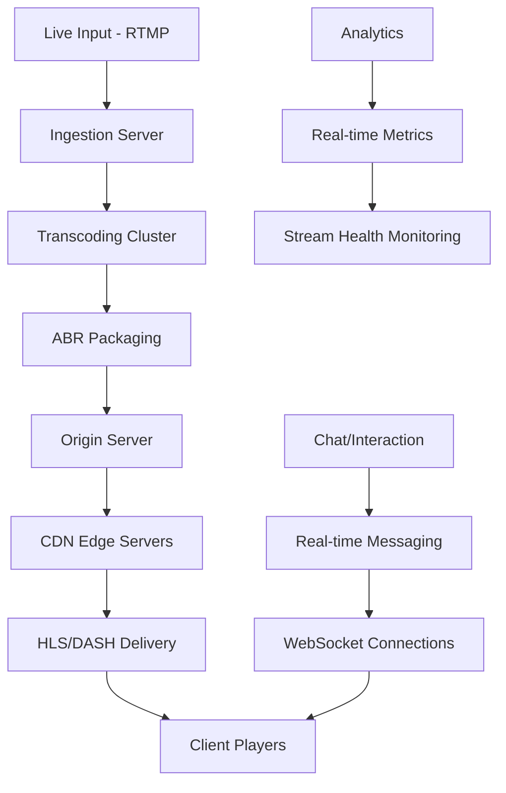

# Media Processing & Streaming

## Introduction

Media processing and streaming systems handle the ingestion, transformation, storage, and delivery of multimedia content at scale. These systems must efficiently process various media formats, optimize for different devices and network conditions, and deliver content with minimal latency to global audiences.

Modern media platforms like YouTube, Netflix, and Spotify process petabytes of content daily, requiring sophisticated pipelines that can handle everything from user uploads to live streaming with millions of concurrent viewers.

## Media Processing Pipeline Architecture

### Basic Media Processing Workflow



### Comprehensive Processing Pipeline



## Video Processing and Transcoding

### Video Transcoding Pipeline

**Multi-Resolution Encoding:**
```python
class VideoTranscoder:
    def __init__(self):
        self.encoding_profiles = {
            '4K': {'resolution': '3840x2160', 'bitrate': '15000k', 'codec': 'h264'},
            '1080p': {'resolution': '1920x1080', 'bitrate': '5000k', 'codec': 'h264'},
            '720p': {'resolution': '1280x720', 'bitrate': '2500k', 'codec': 'h264'},
            '480p': {'resolution': '854x480', 'bitrate': '1000k', 'codec': 'h264'},
            '360p': {'resolution': '640x360', 'bitrate': '600k', 'codec': 'h264'}
        }
    
    def transcode_video(self, input_file, output_dir):
        jobs = []
        
        for quality, profile in self.encoding_profiles.items():
            job = {
                'input': input_file,
                'output': f"{output_dir}/{quality}.mp4",
                'settings': profile,
                'priority': self.get_priority(quality)
            }
            jobs.append(job)
        
        # Process jobs in parallel
        return self.process_jobs_parallel(jobs)
    
    def get_priority(self, quality):
        # Prioritize common resolutions
        priority_map = {'720p': 1, '1080p': 2, '480p': 3, '360p': 4, '4K': 5}
        return priority_map.get(quality, 10)
```

**Adaptive Bitrate Streaming (ABR):**
```python
class ABRProcessor:
    def create_abr_manifest(self, video_variants):
        """Create HLS or DASH manifest for adaptive streaming"""
        manifest = {
            'type': 'application/x-mpegURL',
            'version': 3,
            'variants': []
        }
        
        for variant in video_variants:
            manifest['variants'].append({
                'bandwidth': variant['bitrate'] * 1000,
                'resolution': variant['resolution'],
                'codecs': f"avc1.{variant['profile']},mp4a.40.2",
                'uri': f"{variant['quality']}/playlist.m3u8"
            })
        
        return self.generate_master_playlist(manifest)
    
    def segment_video(self, video_file, segment_duration=6):
        """Split video into segments for streaming"""
        segments = []
        duration = self.get_video_duration(video_file)
        
        for i in range(0, int(duration), segment_duration):
            segment = {
                'index': i // segment_duration,
                'start_time': i,
                'duration': min(segment_duration, duration - i),
                'file': f"segment_{i//segment_duration:04d}.ts"
            }
            segments.append(segment)
        
        return segments
```

### Advanced Video Processing

**Content-Aware Encoding:**
```python
class ContentAwareEncoder:
    def __init__(self):
        self.scene_analyzer = SceneAnalyzer()
        self.complexity_analyzer = ComplexityAnalyzer()
    
    def optimize_encoding(self, video_file):
        # Analyze video content
        scenes = self.scene_analyzer.detect_scenes(video_file)
        complexity_map = self.complexity_analyzer.analyze_complexity(video_file)
        
        encoding_settings = []
        
        for scene in scenes:
            complexity = complexity_map[scene['start']:scene['end']]
            
            if complexity > 0.8:  # High complexity (action scenes)
                bitrate_multiplier = 1.5
                encoding_preset = 'slow'  # Better quality for complex scenes
            elif complexity < 0.3:  # Low complexity (static scenes)
                bitrate_multiplier = 0.7
                encoding_preset = 'fast'  # Faster encoding for simple scenes
            else:
                bitrate_multiplier = 1.0
                encoding_preset = 'medium'
            
            encoding_settings.append({
                'start_time': scene['start'],
                'end_time': scene['end'],
                'bitrate_multiplier': bitrate_multiplier,
                'preset': encoding_preset
            })
        
        return encoding_settings
```

## Audio Processing

### Audio Optimization Pipeline

```python
class AudioProcessor:
    def __init__(self):
        self.supported_formats = ['mp3', 'aac', 'ogg', 'flac']
        self.quality_profiles = {
            'high': {'bitrate': '320k', 'sample_rate': '48000'},
            'medium': {'bitrate': '192k', 'sample_rate': '44100'},
            'low': {'bitrate': '128k', 'sample_rate': '44100'},
            'mobile': {'bitrate': '96k', 'sample_rate': '22050'}
        }
    
    def process_audio(self, input_file):
        # Extract metadata
        metadata = self.extract_audio_metadata(input_file)
        
        # Normalize audio levels
        normalized_audio = self.normalize_audio(input_file)
        
        # Generate multiple quality versions
        variants = {}
        for quality, settings in self.quality_profiles.items():
            variants[quality] = self.encode_audio(
                normalized_audio, 
                settings['bitrate'], 
                settings['sample_rate']
            )
        
        return {
            'metadata': metadata,
            'variants': variants,
            'waveform': self.generate_waveform(normalized_audio)
        }
    
    def normalize_audio(self, audio_file):
        """Apply loudness normalization and dynamic range compression"""
        return {
            'loudness_lufs': -23,  # EBU R128 standard
            'peak_dbfs': -1,       # Prevent clipping
            'dynamic_range': 'compressed'
        }
```

### Real-time Audio Processing

```python
class RealTimeAudioProcessor:
    def __init__(self):
        self.buffer_size = 1024
        self.sample_rate = 48000
        self.latency_target = 20  # milliseconds
    
    def process_live_audio(self, audio_stream):
        """Process live audio with minimal latency"""
        processed_stream = AudioStream()
        
        while audio_stream.is_active():
            # Read audio buffer
            buffer = audio_stream.read(self.buffer_size)
            
            # Apply real-time effects
            processed_buffer = self.apply_effects(buffer)
            
            # Encode for streaming
            encoded_buffer = self.encode_realtime(processed_buffer)
            
            # Send to streaming endpoints
            processed_stream.write(encoded_buffer)
        
        return processed_stream
    
    def apply_effects(self, buffer):
        """Apply noise reduction, echo cancellation, etc."""
        # Noise reduction
        buffer = self.noise_reduction(buffer)
        
        # Echo cancellation for voice calls
        buffer = self.echo_cancellation(buffer)
        
        # Automatic gain control
        buffer = self.automatic_gain_control(buffer)
        
        return buffer
```

## Image Processing and Optimization

### Dynamic Image Processing

```python
class DynamicImageProcessor:
    def __init__(self):
        self.supported_formats = ['jpeg', 'png', 'webp', 'avif']
        self.optimization_profiles = {
            'thumbnail': {'max_width': 150, 'quality': 80},
            'mobile': {'max_width': 800, 'quality': 85},
            'desktop': {'max_width': 1920, 'quality': 90},
            'print': {'max_width': 3000, 'quality': 95}
        }
    
    def process_image_request(self, image_url, params):
        """Process image on-demand based on request parameters"""
        # Parse transformation parameters
        width = params.get('w', 'auto')
        height = params.get('h', 'auto')
        quality = params.get('q', 85)
        format = params.get('f', 'auto')
        
        # Determine optimal format based on user agent
        if format == 'auto':
            format = self.detect_optimal_format(params.get('user_agent'))
        
        # Generate cache key
        cache_key = f"{image_url}:{width}x{height}:q{quality}:{format}"
        
        # Check cache first
        cached_image = self.cache.get(cache_key)
        if cached_image:
            return cached_image
        
        # Process image
        processed_image = self.transform_image(image_url, {
            'width': width,
            'height': height,
            'quality': quality,
            'format': format
        })
        
        # Cache result
        self.cache.set(cache_key, processed_image, ttl=3600)
        
        return processed_image
    
    def detect_optimal_format(self, user_agent):
        """Select best image format based on browser support"""
        if 'Chrome' in user_agent and self.supports_avif(user_agent):
            return 'avif'  # Best compression
        elif self.supports_webp(user_agent):
            return 'webp'  # Good compression, wide support
        else:
            return 'jpeg'  # Universal fallback
```

### Intelligent Image Optimization

```python
class IntelligentImageOptimizer:
    def __init__(self):
        self.ml_model = ImageAnalysisModel()
    
    def optimize_image(self, image_data, context):
        """Use ML to optimize image based on content and context"""
        # Analyze image content
        analysis = self.ml_model.analyze_image(image_data)
        
        # Determine optimal settings based on content
        if analysis['content_type'] == 'photo':
            # Photos benefit from JPEG compression
            format = 'jpeg'
            quality = self.calculate_photo_quality(analysis['complexity'])
        elif analysis['content_type'] == 'graphic':
            # Graphics work better with PNG or WebP
            format = 'webp' if analysis['has_transparency'] else 'png'
            quality = 95  # High quality for graphics
        elif analysis['content_type'] == 'text':
            # Text images need high quality
            format = 'png'
            quality = 100
        
        # Apply context-based optimizations
        if context.get('viewport') == 'mobile':
            quality = max(quality - 10, 70)  # Reduce quality for mobile
        
        if context.get('connection_speed') == 'slow':
            quality = max(quality - 20, 60)  # Further reduce for slow connections
        
        return self.apply_optimization(image_data, format, quality)
```

## Live Streaming Architecture

### Live Streaming Pipeline



### Low-Latency Streaming

```python
class LowLatencyStreaming:
    def __init__(self):
        self.target_latency = 2000  # 2 seconds
        self.segment_duration = 1   # 1 second segments
        self.chunk_duration = 0.2   # 200ms chunks
    
    def setup_low_latency_stream(self, stream_config):
        """Configure stream for minimal latency"""
        config = {
            'protocol': 'WebRTC',  # Lowest latency
            'fallback_protocol': 'HLS_LL',  # Low-latency HLS
            'segment_duration': self.segment_duration,
            'chunk_transfer': True,
            'http2_push': True,
            'prefetch_segments': 2
        }
        
        # Configure encoder for low latency
        encoder_config = {
            'keyframe_interval': 1,  # 1 second keyframes
            'lookahead': 0,          # No lookahead for minimal delay
            'b_frames': 0,           # No B-frames
            'preset': 'ultrafast'    # Fastest encoding
        }
        
        return self.create_stream(config, encoder_config)
    
    def handle_stream_chunk(self, chunk_data):
        """Process and distribute stream chunks immediately"""
        # Minimal processing for low latency
        processed_chunk = self.minimal_process(chunk_data)
        
        # Immediately push to CDN edges
        self.push_to_edges(processed_chunk)
        
        # Update manifest with new chunk
        self.update_manifest(processed_chunk)
        
        return processed_chunk
```

## Media Storage and Distribution

### Tiered Storage Strategy

```python
class MediaStorageManager:
    def __init__(self):
        self.storage_tiers = {
            'hot': {
                'type': 'SSD',
                'cost_per_gb': 0.10,
                'access_time': '1ms',
                'retention': '30 days'
            },
            'warm': {
                'type': 'HDD',
                'cost_per_gb': 0.05,
                'access_time': '10ms',
                'retention': '1 year'
            },
            'cold': {
                'type': 'Archive',
                'cost_per_gb': 0.01,
                'access_time': '1-5 minutes',
                'retention': 'indefinite'
            }
        }
    
    def determine_storage_tier(self, media_metadata):
        """Determine appropriate storage tier based on access patterns"""
        access_frequency = media_metadata['access_count_30d']
        file_size = media_metadata['file_size']
        content_age = media_metadata['days_since_upload']
        
        if access_frequency > 100 or content_age < 7:
            return 'hot'
        elif access_frequency > 10 or content_age < 90:
            return 'warm'
        else:
            return 'cold'
    
    def migrate_content(self, content_id, target_tier):
        """Migrate content between storage tiers"""
        current_tier = self.get_current_tier(content_id)
        
        if current_tier != target_tier:
            # Copy to new tier
            self.copy_to_tier(content_id, target_tier)
            
            # Update metadata
            self.update_content_location(content_id, target_tier)
            
            # Remove from old tier (after verification)
            self.cleanup_old_tier(content_id, current_tier)
```

### Global Content Distribution

```python
class GlobalMediaDistribution:
    def __init__(self):
        self.regions = {
            'us-east': {'capacity': '10PB', 'latency_to_users': '20ms'},
            'us-west': {'capacity': '8PB', 'latency_to_users': '25ms'},
            'europe': {'capacity': '12PB', 'latency_to_users': '30ms'},
            'asia': {'capacity': '15PB', 'latency_to_users': '35ms'}
        }
    
    def distribute_content(self, content_metadata):
        """Intelligently distribute content based on predicted demand"""
        # Analyze content popularity patterns
        popularity_prediction = self.predict_popularity(content_metadata)
        
        # Determine distribution strategy
        if popularity_prediction['global_appeal'] > 0.8:
            # Distribute to all regions immediately
            return self.distribute_globally(content_metadata)
        elif popularity_prediction['regional_appeal']:
            # Distribute to specific regions
            target_regions = popularity_prediction['target_regions']
            return self.distribute_regionally(content_metadata, target_regions)
        else:
            # Keep in origin region, distribute on-demand
            return self.distribute_on_demand(content_metadata)
    
    def predict_popularity(self, metadata):
        """Use ML to predict content popularity and distribution needs"""
        features = {
            'creator_follower_count': metadata['creator']['followers'],
            'content_category': metadata['category'],
            'upload_time': metadata['timestamp'],
            'content_length': metadata['duration'],
            'thumbnail_appeal': metadata['thumbnail_score']
        }
        
        return self.ml_model.predict_popularity(features)
```

## Performance Optimization Strategies

### Adaptive Quality Streaming

```javascript
class AdaptiveQualityController {
    constructor() {
        this.qualityLevels = [
            { name: '4K', bandwidth: 15000000, resolution: '3840x2160' },
            { name: '1080p', bandwidth: 5000000, resolution: '1920x1080' },
            { name: '720p', bandwidth: 2500000, resolution: '1280x720' },
            { name: '480p', bandwidth: 1000000, resolution: '854x480' },
            { name: '360p', bandwidth: 600000, resolution: '640x360' }
        ];
        
        this.currentQuality = this.qualityLevels[2]; // Start with 720p
        this.bandwidthHistory = [];
        this.bufferHealth = 100; // percentage
    }
    
    adaptQuality() {
        const networkSpeed = this.measureNetworkSpeed();
        const bufferLevel = this.getBufferLevel();
        const deviceCapability = this.getDeviceCapability();
        
        // Calculate optimal quality
        const optimalQuality = this.calculateOptimalQuality(
            networkSpeed, 
            bufferLevel, 
            deviceCapability
        );
        
        // Smooth quality transitions
        if (this.shouldChangeQuality(optimalQuality)) {
            this.transitionToQuality(optimalQuality);
        }
    }
    
    calculateOptimalQuality(networkSpeed, bufferLevel, deviceCapability) {
        // Conservative approach: use 80% of available bandwidth
        const usableBandwidth = networkSpeed * 0.8;
        
        // Find highest quality that fits bandwidth
        let targetQuality = this.qualityLevels[this.qualityLevels.length - 1];
        
        for (const quality of this.qualityLevels) {
            if (quality.bandwidth <= usableBandwidth) {
                targetQuality = quality;
                break;
            }
        }
        
        // Adjust based on buffer health
        if (bufferLevel < 30) {
            // Buffer is low, reduce quality
            const currentIndex = this.qualityLevels.indexOf(targetQuality);
            targetQuality = this.qualityLevels[Math.min(currentIndex + 1, this.qualityLevels.length - 1)];
        }
        
        // Respect device capabilities
        if (deviceCapability.maxResolution < targetQuality.resolution) {
            targetQuality = this.findQualityByResolution(deviceCapability.maxResolution);
        }
        
        return targetQuality;
    }
}
```

### Content Preloading and Caching

```python
class IntelligentPreloader:
    def __init__(self):
        self.user_behavior_model = UserBehaviorModel()
        self.content_popularity_model = ContentPopularityModel()
    
    def preload_strategy(self, user_id, current_content):
        """Determine what content to preload for optimal user experience"""
        # Analyze user viewing patterns
        user_preferences = self.user_behavior_model.get_preferences(user_id)
        
        # Get content recommendations
        recommendations = self.get_recommendations(user_id, current_content)
        
        # Calculate preload priorities
        preload_candidates = []
        
        for content in recommendations:
            priority = self.calculate_preload_priority(
                content, 
                user_preferences, 
                current_content
            )
            
            if priority > 0.7:  # High probability of viewing
                preload_candidates.append({
                    'content_id': content['id'],
                    'priority': priority,
                    'quality': self.determine_preload_quality(content, user_preferences)
                })
        
        return sorted(preload_candidates, key=lambda x: x['priority'], reverse=True)
    
    def determine_preload_quality(self, content, user_preferences):
        """Determine what quality to preload based on user context"""
        if user_preferences['connection_type'] == 'wifi':
            return '1080p'  # High quality on WiFi
        elif user_preferences['data_saver_mode']:
            return '480p'   # Lower quality for data saving
        else:
            return '720p'   # Balanced quality for mobile data
```

## Best Practices

### Encoding Optimization

1. **Use Content-Aware Encoding**
   ```python
   def optimize_encoding_settings(video_analysis):
       if video_analysis['motion_level'] > 0.8:
           # High motion content (sports, action)
           return {
               'bitrate_multiplier': 1.3,
               'keyframe_interval': 2,  # More frequent keyframes
               'preset': 'slow'         # Better quality for complex scenes
           }
       elif video_analysis['static_content'] > 0.7:
           # Static content (presentations, tutorials)
           return {
               'bitrate_multiplier': 0.7,
               'keyframe_interval': 10, # Less frequent keyframes
               'preset': 'fast'         # Faster encoding
           }
   ```

2. **Implement Smart Quality Ladders**
   ```python
   def generate_quality_ladder(source_resolution, content_type):
       base_ladder = ['360p', '480p', '720p', '1080p']
       
       if content_type == 'mobile_first':
           # Prioritize mobile-friendly resolutions
           return ['240p', '360p', '480p', '720p']
       elif source_resolution >= '4K':
           # Include 4K for high-resolution sources
           return base_ladder + ['1440p', '2160p']
       else:
           return base_ladder
   ```

### Performance Monitoring

```python
class MediaPerformanceMonitor:
    def track_streaming_metrics(self, session_data):
        metrics = {
            'startup_time': session_data['time_to_first_frame'],
            'rebuffer_ratio': session_data['rebuffer_time'] / session_data['total_time'],
            'quality_switches': len(session_data['quality_changes']),
            'average_bitrate': session_data['total_bytes'] / session_data['total_time'],
            'completion_rate': session_data['watched_duration'] / session_data['content_duration']
        }
        
        # Alert on performance issues
        if metrics['startup_time'] > 3000:  # 3 seconds
            self.alert('High startup time', metrics)
        
        if metrics['rebuffer_ratio'] > 0.02:  # 2% rebuffering
            self.alert('Excessive rebuffering', metrics)
        
        return metrics
```

## Summary

Media processing and streaming systems require sophisticated architectures to handle:

- **Scalable Processing**: Transcode and optimize content for multiple formats and qualities
- **Adaptive Delivery**: Dynamically adjust quality based on network conditions and device capabilities
- **Global Distribution**: Efficiently distribute content worldwide with minimal latency
- **Real-time Streaming**: Handle live content with ultra-low latency requirements
- **Cost Optimization**: Balance quality, performance, and storage costs

Key implementation strategies:

- **Multi-tier Processing**: Use different processing pipelines for different content types
- **Intelligent Caching**: Preload and cache content based on predicted user behavior
- **Adaptive Streaming**: Implement ABR for optimal user experience across varying network conditions
- **Performance Monitoring**: Track key metrics to optimize system performance continuously

Understanding these concepts enables you to build media systems that can scale to serve millions of users while maintaining high quality and performance.
