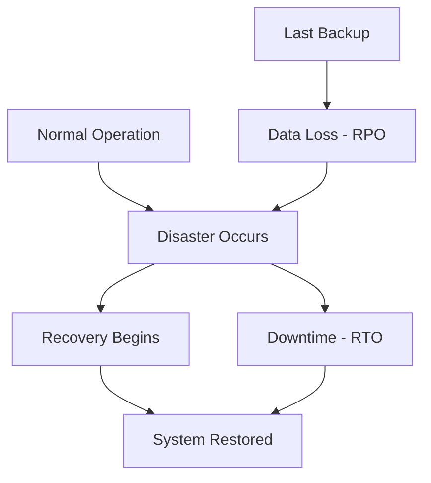
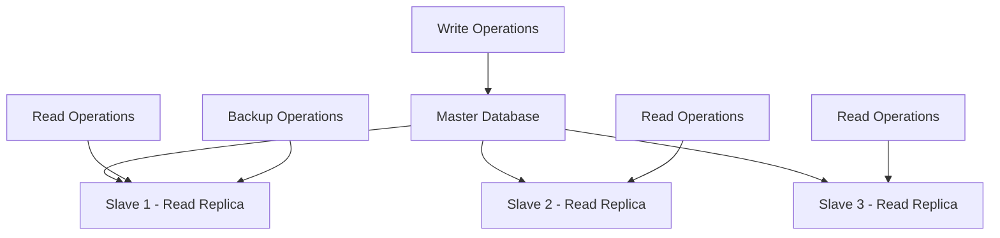
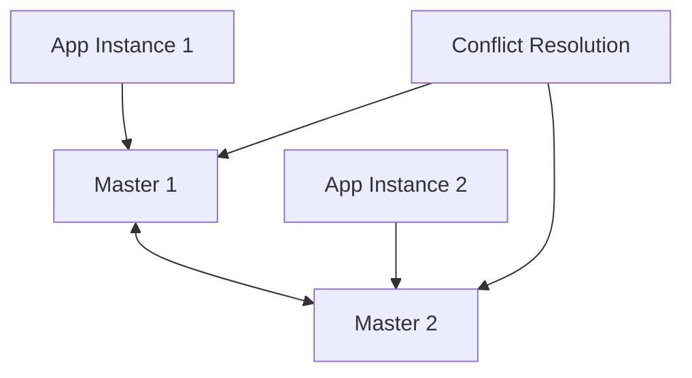

# Backup & Disaster Recovery

## Introduction

Backup and disaster recovery (DR) are critical components of any robust system design. They ensure business continuity, data protection, and system availability in the face of hardware failures, human errors, natural disasters, or cyber attacks. A well-designed backup and recovery strategy can mean the difference between a minor inconvenience and a catastrophic business failure.

Modern systems must balance multiple objectives: minimizing data loss (RPO - Recovery Point Objective), minimizing downtime (RTO - Recovery Time Objective), and managing costs while ensuring compliance with regulatory requirements.

## Key Concepts and Metrics

### Recovery Objectives

**Recovery Point Objective (RPO)**
- Maximum acceptable data loss measured in time
- Determines backup frequency requirements
- Examples: RPO of 1 hour means losing at most 1 hour of data

**Recovery Time Objective (RTO)**
- Maximum acceptable downtime for recovery
- Influences architecture and automation requirements
- Examples: RTO of 15 minutes means system must be restored within 15 minutes



### Backup Types and Strategies

**Full Backup**
```python
class FullBackup:
    def perform_backup(self, source_data):
        """Complete copy of all data"""
        backup_data = {
            'type': 'full',
            'timestamp': datetime.now(),
            'size': len(source_data),
            'data': source_data.copy()
        }
        
        return self.store_backup(backup_data)
    
    def restore_from_full(self, backup_id):
        """Restore complete system from full backup"""
        backup = self.retrieve_backup(backup_id)
        return backup['data']
```

**Incremental Backup**
```python
class IncrementalBackup:
    def __init__(self):
        self.last_backup_timestamp = None
        self.change_tracker = ChangeTracker()
    
    def perform_backup(self, source_data):
        """Backup only changes since last backup"""
        if self.last_backup_timestamp is None:
            return self.perform_full_backup(source_data)
        
        changes = self.change_tracker.get_changes_since(
            self.last_backup_timestamp
        )
        
        backup_data = {
            'type': 'incremental',
            'timestamp': datetime.now(),
            'parent_backup': self.last_backup_timestamp,
            'changes': changes
        }
        
        self.last_backup_timestamp = backup_data['timestamp']
        return self.store_backup(backup_data)
    
    def restore_from_incremental(self, target_timestamp):
        """Restore by applying incremental changes in sequence"""
        # Find full backup before target timestamp
        full_backup = self.find_full_backup_before(target_timestamp)
        restored_data = full_backup['data'].copy()
        
        # Apply incremental changes in order
        incremental_backups = self.get_incremental_backups_after(
            full_backup['timestamp'], 
            target_timestamp
        )
        
        for backup in incremental_backups:
            restored_data = self.apply_changes(restored_data, backup['changes'])
        
        return restored_data
```

**Differential Backup**
```python
class DifferentialBackup:
    def __init__(self):
        self.last_full_backup_timestamp = None
    
    def perform_backup(self, source_data):
        """Backup all changes since last full backup"""
        if self.last_full_backup_timestamp is None:
            return self.perform_full_backup(source_data)
        
        changes = self.change_tracker.get_changes_since(
            self.last_full_backup_timestamp
        )
        
        return {
            'type': 'differential',
            'timestamp': datetime.now(),
            'full_backup_ref': self.last_full_backup_timestamp,
            'changes': changes
        }
    
    def restore_from_differential(self, target_timestamp):
        """Restore using full backup + latest differential"""
        full_backup = self.find_full_backup_before(target_timestamp)
        differential_backup = self.find_differential_backup_before(target_timestamp)
        
        restored_data = full_backup['data'].copy()
        if differential_backup:
            restored_data = self.apply_changes(
                restored_data, 
                differential_backup['changes']
            )
        
        return restored_data
```

## Database Backup Strategies

### Transactional Database Backups

**Point-in-Time Recovery (PITR)**
```python
class DatabasePITR:
    def __init__(self):
        self.wal_archiver = WALArchiver()  # Write-Ahead Log archiver
        self.backup_scheduler = BackupScheduler()
    
    def setup_pitr(self, database_config):
        """Configure point-in-time recovery"""
        config = {
            'full_backup_schedule': 'daily',
            'wal_archiving': True,
            'wal_retention': '7 days',
            'backup_retention': '30 days'
        }
        
        # Schedule regular full backups
        self.backup_scheduler.schedule_full_backup(
            database_config['connection'],
            config['full_backup_schedule']
        )
        
        # Enable WAL archiving for continuous backup
        self.wal_archiver.enable_archiving(
            database_config['wal_directory'],
            config['wal_retention']
        )
        
        return config
    
    def restore_to_point_in_time(self, target_timestamp):
        """Restore database to specific point in time"""
        # Find latest full backup before target time
        full_backup = self.find_full_backup_before(target_timestamp)
        
        # Restore from full backup
        self.restore_full_backup(full_backup)
        
        # Apply WAL files up to target timestamp
        wal_files = self.get_wal_files_between(
            full_backup['timestamp'],
            target_timestamp
        )
        
        for wal_file in wal_files:
            self.apply_wal_file(wal_file, target_timestamp)
        
        return True
```

**Hot vs Cold Backups**
```python
class DatabaseBackupManager:
    def perform_hot_backup(self, database_connection):
        """Backup while database is running (online backup)"""
        try:
            # Start backup mode
            database_connection.execute("SELECT pg_start_backup('hot_backup')")
            
            # Copy database files while maintaining consistency
            backup_data = self.copy_database_files_consistent()
            
            # Stop backup mode and get WAL location
            wal_location = database_connection.execute("SELECT pg_stop_backup()")
            
            return {
                'type': 'hot_backup',
                'data': backup_data,
                'wal_location': wal_location,
                'consistent': True
            }
        except Exception as e:
            database_connection.execute("SELECT pg_stop_backup()")
            raise BackupError(f"Hot backup failed: {e}")
    
    def perform_cold_backup(self, database_config):
        """Backup while database is stopped (offline backup)"""
        # Stop database service
        self.stop_database_service(database_config)
        
        try:
            # Copy all database files
            backup_data = self.copy_database_files_complete()
            
            return {
                'type': 'cold_backup',
                'data': backup_data,
                'consistent': True,
                'downtime': True
            }
        finally:
            # Restart database service
            self.start_database_service(database_config)
```

## Replication and High Availability

### Database Replication Patterns

**Master-Slave Replication**


**Master-Master Replication**


**Multi-Region Replication**
```python
class MultiRegionReplication:
    def __init__(self):
        self.regions = {
            'us-east-1': {'role': 'primary', 'replicas': []},
            'us-west-2': {'role': 'secondary', 'replicas': []},
            'eu-west-1': {'role': 'secondary', 'replicas': []}
        }
    
    def setup_cross_region_replication(self):
        """Configure replication across multiple regions"""
        primary_region = self.get_primary_region()
        
        for region_name, region_config in self.regions.items():
            if region_name != primary_region:
                # Setup async replication to secondary regions
                replication_config = {
                    'source': primary_region,
                    'target': region_name,
                    'mode': 'async',
                    'lag_tolerance': '5 seconds',
                    'conflict_resolution': 'last_write_wins'
                }
                
                self.configure_replication(replication_config)
    
    def handle_region_failover(self, failed_region):
        """Promote secondary region to primary during disaster"""
        if failed_region == self.get_primary_region():
            # Promote best secondary region to primary
            new_primary = self.select_best_secondary_region()
            
            # Stop replication to failed region
            self.stop_replication_to_region(failed_region)
            
            # Promote secondary to primary
            self.promote_to_primary(new_primary)
            
            # Reconfigure other regions to replicate from new primary
            self.reconfigure_replication_topology(new_primary)
            
            return new_primary
```

### Application-Level Backup Strategies

**Microservices Backup Coordination**
```python
class MicroservicesBackupCoordinator:
    def __init__(self):
        self.services = {}
        self.backup_orchestrator = BackupOrchestrator()
    
    def coordinate_distributed_backup(self):
        """Coordinate consistent backup across microservices"""
        backup_id = self.generate_backup_id()
        
        # Phase 1: Prepare all services for backup
        preparation_results = {}
        for service_name, service_config in self.services.items():
            try:
                result = self.prepare_service_backup(service_name, backup_id)
                preparation_results[service_name] = result
            except Exception as e:
                # Abort backup if any service fails to prepare
                self.abort_backup(backup_id, preparation_results)
                raise BackupError(f"Service {service_name} failed to prepare: {e}")
        
        # Phase 2: Execute backup on all services
        backup_results = {}
        for service_name in self.services.keys():
            try:
                result = self.execute_service_backup(service_name, backup_id)
                backup_results[service_name] = result
            except Exception as e:
                # Continue with other services, mark this one as failed
                backup_results[service_name] = {'status': 'failed', 'error': str(e)}
        
        # Phase 3: Finalize backup
        return self.finalize_distributed_backup(backup_id, backup_results)
    
    def restore_distributed_system(self, backup_id, target_timestamp):
        """Restore entire distributed system to consistent state"""
        # Get backup metadata
        backup_metadata = self.get_backup_metadata(backup_id)
        
        # Determine restoration order based on dependencies
        restoration_order = self.calculate_restoration_order()
        
        # Restore services in dependency order
        for service_name in restoration_order:
            service_backup = backup_metadata['services'][service_name]
            self.restore_service(service_name, service_backup, target_timestamp)
        
        # Verify system consistency after restoration
        return self.verify_system_consistency()
```

## Cloud Backup Strategies

### Multi-Cloud Backup Architecture

```python
class MultiCloudBackupManager:
    def __init__(self):
        self.cloud_providers = {
            'aws': AWSBackupService(),
            'gcp': GCPBackupService(),
            'azure': AzureBackupService()
        }
        self.backup_policy = BackupPolicy()
    
    def distribute_backup_across_clouds(self, backup_data):
        """Distribute backup across multiple cloud providers"""
        # Split backup into chunks
        chunks = self.split_backup_data(backup_data)
        
        # Distribute chunks across providers
        distribution_map = {}
        for i, chunk in enumerate(chunks):
            provider = list(self.cloud_providers.keys())[i % len(self.cloud_providers)]
            
            chunk_id = self.cloud_providers[provider].store_backup_chunk(chunk)
            distribution_map[f"chunk_{i}"] = {
                'provider': provider,
                'chunk_id': chunk_id,
                'checksum': self.calculate_checksum(chunk)
            }
        
        # Store distribution metadata
        backup_metadata = {
            'backup_id': self.generate_backup_id(),
            'timestamp': datetime.now(),
            'distribution_map': distribution_map,
            'total_chunks': len(chunks)
        }
        
        return self.store_backup_metadata(backup_metadata)
    
    def restore_from_multi_cloud(self, backup_id):
        """Restore backup distributed across multiple clouds"""
        # Get backup metadata
        metadata = self.get_backup_metadata(backup_id)
        
        # Retrieve chunks from different providers
        chunks = {}
        for chunk_name, chunk_info in metadata['distribution_map'].items():
            provider = self.cloud_providers[chunk_info['provider']]
            chunk_data = provider.retrieve_backup_chunk(chunk_info['chunk_id'])
            
            # Verify chunk integrity
            if self.calculate_checksum(chunk_data) != chunk_info['checksum']:
                raise BackupCorruptionError(f"Chunk {chunk_name} is corrupted")
            
            chunks[chunk_name] = chunk_data
        
        # Reassemble backup data
        return self.reassemble_backup_data(chunks)
```

### Automated Backup Lifecycle Management

```python
class BackupLifecycleManager:
    def __init__(self):
        self.retention_policies = {
            'daily': {'count': 7, 'storage_class': 'standard'},
            'weekly': {'count': 4, 'storage_class': 'infrequent_access'},
            'monthly': {'count': 12, 'storage_class': 'glacier'},
            'yearly': {'count': 7, 'storage_class': 'deep_archive'}
        }
    
    def manage_backup_lifecycle(self):
        """Automatically manage backup retention and storage classes"""
        all_backups = self.get_all_backups()
        
        for backup in all_backups:
            age = datetime.now() - backup['timestamp']
            
            # Determine appropriate retention policy
            if age.days <= 7:
                policy = 'daily'
            elif age.days <= 28:
                policy = 'weekly'
            elif age.days <= 365:
                policy = 'monthly'
            else:
                policy = 'yearly'
            
            # Apply retention policy
            self.apply_retention_policy(backup, policy)
    
    def apply_retention_policy(self, backup, policy_name):
        """Apply specific retention policy to backup"""
        policy = self.retention_policies[policy_name]
        
        # Move to appropriate storage class if needed
        if backup['storage_class'] != policy['storage_class']:
            self.transition_storage_class(backup, policy['storage_class'])
        
        # Check if backup should be deleted based on count limits
        similar_backups = self.get_backups_by_policy(policy_name)
        if len(similar_backups) > policy['count']:
            # Delete oldest backups exceeding retention count
            excess_backups = sorted(similar_backups, key=lambda x: x['timestamp'])[:-policy['count']]
            for old_backup in excess_backups:
                self.delete_backup(old_backup['id'])
```

## Disaster Recovery Planning

### Disaster Recovery Runbook

```python
class DisasterRecoveryOrchestrator:
    def __init__(self):
        self.recovery_procedures = {
            'database_failure': DatabaseFailureRecovery(),
            'application_failure': ApplicationFailureRecovery(),
            'infrastructure_failure': InfrastructureFailureRecovery(),
            'data_corruption': DataCorruptionRecovery(),
            'security_breach': SecurityBreachRecovery()
        }
    
    def execute_disaster_recovery(self, disaster_type, severity):
        """Execute appropriate disaster recovery procedure"""
        recovery_procedure = self.recovery_procedures.get(disaster_type)
        if not recovery_procedure:
            raise UnknownDisasterTypeError(f"No procedure for {disaster_type}")
        
        # Create recovery session
        recovery_session = {
            'id': self.generate_recovery_id(),
            'disaster_type': disaster_type,
            'severity': severity,
            'start_time': datetime.now(),
            'status': 'in_progress'
        }
        
        try:
            # Execute recovery steps
            recovery_steps = recovery_procedure.get_recovery_steps(severity)
            
            for step in recovery_steps:
                step_result = self.execute_recovery_step(step)
                recovery_session['steps'].append(step_result)
                
                # Check if recovery is successful
                if step_result['status'] == 'success' and step.get('validates_recovery'):
                    recovery_session['status'] = 'completed'
                    break
            
            return recovery_session
            
        except Exception as e:
            recovery_session['status'] = 'failed'
            recovery_session['error'] = str(e)
            raise DisasterRecoveryError(f"Recovery failed: {e}")
```

### Recovery Testing and Validation

```python
class RecoveryTestingFramework:
    def __init__(self):
        self.test_environments = {}
        self.test_scenarios = []
    
    def schedule_recovery_tests(self):
        """Regularly test disaster recovery procedures"""
        test_schedule = {
            'backup_restoration': 'weekly',
            'database_failover': 'monthly',
            'full_system_recovery': 'quarterly',
            'cross_region_failover': 'semi-annually'
        }
        
        for test_type, frequency in test_schedule.items():
            self.schedule_test(test_type, frequency)
    
    def execute_recovery_test(self, test_scenario):
        """Execute disaster recovery test in isolated environment"""
        # Create isolated test environment
        test_env = self.create_test_environment(test_scenario['requirements'])
        
        try:
            # Simulate disaster
            self.simulate_disaster(test_env, test_scenario['disaster_type'])
            
            # Execute recovery procedure
            recovery_start = datetime.now()
            recovery_result = self.execute_recovery_procedure(
                test_env, 
                test_scenario['recovery_procedure']
            )
            recovery_duration = datetime.now() - recovery_start
            
            # Validate recovery
            validation_result = self.validate_recovery(test_env, test_scenario['validation_criteria'])
            
            # Generate test report
            return {
                'test_id': test_scenario['id'],
                'recovery_duration': recovery_duration,
                'rto_met': recovery_duration <= test_scenario['target_rto'],
                'validation_passed': validation_result['passed'],
                'issues_found': validation_result['issues'],
                'recommendations': self.generate_recommendations(recovery_result, validation_result)
            }
            
        finally:
            # Clean up test environment
            self.cleanup_test_environment(test_env)
```

## Best Practices

### Backup Strategy Design

1. **Follow the 3-2-1 Rule**
   ```python
   class BackupStrategy321:
       """3 copies, 2 different media types, 1 offsite"""
       def __init__(self):
           self.copies = {
               'production': {'location': 'primary_datacenter', 'media': 'disk'},
               'local_backup': {'location': 'primary_datacenter', 'media': 'tape'},
               'offsite_backup': {'location': 'remote_datacenter', 'media': 'cloud'}
           }
       
       def validate_321_compliance(self, backup_set):
           locations = set(copy['location'] for copy in backup_set.values())
           media_types = set(copy['media'] for copy in backup_set.values())
           
           return (
               len(backup_set) >= 3 and
               len(media_types) >= 2 and
               len(locations) >= 2
           )
   ```

2. **Implement Backup Verification**
   ```python
   class BackupVerification:
       def verify_backup_integrity(self, backup_id):
           """Comprehensive backup verification"""
           backup = self.get_backup(backup_id)
           
           # Checksum verification
           calculated_checksum = self.calculate_checksum(backup['data'])
           if calculated_checksum != backup['stored_checksum']:
               raise BackupCorruptionError("Checksum mismatch")
           
           # Test restoration
           test_restore_result = self.test_restore(backup_id)
           if not test_restore_result['success']:
               raise BackupValidationError("Test restore failed")
           
           # Validate data consistency
           consistency_check = self.validate_data_consistency(backup['data'])
           if not consistency_check['valid']:
               raise BackupConsistencyError("Data consistency check failed")
           
           return True
   ```

3. **Monitor Backup Health**
   ```python
   class BackupHealthMonitor:
       def monitor_backup_health(self):
           """Continuously monitor backup system health"""
           health_metrics = {
               'backup_success_rate': self.calculate_success_rate(),
               'average_backup_duration': self.calculate_avg_duration(),
               'storage_utilization': self.calculate_storage_usage(),
               'recovery_test_success_rate': self.calculate_recovery_success_rate()
           }
           
           # Alert on health issues
           if health_metrics['backup_success_rate'] < 0.95:
               self.alert('Low backup success rate', health_metrics)
           
           if health_metrics['storage_utilization'] > 0.85:
               self.alert('High storage utilization', health_metrics)
           
           return health_metrics
   ```

### Security Considerations

```python
class SecureBackupManager:
    def __init__(self):
        self.encryption_key_manager = KeyManager()
        self.access_control = AccessControl()
    
    def create_encrypted_backup(self, data, backup_metadata):
        """Create encrypted backup with proper key management"""
        # Generate unique encryption key for this backup
        encryption_key = self.encryption_key_manager.generate_key()
        
        # Encrypt backup data
        encrypted_data = self.encrypt_data(data, encryption_key)
        
        # Store encryption key securely (separate from backup)
        key_reference = self.encryption_key_manager.store_key(
            encryption_key, 
            backup_metadata['backup_id']
        )
        
        # Create backup with encrypted data
        secure_backup = {
            'backup_id': backup_metadata['backup_id'],
            'encrypted_data': encrypted_data,
            'key_reference': key_reference,
            'encryption_algorithm': 'AES-256-GCM',
            'access_policy': self.create_access_policy(backup_metadata)
        }
        
        return self.store_secure_backup(secure_backup)
    
    def restore_encrypted_backup(self, backup_id, requester_identity):
        """Restore encrypted backup with proper authorization"""
        # Verify access permissions
        if not self.access_control.verify_restore_permission(requester_identity, backup_id):
            raise UnauthorizedAccessError("Insufficient permissions for restore")
        
        # Retrieve encrypted backup
        secure_backup = self.get_secure_backup(backup_id)
        
        # Retrieve decryption key
        encryption_key = self.encryption_key_manager.retrieve_key(
            secure_backup['key_reference'],
            requester_identity
        )
        
        # Decrypt and return data
        decrypted_data = self.decrypt_data(
            secure_backup['encrypted_data'], 
            encryption_key
        )
        
        # Log access for audit trail
        self.audit_log.record_backup_access(requester_identity, backup_id)
        
        return decrypted_data
```

## Summary

Backup and disaster recovery are fundamental to system reliability and business continuity:

- **Recovery Objectives**: Define clear RPO and RTO requirements to guide backup strategy
- **Backup Types**: Use appropriate backup types (full, incremental, differential) based on requirements
- **Replication**: Implement database and application replication for high availability
- **Testing**: Regularly test recovery procedures to ensure they work when needed
- **Security**: Encrypt backups and implement proper access controls
- **Automation**: Automate backup processes and lifecycle management to reduce human error

Key implementation principles:

- **3-2-1 Rule**: Maintain 3 copies on 2 different media with 1 offsite
- **Regular Testing**: Test recovery procedures regularly in isolated environments
- **Monitoring**: Continuously monitor backup health and success rates
- **Documentation**: Maintain clear runbooks for disaster recovery procedures
- **Security**: Encrypt sensitive backups and implement proper access controls

Understanding these concepts enables you to design robust backup and recovery systems that can protect against data loss and ensure business continuity in the face of various disaster scenarios.
