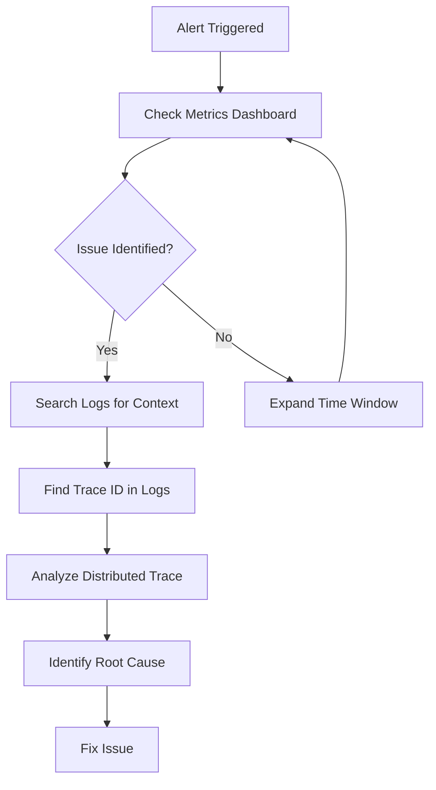

# The Three Pillars of Observability

Observability rests on three fundamental pillars: **Metrics**, **Logs**, and **Traces**. Each provides a different lens into your system's behavior, and together they give you complete visibility into what's happening.

## Understanding the Pillars

### Metrics: The Numbers That Matter

Metrics are numerical measurements collected over time. They answer questions like "How fast?", "How many?", and "What percentage?".

**Key Characteristics:**
- **Aggregated data** - Summarized over time windows
- **Low storage overhead** - Just numbers, not full context
- **Fast to query** - Optimized for real-time dashboards
- **Great for alerting** - Easy to set thresholds

**Common Metric Types:**

```yaml
# Counter - Always increasing value
http_requests_total: 1,234,567
error_count: 42

# Gauge - Value that can go up or down  
cpu_usage_percent: 67.3
active_connections: 150

# Histogram - Distribution of values
response_time_histogram:
  buckets:
    - le: 0.1, count: 1000    # 1000 requests under 100ms
    - le: 0.5, count: 1800    # 1800 requests under 500ms
    - le: 1.0, count: 1950    # 1950 requests under 1s

# Summary - Similar to histogram but with quantiles
response_time_summary:
  quantiles:
    - quantile: 0.5, value: 0.12   # 50th percentile (median)
    - quantile: 0.95, value: 0.45  # 95th percentile
    - quantile: 0.99, value: 0.89  # 99th percentile
```

**Implementation Example - Application Metrics:**

```python
# Python with Prometheus client
from prometheus_client import Counter, Histogram, Gauge
import time

# Define metrics
REQUEST_COUNT = Counter('http_requests_total', 'Total HTTP requests', ['method', 'endpoint'])
REQUEST_DURATION = Histogram('http_request_duration_seconds', 'HTTP request duration')
ACTIVE_USERS = Gauge('active_users_current', 'Currently active users')

def handle_request(method, endpoint):
    # Increment request counter
    REQUEST_COUNT.labels(method=method, endpoint=endpoint).inc()
    
    # Time the request
    start_time = time.time()
    
    try:
        # Process request
        result = process_request()
        return result
    finally:
        # Record duration
        REQUEST_DURATION.observe(time.time() - start_time)

def update_active_users(count):
    ACTIVE_USERS.set(count)
```

### Logs: The Story of What Happened

Logs are timestamped records of discrete events. They provide context and details about what your system was doing at specific moments.

**Key Characteristics:**
- **Event-based** - Records of things that happened
- **Rich context** - Full details about events
- **Higher storage cost** - More verbose than metrics
- **Searchable** - Can query for specific events or patterns

**Structured vs Unstructured Logs:**

```json
// Structured Log (JSON) - Recommended
{
  "timestamp": "2024-01-15T10:30:45.123Z",
  "level": "ERROR",
  "service": "user-service",
  "trace_id": "abc123def456",
  "span_id": "789ghi012jkl",
  "user_id": "user_12345",
  "endpoint": "/api/users/profile",
  "error": "Database connection timeout",
  "duration_ms": 5000,
  "status_code": 500
}
```

```text
// Unstructured Log - Harder to parse
2024-01-15 10:30:45 ERROR [user-service] Database connection timeout for user_12345 on /api/users/profile (5000ms) - 500
```

**Implementation Example - Structured Logging:**

```python
import json
import logging
from datetime import datetime

class StructuredLogger:
    def __init__(self, service_name):
        self.service_name = service_name
        self.logger = logging.getLogger(service_name)
    
    def log(self, level, message, **kwargs):
        log_entry = {
            "timestamp": datetime.utcnow().isoformat() + "Z",
            "level": level,
            "service": self.service_name,
            "message": message,
            **kwargs
        }
        
        self.logger.log(getattr(logging, level), json.dumps(log_entry))
    
    def error(self, message, **kwargs):
        self.log("ERROR", message, **kwargs)
    
    def info(self, message, **kwargs):
        self.log("INFO", message, **kwargs)

# Usage
logger = StructuredLogger("user-service")

def process_user_request(user_id, trace_id):
    logger.info(
        "Processing user request",
        user_id=user_id,
        trace_id=trace_id,
        endpoint="/api/users/profile"
    )
    
    try:
        # Process request
        result = get_user_profile(user_id)
        
        logger.info(
            "Request completed successfully",
            user_id=user_id,
            trace_id=trace_id,
            duration_ms=150
        )
        
        return result
        
    except DatabaseError as e:
        logger.error(
            "Database error occurred",
            user_id=user_id,
            trace_id=trace_id,
            error=str(e),
            duration_ms=5000
        )
        raise
```

### Traces: The Journey Through Your System

Traces track requests as they flow through multiple services in a distributed system. They show the complete path and timing of operations.

**Key Characteristics:**
- **Request-scoped** - Follows a single request end-to-end
- **Distributed context** - Spans multiple services
- **Timing information** - Shows where time is spent
- **Dependency mapping** - Reveals service interactions

**Trace Structure:**

```yaml
Trace ID: abc123def456
├── Span: HTTP Request (user-service)
│   ├── Duration: 250ms
│   ├── Tags: {method: GET, endpoint: /api/users/profile}
│   └── Child Spans:
│       ├── Span: Database Query (user-service)
│       │   ├── Duration: 45ms
│       │   └── Tags: {query: SELECT * FROM users WHERE id = ?}
│       ├── Span: HTTP Call to auth-service
│       │   ├── Duration: 120ms
│       │   └── Tags: {method: POST, endpoint: /validate-token}
│       └── Span: Cache Lookup (user-service)
│           ├── Duration: 5ms
│           └── Tags: {cache_key: user_profile_12345, hit: false}
```

**Implementation Example - Distributed Tracing:**

```python
from opentelemetry import trace
from opentelemetry.exporter.jaeger.thrift import JaegerExporter
from opentelemetry.sdk.trace import TracerProvider
from opentelemetry.sdk.trace.export import BatchSpanProcessor

# Initialize tracing
trace.set_tracer_provider(TracerProvider())
tracer = trace.get_tracer(__name__)

# Configure Jaeger exporter
jaeger_exporter = JaegerExporter(
    agent_host_name="localhost",
    agent_port=6831,
)

span_processor = BatchSpanProcessor(jaeger_exporter)
trace.get_tracer_provider().add_span_processor(span_processor)

def get_user_profile(user_id, trace_context=None):
    # Start a new span
    with tracer.start_as_current_span("get_user_profile") as span:
        # Add attributes to the span
        span.set_attribute("user.id", user_id)
        span.set_attribute("service.name", "user-service")
        
        try:
            # Database operation with child span
            with tracer.start_as_current_span("database_query") as db_span:
                db_span.set_attribute("db.statement", "SELECT * FROM users WHERE id = ?")
                user_data = database.query("SELECT * FROM users WHERE id = ?", user_id)
                db_span.set_attribute("db.rows_affected", 1)
            
            # External service call with child span
            with tracer.start_as_current_span("auth_service_call") as auth_span:
                auth_span.set_attribute("http.method", "POST")
                auth_span.set_attribute("http.url", "/validate-token")
                is_valid = auth_service.validate_user(user_id)
                auth_span.set_attribute("auth.valid", is_valid)
            
            # Cache operation with child span
            with tracer.start_as_current_span("cache_lookup") as cache_span:
                cache_key = f"user_profile_{user_id}"
                cache_span.set_attribute("cache.key", cache_key)
                
                cached_profile = cache.get(cache_key)
                if cached_profile:
                    cache_span.set_attribute("cache.hit", True)
                    return cached_profile
                else:
                    cache_span.set_attribute("cache.hit", False)
            
            # Build and cache profile
            profile = build_user_profile(user_data)
            cache.set(cache_key, profile, ttl=300)
            
            span.set_attribute("operation.success", True)
            return profile
            
        except Exception as e:
            span.set_attribute("operation.success", False)
            span.set_attribute("error.message", str(e))
            span.set_status(trace.Status(trace.StatusCode.ERROR, str(e)))
            raise
```

## How the Pillars Work Together

The three pillars are most powerful when used together. Here's how they complement each other:

### The Observability Workflow



### Example: Debugging a Slow API

**1. Metrics Alert:** "API response time P95 > 2 seconds"

```yaml
# Prometheus Alert
- alert: HighAPILatency
  expr: histogram_quantile(0.95, http_request_duration_seconds) > 2
  for: 5m
  labels:
    severity: warning
  annotations:
    summary: "High API latency detected"
```

**2. Check Metrics Dashboard:**
- Response time spiked at 14:30
- Error rate increased from 0.1% to 2%
- Database connection pool utilization at 95%

**3. Search Logs for Context:**

```json
// Query: level:ERROR AND timestamp:[14:25 TO 14:35]
{
  "timestamp": "2024-01-15T14:32:15.123Z",
  "level": "ERROR",
  "message": "Database query timeout",
  "trace_id": "abc123def456",
  "query_duration_ms": 8000,
  "connection_pool_size": 20,
  "active_connections": 19
}
```

**4. Analyze Distributed Trace:**
- Trace ID: `abc123def456`
- Total duration: 8.2 seconds
- Database query span: 8.0 seconds (97% of total time)
- Query: `SELECT * FROM orders WHERE customer_id = ? ORDER BY created_at DESC`

**5. Root Cause:** Missing database index on `customer_id` column causing full table scan.

## Best Practices for Each Pillar

### Metrics Best Practices

**1. Use Consistent Naming:**
```yaml
# Good - Clear, consistent naming
http_requests_total
http_request_duration_seconds
database_connections_active

# Bad - Inconsistent, unclear
requests
api_time
db_conn
```

**2. Include Relevant Labels:**
```yaml
# Good - Useful dimensions
http_requests_total{method="GET", endpoint="/api/users", status="200"}

# Bad - Too many high-cardinality labels
http_requests_total{method="GET", endpoint="/api/users", user_id="12345", session_id="abc123"}
```

**3. Choose the Right Metric Type:**
- **Counters** for things that only increase (requests, errors)
- **Gauges** for values that go up and down (CPU, memory, queue size)
- **Histograms** for distributions (response times, request sizes)

### Logging Best Practices

**1. Use Structured Logging:**
```python
# Good - Structured and searchable
logger.info("User login successful", user_id=12345, ip_address="192.168.1.1", duration_ms=150)

# Bad - Unstructured text
logger.info(f"User {user_id} logged in from {ip_address} in {duration_ms}ms")
```

**2. Include Correlation IDs:**
```python
# Always include trace/request ID for correlation
logger.error("Payment processing failed", 
            trace_id=trace_id, 
            user_id=user_id, 
            payment_id=payment_id,
            error_code="INSUFFICIENT_FUNDS")
```

**3. Log at Appropriate Levels:**
- **ERROR**: Something went wrong that needs attention
- **WARN**: Something unexpected but recoverable happened
- **INFO**: Important business events
- **DEBUG**: Detailed information for troubleshooting

### Tracing Best Practices

**1. Trace Important Operations:**
```python
# Trace user-facing operations
@trace_operation("user_registration")
def register_user(email, password):
    pass

# Trace external service calls
@trace_operation("payment_service_call")
def process_payment(amount, card_token):
    pass
```

**2. Add Meaningful Attributes:**
```python
span.set_attribute("user.id", user_id)
span.set_attribute("payment.amount", amount)
span.set_attribute("payment.currency", "USD")
span.set_attribute("external_service.name", "stripe")
```

**3. Handle Errors Properly:**
```python
try:
    result = risky_operation()
    span.set_status(trace.Status(trace.StatusCode.OK))
except Exception as e:
    span.set_status(trace.Status(trace.StatusCode.ERROR, str(e)))
    span.set_attribute("error.type", type(e).__name__)
    raise
```

## Common Anti-Patterns to Avoid

### Metrics Anti-Patterns

**1. High Cardinality Labels:**
```yaml
# Bad - Creates millions of time series
http_requests{user_id="12345", session_id="abc123", request_id="xyz789"}

# Good - Use reasonable cardinality
http_requests{method="GET", endpoint="/api/users", status="200"}
```

**2. Meaningless Metrics:**
```yaml
# Bad - Not actionable
lines_of_code_total

# Good - Actionable business metrics
user_registrations_total
revenue_dollars_total
```

### Logging Anti-Patterns

**1. Logging Sensitive Data:**
```python
# Bad - Logs sensitive information
logger.info(f"User login: {email}, password: {password}")

# Good - Logs safely
logger.info("User login attempt", user_id=user_id, success=True)
```

**2. Excessive Debug Logging in Production:**
```python
# Bad - Too verbose in production
for item in large_list:
    logger.debug(f"Processing item: {item}")

# Good - Conditional debug logging
if logger.isEnabledFor(logging.DEBUG):
    logger.debug(f"Processing {len(large_list)} items")
```

### Tracing Anti-Patterns

**1. Tracing Everything:**
```python
# Bad - Creates too much overhead
with tracer.start_span("add_numbers"):
    return a + b

# Good - Trace meaningful operations
with tracer.start_span("calculate_user_score"):
    return complex_scoring_algorithm(user_data)
```

**2. Missing Error Context:**
```python
# Bad - No error information in trace
try:
    result = operation()
except:
    pass  # Silent failure, no trace context

# Good - Proper error handling
try:
    result = operation()
except Exception as e:
    span.record_exception(e)
    span.set_status(trace.Status(trace.StatusCode.ERROR))
    raise
```

The three pillars of observability work together to give you complete visibility into your system. Metrics tell you when something is wrong, logs provide context about what happened, and traces show you exactly where the problem occurred in your distributed system. Master all three, and you'll be able to debug even the most complex issues quickly and effectively.