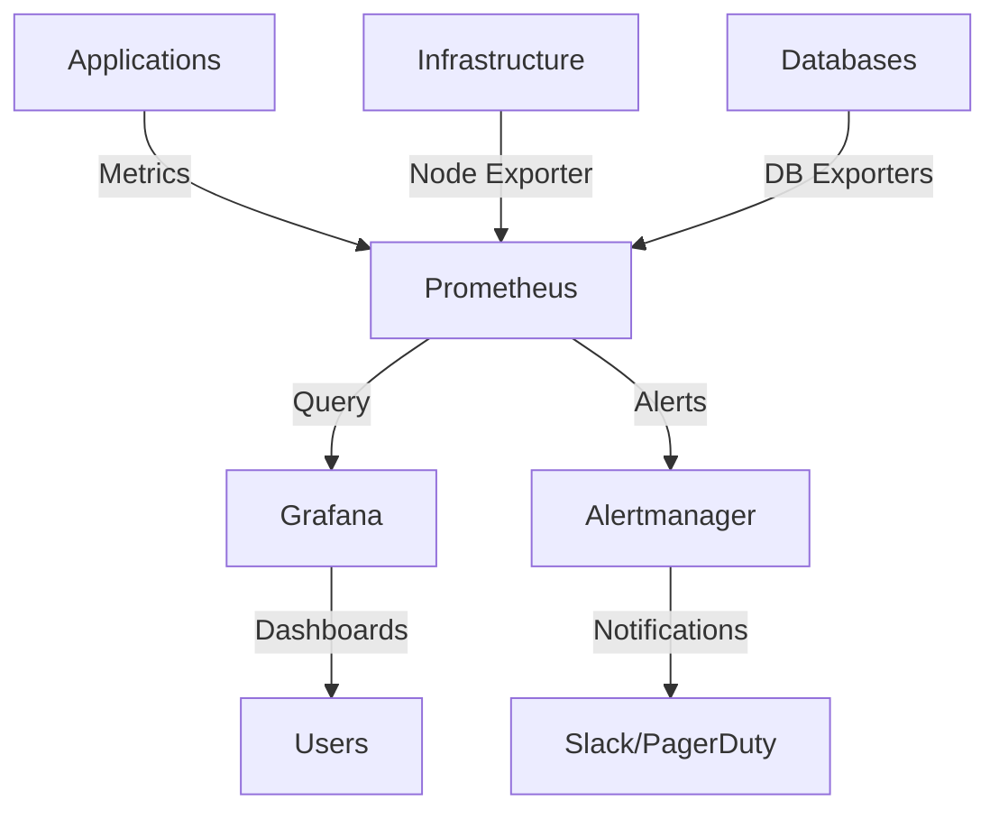
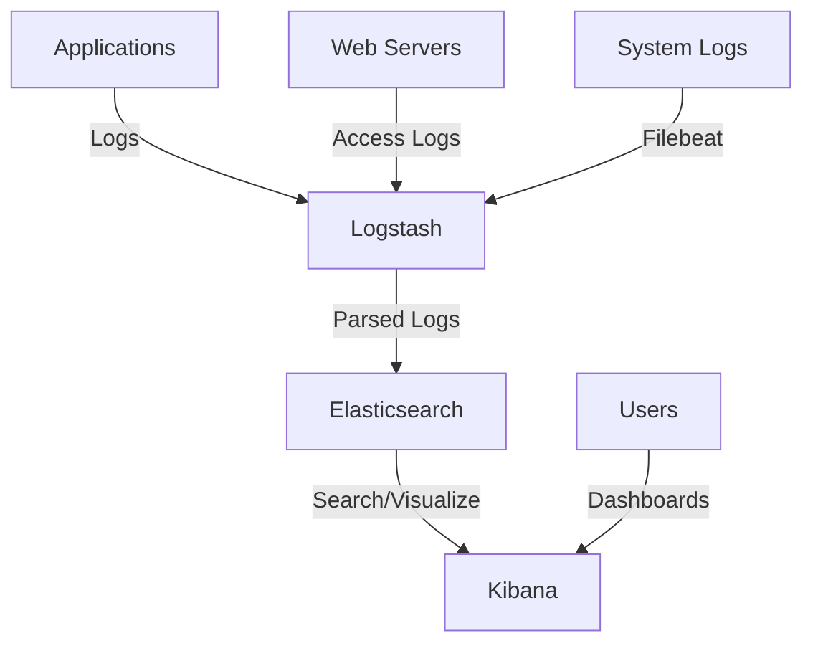

# Monitoring Systems

Choosing the right monitoring tools is crucial for effective observability. Different tools excel at different aspects of monitoring, and understanding their strengths helps you build a comprehensive monitoring stack.

## Popular Monitoring Stacks

### The Prometheus + Grafana Stack

**Best for:** Metrics collection, alerting, and visualization in cloud-native environments.

**Architecture:**


**Components:**
- **Prometheus**: Time-series database and metrics collector
- **Grafana**: Visualization and dashboarding
- **Alertmanager**: Alert routing and notification
- **Exporters**: Collect metrics from various systems

**Setup Guide:**

```yaml
# docker-compose.yml
version: '3.8'
services:
  prometheus:
    image: prom/prometheus:latest
    ports:
      - "9090:9090"
    volumes:
      - ./prometheus.yml:/etc/prometheus/prometheus.yml
      - prometheus_data:/prometheus
    command:
      - '--config.file=/etc/prometheus/prometheus.yml'
      - '--storage.tsdb.path=/prometheus'
      - '--web.console.libraries=/etc/prometheus/console_libraries'
      - '--web.console.templates=/etc/prometheus/consoles'
      - '--storage.tsdb.retention.time=200h'
      - '--web.enable-lifecycle'

  grafana:
    image: grafana/grafana:latest
    ports:
      - "3000:3000"
    environment:
      - GF_SECURITY_ADMIN_PASSWORD=admin
    volumes:
      - grafana_data:/var/lib/grafana

  alertmanager:
    image: prom/alertmanager:latest
    ports:
      - "9093:9093"
    volumes:
      - ./alertmanager.yml:/etc/alertmanager/alertmanager.yml

volumes:
  prometheus_data:
  grafana_data:
```

```yaml
# prometheus.yml
global:
  scrape_interval: 15s
  evaluation_interval: 15s

rule_files:
  - "alert_rules.yml"

alerting:
  alertmanagers:
    - static_configs:
        - targets:
          - alertmanager:9093

scrape_configs:
  - job_name: 'prometheus'
    static_configs:
      - targets: ['localhost:9090']

  - job_name: 'node-exporter'
    static_configs:
      - targets: ['node-exporter:9100']

  - job_name: 'my-app'
    static_configs:
      - targets: ['app:8080']
    metrics_path: '/metrics'
    scrape_interval: 5s
```

**Pros:**
- Open source and free
- Excellent for cloud-native environments
- Strong community and ecosystem
- Powerful query language (PromQL)
- Great for Kubernetes monitoring

**Cons:**
- Requires operational overhead
- Limited long-term storage options
- Steep learning curve for PromQL
- No built-in log aggregation

### The ELK Stack (Elasticsearch, Logstash, Kibana)

**Best for:** Log aggregation, search, and analysis.

**Architecture:**


**Setup Guide:**

```yaml
# docker-compose.yml for ELK
version: '3.8'
services:
  elasticsearch:
    image: docker.elastic.co/elasticsearch/elasticsearch:8.11.0
    environment:
      - discovery.type=single-node
      - "ES_JAVA_OPTS=-Xms512m -Xmx512m"
      - xpack.security.enabled=false
    ports:
      - "9200:9200"
    volumes:
      - elasticsearch_data:/usr/share/elasticsearch/data

  logstash:
    image: docker.elastic.co/logstash/logstash:8.11.0
    ports:
      - "5044:5044"
      - "9600:9600"
    volumes:
      - ./logstash.conf:/usr/share/logstash/pipeline/logstash.conf
    depends_on:
      - elasticsearch

  kibana:
    image: docker.elastic.co/kibana/kibana:8.11.0
    ports:
      - "5601:5601"
    environment:
      - ELASTICSEARCH_HOSTS=http://elasticsearch:9200
    depends_on:
      - elasticsearch

volumes:
  elasticsearch_data:
```

```ruby
# logstash.conf
input {
  beats {
    port => 5044
  }
  
  http {
    port => 8080
    codec => json
  }
}

filter {
  if [fields][log_type] == "application" {
    json {
      source => "message"
    }
    
    date {
      match => [ "timestamp", "ISO8601" ]
    }
    
    if [level] == "ERROR" {
      mutate {
        add_tag => [ "error" ]
      }
    }
  }
  
  if [fields][log_type] == "nginx" {
    grok {
      match => { 
        "message" => "%{NGINXACCESS}" 
      }
    }
  }
}

output {
  elasticsearch {
    hosts => ["elasticsearch:9200"]
    index => "logs-%{+YYYY.MM.dd}"
  }
  
  stdout {
    codec => rubydebug
  }
}
```

**Pros:**
- Excellent for log search and analysis
- Powerful visualization capabilities
- Handles large volumes of log data
- Rich ecosystem of plugins

**Cons:**
- Resource intensive
- Complex to operate at scale
- Expensive for large deployments
- Primarily focused on logs, not metrics

### Jaeger for Distributed Tracing

**Best for:** Distributed tracing in microservices architectures.

**Setup Guide:**

```yaml
# docker-compose.yml for Jaeger
version: '3.8'
services:
  jaeger:
    image: jaegertracing/all-in-one:latest
    ports:
      - "16686:16686"  # Jaeger UI
      - "14268:14268"  # HTTP collector
      - "6831:6831/udp"  # UDP agent
    environment:
      - COLLECTOR_ZIPKIN_HOST_PORT=:9411
```

**Application Integration:**

```python
# Python application with Jaeger
from jaeger_client import Config
from opentracing.ext import tags
import opentracing

def init_tracer(service_name):
    config = Config(
        config={
            'sampler': {
                'type': 'const',
                'param': 1,
            },
            'logging': True,
        },
        service_name=service_name,
    )
    return config.initialize_tracer()

tracer = init_tracer('user-service')

def get_user(user_id):
    with tracer.start_span('get_user') as span:
        span.set_tag('user.id', user_id)
        span.set_tag(tags.COMPONENT, 'user-service')
        
        # Simulate database call
        with tracer.start_span('database_query', child_of=span) as db_span:
            db_span.set_tag(tags.DATABASE_TYPE, 'postgresql')
            db_span.set_tag(tags.DATABASE_STATEMENT, 'SELECT * FROM users WHERE id = ?')
            
            # Your database logic here
            user_data = fetch_from_db(user_id)
            
        return user_data
```

## Cloud-Native Monitoring Solutions

### DataDog

**Best for:** Comprehensive monitoring with minimal setup overhead.

**Features:**
- Unified metrics, logs, and traces
- AI-powered anomaly detection
- Extensive integrations
- Real user monitoring (RUM)

**Setup Example:**

```yaml
# Kubernetes DaemonSet for DataDog Agent
apiVersion: apps/v1
kind: DaemonSet
metadata:
  name: datadog-agent
spec:
  selector:
    matchLabels:
      app: datadog-agent
  template:
    metadata:
      labels:
        app: datadog-agent
    spec:
      containers:
      - name: datadog-agent
        image: datadog/agent:latest
        env:
        - name: DD_API_KEY
          valueFrom:
            secretKeyRef:
              name: datadog-secret
              key: api-key
        - name: DD_SITE
          value: "datadoghq.com"
        - name: DD_LOGS_ENABLED
          value: "true"
        - name: DD_APM_ENABLED
          value: "true"
        - name: DD_PROCESS_AGENT_ENABLED
          value: "true"
        volumeMounts:
        - name: dockersocket
          mountPath: /var/run/docker.sock
        - name: procdir
          mountPath: /host/proc
        - name: cgroups
          mountPath: /host/sys/fs/cgroup
      volumes:
      - name: dockersocket
        hostPath:
          path: /var/run/docker.sock
      - name: procdir
        hostPath:
          path: /proc
      - name: cgroups
        hostPath:
          path: /sys/fs/cgroup
```

**Pros:**
- Minimal operational overhead
- Excellent user experience
- AI-powered insights
- Comprehensive feature set

**Cons:**
- Expensive at scale
- Vendor lock-in
- Less customizable than open source

### New Relic

**Best for:** Application performance monitoring with business insights.

**Features:**
- Application performance monitoring (APM)
- Infrastructure monitoring
- Browser and mobile monitoring
- Business intelligence dashboards

**Setup Example:**

```python
# Python application with New Relic
import newrelic.agent

# Initialize New Relic
newrelic.agent.initialize('newrelic.ini')

@newrelic.agent.function_trace()
def process_order(order_id):
    # Add custom attributes
    newrelic.agent.add_custom_attribute('order.id', order_id)
    newrelic.agent.add_custom_attribute('order.type', 'premium')
    
    try:
        result = expensive_operation(order_id)
        
        # Record custom metrics
        newrelic.agent.record_custom_metric('Custom/Orders/Processed', 1)
        
        return result
    except Exception as e:
        # Record the exception
        newrelic.agent.record_exception()
        raise
```

### AWS CloudWatch

**Best for:** AWS-native applications with tight AWS integration.

**Setup Example:**

```python
import boto3
import json
from datetime import datetime

cloudwatch = boto3.client('cloudwatch')

def put_custom_metric(metric_name, value, unit='Count', namespace='MyApp'):
    cloudwatch.put_metric_data(
        Namespace=namespace,
        MetricData=[
            {
                'MetricName': metric_name,
                'Value': value,
                'Unit': unit,
                'Timestamp': datetime.utcnow(),
                'Dimensions': [
                    {
                        'Name': 'Environment',
                        'Value': 'production'
                    },
                    {
                        'Name': 'Service',
                        'Value': 'user-service'
                    }
                ]
            }
        ]
    )

# Usage
put_custom_metric('UserRegistrations', 1)
put_custom_metric('ResponseTime', 150, 'Milliseconds')
```

## Monitoring Stack Comparison

| Feature | Prometheus + Grafana | ELK Stack | DataDog | New Relic | CloudWatch |
|---------|---------------------|-----------|---------|-----------|------------|
| **Cost** | Free (self-hosted) | Free (self-hosted) | $$$ | $$$ | $$ |
| **Setup Complexity** | Medium | High | Low | Low | Low (AWS) |
| **Metrics** | Excellent | Limited | Excellent | Excellent | Good |
| **Logs** | Limited | Excellent | Excellent | Good | Good |
| **Traces** | Limited | Limited | Excellent | Excellent | Good |
| **Alerting** | Good | Good | Excellent | Excellent | Good |
| **Scalability** | Good | Excellent | Excellent | Excellent | Excellent |
| **Customization** | High | High | Medium | Medium | Low |
| **Learning Curve** | Steep | Steep | Gentle | Gentle | Gentle |

## Choosing the Right Stack

### For Startups and Small Teams

**Recommendation:** DataDog or New Relic
- Minimal operational overhead
- Quick time to value
- Comprehensive features out of the box

```yaml
# Simple DataDog setup for a startup
version: '3.8'
services:
  app:
    build: .
    environment:
      - DD_AGENT_HOST=datadog-agent
      - DD_TRACE_ENABLED=true
      - DD_SERVICE=my-startup-app
      - DD_ENV=production
  
  datadog-agent:
    image: datadog/agent:latest
    environment:
      - DD_API_KEY=${DD_API_KEY}
      - DD_SITE=datadoghq.com
      - DD_LOGS_ENABLED=true
      - DD_APM_ENABLED=true
    volumes:
      - /var/run/docker.sock:/var/run/docker.sock
      - /proc/:/host/proc/:ro
      - /sys/fs/cgroup/:/host/sys/fs/cgroup:ro
```

### For Medium-Sized Companies

**Recommendation:** Prometheus + Grafana + ELK
- Good balance of cost and features
- More control over data
- Can scale with your needs

```yaml
# Comprehensive open-source stack
version: '3.8'
services:
  # Metrics stack
  prometheus:
    image: prom/prometheus:latest
    ports: ["9090:9090"]
    volumes:
      - ./prometheus.yml:/etc/prometheus/prometheus.yml
  
  grafana:
    image: grafana/grafana:latest
    ports: ["3000:3000"]
    environment:
      - GF_SECURITY_ADMIN_PASSWORD=admin
  
  # Logging stack
  elasticsearch:
    image: docker.elastic.co/elasticsearch/elasticsearch:8.11.0
    environment:
      - discovery.type=single-node
    ports: ["9200:9200"]
  
  kibana:
    image: docker.elastic.co/kibana/kibana:8.11.0
    ports: ["5601:5601"]
    environment:
      - ELASTICSEARCH_HOSTS=http://elasticsearch:9200
  
  # Tracing
  jaeger:
    image: jaegertracing/all-in-one:latest
    ports: ["16686:16686", "14268:14268"]
```

### For Large Enterprises

**Recommendation:** Hybrid approach
- Critical systems: Commercial solutions (DataDog, New Relic)
- Internal tools: Open source stack
- Multi-cloud: Cloud-agnostic solutions

```yaml
# Enterprise monitoring strategy
Tier 1 (Critical):
  - DataDog for customer-facing services
  - 24/7 monitoring and alerting
  - Advanced anomaly detection

Tier 2 (Important):
  - Prometheus + Grafana for internal services
  - Standard alerting and dashboards
  - Cost-effective monitoring

Tier 3 (Development):
  - Basic CloudWatch/Azure Monitor
  - Simple metrics and logs
  - Minimal cost
```

## Implementation Best Practices

### 1. Start Simple, Scale Gradually

```python
# Phase 1: Basic metrics
from prometheus_client import Counter, Histogram, start_http_server

REQUEST_COUNT = Counter('requests_total', 'Total requests')
REQUEST_DURATION = Histogram('request_duration_seconds', 'Request duration')

def handle_request():
    REQUEST_COUNT.inc()
    with REQUEST_DURATION.time():
        # Your application logic
        pass

# Start metrics server
start_http_server(8000)
```

```python
# Phase 2: Add structured logging
import structlog

logger = structlog.get_logger()

def handle_request(user_id, endpoint):
    logger.info("Request started", user_id=user_id, endpoint=endpoint)
    
    try:
        result = process_request()
        logger.info("Request completed", user_id=user_id, success=True)
        return result
    except Exception as e:
        logger.error("Request failed", user_id=user_id, error=str(e))
        raise
```

```python
# Phase 3: Add distributed tracing
from opentelemetry import trace

tracer = trace.get_tracer(__name__)

def handle_request(user_id, endpoint):
    with tracer.start_as_current_span("handle_request") as span:
        span.set_attribute("user.id", user_id)
        span.set_attribute("http.endpoint", endpoint)
        
        # Your application logic with child spans
        result = process_request()
        return result
```

### 2. Standardize Across Services

```yaml
# monitoring-standards.yml
metrics:
  naming_convention: "service_operation_unit"
  labels:
    required: ["service", "environment", "version"]
    optional: ["endpoint", "method", "status"]
  
logging:
  format: "json"
  required_fields: ["timestamp", "level", "service", "message"]
  correlation_id: "trace_id"
  
tracing:
  sample_rate: 0.1  # 10% sampling in production
  required_attributes: ["service.name", "service.version"]
```

### 3. Implement Monitoring as Code

```python
# monitoring_config.py
from dataclasses import dataclass
from typing import List, Dict

@dataclass
class MetricConfig:
    name: str
    type: str  # counter, gauge, histogram
    description: str
    labels: List[str]

@dataclass
class AlertConfig:
    name: str
    condition: str
    threshold: float
    duration: str
    severity: str

class ServiceMonitoring:
    def __init__(self, service_name: str):
        self.service_name = service_name
        self.metrics: List[MetricConfig] = []
        self.alerts: List[AlertConfig] = []
    
    def add_metric(self, name: str, type: str, description: str, labels: List[str]):
        self.metrics.append(MetricConfig(name, type, description, labels))
    
    def add_alert(self, name: str, condition: str, threshold: float, duration: str, severity: str):
        self.alerts.append(AlertConfig(name, condition, threshold, duration, severity))
    
    def generate_prometheus_config(self) -> Dict:
        # Generate Prometheus configuration
        pass
    
    def generate_grafana_dashboard(self) -> Dict:
        # Generate Grafana dashboard JSON
        pass

# Usage
user_service = ServiceMonitoring("user-service")
user_service.add_metric("requests_total", "counter", "Total requests", ["method", "endpoint"])
user_service.add_alert("high_error_rate", "rate(errors_total[5m]) > 0.05", 0.05, "5m", "warning")
```

The key to successful monitoring is choosing tools that fit your team's size, budget, and technical expertise. Start with the basics—metrics, logs, and traces—then gradually add more sophisticated features as your needs grow. Remember, the best monitoring system is the one your team actually uses to find and fix problems quickly.