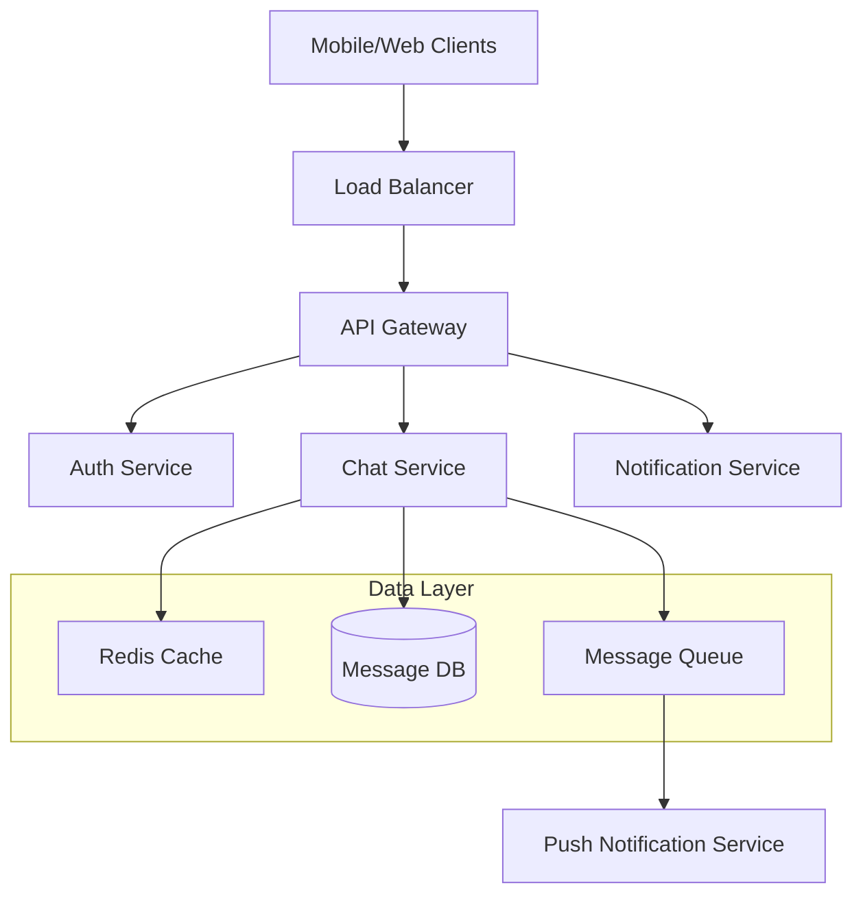

# System Design Interview Methodology

## The SCARED Framework

Use the **SCARED** methodology to systematically approach any system design interview:

- **S**cope & Requirements
- **C**apacity Estimation  
- **A**rchitecture Overview
- **R**efine Components
- **E**valuate & Scale
- **D**iscuss Trade-offs

## Step 1: Scope & Requirements (5-10 minutes)

### Clarify the Problem

Never start designing immediately. Always begin by understanding what you're building.

**Template Questions:**
```
Functional Requirements:
- What are the core features we need to support?
- Who are the users and how will they interact with the system?
- What's the expected user workflow?

Non-Functional Requirements:
- How many users do we expect?
- What's the expected read/write ratio?
- What are the latency requirements?
- Do we need to support real-time features?
- What are the availability requirements (99.9%, 99.99%)?

Constraints:
- Are there any specific technologies we must use?
- Do we need to integrate with existing systems?
- Are there any compliance requirements (GDPR, HIPAA)?
- What's our budget/resource constraints?
```

### Example: Design a Chat Application

**Good Clarification Process:**
```
Interviewer: "Design a chat application like WhatsApp"

You: "Let me clarify the requirements:

Functional Requirements:
- Should users be able to send text messages 1-on-1?
- Do we need group chats? If so, what's the max group size?
- Do we need to support media (images, videos, files)?
- Should messages be persistent?
- Do we need read receipts and online status?
- Do we need push notifications?

Non-Functional Requirements:
- How many users are we targeting? 100M, 1B?
- What's the expected message volume per day?
- What regions do we need to support?
- What's the acceptable message delivery latency?
- Do we need 99.9% or 99.99% availability?

Constraints:
- Are we building for mobile, web, or both?
- Do we need end-to-end encryption?
- Any specific compliance requirements?"
```

### Requirements Documentation Template

Create a clear summary of agreed requirements:

```markdown
## Functional Requirements
1. Users can send/receive text messages in real-time
2. Support for 1-on-1 and group chats (up to 100 members)
3. Message history persistence
4. Online/offline status indicators
5. Push notifications for offline users

## Non-Functional Requirements
1. 500M daily active users
2. 10B messages per day
3. <100ms message delivery latency
4. 99.9% availability
5. Global deployment

## Out of Scope (for this interview)
1. Voice/video calls
2. Media sharing
3. Message encryption
4. Advanced features (stories, payments)
```

## Step 2: Capacity Estimation (5-10 minutes)

### Calculate Key Metrics

Estimate the scale to inform your design decisions.

**Estimation Template:**
```
Users & Traffic:
- Daily Active Users (DAU): X
- Messages per user per day: Y
- Total messages per day: X * Y
- Messages per second: (X * Y) / 86400
- Peak QPS (assume 3x average): QPS * 3

Storage:
- Average message size: Z bytes
- Daily storage: (X * Y * Z) bytes
- Annual storage: Daily * 365
- With replication (3x): Annual * 3

Bandwidth:
- Incoming: Peak QPS * Average message size
- Outgoing: Incoming * Average fanout
```

### Example Calculation

```
Chat Application Estimation:

Users & Traffic:
- DAU: 500M users
- Messages per user per day: 20
- Total messages per day: 10B
- Messages per second: ~115K QPS
- Peak QPS: ~350K QPS

Storage:
- Average message size: 100 bytes
- Daily storage: 1TB
- Annual storage: 365TB
- With replication: ~1PB

Bandwidth:
- Incoming: 35MB/s
- Outgoing (1-on-1 avg): 70MB/s
- Peak outgoing: 210MB/s
```

### Key Estimation Guidelines

1. **Start with round numbers** (100M users, not 97.3M)
2. **Show your math** - write calculations clearly
3. **State assumptions** - "Assuming 20 messages per user per day"
4. **Consider peak load** - usually 2-3x average
5. **Think about growth** - design for 10x current scale

## Step 3: Architecture Overview (15-20 minutes)

### High-Level Design

Start with a simple, end-to-end design that addresses core requirements.

**Basic Architecture Template:**
```
[Client] → [Load Balancer] → [API Gateway] → [Application Servers] → [Database]
                                ↓
                          [Message Queue] → [Notification Service]
```

### Component Identification

Identify the major components you'll need:

**Core Components Checklist:**
- [ ] Client applications (mobile, web)
- [ ] Load balancers
- [ ] API gateway/reverse proxy
- [ ] Application servers
- [ ] Databases (primary data store)
- [ ] Caching layer
- [ ] Message queues
- [ ] Notification services
- [ ] File storage (if needed)
- [ ] CDN (if needed)

### Example: Chat Application High-Level Design



### API Design

Define key APIs that your system will expose:

```
POST /api/v1/messages
GET /api/v1/conversations/{id}/messages
POST /api/v1/conversations
WebSocket /ws/chat/{user_id}
```

## Step 4: Refine Components (10-15 minutes)

### Deep Dive into Critical Components

Choose 2-3 most important components and design them in detail.

**Component Deep Dive Template:**
```
Component: [Name]
Purpose: [What it does]
Inputs: [What data it receives]
Outputs: [What data it produces]
Processing: [How it works internally]
Storage: [What data it stores]
APIs: [Key interfaces]
```

### Database Design

Design your data models and storage strategy:

**Example: Chat Application Database Schema**

```sql
-- Users table
CREATE TABLE users (
    user_id UUID PRIMARY KEY,
    username VARCHAR(50) UNIQUE,
    email VARCHAR(100) UNIQUE,
    created_at TIMESTAMP,
    last_seen TIMESTAMP
);

-- Conversations table
CREATE TABLE conversations (
    conversation_id UUID PRIMARY KEY,
    type ENUM('direct', 'group'),
    name VARCHAR(100), -- for group chats
    created_at TIMESTAMP,
    updated_at TIMESTAMP
);

-- Messages table (partitioned by conversation_id)
CREATE TABLE messages (
    message_id UUID PRIMARY KEY,
    conversation_id UUID,
    sender_id UUID,
    content TEXT,
    message_type ENUM('text', 'image', 'file'),
    created_at TIMESTAMP,
    INDEX idx_conversation_time (conversation_id, created_at)
) PARTITION BY HASH(conversation_id);

-- Conversation participants
CREATE TABLE conversation_participants (
    conversation_id UUID,
    user_id UUID,
    joined_at TIMESTAMP,
    role ENUM('admin', 'member'),
    PRIMARY KEY (conversation_id, user_id)
);
```

### Technology Choices

Justify your technology selections:

```
Database: PostgreSQL
- ACID compliance for message consistency
- Good performance for read-heavy workloads
- Mature ecosystem and tooling

Cache: Redis
- Sub-millisecond latency for recent messages
- Pub/Sub for real-time message distribution
- Supports complex data structures

Message Queue: Apache Kafka
- High throughput for message processing
- Durability and replication
- Good for event streaming architecture
```

## Step 5: Evaluate & Scale (5-10 minutes)

### Identify Bottlenecks

Analyze your design for potential scaling issues:

**Common Bottlenecks:**
- Database write/read capacity
- Memory usage in caching layer
- Network bandwidth
- CPU usage in application servers
- Storage capacity growth

### Scaling Solutions

Propose specific solutions for identified bottlenecks:

**Database Scaling:**
```
Problem: Single database can't handle 350K QPS
Solutions:
1. Read replicas for read scaling
2. Sharding by conversation_id for write scaling
3. Separate read/write workloads

Implementation:
- 5 read replicas for message retrieval
- Shard messages across 10 database instances
- Use consistent hashing for shard selection
```

**Caching Strategy:**
```
Problem: Database queries for recent messages
Solutions:
1. Cache recent messages per conversation
2. Cache user online status
3. Cache conversation metadata

Implementation:
- Redis cluster with 20 nodes
- Cache last 100 messages per conversation
- TTL of 24 hours for message cache
```

### Global Scale Considerations

Discuss how to handle global deployment:

```
Multi-Region Deployment:
- Deploy in 3 regions: US-East, EU-West, Asia-Pacific
- Route users to nearest region
- Cross-region replication for disaster recovery

Data Consistency:
- Eventually consistent for message delivery
- Strong consistency for user authentication
- Conflict resolution for concurrent edits
```

## Step 6: Discuss Trade-offs (5 minutes)

### Present Alternative Approaches

Show you understand different solutions and their trade-offs:

**Example Trade-off Discussion:**

```
Message Storage Options:

Option 1: SQL Database (PostgreSQL)
Pros: ACID compliance, complex queries, mature tooling
Cons: Harder to scale writes, more expensive

Option 2: NoSQL Database (Cassandra)
Pros: Better write scalability, lower latency
Cons: Eventually consistent, limited query flexibility

Option 3: Hybrid Approach
Pros: Best of both worlds
Cons: Increased complexity, more operational overhead

Recommendation: Start with PostgreSQL for simplicity, 
migrate to hybrid approach as we scale beyond 1M QPS.
```

### Address Potential Concerns

Anticipate interviewer questions:

```
Q: "What if a database shard goes down?"
A: "We'd implement automatic failover to replica shards, 
with monitoring to detect failures within 30 seconds."

Q: "How do you handle message ordering?"
A: "Messages within a conversation are ordered by timestamp. 
For global consistency, we'd use vector clocks or 
logical timestamps."

Q: "What about data privacy and security?"
A: "We'd implement TLS for data in transit, encryption 
at rest for sensitive data, and audit logging for 
compliance requirements."
```

## Common Methodology Mistakes

### ❌ What NOT to Do

1. **Jumping to solutions too quickly**
   - Don't start drawing architecture before clarifying requirements

2. **Over-engineering from the start**
   - Don't design for 1 billion users if the requirement is 1 million

3. **Ignoring the interviewer**
   - Don't work in silence - engage and ask for feedback

4. **Getting stuck on details**
   - Don't spend 20 minutes on database schema optimization

5. **Not considering trade-offs**
   - Don't present only one solution without discussing alternatives

### ✅ Best Practices

1. **Follow the framework consistently**
   - Use SCARED for every problem to build muscle memory

2. **Manage your time**
   - Spend appropriate time on each step based on interview length

3. **Stay flexible**
   - Be ready to adjust your design based on interviewer feedback

4. **Show your reasoning**
   - Explain why you made each design decision

5. **Practice with real problems**
   - Use this methodology on actual system design problems

## Next Steps

Now that you have the methodology framework, let's dive deeper into the problem-solving techniques and communication strategies that will make your interviews successful.

Continue to: [Problem-Solving Framework →](02-problem-solving.md)