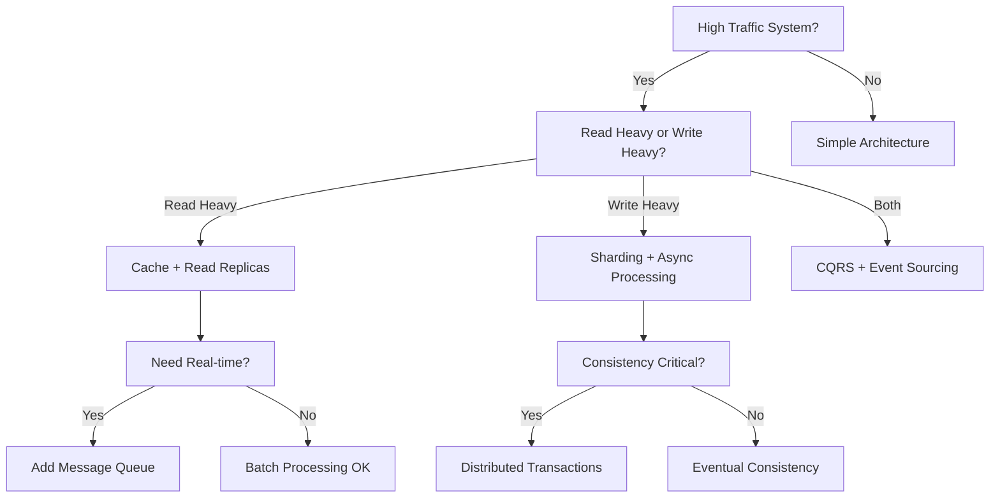

# Problem-Solving Framework

## The Systems Thinking Approach

System design interviews test your ability to think systematically about complex problems. This section provides frameworks for breaking down problems, making decisions, and designing robust solutions.

## Problem Decomposition Framework

### The Layered Thinking Model

Break down any system design problem into these layers:

```
┌─────────────────────────────────────┐
│           User Experience           │  ← What users see and do
├─────────────────────────────────────┤
│          Application Logic          │  ← Business rules and workflows  
├─────────────────────────────────────┤
│         Service Architecture        │  ← How services communicate
├─────────────────────────────────────┤
│           Data Management           │  ← How data is stored and accessed
├─────────────────────────────────────┤
│          Infrastructure             │  ← Hardware, networking, deployment
└─────────────────────────────────────┘
```

### Layer-by-Layer Analysis

**1. User Experience Layer**
```
Questions to Ask:
- What actions can users perform?
- What information do they need to see?
- How do they interact with the system?
- What are the user journeys?

Example (Twitter):
- Users can post tweets, follow others, view timeline
- They need to see tweets, user profiles, trending topics
- Interactions: tap, scroll, type, share
- Journey: Login → View timeline → Post tweet → Engage
```

**2. Application Logic Layer**
```
Questions to Ask:
- What business rules need to be enforced?
- What workflows need to be supported?
- What validations are required?
- How do different features interact?

Example (Twitter):
- Tweet length limit (280 characters)
- Timeline generation algorithm
- Content moderation rules
- Notification triggers
```

**3. Service Architecture Layer**
```
Questions to Ask:
- What services do we need?
- How do services communicate?
- What are the service boundaries?
- How do we handle service failures?

Example (Twitter):
- User Service, Tweet Service, Timeline Service
- REST APIs + Message queues for async processing
- Domain-driven service boundaries
- Circuit breakers and retries
```

**4. Data Management Layer**
```
Questions to Ask:
- What data needs to be stored?
- How is data accessed and queried?
- What are the consistency requirements?
- How do we handle data growth?

Example (Twitter):
- User profiles, tweets, relationships, timelines
- Read-heavy with complex timeline queries
- Eventually consistent for timeline generation
- Sharding by user_id for horizontal scaling
```

**5. Infrastructure Layer**
```
Questions to Ask:
- How do we deploy and scale services?
- What are the networking requirements?
- How do we monitor and maintain the system?
- What are the security requirements?

Example (Twitter):
- Kubernetes for container orchestration
- CDN for global content delivery
- Monitoring with metrics and alerting
- OAuth for authentication, HTTPS for security
```

## Decision-Making Framework

### The TRADE Framework

Use **TRADE** to make systematic design decisions:

- **T**rade-offs identification
- **R**equirements alignment  
- **A**lternatives evaluation
- **D**ecision rationale
- **E**volution planning

### Example: Choosing a Database

**Problem:** Select database technology for a social media platform

**T - Trade-offs Identification:**
```
Key Trade-offs:
- Consistency vs Availability (CAP theorem)
- Read performance vs Write performance  
- Query flexibility vs Scalability
- Operational complexity vs Feature richness
- Cost vs Performance
```

**R - Requirements Alignment:**
```
Our Requirements:
- 100M daily active users
- Read-heavy workload (90% reads, 10% writes)
- Complex queries for timeline generation
- Global deployment across 3 regions
- 99.9% availability target
```

**A - Alternatives Evaluation:**

| Option | Pros | Cons | Fit Score |
|--------|------|------|-----------|
| **PostgreSQL** | ACID compliance, Rich queries, Mature ecosystem | Limited horizontal scaling, Single point of failure | 7/10 |
| **MongoDB** | Flexible schema, Good read performance, Horizontal scaling | Eventual consistency, Complex sharding | 8/10 |
| **Cassandra** | Excellent write scaling, Multi-region, High availability | Limited query flexibility, Eventual consistency | 6/10 |
| **Hybrid (Postgres + Redis)** | Best of both worlds, Proven pattern | Increased complexity, Data synchronization | 9/10 |

**D - Decision Rationale:**
```
Selected: Hybrid approach (PostgreSQL + Redis)

Reasoning:
1. PostgreSQL for transactional data (users, posts) - leverages ACID properties
2. Redis for timeline caching and real-time features - provides low latency
3. Proven architecture used by Twitter, Instagram
4. Allows gradual migration and optimization
5. Balances consistency needs with performance requirements
```

**E - Evolution Planning:**
```
Phase 1 (0-1M users): Single PostgreSQL + Redis
Phase 2 (1-10M users): Read replicas + Redis cluster  
Phase 3 (10M+ users): Sharded PostgreSQL + Distributed Redis
Phase 4 (100M+ users): Consider NoSQL migration for specific use cases
```

## Scalability Analysis Framework

### The SCALE Method

Systematically analyze scalability using **SCALE**:

- **S**ingle points of failure
- **C**apacity bottlenecks
- **A**vailability requirements
- **L**atency constraints  
- **E**lasticity needs

### Example: E-commerce Platform Analysis

**S - Single Points of Failure:**
```
Identified SPOFs:
1. Single database instance
2. Single load balancer
3. Single payment service
4. Single search index

Mitigation:
1. Database: Master-slave replication + automatic failover
2. Load balancer: Multiple LBs with health checks
3. Payment: Multiple payment providers + circuit breaker
4. Search: Elasticsearch cluster with replicas
```

**C - Capacity Bottlenecks:**
```
Current Bottlenecks (at 10x scale):
1. Database writes: 50K QPS → 500K QPS (exceeds single DB capacity)
2. Search queries: 100K QPS → 1M QPS (exceeds single ES cluster)
3. Image storage: 1TB/day → 10TB/day (storage growth)

Solutions:
1. Database sharding by product_category + user_id
2. Search federation across multiple ES clusters
3. CDN + object storage with automatic tiering
```

**A - Availability Requirements:**
```
Target: 99.9% availability (8.76 hours downtime/year)

Critical Path Analysis:
- User authentication: 99.95% required
- Product catalog: 99.9% acceptable  
- Payment processing: 99.99% required
- Search functionality: 99.5% acceptable

Architecture Impact:
- Multi-region deployment for critical services
- Graceful degradation for non-critical features
- Circuit breakers to prevent cascade failures
```

**L - Latency Constraints:**
```
Requirements:
- Page load: <2 seconds (95th percentile)
- Search results: <500ms (95th percentile)  
- Payment processing: <5 seconds (99th percentile)

Optimization Strategy:
- CDN for static assets (reduces page load by 60%)
- Search result caching (reduces search latency by 80%)
- Async payment processing with status updates
```

**E - Elasticity Needs:**
```
Traffic Patterns:
- Daily: 3x variation (peak at 8 PM)
- Seasonal: 10x variation (Black Friday, holidays)
- Flash sales: 50x spike for 2-hour periods

Auto-scaling Strategy:
- Horizontal pod autoscaling based on CPU/memory
- Predictive scaling for known events
- Circuit breakers to protect during traffic spikes
- Queue-based load leveling for flash sales
```

## Pattern Recognition Framework

### Common System Design Patterns

Recognize and apply these proven patterns:

**1. Data Access Patterns**

| Pattern | Use Case | Example |
|---------|----------|---------|
| **Cache-Aside** | Read-heavy workloads | User profile caching |
| **Write-Through** | Consistency critical | Financial transactions |
| **Write-Behind** | High write volume | Analytics data collection |
| **CQRS** | Different read/write needs | E-commerce product catalog |

**2. Communication Patterns**

| Pattern | Use Case | Example |
|---------|----------|---------|
| **Request-Response** | Synchronous operations | User authentication |
| **Publish-Subscribe** | Event-driven architecture | Order processing workflow |
| **Message Queue** | Async processing | Email notifications |
| **Event Sourcing** | Audit trail needed | Banking transactions |

**3. Scalability Patterns**

| Pattern | Use Case | Example |
|---------|----------|---------|
| **Database Sharding** | Horizontal data scaling | User data partitioning |
| **Read Replicas** | Read scaling | Social media timelines |
| **Load Balancing** | Traffic distribution | Web server scaling |
| **CDN** | Global content delivery | Static asset serving |

### Pattern Selection Decision Tree



## Problem-Solving Templates

### Template 1: Data-Intensive Applications

**Use for:** Social media, content platforms, analytics systems

```
1. Data Modeling
   - Identify entities and relationships
   - Choose appropriate data stores
   - Design for query patterns

2. Read Path Optimization
   - Implement caching strategy
   - Consider read replicas
   - Optimize query performance

3. Write Path Optimization  
   - Handle write scaling
   - Implement async processing
   - Ensure data consistency

4. Real-time Features
   - Design event streaming
   - Implement push notifications
   - Handle concurrent updates
```

### Template 2: Transaction-Heavy Systems

**Use for:** E-commerce, banking, booking systems

```
1. Transaction Design
   - Identify transaction boundaries
   - Choose consistency model
   - Handle distributed transactions

2. Payment Processing
   - Implement idempotency
   - Handle payment failures
   - Ensure audit trails

3. Inventory Management
   - Handle concurrent updates
   - Implement reservation system
   - Manage stock consistency

4. Order Processing
   - Design workflow engine
   - Handle partial failures
   - Implement compensation logic
```

### Template 3: Real-time Systems

**Use for:** Chat applications, gaming, live streaming

```
1. Real-time Communication
   - Choose protocol (WebSocket, SSE, WebRTC)
   - Handle connection management
   - Implement message routing

2. Low Latency Design
   - Minimize network hops
   - Implement edge computing
   - Optimize data structures

3. Scalability Challenges
   - Handle connection scaling
   - Implement message fanout
   - Manage state synchronization

4. Reliability Features
   - Handle network partitions
   - Implement message delivery guarantees
   - Design failover mechanisms
```

## Advanced Problem-Solving Techniques

### Root Cause Analysis

When facing complex problems, use the "5 Whys" technique:

```
Problem: Users experiencing slow timeline loading

Why 1: Timeline queries are taking 5+ seconds
Why 2: Database is overwhelmed with complex JOIN queries  
Why 3: Timeline generation requires data from multiple tables
Why 4: We're computing timelines on-demand for each request
Why 5: We don't have a pre-computed timeline cache

Root Cause: Missing timeline pre-computation and caching
Solution: Implement timeline generation service with Redis cache
```

### Constraint-Based Design

Start with the hardest constraints and design around them:

```
Example: Design a video streaming service

Hardest Constraints:
1. 4K video requires 25 Mbps bandwidth
2. Global latency must be <100ms for good UX
3. Storage costs must be <$0.01 per GB per month

Design Implications:
1. Bandwidth → Multiple quality levels + adaptive streaming
2. Latency → Global CDN with edge caching required
3. Cost → Intelligent tiering + compression algorithms
```

### Trade-off Analysis Matrix

Systematically evaluate design alternatives:

| Criteria | Weight | Option A | Option B | Option C |
|----------|--------|----------|----------|----------|
| **Performance** | 30% | 8/10 | 6/10 | 9/10 |
| **Scalability** | 25% | 7/10 | 9/10 | 8/10 |
| **Complexity** | 20% | 9/10 | 5/10 | 6/10 |
| **Cost** | 15% | 6/10 | 8/10 | 7/10 |
| **Reliability** | 10% | 8/10 | 7/10 | 9/10 |
| **Weighted Score** | | **7.6** | **7.0** | **7.9** |

## Common Problem-Solving Pitfalls

### ❌ Avoid These Mistakes

1. **Analysis Paralysis**
   - Don't spend too much time evaluating every possible option
   - Make reasonable assumptions and move forward

2. **Premature Optimization**
   - Don't over-engineer for problems you don't have yet
   - Start simple and evolve based on actual needs

3. **Technology Bias**
   - Don't default to technologies you're familiar with
   - Choose based on requirements, not preferences

4. **Ignoring Non-Functional Requirements**
   - Don't focus only on features
   - Consider performance, security, maintainability

5. **Not Considering Evolution**
   - Don't design for current scale only
   - Plan for growth and changing requirements

### ✅ Best Practices

1. **Start with Requirements**
   - Always ground your design in actual requirements
   - Validate assumptions with the interviewer

2. **Think in Systems**
   - Consider how components interact
   - Design for the whole system, not individual parts

3. **Embrace Trade-offs**
   - Every design decision has pros and cons
   - Be explicit about trade-offs you're making

4. **Plan for Failure**
   - Assume components will fail
   - Design resilience into your system

5. **Iterate and Improve**
   - Start with a working design
   - Continuously refine based on feedback

## Practice Exercises

### Exercise 1: Pattern Recognition

For each scenario, identify the most appropriate patterns:

1. **Scenario:** Social media platform with 100M users, read-heavy workload
   - **Your Answer:** ________________
   - **Patterns to Consider:** Caching, Read Replicas, CDN, Sharding

2. **Scenario:** Financial trading system requiring strict consistency
   - **Your Answer:** ________________  
   - **Patterns to Consider:** ACID transactions, Synchronous replication, Event sourcing

3. **Scenario:** Real-time multiplayer game with global players
   - **Your Answer:** ________________
   - **Patterns to Consider:** WebSockets, Edge computing, State synchronization

### Exercise 2: Trade-off Analysis

**Problem:** Choose between microservices vs monolithic architecture for a startup

Create a trade-off analysis considering:
- Development speed
- Operational complexity  
- Scalability needs
- Team size and expertise
- Time to market

### Exercise 3: Bottleneck Identification

**System:** E-commerce platform handling Black Friday traffic (50x normal load)

Identify potential bottlenecks and propose solutions for:
- Database performance
- Payment processing
- Search functionality
- Image serving
- Checkout process

## Next Steps

Now that you have systematic problem-solving frameworks, let's focus on the communication skills needed to effectively present your solutions and collaborate with interviewers.

Continue to: [Communication & Presentation →](03-communication.md)