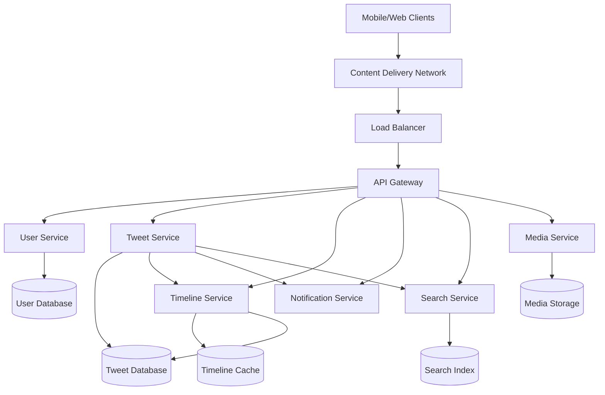
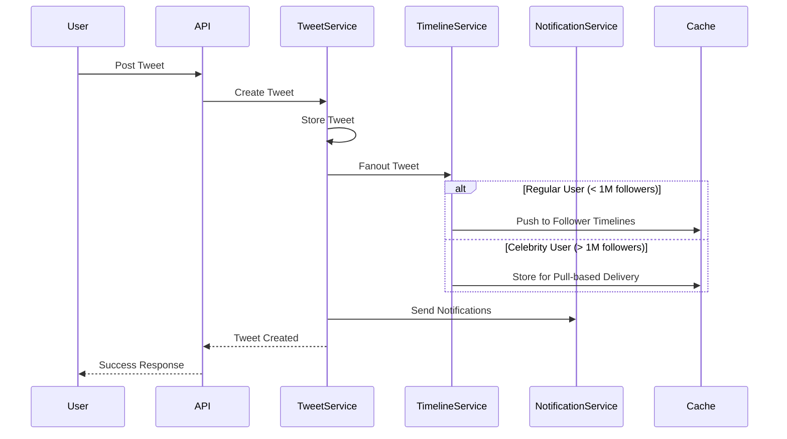

# Design Twitter/X Feed System - System Design Interview Problem

## Metadata
- **Difficulty**: Medium
- **Companies**: Twitter, Meta, Google, Amazon, Microsoft, Snapchat
- **Tags**: social-media, real-time-systems, timeline-generation, microservices, caching
- **Estimated Time**: 
  - Reading: 25 minutes
  - Solving: 45 minutes
  - Total: 70 minutes
- **Last Updated**: 2024-08-24
- **Version**: 1.0
- **Popularity**: ⭐⭐⭐⭐⭐

## Problem Statement

### Business Context
Twitter (now X) is a social media platform where users can post short messages (tweets), follow other users, and see a personalized timeline of tweets from people they follow. The platform needs to handle hundreds of millions of users posting billions of tweets daily, with real-time delivery of content to user timelines.

### Core Problem
Design a scalable system that allows users to post tweets, follow other users, and view a personalized timeline of tweets from people they follow. The system should handle high read and write volumes while providing near real-time updates.

### User Stories
- As a user, I want to post tweets (text, images, videos) so that my followers can see my updates
- As a user, I want to follow/unfollow other users so that I can see their tweets in my timeline
- As a user, I want to view my personalized timeline so that I can see recent tweets from people I follow
- As a user, I want to like, retweet, and reply to tweets so that I can interact with content
- As a user, I want to search for tweets and users so that I can discover new content

## Requirements Clarification

### Functional Requirements
- [ ] Users can post tweets (text up to 280 characters, images, videos)
- [ ] Users can follow/unfollow other users
- [ ] Users can view their personalized timeline (home feed)
- [ ] Users can like, retweet, and reply to tweets
- [ ] Users can search for tweets and users
- [ ] Users receive notifications for interactions
- [ ] Support for hashtags and mentions

### Non-Functional Requirements
- **Scale**: 500M users, 200M daily active users, 400M tweets per day
- **Performance**: Timeline loading < 200ms, tweet posting < 100ms
- **Availability**: 99.9% uptime, graceful degradation during failures
- **Consistency**: Eventual consistency for timeline, strong consistency for user data
- **Security**: User authentication, content moderation, spam prevention

### Constraints
- [ ] Tweets have a maximum length of 280 characters
- [ ] Images up to 5MB, videos up to 512MB
- [ ] Users can follow up to 5,000 accounts
- [ ] Timeline shows tweets from last 7 days by default
- [ ] Support for multiple languages and time zones

### Assumptions
- [ ] Read-heavy system (100:1 read to write ratio)
- [ ] Users follow an average of 200 accounts
- [ ] Average user checks timeline 10 times per day
- [ ] 20% of tweets contain media (images/videos)

## Capacity Estimation

### User Metrics
| Metric | Value | Calculation |
|--------|-------|-------------|
| Total Users | 500M | Given requirement |
| Daily Active Users (DAU) | 200M | 40% of total users |
| Peak Concurrent Users | 50M | 25% of DAU during peak hours |
| User Growth Rate | 15% per year | Industry average |

### Traffic Metrics
| Metric | Value | Calculation |
|--------|-------|-------------|
| Tweets per Day | 400M | Given requirement |
| Tweets per Second (Average) | 4,630 | 400M ÷ 86,400 |
| Peak Tweets per Second | 13,890 | Average × 3 (peak factor) |
| Timeline Requests per Day | 2B | 200M DAU × 10 requests |
| Timeline QPS (Average) | 23,150 | 2B ÷ 86,400 |
| Peak Timeline QPS | 69,450 | Average × 3 |
| Read:Write Ratio | 100:1 | Timeline reads vs tweet writes |

### Data Metrics
| Metric | Value | Calculation |
|--------|-------|-------------|
| Tweet Size (Text) | 300 bytes | 280 chars + metadata |
| Tweet Size (with Media) | 2MB average | Including images/videos |
| Daily Storage Growth | 240GB | 400M tweets × 600 bytes avg |
| User Data per User | 1KB | Profile, settings, relationships |
| Total User Data | 500GB | 500M users × 1KB |
| 5-Year Storage Projection | 438TB | Current + 5 years growth |

### Bandwidth Estimation
| Metric | Value | Calculation |
|--------|-------|-------------|
| Average Tweet Request | 1KB | Tweet data + metadata |
| Average Timeline Response | 50KB | 20 tweets × 2.5KB each |
| Peak Ingress Bandwidth | 28Mbps | Peak tweet writes × 2MB |
| Peak Egress Bandwidth | 3.5Gbps | Peak timeline reads × 50KB |

## High-Level System Design

### Architecture Overview
The system uses a microservices architecture with separate services for user management, tweet posting, timeline generation, and content delivery. We'll implement a hybrid approach for timeline generation using both push and pull models based on user follower count.



### Core Components
1. **User Service**: Manages user profiles, authentication, and follow relationships
2. **Tweet Service**: Handles tweet creation, storage, and retrieval
3. **Timeline Service**: Generates and caches personalized user timelines
4. **Notification Service**: Manages real-time notifications and push messages
5. **Search Service**: Provides tweet and user search functionality
6. **Media Service**: Handles image/video upload, processing, and delivery

### Data Flow
The main data flow involves tweet creation triggering timeline updates for followers, with different strategies based on user popularity (celebrity vs regular users).



## Detailed Component Design

### API Design
```yaml
# Tweet Management
POST /api/v1/tweets
GET /api/v1/tweets/{tweet_id}
DELETE /api/v1/tweets/{tweet_id}

# Timeline Operations
GET /api/v1/timeline/home?limit=20&cursor={cursor}
GET /api/v1/timeline/user/{user_id}?limit=20&cursor={cursor}

# User Operations
POST /api/v1/users/{user_id}/follow
DELETE /api/v1/users/{user_id}/follow
GET /api/v1/users/{user_id}/followers
GET /api/v1/users/{user_id}/following

# Interactions
POST /api/v1/tweets/{tweet_id}/like
POST /api/v1/tweets/{tweet_id}/retweet
POST /api/v1/tweets/{tweet_id}/reply

# Search
GET /api/v1/search/tweets?q={query}&limit=20
GET /api/v1/search/users?q={query}&limit=20
```

### Database Design

#### User Service Schema
```sql
-- Users table
CREATE TABLE users (
    user_id BIGINT PRIMARY KEY,
    username VARCHAR(50) UNIQUE NOT NULL,
    email VARCHAR(255) UNIQUE NOT NULL,
    display_name VARCHAR(100),
    bio TEXT,
    profile_image_url VARCHAR(500),
    verified BOOLEAN DEFAULT FALSE,
    follower_count INT DEFAULT 0,
    following_count INT DEFAULT 0,
    tweet_count INT DEFAULT 0,
    created_at TIMESTAMP DEFAULT CURRENT_TIMESTAMP,
    updated_at TIMESTAMP DEFAULT CURRENT_TIMESTAMP ON UPDATE CURRENT_TIMESTAMP
);

-- Follow relationships
CREATE TABLE follows (
    follower_id BIGINT,
    followee_id BIGINT,
    created_at TIMESTAMP DEFAULT CURRENT_TIMESTAMP,
    PRIMARY KEY (follower_id, followee_id),
    FOREIGN KEY (follower_id) REFERENCES users(user_id),
    FOREIGN KEY (followee_id) REFERENCES users(user_id)
);

-- Indexes
CREATE INDEX idx_follows_follower ON follows(follower_id);
CREATE INDEX idx_follows_followee ON follows(followee_id);
CREATE INDEX idx_users_username ON users(username);
```

#### Tweet Service Schema
```sql
-- Tweets table
CREATE TABLE tweets (
    tweet_id BIGINT PRIMARY KEY,
    user_id BIGINT NOT NULL,
    content TEXT NOT NULL,
    media_urls JSON,
    hashtags JSON,
    mentions JSON,
    reply_to_tweet_id BIGINT,
    retweet_of_tweet_id BIGINT,
    like_count INT DEFAULT 0,
    retweet_count INT DEFAULT 0,
    reply_count INT DEFAULT 0,
    created_at TIMESTAMP DEFAULT CURRENT_TIMESTAMP,
    FOREIGN KEY (user_id) REFERENCES users(user_id)
);

-- Tweet interactions
CREATE TABLE tweet_likes (
    user_id BIGINT,
    tweet_id BIGINT,
    created_at TIMESTAMP DEFAULT CURRENT_TIMESTAMP,
    PRIMARY KEY (user_id, tweet_id)
);

CREATE TABLE tweet_retweets (
    user_id BIGINT,
    tweet_id BIGINT,
    created_at TIMESTAMP DEFAULT CURRENT_TIMESTAMP,
    PRIMARY KEY (user_id, tweet_id)
);

-- Indexes
CREATE INDEX idx_tweets_user_id ON tweets(user_id, created_at DESC);
CREATE INDEX idx_tweets_created_at ON tweets(created_at DESC);
CREATE INDEX idx_tweets_hashtags ON tweets USING GIN(hashtags);
```

#### Indexing Strategy
- **Primary Indexes**: Auto-generated for primary keys
- **Timeline Queries**: Composite index on (user_id, created_at DESC) for user tweets
- **Search Optimization**: GIN indexes for hashtags and full-text search
- **Relationship Queries**: Indexes on follower_id and followee_id for follow operations

### Caching Strategy

#### Timeline Cache (Redis)
```python
# Cache structure for user timelines
# Key: "timeline:user:{user_id}"
# Value: List of tweet IDs with scores (timestamp)

# Push model for regular users
def cache_timeline_push(user_id, tweet_id, timestamp):
    key = f"timeline:user:{user_id}"
    redis.zadd(key, {tweet_id: timestamp})
    redis.zremrangebyrank(key, 0, -801)  # Keep only latest 800 tweets
    redis.expire(key, 86400 * 7)  # 7 days TTL

# Pull model for celebrity users
def cache_timeline_pull(user_id, following_list):
    key = f"timeline:user:{user_id}"
    if not redis.exists(key):
        # Generate timeline on-demand
        timeline = generate_timeline_from_db(following_list)
        redis.zadd(key, timeline)
        redis.expire(key, 3600)  # 1 hour TTL for pull-based
    return redis.zrevrange(key, 0, 19)  # Get latest 20 tweets
```

#### Tweet Cache
```python
# Cache individual tweets for fast retrieval
# Key: "tweet:{tweet_id}"
# Value: Tweet object with metadata

def cache_tweet(tweet_id, tweet_data):
    key = f"tweet:{tweet_id}"
    redis.setex(key, 86400, json.dumps(tweet_data))  # 24 hour TTL

def get_cached_tweet(tweet_id):
    key = f"tweet:{tweet_id}"
    cached = redis.get(key)
    return json.loads(cached) if cached else None
```

## Scaling the Design

### Bottleneck Analysis

1. **Timeline Generation Bottleneck**
   - **Problem**: Generating timelines for users with many followers is expensive
   - **Solution**: Hybrid push/pull model based on follower count
   - **Trade-offs**: Complexity vs performance, memory usage vs compute

2. **Database Write Bottleneck**
   - **Problem**: High tweet volume can overwhelm single database
   - **Solution**: Shard tweets by user_id or tweet_id
   - **Trade-offs**: Cross-shard queries become complex

3. **Media Storage Bottleneck**
   - **Problem**: Large media files consume bandwidth and storage
   - **Solution**: CDN with multiple regions, video compression
   - **Trade-offs**: Storage costs vs delivery performance

### Horizontal Scaling Strategies

#### Database Sharding
```python
# Shard tweets by user_id for better locality
def get_tweet_shard(user_id):
    return user_id % NUM_TWEET_SHARDS

# Shard users by user_id
def get_user_shard(user_id):
    return user_id % NUM_USER_SHARDS

# Timeline generation requires cross-shard queries
def generate_timeline(user_id, following_list):
    timeline_tweets = []
    
    # Group following users by shard
    shard_groups = defaultdict(list)
    for followee_id in following_list:
        shard = get_tweet_shard(followee_id)
        shard_groups[shard].append(followee_id)
    
    # Query each shard in parallel
    with ThreadPoolExecutor() as executor:
        futures = []
        for shard, user_ids in shard_groups.items():
            future = executor.submit(get_recent_tweets_from_shard, shard, user_ids)
            futures.append(future)
        
        for future in futures:
            timeline_tweets.extend(future.result())
    
    # Merge and sort by timestamp
    return sorted(timeline_tweets, key=lambda x: x.created_at, reverse=True)[:20]
```

#### Service Partitioning
- **User Service**: Handles authentication, profiles, follow relationships
- **Tweet Service**: Manages tweet CRUD operations and interactions
- **Timeline Service**: Dedicated to timeline generation and caching
- **Media Service**: Handles file uploads, processing, and CDN integration
- **Notification Service**: Real-time notifications and push messages

### Performance Optimizations

#### Timeline Generation Optimization
```python
class TimelineGenerator:
    def __init__(self):
        self.celebrity_threshold = 1000000  # 1M followers
    
    def fanout_tweet(self, tweet_id, user_id, follower_list):
        if len(follower_list) < self.celebrity_threshold:
            # Push model: Pre-compute timelines
            self.push_to_timelines(tweet_id, follower_list)
        else:
            # Pull model: Store for on-demand generation
            self.store_for_pull(tweet_id, user_id)
    
    def push_to_timelines(self, tweet_id, follower_list):
        # Batch update follower timelines
        pipeline = redis.pipeline()
        timestamp = time.time()
        
        for follower_id in follower_list:
            key = f"timeline:user:{follower_id}"
            pipeline.zadd(key, {tweet_id: timestamp})
            pipeline.zremrangebyrank(key, 0, -801)
            pipeline.expire(key, 86400 * 7)
        
        pipeline.execute()
    
    def get_timeline(self, user_id, following_list):
        key = f"timeline:user:{user_id}"
        
        # Check if timeline exists in cache
        if redis.exists(key):
            tweet_ids = redis.zrevrange(key, 0, 19)
            return self.hydrate_tweets(tweet_ids)
        
        # Generate timeline on-demand (pull model)
        return self.generate_timeline_pull(user_id, following_list)
```

#### Caching Optimizations
- **Multi-level Caching**: Browser cache → CDN → Application cache → Database
- **Cache Warming**: Pre-populate popular user timelines
- **Cache Partitioning**: Separate caches for different data types
- **Intelligent TTL**: Shorter TTL for active users, longer for inactive

## Advanced Considerations

### Security & Privacy
- **Authentication**: OAuth 2.0 with JWT tokens, multi-factor authentication
- **Authorization**: Role-based access control, private account settings
- **Data Protection**: Encryption at rest (AES-256), in transit (TLS 1.3)
- **Content Moderation**: ML-based spam detection, human review workflows
- **Privacy Compliance**: GDPR data portability, right to deletion

### Monitoring & Observability
- **Key Metrics**: Tweet posting rate, timeline generation latency, cache hit ratio
- **Alerting**: High error rates, database connection issues, cache failures
- **Logging**: Structured logging with correlation IDs, audit trails
- **Distributed Tracing**: Request flow tracking across microservices

### Disaster Recovery
- **Backup Strategy**: Daily database backups, cross-region replication
- **Failover Mechanisms**: Automatic database failover, circuit breakers
- **Recovery Time Objectives**: RTO < 15 minutes, RPO < 5 minutes

## Follow-up Questions

### Technical Deep Dives
- How would you handle trending topics and hashtag analytics?
- What happens if the timeline cache becomes unavailable?
- How would you implement real-time notifications for millions of users?
- How would you handle tweet deletion and timeline consistency?

### Design Variations
- How would the design change for 10x more users (5 billion users)?
- What if we needed to support live video streaming?
- How would you adapt this for a more privacy-focused platform?
- What changes would you make for better mobile performance?

### Real-World Considerations
- How would you handle gradual rollout of new timeline algorithms?
- What metrics would you track to measure user engagement?
- How would you handle content moderation at scale?
- How would you implement A/B testing for timeline features?

## Learning Objectives

### Concepts Covered
- [ ] Timeline generation strategies (push vs pull models)
- [ ] Social graph storage and querying
- [ ] Real-time system design patterns
- [ ] Caching strategies for social media
- [ ] Database sharding for social data
- [ ] Content delivery optimization

### Technologies Discussed
- [ ] Redis for timeline caching
- [ ] MySQL/PostgreSQL for relational data
- [ ] Elasticsearch for search functionality
- [ ] CDN for media delivery
- [ ] Message queues for async processing
- [ ] Load balancers for traffic distribution

### Design Patterns Applied
- [ ] Fan-out pattern for timeline generation
- [ ] CQRS for read/write separation
- [ ] Circuit breaker for fault tolerance
- [ ] Cache-aside pattern
- [ ] Event-driven architecture
- [ ] Microservices architecture

## Assessment Criteria

### Excellent Answer Includes
- [ ] Clear understanding of timeline generation challenges and trade-offs
- [ ] Realistic capacity estimation with proper scaling considerations
- [ ] Well-designed database schema with appropriate indexing
- [ ] Thoughtful caching strategy addressing different user types
- [ ] Consideration of real-time requirements and consistency models
- [ ] Security and privacy considerations for social media
- [ ] Performance optimization strategies for high-scale systems

### Common Mistakes to Avoid
- [ ] Using only push or only pull model without considering hybrid approach
- [ ] Ignoring the celebrity user problem in timeline generation
- [ ] Underestimating storage requirements for media content
- [ ] Not considering eventual consistency in social interactions
- [ ] Overlooking content moderation and spam prevention
- [ ] Designing overly complex solutions without justification

### Interview Tips
- Start by clarifying the scale and core features needed
- Discuss the trade-offs between push and pull timeline models early
- Consider the different user types (regular users vs celebrities)
- Think about real-time requirements and how they affect the design
- Don't forget about content moderation and user safety features
- Consider mobile-first design since most users access via mobile apps

## Related Problems
- **Design Instagram**: Similar social features but focused on photo/video sharing
- **Design Facebook News Feed**: More complex social graph with multiple content types
- **Design LinkedIn Feed**: Professional network with different engagement patterns
- **Design Notification System**: Deep dive into real-time notification delivery

## Additional Resources
- [Twitter's Timeline Architecture](https://blog.twitter.com/engineering/en_us/topics/architecture)
- [Scaling Twitter: Making Twitter 10000 Percent Faster](https://www.slideshare.net/nkallen/q-con-3770885)
- [The Architecture Twitter Uses to Deal with 150M Active Users](https://highscalability.com/blog/2013/7/8/the-architecture-twitter-uses-to-deal-with-150m-active-users.html)
- [Redis for Timeline Caching](https://redis.io/docs/data-types/sorted-sets/)