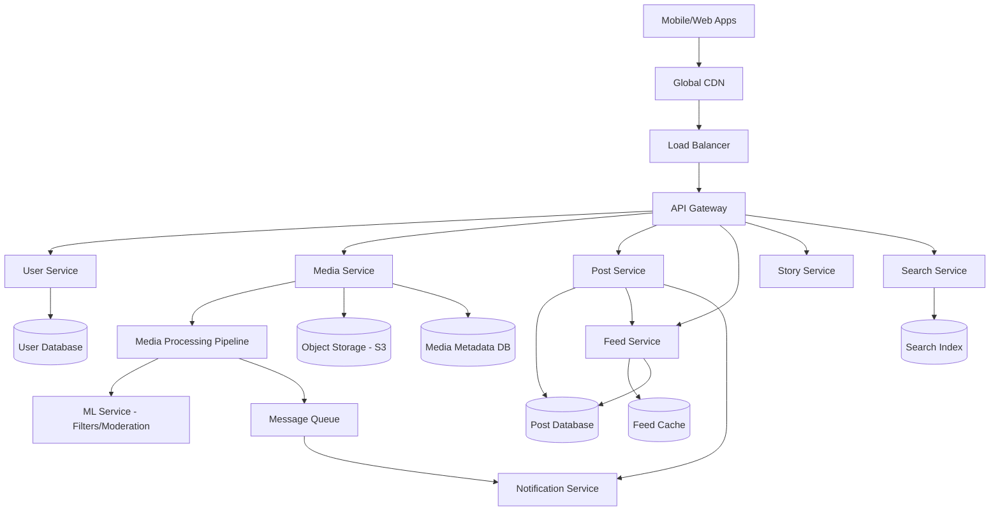
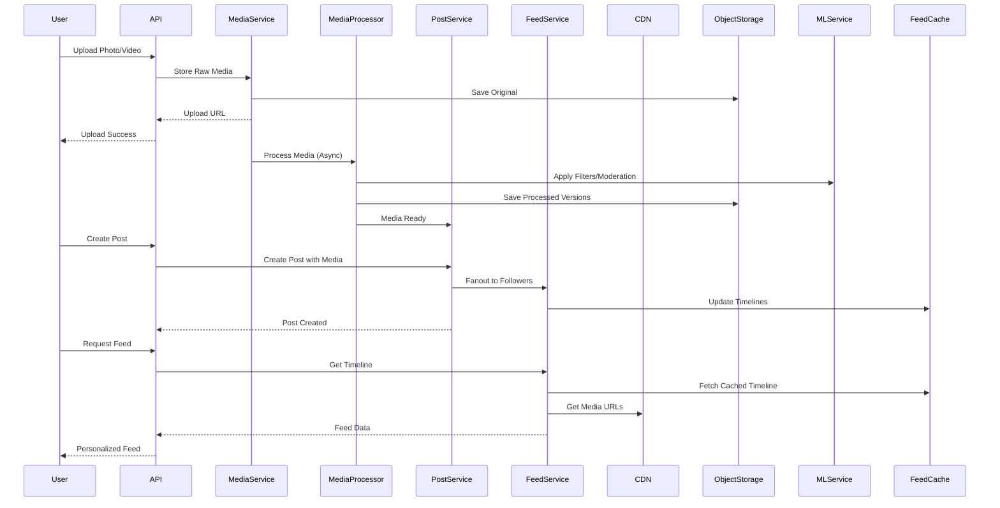

# Design Instagram Photo Sharing - System Design Interview Problem

## Metadata
- **Difficulty**: Medium
- **Companies**: Meta, Google, Amazon, Netflix, Snapchat, TikTok
- **Tags**: photo-sharing, media-processing, social-media, cdn, microservices
- **Estimated Time**: 
  - Reading: 30 minutes
  - Solving: 50 minutes
  - Total: 80 minutes
- **Last Updated**: 2024-08-24
- **Version**: 1.0
- **Popularity**: ⭐⭐⭐⭐⭐

## Problem Statement

### Business Context
Instagram is a photo and video sharing social media platform where users can upload media, apply filters, share posts, follow other users, and interact through likes and comments. The platform needs to handle billions of photos and videos while providing fast upload, processing, and delivery experiences globally.

### Core Problem
Design a scalable photo and video sharing platform that allows users to upload media, apply filters, share posts with followers, and discover content. The system should handle massive media storage, real-time processing, and global content delivery while maintaining high availability and performance.

### User Stories
- As a user, I want to upload photos and videos so that I can share moments with my followers
- As a user, I want to apply filters and edit my photos so that I can enhance my content
- As a user, I want to follow other users so that I can see their posts in my feed
- As a user, I want to like and comment on posts so that I can interact with content
- As a user, I want to discover new content through explore page and hashtags
- As a user, I want to share stories that disappear after 24 hours

## Requirements Clarification

### Functional Requirements
- [ ] Users can upload photos (up to 10MB) and videos (up to 100MB)
- [ ] Users can apply filters and basic editing to photos
- [ ] Users can create posts with captions, hashtags, and location tags
- [ ] Users can follow/unfollow other users and view their feed
- [ ] Users can like, comment, and share posts
- [ ] Users can create and view stories (24-hour temporary content)
- [ ] Users can discover content through explore page and search
- [ ] Users can create and manage multiple accounts

### Non-Functional Requirements
- **Scale**: 2B users, 500M daily active users, 100M photos/videos uploaded daily
- **Performance**: Upload processing < 30 seconds, feed loading < 500ms
- **Availability**: 99.95% uptime, graceful degradation during peak loads
- **Consistency**: Eventual consistency for feeds, strong consistency for user data
- **Security**: Content moderation, privacy controls, secure media storage###
 Constraints
- [ ] Photos: Max 10MB, support JPEG, PNG, HEIC formats
- [ ] Videos: Max 100MB, 60 seconds duration, support MP4, MOV formats
- [ ] Stories: 15-second video clips, 24-hour expiration
- [ ] Feed: Show posts from last 30 days by default
- [ ] Global deployment across multiple regions

### Assumptions
- [ ] Read-heavy system (500:1 read to write ratio)
- [ ] Average user uploads 2 photos per day
- [ ] Average user follows 150 accounts
- [ ] 80% of content consumption happens within 24 hours of posting
- [ ] Mobile-first platform (90% mobile usage)

## Capacity Estimation

### User Metrics
| Metric | Value | Calculation |
|--------|-------|-------------|
| Total Users | 2B | Given requirement |
| Daily Active Users (DAU) | 500M | 25% of total users |
| Peak Concurrent Users | 125M | 25% of DAU during peak hours |
| User Growth Rate | 20% per year | Social media growth rate |

### Content Metrics
| Metric | Value | Calculation |
|--------|-------|-------------|
| Photos Uploaded per Day | 80M | 500M DAU × 0.8 × 0.2 upload rate |
| Videos Uploaded per Day | 20M | 500M DAU × 0.8 × 0.05 upload rate |
| Stories per Day | 200M | 500M DAU × 0.4 story rate |
| Total Media per Day | 300M | Photos + Videos + Stories |

### Traffic Metrics
| Metric | Value | Calculation |
|--------|-------|-------------|
| Upload Requests per Day | 100M | Given requirement |
| Upload QPS (Average) | 1,157 | 100M ÷ 86,400 |
| Peak Upload QPS | 3,472 | Average × 3 |
| Feed Requests per Day | 2.5B | 500M DAU × 5 feed refreshes |
| Feed QPS (Average) | 28,935 | 2.5B ÷ 86,400 |
| Peak Feed QPS | 86,806 | Average × 3 |
| Media View Requests | 50B | 100M posts × 500 avg views |

### Storage Metrics
| Metric | Value | Calculation |
|--------|-------|-------------|
| Average Photo Size | 2MB | After compression |
| Average Video Size | 15MB | After compression |
| Average Story Size | 5MB | Short video clips |
| Daily Storage Growth | 520GB | (80M×2MB + 20M×15MB + 200M×5MB) |
| Monthly Storage Growth | 15.6TB | Daily × 30 |
| 5-Year Storage Projection | 950TB | Current + 5 years growth |

### Bandwidth Estimation
| Metric | Value | Calculation |
|--------|-------|-------------|
| Peak Upload Bandwidth | 52Gbps | 3,472 QPS × 15MB avg |
| Peak Download Bandwidth | 1.7Tbps | 86,806 QPS × 2.5MB avg response |
| CDN Bandwidth | 2Tbps | Including global distribution |

## High-Level System Design

### Architecture Overview
The system uses a microservices architecture with dedicated services for media processing, content delivery, and social features. We implement a multi-region deployment with CDN for global media delivery and separate read/write paths for optimal performance.



### Core Components
1. **Media Service**: Handles photo/video upload, processing, and storage management
2. **Post Service**: Manages post creation, metadata, and social interactions
3. **Feed Service**: Generates personalized feeds and manages timeline caching
4. **Story Service**: Handles temporary content with automatic expiration
5. **Search Service**: Provides content discovery and hashtag functionality
6. **Media Processing Pipeline**: Asynchronous media processing, compression, and filter application### D
ata Flow
The system separates upload and consumption paths, with asynchronous processing for media optimization and multiple format generation for different devices.



## Detailed Component Design

### API Design
```yaml
# Media Upload
POST /api/v1/media/upload
GET /api/v1/media/{media_id}/status
DELETE /api/v1/media/{media_id}

# Post Management
POST /api/v1/posts
GET /api/v1/posts/{post_id}
PUT /api/v1/posts/{post_id}
DELETE /api/v1/posts/{post_id}

# Feed Operations
GET /api/v1/feed/home?limit=20&cursor={cursor}
GET /api/v1/feed/user/{user_id}?limit=20&cursor={cursor}
GET /api/v1/feed/explore?limit=20&cursor={cursor}

# Story Operations
POST /api/v1/stories
GET /api/v1/stories/user/{user_id}
GET /api/v1/stories/feed

# Interactions
POST /api/v1/posts/{post_id}/like
POST /api/v1/posts/{post_id}/comment
GET /api/v1/posts/{post_id}/comments

# Search
GET /api/v1/search/posts?q={query}&limit=20
GET /api/v1/search/users?q={query}&limit=20
GET /api/v1/search/hashtags?q={query}&limit=20
```

### Database Design

#### User Service Schema
```sql
-- Users table
CREATE TABLE users (
    user_id BIGINT PRIMARY KEY,
    username VARCHAR(50) UNIQUE NOT NULL,
    email VARCHAR(255) UNIQUE NOT NULL,
    display_name VARCHAR(100),
    bio TEXT,
    profile_image_url VARCHAR(500),
    verified BOOLEAN DEFAULT FALSE,
    private_account BOOLEAN DEFAULT FALSE,
    follower_count INT DEFAULT 0,
    following_count INT DEFAULT 0,
    post_count INT DEFAULT 0,
    created_at TIMESTAMP DEFAULT CURRENT_TIMESTAMP,
    updated_at TIMESTAMP DEFAULT CURRENT_TIMESTAMP ON UPDATE CURRENT_TIMESTAMP
);

-- Follow relationships
CREATE TABLE follows (
    follower_id BIGINT,
    followee_id BIGINT,
    status ENUM('pending', 'accepted') DEFAULT 'accepted',
    created_at TIMESTAMP DEFAULT CURRENT_TIMESTAMP,
    PRIMARY KEY (follower_id, followee_id)
);
```

#### Media Service Schema
```sql
-- Media metadata
CREATE TABLE media (
    media_id BIGINT PRIMARY KEY,
    user_id BIGINT NOT NULL,
    media_type ENUM('photo', 'video') NOT NULL,
    original_url VARCHAR(500) NOT NULL,
    processed_urls JSON, -- Different sizes/formats
    file_size BIGINT,
    width INT,
    height INT,
    duration INT, -- For videos
    processing_status ENUM('uploading', 'processing', 'ready', 'failed'),
    metadata JSON, -- EXIF data, location, etc.
    created_at TIMESTAMP DEFAULT CURRENT_TIMESTAMP
);

-- Media processing jobs
CREATE TABLE media_processing_jobs (
    job_id BIGINT PRIMARY KEY,
    media_id BIGINT NOT NULL,
    job_type ENUM('resize', 'filter', 'compress', 'moderation'),
    status ENUM('pending', 'processing', 'completed', 'failed'),
    parameters JSON,
    created_at TIMESTAMP DEFAULT CURRENT_TIMESTAMP,
    completed_at TIMESTAMP
);
```#### 
Post Service Schema
```sql
-- Posts table
CREATE TABLE posts (
    post_id BIGINT PRIMARY KEY,
    user_id BIGINT NOT NULL,
    caption TEXT,
    media_ids JSON NOT NULL, -- Array of media IDs
    hashtags JSON,
    location_id BIGINT,
    like_count INT DEFAULT 0,
    comment_count INT DEFAULT 0,
    share_count INT DEFAULT 0,
    visibility ENUM('public', 'followers', 'private') DEFAULT 'public',
    created_at TIMESTAMP DEFAULT CURRENT_TIMESTAMP,
    updated_at TIMESTAMP DEFAULT CURRENT_TIMESTAMP ON UPDATE CURRENT_TIMESTAMP
);

-- Post interactions
CREATE TABLE post_likes (
    user_id BIGINT,
    post_id BIGINT,
    created_at TIMESTAMP DEFAULT CURRENT_TIMESTAMP,
    PRIMARY KEY (user_id, post_id)
);

CREATE TABLE post_comments (
    comment_id BIGINT PRIMARY KEY,
    post_id BIGINT NOT NULL,
    user_id BIGINT NOT NULL,
    parent_comment_id BIGINT, -- For nested comments
    content TEXT NOT NULL,
    like_count INT DEFAULT 0,
    created_at TIMESTAMP DEFAULT CURRENT_TIMESTAMP
);

-- Stories (temporary content)
CREATE TABLE stories (
    story_id BIGINT PRIMARY KEY,
    user_id BIGINT NOT NULL,
    media_id BIGINT NOT NULL,
    view_count INT DEFAULT 0,
    expires_at TIMESTAMP NOT NULL,
    created_at TIMESTAMP DEFAULT CURRENT_TIMESTAMP
);
```

#### Indexing Strategy
- **Timeline Queries**: Composite index on (user_id, created_at DESC)
- **Media Lookup**: Index on media_id and user_id
- **Hashtag Search**: GIN index on hashtags JSON field
- **Location Search**: Geospatial index on location coordinates
- **Story Expiration**: Index on expires_at for cleanup jobs

### Media Processing Pipeline

#### Upload Flow
```python
class MediaUploadService:
    def __init__(self):
        self.s3_client = boto3.client('s3')
        self.processing_queue = MessageQueue('media-processing')
    
    async def upload_media(self, user_id, file_data, media_type):
        # Generate unique media ID
        media_id = generate_snowflake_id()
        
        # Upload original to S3
        original_key = f"media/original/{media_id}"
        upload_url = await self.s3_client.generate_presigned_url(
            'put_object',
            Params={'Bucket': 'instagram-media', 'Key': original_key},
            ExpiresIn=3600
        )
        
        # Store metadata
        media_record = {
            'media_id': media_id,
            'user_id': user_id,
            'media_type': media_type,
            'original_url': f"s3://instagram-media/{original_key}",
            'processing_status': 'uploading'
        }
        await self.db.insert('media', media_record)
        
        # Queue for processing
        processing_job = {
            'media_id': media_id,
            'user_id': user_id,
            'media_type': media_type,
            'tasks': ['resize', 'compress', 'moderation']
        }
        await self.processing_queue.send(processing_job)
        
        return {'media_id': media_id, 'upload_url': upload_url}
```

#### Processing Pipeline
```python
class MediaProcessor:
    def __init__(self):
        self.image_sizes = [
            {'name': 'thumbnail', 'width': 150, 'height': 150},
            {'name': 'small', 'width': 320, 'height': 320},
            {'name': 'medium', 'width': 640, 'height': 640},
            {'name': 'large', 'width': 1080, 'height': 1080}
        ]
        self.video_qualities = [
            {'name': '480p', 'height': 480, 'bitrate': '1000k'},
            {'name': '720p', 'height': 720, 'bitrate': '2500k'},
            {'name': '1080p', 'height': 1080, 'bitrate': '5000k'}
        ]
    
    async def process_media(self, job):
        media_id = job['media_id']
        media_type = job['media_type']
        
        try:
            # Update status
            await self.update_processing_status(media_id, 'processing')
            
            if media_type == 'photo':
                processed_urls = await self.process_image(media_id)
            else:
                processed_urls = await self.process_video(media_id)
            
            # Content moderation
            moderation_result = await self.moderate_content(media_id)
            if not moderation_result['approved']:
                await self.handle_content_violation(media_id)
                return
            
            # Update media record with processed URLs
            await self.db.update('media', 
                {'media_id': media_id}, 
                {
                    'processed_urls': processed_urls,
                    'processing_status': 'ready'
                }
            )
            
            # Notify completion
            await self.notify_processing_complete(media_id)
            
        except Exception as e:
            await self.update_processing_status(media_id, 'failed')
            await self.handle_processing_error(media_id, str(e))
```##
# Caching Strategy

#### Feed Cache (Redis)
```python
class FeedCache:
    def __init__(self):
        self.redis = Redis(host='feed-cache-cluster')
        self.feed_size = 100  # Cache 100 posts per user
        self.ttl = 86400 * 3  # 3 days
    
    def cache_user_feed(self, user_id, posts):
        key = f"feed:user:{user_id}"
        
        # Use sorted set with timestamp scores
        pipeline = self.redis.pipeline()
        for post in posts:
            pipeline.zadd(key, {post['post_id']: post['created_at']})
        
        # Keep only latest posts
        pipeline.zremrangebyrank(key, 0, -(self.feed_size + 1))
        pipeline.expire(key, self.ttl)
        pipeline.execute()
    
    def get_user_feed(self, user_id, limit=20, cursor=None):
        key = f"feed:user:{user_id}"
        
        if cursor:
            # Get posts older than cursor
            post_ids = self.redis.zrevrangebyscore(
                key, cursor, '-inf', start=0, num=limit
            )
        else:
            # Get latest posts
            post_ids = self.redis.zrevrange(key, 0, limit - 1)
        
        return [int(pid) for pid in post_ids]
```

## Scaling the Design

### Bottleneck Analysis

1. **Media Upload Bottleneck**
   - **Problem**: Large file uploads can overwhelm servers and storage
   - **Solution**: Direct S3 uploads with presigned URLs, chunked uploads
   - **Trade-offs**: Complexity vs performance, client-side logic

2. **Media Processing Bottleneck**
   - **Problem**: Image/video processing is CPU intensive
   - **Solution**: Horizontal scaling with worker queues, GPU acceleration
   - **Trade-offs**: Processing cost vs speed, queue latency

3. **Feed Generation Bottleneck**
   - **Problem**: Generating feeds for users with many followers
   - **Solution**: Pre-computed feeds with smart caching strategies
   - **Trade-offs**: Memory usage vs computation, staleness vs freshness

### Performance Optimizations

#### CDN and Media Optimization
```python
class GlobalMediaDelivery:
    def __init__(self):
        self.cdn_regions = {
            'us-east': 'https://us-east.cdn.instagram.com',
            'us-west': 'https://us-west.cdn.instagram.com',
            'eu': 'https://eu.cdn.instagram.com',
            'asia': 'https://asia.cdn.instagram.com'
        }
    
    def get_optimized_media_url(self, media_id, user_location, device_info):
        # Select closest CDN region
        cdn_region = self.select_cdn_region(user_location)
        base_url = self.cdn_regions[cdn_region]
        
        # Select appropriate media size
        size = self.select_media_size(device_info)
        
        # Generate CDN URL with cache headers
        url = f"{base_url}/media/{media_id}/{size}.jpg"
        
        # Add query parameters for optimization
        params = {
            'quality': self.get_quality_setting(device_info),
            'format': self.get_format_preference(device_info),
            'cache': '86400'  # 24 hour cache
        }
        
        return f"{url}?{urlencode(params)}"
```

## Advanced Considerations

### Security & Privacy
- **Content Moderation**: ML-based detection of inappropriate content, human review workflows
- **Privacy Controls**: Private accounts, story visibility settings, data download/deletion
- **Media Security**: Watermarking, EXIF data stripping, secure URLs with expiration
- **API Security**: Rate limiting, OAuth 2.0, request signing for sensitive operations

### Monitoring & Observability
- **Key Metrics**: Upload success rate, processing latency, feed generation time, CDN hit ratio
- **Alerting**: Failed uploads, processing queue backlog, high error rates
- **Logging**: Media processing pipeline, user interactions, performance metrics
- **A/B Testing**: Feed algorithms, UI changes, feature rollouts

## Follow-up Questions

### Technical Deep Dives
- How would you implement real-time story views and reactions?
- What happens if media processing fails for a popular user's post?
- How would you handle copyright detection and DMCA takedowns?
- How would you implement live video streaming features?

### Design Variations
- How would the design change for supporting 4K video uploads?
- What if we needed to support AR filters and effects?
- How would you adapt this for a TikTok-style short video platform?
- What changes would you make for better accessibility features?

## Learning Objectives

### Concepts Covered
- [ ] Media processing pipelines and asynchronous workflows
- [ ] Content delivery networks and global media distribution
- [ ] Social media feed generation and personalization
- [ ] Large-scale file storage and management
- [ ] Real-time features and temporary content (stories)
- [ ] Content moderation and safety systems

### Technologies Discussed
- [ ] Object storage (S3) for media files
- [ ] CDN for global content delivery
- [ ] Message queues for asynchronous processing
- [ ] Redis for feed caching and session management
- [ ] Machine learning for content recommendation
- [ ] Image/video processing libraries and services

## Related Problems
- **Design TikTok**: Similar media focus but with short-form video emphasis
- **Design YouTube**: Video platform with different scale and use patterns
- **Design Snapchat**: Temporary content focus with real-time messaging
- **Design Pinterest**: Visual discovery platform with different social dynamics