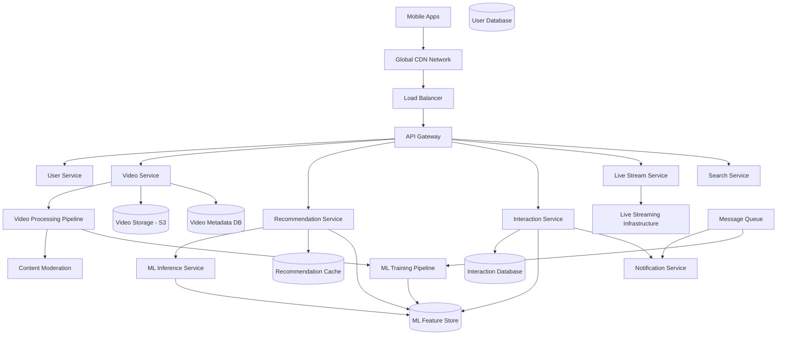
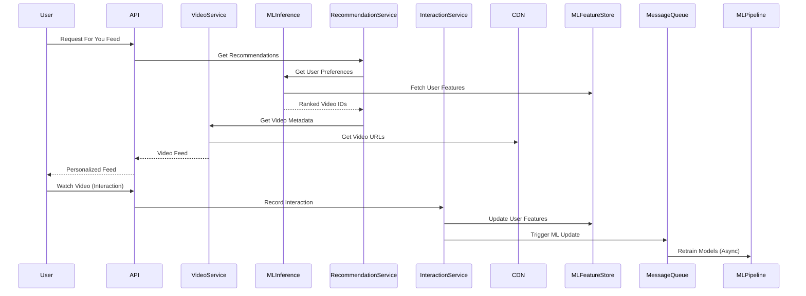

# Design TikTok Video Platform - System Design Interview Problem

## Metadata
- **Difficulty**: Hard
- **Companies**: ByteDance, Meta, Google, Amazon, Netflix, Snapchat
- **Tags**: short-video, recommendation-engine, real-time-streaming, ml-algorithms, global-cdn
- **Estimated Time**: 
  - Reading: 35 minutes
  - Solving: 60 minutes
  - Total: 95 minutes
- **Last Updated**: 2024-08-24
- **Version**: 1.0
- **Popularity**: ⭐⭐⭐⭐⭐

## Problem Statement

### Business Context
TikTok is a short-form video platform where users create, share, and discover 15-60 second videos with music, effects, and filters. The platform's success relies heavily on its recommendation algorithm that creates highly personalized "For You" feeds, keeping users engaged for hours. The system needs to handle billions of video uploads and views while providing real-time recommendations.

### Core Problem
Design a scalable short-video platform that allows users to create and share videos, discover content through an AI-powered recommendation system, and interact with a global community. The system should handle massive video processing, real-time ML inference, and global content delivery while maintaining sub-second video loading times.

### User Stories
- As a user, I want to record and upload short videos with effects and music so that I can express creativity
- As a user, I want to scroll through a personalized "For You" feed so that I can discover engaging content
- As a user, I want to like, comment, and share videos so that I can interact with creators
- As a user, I want to follow creators and see their content so that I can stay updated with my interests
- As a user, I want to use trending sounds and effects so that I can participate in viral trends
- As a user, I want to go live and interact with viewers in real-time

## Requirements Clarification

### Functional Requirements
- [ ] Users can record/upload videos (15-60 seconds, up to 200MB)
- [ ] Users can add music, effects, filters, and text overlays
- [ ] Users can browse personalized "For You" feed with infinite scroll
- [ ] Users can like, comment, share, and follow other users
- [ ] Users can discover content through hashtags and trending sounds
- [ ] Users can go live and watch live streams
- [ ] Users can create duets and reactions to existing videos
- [ ] Support for multiple video qualities and adaptive streaming

### Non-Functional Requirements
- **Scale**: 1B users, 800M daily active users, 1B videos uploaded daily
- **Performance**: Video loading < 200ms, recommendation latency < 100ms
- **Availability**: 99.9% uptime, graceful degradation during peak loads
- **Consistency**: Eventual consistency for feeds, real-time for interactions
- **Security**: Content moderation, age-appropriate content filtering, data privacy

### Constraints
- [ ] Videos: 15-60 seconds duration, max 200MB file size
- [ ] Support for 480p, 720p, 1080p video qualities
- [ ] Global deployment with <200ms latency worldwide
- [ ] Real-time recommendation updates based on user behavior
- [ ] Support for 50+ languages and regional content preferences

### Assumptions
- [ ] Extremely read-heavy system (1000:1 read to write ratio)
- [ ] Average user watches 100 videos per session
- [ ] 90% of video consumption happens within 48 hours of upload
- [ ] Mobile-first platform (95% mobile usage)
- [ ] Average video size: 50MB (after compression)## 
Capacity Estimation

### User Metrics
| Metric | Value | Calculation |
|--------|-------|-------------|
| Total Users | 1B | Given requirement |
| Daily Active Users (DAU) | 800M | 80% of total users |
| Peak Concurrent Users | 200M | 25% of DAU during peak hours |
| User Growth Rate | 25% per year | High growth social platform |

### Content Metrics
| Metric | Value | Calculation |
|--------|-------|-------------|
| Videos Uploaded per Day | 1B | Given requirement |
| Videos per Second (Average) | 11,574 | 1B ÷ 86,400 |
| Peak Upload QPS | 34,722 | Average × 3 |
| Live Streams per Day | 10M | 800M DAU × 0.0125 live rate |

### Traffic Metrics
| Metric | Value | Calculation |
|--------|-------|-------------|
| Video Views per Day | 80B | 800M DAU × 100 videos per session |
| Video View QPS (Average) | 925,926 | 80B ÷ 86,400 |
| Peak Video QPS | 2.78M | Average × 3 |
| Recommendation Requests | 160B | 2 requests per video view |
| ML Inference QPS | 1.85M | 160B ÷ 86,400 |

### Storage Metrics
| Metric | Value | Calculation |
|--------|-------|-------------|
| Average Video Size (Original) | 100MB | Before compression |
| Average Video Size (Processed) | 50MB | After compression + multiple qualities |
| Daily Storage Growth | 50TB | 1B videos × 50MB |
| Monthly Storage Growth | 1.5PB | Daily × 30 |
| 5-Year Storage Projection | 91PB | Current + 5 years growth |

### Bandwidth Estimation
| Metric | Value | Calculation |
|--------|-------|-------------|
| Peak Upload Bandwidth | 3.5Tbps | 34,722 QPS × 100MB |
| Peak Download Bandwidth | 139Tbps | 2.78M QPS × 50MB |
| Global CDN Bandwidth | 200Tbps | Including redundancy and global distribution |

## High-Level System Design

### Architecture Overview
The system uses a microservices architecture with heavy emphasis on ML-powered recommendation engine, real-time video processing, and global CDN distribution. The recommendation system is the core differentiator, requiring real-time ML inference at massive scale.



### Core Components
1. **Video Service**: Handles video upload, processing, and metadata management
2. **Recommendation Service**: ML-powered personalized content recommendation engine
3. **Interaction Service**: Manages likes, comments, shares, and user engagement tracking
4. **Live Stream Service**: Real-time video streaming and chat functionality
5. **ML Pipeline**: Continuous model training and feature engineering
6. **Content Moderation**: Automated and human content review systems

### Data Flow
The system emphasizes real-time recommendation updates, with user interactions immediately feeding back into the ML system for improved personalization.



## Detailed Component Design

### API Design
```yaml
# Video Management
POST /api/v1/videos/upload
GET /api/v1/videos/{video_id}
DELETE /api/v1/videos/{video_id}
POST /api/v1/videos/{video_id}/duet

# Feed Operations
GET /api/v1/feed/for-you?limit=20&cursor={cursor}
GET /api/v1/feed/following?limit=20&cursor={cursor}
GET /api/v1/feed/trending?limit=20&cursor={cursor}

# Interactions
POST /api/v1/videos/{video_id}/like
POST /api/v1/videos/{video_id}/comment
POST /api/v1/videos/{video_id}/share
GET /api/v1/videos/{video_id}/comments

# Live Streaming
POST /api/v1/live/start
GET /api/v1/live/{stream_id}
POST /api/v1/live/{stream_id}/end

# Search & Discovery
GET /api/v1/search/videos?q={query}&limit=20
GET /api/v1/search/users?q={query}&limit=20
GET /api/v1/trending/hashtags
GET /api/v1/trending/sounds

# User Interactions
POST /api/v1/users/{user_id}/follow
GET /api/v1/users/{user_id}/videos
GET /api/v1/users/{user_id}/profile
```

### Database Design

#### Video Service Schema
```sql
-- Videos table
CREATE TABLE videos (
    video_id BIGINT PRIMARY KEY,
    user_id BIGINT NOT NULL,
    title VARCHAR(500),
    description TEXT,
    duration INT NOT NULL, -- in seconds
    file_size BIGINT,
    video_urls JSON, -- Different qualities
    thumbnail_url VARCHAR(500),
    music_id BIGINT,
    effects JSON,
    hashtags JSON,
    view_count BIGINT DEFAULT 0,
    like_count INT DEFAULT 0,
    comment_count INT DEFAULT 0,
    share_count INT DEFAULT 0,
    processing_status ENUM('uploading', 'processing', 'ready', 'failed'),
    visibility ENUM('public', 'private', 'friends') DEFAULT 'public',
    created_at TIMESTAMP DEFAULT CURRENT_TIMESTAMP,
    updated_at TIMESTAMP DEFAULT CURRENT_TIMESTAMP ON UPDATE CURRENT_TIMESTAMP
);

-- Music/Sounds library
CREATE TABLE music_tracks (
    music_id BIGINT PRIMARY KEY,
    title VARCHAR(200) NOT NULL,
    artist VARCHAR(200),
    duration INT,
    audio_url VARCHAR(500),
    usage_count BIGINT DEFAULT 0,
    trending_score FLOAT DEFAULT 0,
    created_at TIMESTAMP DEFAULT CURRENT_TIMESTAMP
);

-- Video effects and filters
CREATE TABLE effects (
    effect_id BIGINT PRIMARY KEY,
    name VARCHAR(100) NOT NULL,
    category ENUM('filter', 'effect', 'sticker'),
    parameters JSON,
    usage_count BIGINT DEFAULT 0,
    created_at TIMESTAMP DEFAULT CURRENT_TIMESTAMP
);
```

#### Interaction Service Schema
```sql
-- User interactions with videos
CREATE TABLE video_interactions (
    interaction_id BIGINT PRIMARY KEY,
    user_id BIGINT NOT NULL,
    video_id BIGINT NOT NULL,
    interaction_type ENUM('view', 'like', 'share', 'comment', 'complete_view'),
    watch_duration INT, -- seconds watched
    interaction_value FLOAT, -- engagement score
    created_at TIMESTAMP DEFAULT CURRENT_TIMESTAMP,
    
    INDEX idx_user_interactions (user_id, created_at DESC),
    INDEX idx_video_interactions (video_id, interaction_type, created_at DESC)
);

-- Comments
CREATE TABLE video_comments (
    comment_id BIGINT PRIMARY KEY,
    video_id BIGINT NOT NULL,
    user_id BIGINT NOT NULL,
    parent_comment_id BIGINT,
    content TEXT NOT NULL,
    like_count INT DEFAULT 0,
    created_at TIMESTAMP DEFAULT CURRENT_TIMESTAMP
);

-- User relationships
CREATE TABLE user_follows (
    follower_id BIGINT,
    followee_id BIGINT,
    created_at TIMESTAMP DEFAULT CURRENT_TIMESTAMP,
    PRIMARY KEY (follower_id, followee_id)
);
```##
# ML-Powered Recommendation System

#### Feature Engineering
```python
class FeatureEngineer:
    def __init__(self):
        self.feature_store = MLFeatureStore()
    
    def extract_user_features(self, user_id):
        """Extract comprehensive user features for recommendation"""
        
        # Demographic features
        user_profile = self.get_user_profile(user_id)
        demographic_features = {
            'age_group': self.categorize_age(user_profile.age),
            'location': user_profile.location,
            'language': user_profile.language,
            'device_type': user_profile.device_type
        }
        
        # Behavioral features (last 7 days)
        interactions = self.get_recent_interactions(user_id, days=7)
        behavioral_features = {
            'avg_watch_duration': self.calculate_avg_watch_duration(interactions),
            'completion_rate': self.calculate_completion_rate(interactions),
            'interaction_frequency': len(interactions) / 7,
            'preferred_video_length': self.get_preferred_duration(interactions),
            'active_hours': self.get_active_time_patterns(interactions)
        }
        
        # Content preference features
        content_features = {
            'favorite_categories': self.get_top_categories(interactions),
            'favorite_creators': self.get_top_creators(interactions),
            'favorite_music_genres': self.get_music_preferences(interactions),
            'hashtag_interests': self.get_hashtag_preferences(interactions)
        }
        
        # Social features
        social_features = {
            'follower_count': user_profile.follower_count,
            'following_count': user_profile.following_count,
            'social_activity_score': self.calculate_social_score(user_id),
            'friend_similarity_scores': self.get_friend_similarities(user_id)
        }
        
        return {
            **demographic_features,
            **behavioral_features,
            **content_features,
            **social_features
        }
    
    def extract_video_features(self, video_id):
        """Extract video features for recommendation scoring"""
        
        video = self.get_video_metadata(video_id)
        
        # Content features
        content_features = {
            'duration': video.duration,
            'category': video.category,
            'hashtags': video.hashtags,
            'music_id': video.music_id,
            'effects_used': video.effects,
            'upload_time': video.created_at,
            'creator_id': video.user_id
        }
        
        # Performance features
        performance_features = {
            'view_count': video.view_count,
            'like_rate': video.like_count / max(video.view_count, 1),
            'comment_rate': video.comment_count / max(video.view_count, 1),
            'share_rate': video.share_count / max(video.view_count, 1),
            'completion_rate': self.get_video_completion_rate(video_id),
            'viral_score': self.calculate_viral_score(video_id)
        }
        
        # Creator features
        creator_features = {
            'creator_follower_count': self.get_creator_followers(video.user_id),
            'creator_avg_performance': self.get_creator_avg_metrics(video.user_id),
            'creator_consistency_score': self.get_creator_consistency(video.user_id)
        }
        
        return {
            **content_features,
            **performance_features,
            **creator_features
        }
```

#### Real-time Recommendation Engine
```python
class RecommendationEngine:
    def __init__(self):
        self.model_ensemble = ModelEnsemble()
        self.feature_store = MLFeatureStore()
        self.cache = RecommendationCache()
        
    async def get_recommendations(self, user_id, limit=20, context=None):
        """Generate personalized video recommendations"""
        
        # Check cache first
        cached_recs = await self.cache.get_recommendations(user_id)
        if cached_recs and len(cached_recs) >= limit:
            return cached_recs[:limit]
        
        # Get user features
        user_features = await self.feature_store.get_user_features(user_id)
        
        # Get candidate videos (multiple strategies)
        candidates = await self.get_candidate_videos(user_id, user_features)
        
        # Score candidates using ensemble model
        scored_videos = await self.score_candidates(user_id, candidates, user_features)
        
        # Apply business rules and diversity
        final_recommendations = self.apply_recommendation_rules(
            scored_videos, user_features, context
        )
        
        # Cache recommendations
        await self.cache.cache_recommendations(user_id, final_recommendations)
        
        return final_recommendations[:limit]
    
    async def get_candidate_videos(self, user_id, user_features):
        """Multi-strategy candidate generation"""
        
        candidates = []
        
        # Strategy 1: Collaborative filtering (users with similar behavior)
        similar_users = await self.find_similar_users(user_id, user_features)
        collab_candidates = await self.get_videos_from_similar_users(similar_users)
        candidates.extend(collab_candidates)
        
        # Strategy 2: Content-based (similar to liked videos)
        liked_videos = await self.get_user_liked_videos(user_id)
        content_candidates = await self.find_similar_videos(liked_videos)
        candidates.extend(content_candidates)
        
        # Strategy 3: Trending videos (global and local trends)
        trending_candidates = await self.get_trending_videos(user_features['location'])
        candidates.extend(trending_candidates)
        
        # Strategy 4: Following feed (creators user follows)
        following_candidates = await self.get_following_videos(user_id)
        candidates.extend(following_candidates)
        
        # Strategy 5: Exploration (new creators and content)
        exploration_candidates = await self.get_exploration_videos(user_features)
        candidates.extend(exploration_candidates)
        
        # Remove duplicates and videos already seen
        candidates = await self.deduplicate_and_filter(user_id, candidates)
        
        return candidates
    
    async def score_candidates(self, user_id, candidates, user_features):
        """Score candidates using ML ensemble"""
        
        scored_videos = []
        
        for video_id in candidates:
            video_features = await self.feature_store.get_video_features(video_id)
            
            # Combine user and video features
            combined_features = {
                **user_features,
                **video_features,
                'user_video_similarity': self.calculate_similarity(user_features, video_features)
            }
            
            # Get predictions from ensemble models
            predictions = await self.model_ensemble.predict(combined_features)
            
            # Calculate final score
            final_score = self.calculate_final_score(predictions, combined_features)
            
            scored_videos.append({
                'video_id': video_id,
                'score': final_score,
                'prediction_breakdown': predictions
            })
        
        # Sort by score
        scored_videos.sort(key=lambda x: x['score'], reverse=True)
        
        return scored_videos
    
    def apply_recommendation_rules(self, scored_videos, user_features, context):
        """Apply business rules for diversity and quality"""
        
        final_recs = []
        creators_seen = set()
        categories_seen = set()
        
        for video in scored_videos:
            video_meta = self.get_video_metadata(video['video_id'])
            
            # Diversity rules
            if len(creators_seen) < 3 or video_meta.creator_id not in creators_seen:
                if len(categories_seen) < 5 or video_meta.category not in categories_seen:
                    
                    # Quality thresholds
                    if video['score'] > 0.3:  # Minimum quality threshold
                        final_recs.append(video)
                        creators_seen.add(video_meta.creator_id)
                        categories_seen.add(video_meta.category)
            
            if len(final_recs) >= 100:  # Cache up to 100 recommendations
                break
        
        return final_recs
```

### Video Processing Pipeline

#### Multi-Quality Video Processing
```python
class VideoProcessor:
    def __init__(self):
        self.quality_configs = [
            {'name': '480p', 'height': 480, 'bitrate': '1000k', 'fps': 30},
            {'name': '720p', 'height': 720, 'bitrate': '2500k', 'fps': 30},
            {'name': '1080p', 'height': 1080, 'bitrate': '5000k', 'fps': 60}
        ]
        self.s3_client = boto3.client('s3')
        
    async def process_video(self, video_id, original_url):
        """Process video into multiple qualities and extract features"""
        
        try:
            # Download original video
            original_video = await self.download_video(original_url)
            
            # Extract video metadata
            metadata = await self.extract_metadata(original_video)
            
            # Generate multiple quality versions
            processed_versions = {}
            for config in self.quality_configs:
                processed_video = await self.transcode_video(original_video, config)
                s3_url = await self.upload_to_s3(processed_video, video_id, config['name'])
                processed_versions[config['name']] = s3_url
            
            # Generate thumbnail
            thumbnail = await self.generate_thumbnail(original_video)
            thumbnail_url = await self.upload_thumbnail(thumbnail, video_id)
            
            # Extract ML features for recommendation
            ml_features = await self.extract_ml_features(original_video, metadata)
            
            # Content moderation
            moderation_result = await self.moderate_content(original_video, metadata)
            
            # Update video record
            await self.update_video_record(video_id, {
                'video_urls': processed_versions,
                'thumbnail_url': thumbnail_url,
                'duration': metadata['duration'],
                'processing_status': 'ready' if moderation_result['approved'] else 'rejected',
                'ml_features': ml_features
            })
            
            # Trigger recommendation model update
            await self.trigger_ml_update(video_id, ml_features)
            
        except Exception as e:
            await self.handle_processing_error(video_id, str(e))
    
    async def extract_ml_features(self, video, metadata):
        """Extract features for ML recommendation system"""
        
        features = {}
        
        # Visual features
        features['dominant_colors'] = await self.extract_dominant_colors(video)
        features['scene_changes'] = await self.detect_scene_changes(video)
        features['face_count'] = await self.count_faces(video)
        features['object_categories'] = await self.detect_objects(video)
        
        # Audio features
        features['audio_tempo'] = await self.analyze_audio_tempo(video)
        features['audio_genre'] = await self.classify_audio_genre(video)
        features['speech_detected'] = await self.detect_speech(video)
        
        # Content features
        features['text_overlay'] = await self.extract_text_overlay(video)
        features['motion_intensity'] = await self.analyze_motion(video)
        features['video_quality_score'] = await self.assess_quality(video)
        
        return features
```## S
caling the Design

### Bottleneck Analysis

1. **ML Inference Bottleneck**
   - **Problem**: Real-time recommendation requires millions of ML inferences per second
   - **Solution**: Model serving infrastructure with GPU clusters, model caching, batch inference
   - **Trade-offs**: Cost vs latency, model complexity vs speed

2. **Video Delivery Bottleneck**
   - **Problem**: Massive video bandwidth requirements globally
   - **Solution**: Multi-tier CDN with edge caching, adaptive bitrate streaming
   - **Trade-offs**: Storage cost vs delivery performance

3. **Real-time Feature Updates**
   - **Problem**: User interactions need to immediately update recommendation models
   - **Solution**: Stream processing with feature store, incremental model updates
   - **Trade-offs**: Consistency vs performance, complexity vs freshness

### Horizontal Scaling Strategies

#### ML Infrastructure Scaling
```python
class MLInfrastructure:
    def __init__(self):
        self.model_servers = ModelServerCluster()
        self.feature_cache = FeatureCache()
        self.batch_processor = BatchProcessor()
        
    async def serve_recommendations(self, user_requests):
        """Handle massive ML inference load"""
        
        # Batch requests for efficiency
        batched_requests = self.batch_requests(user_requests, batch_size=100)
        
        # Parallel processing across GPU clusters
        results = []
        async with asyncio.TaskGroup() as tg:
            for batch in batched_requests:
                task = tg.create_task(self.process_batch(batch))
                results.append(task)
        
        # Combine results
        all_recommendations = []
        for result in results:
            all_recommendations.extend(await result)
        
        return all_recommendations
    
    async def process_batch(self, batch):
        """Process batch of recommendation requests"""
        
        # Get cached features first
        cached_features = await self.feature_cache.get_batch_features(
            [req['user_id'] for req in batch]
        )
        
        # Identify missing features
        missing_users = [
            req['user_id'] for req in batch 
            if req['user_id'] not in cached_features
        ]
        
        # Compute missing features
        if missing_users:
            fresh_features = await self.compute_fresh_features(missing_users)
            cached_features.update(fresh_features)
        
        # Batch ML inference
        inference_input = self.prepare_inference_batch(batch, cached_features)
        predictions = await self.model_servers.batch_predict(inference_input)
        
        # Convert to recommendations
        recommendations = self.convert_to_recommendations(batch, predictions)
        
        return recommendations

class FeatureStore:
    def __init__(self):
        self.redis_cluster = RedisCluster()
        self.streaming_processor = StreamProcessor()
        
    async def update_user_features_realtime(self, user_id, interaction):
        """Update user features in real-time based on interactions"""
        
        # Get current features
        current_features = await self.get_user_features(user_id)
        
        # Update based on interaction
        updated_features = self.update_features_with_interaction(
            current_features, interaction
        )
        
        # Store updated features
        await self.store_user_features(user_id, updated_features)
        
        # Trigger model update if significant change
        if self.is_significant_change(current_features, updated_features):
            await self.trigger_model_update(user_id, updated_features)
    
    def update_features_with_interaction(self, features, interaction):
        """Update user features based on single interaction"""
        
        # Update engagement metrics
        features['total_watch_time'] += interaction['watch_duration']
        features['total_interactions'] += 1
        
        # Update preferences
        if interaction['interaction_type'] == 'like':
            features['liked_categories'][interaction['video_category']] += 1
            features['liked_creators'][interaction['creator_id']] += 1
        
        # Update temporal patterns
        hour = interaction['timestamp'].hour
        features['active_hours'][hour] += 1
        
        # Update completion rate
        completion = interaction['watch_duration'] / interaction['video_duration']
        features['avg_completion_rate'] = (
            features['avg_completion_rate'] * 0.9 + completion * 0.1
        )
        
        return features
```

#### Global CDN Architecture
```python
class GlobalCDNManager:
    def __init__(self):
        self.cdn_regions = {
            'us-east': CDNCluster('us-east-1'),
            'us-west': CDNCluster('us-west-1'),
            'eu-west': CDNCluster('eu-west-1'),
            'asia-pacific': CDNCluster('ap-southeast-1'),
            'china': CDNCluster('cn-north-1'),  # Special handling for China
        }
        self.edge_locations = EdgeLocationManager()
        
    async def serve_video(self, video_id, user_location, device_info):
        """Serve video with optimal quality and location"""
        
        # Select best CDN region
        cdn_region = self.select_optimal_cdn(user_location)
        
        # Determine video quality based on device and network
        quality = self.determine_video_quality(device_info)
        
        # Check edge cache first
        edge_url = await self.check_edge_cache(video_id, quality, user_location)
        if edge_url:
            return edge_url
        
        # Get from regional CDN
        cdn_cluster = self.cdn_regions[cdn_region]
        video_url = await cdn_cluster.get_video_url(video_id, quality)
        
        # Pre-warm edge cache for popular videos
        if await self.is_trending_video(video_id):
            await self.pre_warm_edge_cache(video_id, quality)
        
        return video_url
    
    def determine_video_quality(self, device_info):
        """Adaptive quality selection based on device and network"""
        
        network_speed = device_info.get('network_speed', 'unknown')
        screen_resolution = device_info.get('screen_resolution', '1080p')
        battery_level = device_info.get('battery_level', 100)
        
        # Network-based quality selection
        if network_speed == 'slow' or network_speed == '2g':
            return '480p'
        elif network_speed == '3g':
            return '720p' if screen_resolution >= '720p' else '480p'
        elif network_speed in ['4g', '5g', 'wifi']:
            # Consider battery level for high quality
            if battery_level < 20:
                return '720p'  # Save battery
            else:
                return '1080p' if screen_resolution >= '1080p' else '720p'
        
        return '720p'  # Default fallback
```

### Performance Optimizations

#### Predictive Caching
```python
class PredictiveCachingSystem:
    def __init__(self):
        self.ml_predictor = ViewPredictionModel()
        self.cache_manager = CacheManager()
        
    async def predict_and_cache_videos(self, user_id):
        """Predict which videos user will watch and pre-cache them"""
        
        # Get user's likely next videos
        predicted_videos = await self.ml_predictor.predict_next_videos(
            user_id, prediction_horizon=10
        )
        
        # Pre-cache high-probability videos
        for video_prediction in predicted_videos:
            if video_prediction['probability'] > 0.7:
                await self.pre_cache_video(
                    video_prediction['video_id'],
                    user_id,
                    video_prediction['predicted_quality']
                )
    
    async def pre_cache_video(self, video_id, user_id, quality):
        """Pre-cache video in user's regional edge location"""
        
        user_location = await self.get_user_location(user_id)
        edge_location = self.get_nearest_edge(user_location)
        
        # Check if already cached
        if await edge_location.has_video(video_id, quality):
            return
        
        # Cache video at edge location
        video_data = await self.get_video_from_origin(video_id, quality)
        await edge_location.cache_video(video_id, quality, video_data)
        
        # Set TTL based on prediction confidence
        ttl = self.calculate_cache_ttl(video_prediction['probability'])
        await edge_location.set_ttl(video_id, quality, ttl)

class AdaptiveStreamingOptimizer:
    def __init__(self):
        self.quality_ladder = ['480p', '720p', '1080p']
        self.network_monitor = NetworkMonitor()
        
    async def optimize_streaming_quality(self, user_id, video_id):
        """Dynamically adjust video quality based on network conditions"""
        
        # Monitor network performance
        network_stats = await self.network_monitor.get_user_network_stats(user_id)
        
        # Calculate optimal quality
        optimal_quality = self.calculate_optimal_quality(network_stats)
        
        # Check if quality change is needed
        current_quality = await self.get_current_streaming_quality(user_id)
        
        if optimal_quality != current_quality:
            # Smooth quality transition
            await self.transition_quality(user_id, video_id, optimal_quality)
    
    def calculate_optimal_quality(self, network_stats):
        """Calculate optimal quality based on network performance"""
        
        bandwidth = network_stats['bandwidth_mbps']
        latency = network_stats['latency_ms']
        packet_loss = network_stats['packet_loss_percent']
        
        # Quality decision matrix
        if bandwidth < 1.5 or latency > 200 or packet_loss > 5:
            return '480p'
        elif bandwidth < 4 or latency > 100 or packet_loss > 2:
            return '720p'
        else:
            return '1080p'
```

## Advanced Considerations

### Security & Privacy
- **Content Moderation**: Multi-stage AI and human moderation pipeline
- **Age-Appropriate Content**: ML-based age classification and filtering
- **Data Privacy**: Regional data residency, user data anonymization
- **Anti-Spam**: Bot detection, fake engagement prevention
- **Copyright Protection**: Audio fingerprinting, automated DMCA compliance

### Monitoring & Observability
- **Key Metrics**: Recommendation CTR, video completion rate, user session duration
- **ML Monitoring**: Model drift detection, prediction accuracy tracking
- **Performance Monitoring**: Video loading times, recommendation latency
- **Business Metrics**: User engagement, content creator satisfaction, revenue per user

### Disaster Recovery
- **Multi-Region Failover**: Automatic traffic routing during outages
- **Data Replication**: Cross-region video and metadata replication
- **ML Model Backup**: Model versioning and rollback capabilities
- **Graceful Degradation**: Fallback to simpler algorithms during ML service outages

## Follow-up Questions

### Technical Deep Dives
- How would you handle real-time collaborative features like duets and reactions?
- What happens if the recommendation system goes down during peak hours?
- How would you implement live streaming with ultra-low latency?
- How would you detect and prevent coordinated inauthentic behavior?

### Design Variations
- How would the design change for supporting longer-form content (10+ minutes)?
- What if we needed to support AR effects and real-time face filters?
- How would you adapt this for a more privacy-focused platform?
- What changes would you make for better creator monetization features?

### Real-World Considerations
- How would you handle content localization for different countries?
- What metrics would you use to measure recommendation algorithm success?
- How would you implement gradual rollout of new ML models?
- How would you handle compliance with different countries' content regulations?

## Learning Objectives

### Concepts Covered
- [ ] Large-scale machine learning inference and real-time recommendations
- [ ] Video processing and adaptive streaming optimization
- [ ] Global content delivery with edge caching strategies
- [ ] Real-time feature engineering and model updates
- [ ] Multi-modal content analysis (video, audio, text)
- [ ] Predictive caching and performance optimization

### Technologies Discussed
- [ ] Machine learning model serving at scale
- [ ] Real-time stream processing for feature updates
- [ ] Global CDN with edge computing capabilities
- [ ] GPU clusters for video processing and ML inference
- [ ] Feature stores for ML feature management
- [ ] Adaptive bitrate streaming protocols

### Design Patterns Applied
- [ ] Real-time ML pipeline with feedback loops
- [ ] Multi-tier caching with predictive pre-loading
- [ ] Event-driven architecture for user interactions
- [ ] Microservices with ML-first design
- [ ] Global distribution with regional optimization
- [ ] Ensemble modeling for recommendation systems

## Assessment Criteria

### Excellent Answer Includes
- [ ] Comprehensive ML recommendation system with real-time updates
- [ ] Scalable video processing pipeline with multiple quality outputs
- [ ] Global CDN strategy with adaptive streaming and edge caching
- [ ] Real-time feature engineering and model serving architecture
- [ ] Content moderation and safety systems at scale
- [ ] Performance optimization strategies for video delivery
- [ ] Consideration of regional compliance and content localization

### Common Mistakes to Avoid
- [ ] Underestimating the complexity of real-time ML recommendations
- [ ] Not considering the massive bandwidth requirements for video
- [ ] Ignoring the importance of content moderation and safety
- [ ] Designing batch-only ML systems without real-time capabilities
- [ ] Not planning for global distribution and regional differences
- [ ] Overlooking the need for predictive caching and optimization

### Interview Tips
- Emphasize the ML recommendation system as the core differentiator
- Discuss the challenges of real-time personalization at massive scale
- Consider the global nature and regional compliance requirements
- Think about the creator economy and platform monetization
- Don't forget about content safety and age-appropriate filtering
- Consider the mobile-first nature and battery/bandwidth constraints

## Related Problems
- **Design YouTube**: Similar video platform but with longer-form content
- **Design Instagram Reels**: Similar short-form video within larger platform
- **Design Spotify**: Music recommendation system with different content type
- **Design Netflix**: Video recommendation with different consumption patterns

## Additional Resources
- [TikTok Engineering Blog](https://www.tiktok.com/engineering/)
- [ByteDance's Recommendation System](https://arxiv.org/abs/1905.12781)
- [Real-time Machine Learning at Scale](https://www.youtube.com/watch?v=rv4LlmLmVWk)
- [Video Streaming Architecture Best Practices](https://aws.amazon.com/blogs/media/)