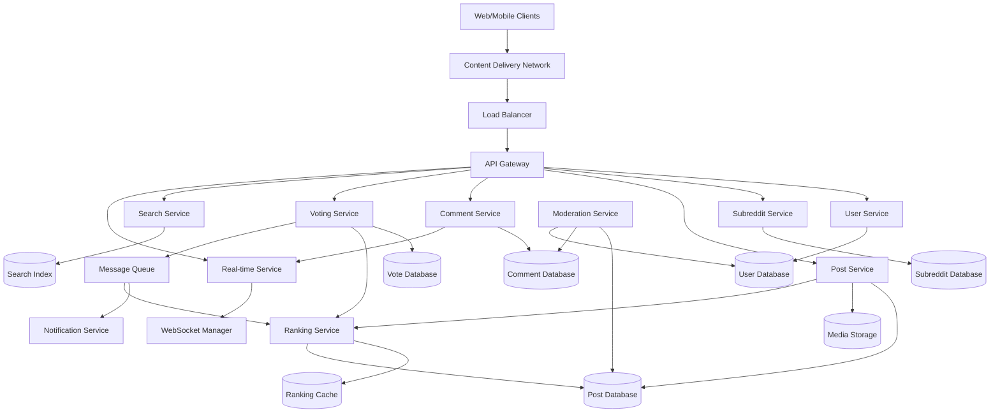
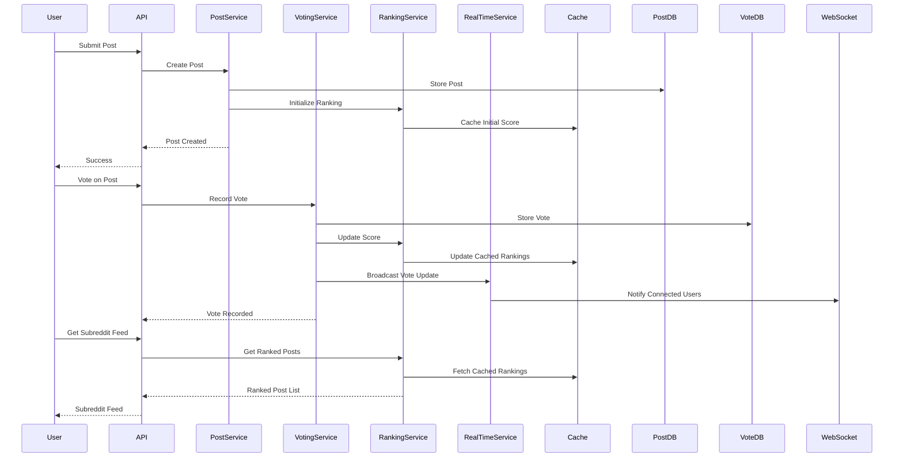

# Design Reddit Forum System - System Design Interview Problem

## Metadata
- **Difficulty**: Medium
- **Companies**: Reddit, Meta, Google, Amazon, Discord, Stack Overflow
- **Tags**: forum-system, voting-algorithm, community-moderation, real-time-updates, content-ranking
- **Estimated Time**: 
  - Reading: 25 minutes
  - Solving: 45 minutes
  - Total: 70 minutes
- **Last Updated**: 2024-08-24
- **Version**: 1.0
- **Popularity**: ⭐⭐⭐⭐⭐

## Problem Statement

### Business Context
Reddit is a community-driven discussion platform organized into topic-based communities called subreddits. Users can submit posts (text, links, images, videos), vote on content, and participate in threaded discussions. The platform's success relies on its voting system that surfaces the most relevant content and its community moderation features that maintain quality discussions.

### Core Problem
Design a scalable forum system that supports community-based discussions, democratic content ranking through voting, real-time comment threads, and distributed moderation. The system should handle millions of communities with billions of posts and comments while maintaining fast content discovery and engagement.

### User Stories
- As a user, I want to create and join communities (subreddits) so that I can participate in discussions about my interests
- As a user, I want to submit posts and comments so that I can contribute to community discussions
- As a user, I want to vote on posts and comments so that I can help surface quality content
- As a user, I want to see trending and hot content so that I can discover popular discussions
- As a moderator, I want to manage community rules and content so that I can maintain discussion quality
- As a user, I want real-time updates on active discussions so that I can participate in live conversations

## Requirements Clarification

### Functional Requirements
- [ ] Users can create and join subreddits (communities)
- [ ] Users can submit posts (text, links, images, videos) to subreddits
- [ ] Users can comment on posts and reply to comments (nested threading)
- [ ] Users can upvote/downvote posts and comments
- [ ] Users can view content sorted by hot, new, top, controversial
- [ ] Moderators can manage subreddit rules, remove content, ban users
- [ ] Users can search for posts, comments, and subreddits
- [ ] Users receive notifications for replies and mentions
- [ ] Support for real-time comment updates during active discussions

### Non-Functional Requirements
- **Scale**: 500M users, 50M daily active users, 100M posts per day, 500M comments per day
- **Performance**: Post loading < 300ms, comment loading < 200ms, voting response < 100ms
- **Availability**: 99.9% uptime, graceful degradation during peak loads
- **Consistency**: Strong consistency for votes, eventual consistency for rankings
- **Security**: Content moderation, spam prevention, vote manipulation detection

### Constraints
- [ ] Support for nested comments up to 10 levels deep
- [ ] Posts can contain text (40,000 chars), links, images (20MB), videos (1GB)
- [ ] Subreddits can have up to 25M subscribers
- [ ] Real-time updates for active discussions (>100 comments/hour)
- [ ] Support for 1M+ active subreddits

### Assumptions
- [ ] Read-heavy system (200:1 read to write ratio)
- [ ] 80% of votes happen within 24 hours of post creation
- [ ] Average post receives 50 votes and 10 comments
- [ ] Power users contribute 80% of content
- [ ] Mobile and web usage split 60/40## C
apacity Estimation

### User Metrics
| Metric | Value | Calculation |
|--------|-------|-------------|
| Total Users | 500M | Given requirement |
| Daily Active Users (DAU) | 50M | 10% of total users |
| Peak Concurrent Users | 12.5M | 25% of DAU during peak hours |
| User Growth Rate | 15% per year | Forum platform growth rate |

### Content Metrics
| Metric | Value | Calculation |
|--------|-------|-------------|
| Posts per Day | 100M | Given requirement |
| Comments per Day | 500M | Given requirement |
| Votes per Day | 2B | Posts + comments × avg votes |
| Subreddits Created per Day | 1,000 | Estimated community growth |

### Traffic Metrics
| Metric | Value | Calculation |
|--------|-------|-------------|
| Post Submissions per Second | 1,157 | 100M ÷ 86,400 |
| Comment Submissions per Second | 5,787 | 500M ÷ 86,400 |
| Vote Submissions per Second | 23,148 | 2B ÷ 86,400 |
| Page Views per Day | 10B | 50M DAU × 200 page views |
| Page View QPS (Average) | 115,741 | 10B ÷ 86,400 |
| Peak Page View QPS | 347,222 | Average × 3 |

### Storage Metrics
| Metric | Value | Calculation |
|--------|-------|-------------|
| Average Post Size | 2KB | Text + metadata |
| Average Comment Size | 500 bytes | Text + metadata |
| Daily Text Storage Growth | 450GB | (100M×2KB + 500M×500B) |
| Media Storage per Day | 2TB | Images and videos |
| Total Daily Storage Growth | 2.45TB | Text + media |
| 5-Year Storage Projection | 4.5PB | Current + 5 years growth |

### Bandwidth Estimation
| Metric | Value | Calculation |
|--------|-------|-------------|
| Peak Upload Bandwidth | 12Gbps | Content submissions |
| Peak Download Bandwidth | 868Gbps | Page views with media |
| CDN Bandwidth | 1.2Tbps | Including global distribution |

## High-Level System Design

### Architecture Overview
The system uses a microservices architecture with specialized services for community management, content ranking, and real-time features. The voting and ranking system is the core component that determines content visibility and user engagement.



### Core Components
1. **Voting Service**: Handles upvotes/downvotes and vote aggregation with anti-manipulation measures
2. **Ranking Service**: Calculates content scores and maintains sorted feeds using Reddit's ranking algorithms
3. **Comment Service**: Manages threaded discussions with real-time updates
4. **Moderation Service**: Community moderation tools and automated content filtering
5. **Real-time Service**: WebSocket connections for live comment updates and notifications
6. **Subreddit Service**: Community management, rules, and membership

### Data Flow
The system emphasizes real-time voting and ranking updates, with separate paths for content submission and consumption to handle the read-heavy workload.



## Detailed Component Design

### API Design
```yaml
# Subreddit Management
POST /api/v1/subreddits
GET /api/v1/subreddits/{subreddit_name}
POST /api/v1/subreddits/{subreddit_name}/join
DELETE /api/v1/subreddits/{subreddit_name}/leave

# Post Operations
POST /api/v1/subreddits/{subreddit_name}/posts
GET /api/v1/posts/{post_id}
PUT /api/v1/posts/{post_id}
DELETE /api/v1/posts/{post_id}

# Comment Operations
POST /api/v1/posts/{post_id}/comments
GET /api/v1/posts/{post_id}/comments?sort=best&limit=50
POST /api/v1/comments/{comment_id}/reply
GET /api/v1/comments/{comment_id}/children

# Voting
POST /api/v1/posts/{post_id}/vote
POST /api/v1/comments/{comment_id}/vote
DELETE /api/v1/posts/{post_id}/vote

# Feed Operations
GET /api/v1/subreddits/{subreddit_name}/posts?sort=hot&limit=25
GET /api/v1/user/front-page?sort=best&limit=25
GET /api/v1/subreddits/{subreddit_name}/posts?sort=top&time=day

# Moderation
POST /api/v1/subreddits/{subreddit_name}/moderate/remove
POST /api/v1/subreddits/{subreddit_name}/moderate/ban
GET /api/v1/subreddits/{subreddit_name}/modqueue

# Search
GET /api/v1/search/posts?q={query}&subreddit={name}&sort=relevance
GET /api/v1/search/subreddits?q={query}&limit=20
GET /api/v1/search/users?q={query}&limit=20

# Real-time
WebSocket /ws/posts/{post_id}/live-comments
WebSocket /ws/user/notifications
```

### Database Design

#### Subreddit Service Schema
```sql
-- Subreddits table
CREATE TABLE subreddits (
    subreddit_id BIGINT PRIMARY KEY,
    name VARCHAR(50) UNIQUE NOT NULL,
    display_name VARCHAR(100),
    description TEXT,
    rules JSON,
    subscriber_count BIGINT DEFAULT 0,
    created_by BIGINT NOT NULL,
    is_private BOOLEAN DEFAULT FALSE,
    is_nsfw BOOLEAN DEFAULT FALSE,
    created_at TIMESTAMP DEFAULT CURRENT_TIMESTAMP,
    updated_at TIMESTAMP DEFAULT CURRENT_TIMESTAMP ON UPDATE CURRENT_TIMESTAMP
);

-- Subreddit memberships
CREATE TABLE subreddit_memberships (
    user_id BIGINT,
    subreddit_id BIGINT,
    role ENUM('member', 'moderator', 'admin') DEFAULT 'member',
    joined_at TIMESTAMP DEFAULT CURRENT_TIMESTAMP,
    PRIMARY KEY (user_id, subreddit_id)
);

-- Subreddit rules and moderation
CREATE TABLE subreddit_rules (
    rule_id BIGINT PRIMARY KEY,
    subreddit_id BIGINT NOT NULL,
    title VARCHAR(200) NOT NULL,
    description TEXT,
    rule_order INT,
    created_at TIMESTAMP DEFAULT CURRENT_TIMESTAMP
);
```

#### Post Service Schema
```sql
-- Posts table
CREATE TABLE posts (
    post_id BIGINT PRIMARY KEY,
    subreddit_id BIGINT NOT NULL,
    user_id BIGINT NOT NULL,
    title VARCHAR(300) NOT NULL,
    content_type ENUM('text', 'link', 'image', 'video') NOT NULL,
    text_content TEXT,
    url VARCHAR(2000),
    media_urls JSON,
    thumbnail_url VARCHAR(500),
    upvotes INT DEFAULT 0,
    downvotes INT DEFAULT 0,
    score FLOAT DEFAULT 0, -- Calculated ranking score
    comment_count INT DEFAULT 0,
    is_nsfw BOOLEAN DEFAULT FALSE,
    is_spoiler BOOLEAN DEFAULT FALSE,
    is_removed BOOLEAN DEFAULT FALSE,
    removed_by BIGINT,
    created_at TIMESTAMP DEFAULT CURRENT_TIMESTAMP,
    updated_at TIMESTAMP DEFAULT CURRENT_TIMESTAMP ON UPDATE CURRENT_TIMESTAMP,
    
    INDEX idx_subreddit_score (subreddit_id, score DESC, created_at DESC),
    INDEX idx_subreddit_new (subreddit_id, created_at DESC),
    INDEX idx_user_posts (user_id, created_at DESC)
);
```

#### Comment Service Schema
```sql
-- Comments table (nested set model for threading)
CREATE TABLE comments (
    comment_id BIGINT PRIMARY KEY,
    post_id BIGINT NOT NULL,
    parent_comment_id BIGINT,
    user_id BIGINT NOT NULL,
    content TEXT NOT NULL,
    upvotes INT DEFAULT 0,
    downvotes INT DEFAULT 0,
    score FLOAT DEFAULT 0,
    depth INT DEFAULT 0, -- Nesting level
    thread_position INT, -- Position in thread
    is_removed BOOLEAN DEFAULT FALSE,
    removed_by BIGINT,
    created_at TIMESTAMP DEFAULT CURRENT_TIMESTAMP,
    updated_at TIMESTAMP DEFAULT CURRENT_TIMESTAMP ON UPDATE CURRENT_TIMESTAMP,
    
    INDEX idx_post_comments (post_id, thread_position),
    INDEX idx_parent_comments (parent_comment_id, score DESC),
    INDEX idx_user_comments (user_id, created_at DESC)
);

-- Comment threading helper table
CREATE TABLE comment_threads (
    comment_id BIGINT PRIMARY KEY,
    post_id BIGINT NOT NULL,
    root_comment_id BIGINT, -- Top-level comment in thread
    left_bound INT NOT NULL, -- Nested set left boundary
    right_bound INT NOT NULL, -- Nested set right boundary
    depth INT NOT NULL,
    
    INDEX idx_post_thread (post_id, left_bound),
    INDEX idx_root_thread (root_comment_id, left_bound)
);
```

#### Voting Service Schema
```sql
-- Votes table
CREATE TABLE votes (
    vote_id BIGINT PRIMARY KEY,
    user_id BIGINT NOT NULL,
    target_type ENUM('post', 'comment') NOT NULL,
    target_id BIGINT NOT NULL,
    vote_value TINYINT NOT NULL, -- -1 for downvote, 1 for upvote
    created_at TIMESTAMP DEFAULT CURRENT_TIMESTAMP,
    updated_at TIMESTAMP DEFAULT CURRENT_TIMESTAMP ON UPDATE CURRENT_TIMESTAMP,
    
    UNIQUE KEY unique_user_target (user_id, target_type, target_id),
    INDEX idx_target_votes (target_type, target_id, vote_value),
    INDEX idx_user_votes (user_id, created_at DESC)
);

-- Vote aggregations (for performance)
CREATE TABLE vote_aggregations (
    target_type ENUM('post', 'comment') NOT NULL,
    target_id BIGINT NOT NULL,
    upvotes INT DEFAULT 0,
    downvotes INT DEFAULT 0,
    score FLOAT DEFAULT 0,
    updated_at TIMESTAMP DEFAULT CURRENT_TIMESTAMP ON UPDATE CURRENT_TIMESTAMP,
    
    PRIMARY KEY (target_type, target_id)
);
```### Red
dit Ranking Algorithm Implementation

#### Hot Score Algorithm
```python
class RedditRankingService:
    def __init__(self):
        self.cache = RankingCache()
        self.vote_service = VotingService()
        
    def calculate_hot_score(self, post_id, upvotes, downvotes, created_at):
        """
        Reddit's Hot algorithm implementation
        Score = log10(max(|ups - downs|, 1)) + (sign(ups - downs) * seconds_since_epoch) / 45000
        """
        
        # Calculate vote difference
        vote_diff = upvotes - downvotes
        
        # Get the absolute value, minimum 1 to avoid log(0)
        abs_vote_diff = max(abs(vote_diff), 1)
        
        # Calculate the sign (-1, 0, or 1)
        if vote_diff > 0:
            sign = 1
        elif vote_diff < 0:
            sign = -1
        else:
            sign = 0
        
        # Calculate seconds since epoch
        epoch_seconds = created_at.timestamp()
        
        # Reddit's hot score formula
        hot_score = math.log10(abs_vote_diff) + (sign * epoch_seconds) / 45000
        
        return hot_score
    
    def calculate_best_score(self, upvotes, downvotes):
        """
        Reddit's Best algorithm (Wilson Score Confidence Interval)
        Used for comment ranking
        """
        
        total_votes = upvotes + downvotes
        if total_votes == 0:
            return 0
        
        # Positive ratio
        p = upvotes / total_votes
        
        # Wilson score confidence interval for 95% confidence
        z = 1.96  # 95% confidence
        n = total_votes
        
        # Wilson score formula
        numerator = p + (z * z) / (2 * n) - z * math.sqrt((p * (1 - p) + (z * z) / (4 * n)) / n)
        denominator = 1 + (z * z) / n
        
        return numerator / denominator
    
    def calculate_controversial_score(self, upvotes, downvotes):
        """
        Controversial score - higher when votes are close and numerous
        """
        
        total_votes = upvotes + downvotes
        if total_votes == 0:
            return 0
        
        # Balance between upvotes and downvotes (closer to 0.5 is more controversial)
        balance = 0.5 - abs(0.5 - (upvotes / total_votes))
        
        # Magnitude factor (more total votes = more controversial potential)
        magnitude = math.log10(total_votes + 1)
        
        return balance * magnitude
    
    async def update_post_rankings(self, post_id):
        """Update all ranking scores for a post"""
        
        # Get current vote counts
        vote_data = await self.vote_service.get_vote_counts(post_id)
        post_data = await self.get_post_data(post_id)
        
        # Calculate all scores
        hot_score = self.calculate_hot_score(
            post_id, 
            vote_data['upvotes'], 
            vote_data['downvotes'], 
            post_data['created_at']
        )
        
        best_score = self.calculate_best_score(
            vote_data['upvotes'], 
            vote_data['downvotes']
        )
        
        controversial_score = self.calculate_controversial_score(
            vote_data['upvotes'], 
            vote_data['downvotes']
        )
        
        # Update database
        await self.update_post_scores(post_id, {
            'hot_score': hot_score,
            'best_score': best_score,
            'controversial_score': controversial_score,
            'upvotes': vote_data['upvotes'],
            'downvotes': vote_data['downvotes']
        })
        
        # Update cached rankings
        await self.update_cached_rankings(post_data['subreddit_id'], post_id)
```

#### Real-time Ranking Updates
```python
class RankingUpdateService:
    def __init__(self):
        self.ranking_service = RedditRankingService()
        self.cache = RankingCache()
        self.message_queue = MessageQueue()
        
    async def handle_vote_update(self, vote_event):
        """Handle real-time vote updates"""
        
        target_type = vote_event['target_type']
        target_id = vote_event['target_id']
        
        if target_type == 'post':
            await self.update_post_ranking(target_id)
        elif target_type == 'comment':
            await self.update_comment_ranking(target_id)
    
    async def update_post_ranking(self, post_id):
        """Update post ranking and propagate to feeds"""
        
        # Recalculate scores
        await self.ranking_service.update_post_rankings(post_id)
        
        # Get post data
        post_data = await self.get_post_data(post_id)
        subreddit_id = post_data['subreddit_id']
        
        # Update subreddit feed rankings
        await self.update_subreddit_feed_cache(subreddit_id, post_id)
        
        # Update front page rankings if post is popular enough
        if post_data['score'] > self.get_front_page_threshold():
            await self.update_front_page_cache(post_id)
        
        # Notify real-time subscribers
        await self.notify_ranking_update(post_id, post_data['score'])
    
    async def update_subreddit_feed_cache(self, subreddit_id, post_id):
        """Update cached subreddit feed rankings"""
        
        # Get all sorting methods that need updates
        sort_methods = ['hot', 'best', 'new', 'top', 'controversial']
        
        for sort_method in sort_methods:
            cache_key = f"subreddit:{subreddit_id}:feed:{sort_method}"
            
            # Get current cached feed
            cached_feed = await self.cache.get_sorted_set(cache_key)
            
            # Get updated score for this post
            new_score = await self.get_post_score(post_id, sort_method)
            
            # Update post position in cached feed
            await self.cache.update_sorted_set_score(cache_key, post_id, new_score)
            
            # Trim to keep only top 1000 posts
            await self.cache.trim_sorted_set(cache_key, 0, 999)

class CommentThreadingService:
    def __init__(self):
        self.db = CommentDatabase()
        self.cache = CommentCache()
        
    async def add_comment(self, post_id, parent_comment_id, user_id, content):
        """Add comment with proper threading"""
        
        comment_id = generate_snowflake_id()
        
        if parent_comment_id:
            # Get parent comment threading info
            parent_thread = await self.get_comment_thread_info(parent_comment_id)
            depth = parent_thread['depth'] + 1
            
            # Find insertion point in nested set
            left_bound = parent_thread['right_bound']
            
            # Shift existing bounds to make room
            await self.shift_thread_bounds(post_id, left_bound)
            
            # Insert new comment
            right_bound = left_bound + 1
            root_comment_id = parent_thread['root_comment_id']
            
        else:
            # Top-level comment
            depth = 0
            root_comment_id = comment_id
            
            # Find position at end of post's comments
            max_bound = await self.get_max_thread_bound(post_id)
            left_bound = max_bound + 1
            right_bound = max_bound + 2
        
        # Insert comment
        await self.db.insert_comment({
            'comment_id': comment_id,
            'post_id': post_id,
            'parent_comment_id': parent_comment_id,
            'user_id': user_id,
            'content': content,
            'depth': depth
        })
        
        # Insert threading info
        await self.db.insert_comment_thread({
            'comment_id': comment_id,
            'post_id': post_id,
            'root_comment_id': root_comment_id,
            'left_bound': left_bound,
            'right_bound': right_bound,
            'depth': depth
        })
        
        # Update post comment count
        await self.increment_post_comment_count(post_id)
        
        # Invalidate cached comment tree
        await self.cache.invalidate_comment_tree(post_id)
        
        return comment_id
    
    async def get_comment_tree(self, post_id, sort_method='best', limit=500):
        """Get threaded comments for a post"""
        
        cache_key = f"comments:{post_id}:{sort_method}:{limit}"
        
        # Check cache first
        cached_tree = await self.cache.get(cache_key)
        if cached_tree:
            return cached_tree
        
        # Build comment tree from database
        comments = await self.db.get_post_comments_threaded(
            post_id, sort_method, limit
        )
        
        # Build nested structure
        comment_tree = self.build_comment_tree(comments)
        
        # Cache for 5 minutes
        await self.cache.set(cache_key, comment_tree, ttl=300)
        
        return comment_tree
    
    def build_comment_tree(self, flat_comments):
        """Convert flat comment list to nested tree structure"""
        
        comment_map = {}
        root_comments = []
        
        # First pass: create comment objects
        for comment in flat_comments:
            comment_obj = {
                'comment_id': comment['comment_id'],
                'user_id': comment['user_id'],
                'content': comment['content'],
                'score': comment['score'],
                'depth': comment['depth'],
                'created_at': comment['created_at'],
                'children': []
            }
            comment_map[comment['comment_id']] = comment_obj
        
        # Second pass: build tree structure
        for comment in flat_comments:
            comment_obj = comment_map[comment['comment_id']]
            
            if comment['parent_comment_id']:
                parent = comment_map.get(comment['parent_comment_id'])
                if parent:
                    parent['children'].append(comment_obj)
            else:
                root_comments.append(comment_obj)
        
        return root_comments
```

### Real-time Features Implementation

#### WebSocket Management
```python
class RealTimeCommentService:
    def __init__(self):
        self.websocket_manager = WebSocketManager()
        self.comment_service = CommentThreadingService()
        
    async def handle_new_comment(self, post_id, comment_data):
        """Handle new comment and broadcast to subscribers"""
        
        # Add comment to database
        comment_id = await self.comment_service.add_comment(
            post_id,
            comment_data['parent_comment_id'],
            comment_data['user_id'],
            comment_data['content']
        )
        
        # Get full comment data for broadcast
        full_comment = await self.comment_service.get_comment(comment_id)
        
        # Broadcast to all users viewing this post
        await self.websocket_manager.broadcast_to_room(
            f"post:{post_id}",
            {
                'type': 'new_comment',
                'comment': full_comment,
                'post_id': post_id
            }
        )
        
        # Send notification to parent comment author
        if comment_data['parent_comment_id']:
            parent_comment = await self.comment_service.get_comment(
                comment_data['parent_comment_id']
            )
            await self.send_reply_notification(
                parent_comment['user_id'],
                comment_id,
                post_id
            )
        
        return comment_id
    
    async def handle_vote_update(self, target_type, target_id, new_score):
        """Broadcast vote updates to real-time subscribers"""
        
        if target_type == 'post':
            # Broadcast to post viewers
            await self.websocket_manager.broadcast_to_room(
                f"post:{target_id}",
                {
                    'type': 'vote_update',
                    'target_type': 'post',
                    'target_id': target_id,
                    'new_score': new_score
                }
            )
        elif target_type == 'comment':
            # Get post_id for the comment
            comment = await self.comment_service.get_comment(target_id)
            post_id = comment['post_id']
            
            # Broadcast to post viewers
            await self.websocket_manager.broadcast_to_room(
                f"post:{post_id}",
                {
                    'type': 'vote_update',
                    'target_type': 'comment',
                    'target_id': target_id,
                    'new_score': new_score
                }
            )

class WebSocketManager:
    def __init__(self):
        self.connections = {}  # user_id -> websocket connection
        self.rooms = defaultdict(set)  # room_name -> set of user_ids
        
    async def connect_user(self, user_id, websocket):
        """Register new WebSocket connection"""
        self.connections[user_id] = websocket
        
    async def disconnect_user(self, user_id):
        """Clean up user connection"""
        if user_id in self.connections:
            del self.connections[user_id]
        
        # Remove from all rooms
        for room_users in self.rooms.values():
            room_users.discard(user_id)
    
    async def join_room(self, user_id, room_name):
        """Add user to a room (e.g., post:12345)"""
        self.rooms[room_name].add(user_id)
    
    async def leave_room(self, user_id, room_name):
        """Remove user from a room"""
        self.rooms[room_name].discard(user_id)
    
    async def broadcast_to_room(self, room_name, message):
        """Send message to all users in a room"""
        user_ids = self.rooms.get(room_name, set())
        
        # Send to all connected users in the room
        for user_id in user_ids:
            if user_id in self.connections:
                try:
                    await self.connections[user_id].send_json(message)
                except:
                    # Connection is dead, clean it up
                    await self.disconnect_user(user_id)
```

## Scaling the Design

### Bottleneck Analysis

1. **Vote Processing Bottleneck**
   - **Problem**: High volume of votes can overwhelm ranking calculations
   - **Solution**: Batch vote processing, eventual consistency for rankings
   - **Trade-offs**: Real-time accuracy vs performance

2. **Comment Threading Bottleneck**
   - **Problem**: Deep comment threads become expensive to query and update
   - **Solution**: Nested set model with caching, pagination for deep threads
   - **Trade-offs**: Query complexity vs update performance

3. **Hot Feed Generation Bottleneck**
   - **Problem**: Calculating hot scores for millions of posts is expensive
   - **Solution**: Incremental updates, pre-computed rankings, smart caching
   - **Trade-offs**: Memory usage vs computation cost

### Performance Optimizations

#### Intelligent Caching Strategy
```python
class RedditCacheStrategy:
    def __init__(self):
        self.redis = RedisCluster()
        self.cache_tiers = {
            'hot_feeds': 300,      # 5 minutes
            'comment_trees': 600,  # 10 minutes
            'user_profiles': 1800, # 30 minutes
            'subreddit_info': 3600 # 1 hour
        }
    
    async def cache_subreddit_feed(self, subreddit_id, sort_method, posts):
        """Cache subreddit feed with smart TTL"""
        
        cache_key = f"feed:{subreddit_id}:{sort_method}"
        
        # Determine TTL based on subreddit activity
        activity_level = await self.get_subreddit_activity_level(subreddit_id)
        
        if activity_level == 'high':
            ttl = 60  # 1 minute for very active subreddits
        elif activity_level == 'medium':
            ttl = 300  # 5 minutes for moderately active
        else:
            ttl = 900  # 15 minutes for less active
        
        # Cache as sorted set for easy ranking operations
        pipeline = self.redis.pipeline()
        for post in posts:
            pipeline.zadd(cache_key, {post['post_id']: post['score']})
        pipeline.expire(cache_key, ttl)
        await pipeline.execute()
    
    async def get_cached_feed(self, subreddit_id, sort_method, limit=25, offset=0):
        """Get cached feed with pagination"""
        
        cache_key = f"feed:{subreddit_id}:{sort_method}"
        
        # Get post IDs from sorted set
        post_ids = await self.redis.zrevrange(
            cache_key, offset, offset + limit - 1
        )
        
        if not post_ids:
            return None
        
        # Get full post data (may hit another cache layer)
        posts = await self.get_posts_batch(post_ids)
        
        return posts
```

## Advanced Considerations

### Security & Privacy
- **Vote Manipulation Prevention**: Rate limiting, bot detection, vote fuzzing
- **Content Moderation**: Automated spam detection, community moderation tools
- **Privacy Controls**: Anonymous posting options, data deletion capabilities
- **Anti-Brigading**: Cross-subreddit vote tracking, suspicious activity detection

### Monitoring & Observability
- **Key Metrics**: Vote processing latency, comment thread depth, cache hit ratios
- **Community Health**: Moderation queue size, user engagement rates, content quality scores
- **Performance Monitoring**: Database query performance, WebSocket connection counts
- **Business Metrics**: User retention, community growth, content creation rates

## Follow-up Questions

### Technical Deep Dives
- How would you handle vote manipulation and bot detection at scale?
- What happens when a comment thread becomes extremely deep (1000+ levels)?
- How would you implement cross-subreddit features like multireddits?
- How would you handle real-time moderation during brigading events?

### Design Variations
- How would the design change for supporting live chat rooms?
- What if we needed to support video/audio posts with transcription?
- How would you adapt this for a more privacy-focused anonymous platform?
- What changes would you make for better mobile app performance?

### Real-World Considerations
- How would you implement gradual rollout of new ranking algorithms?
- What metrics would you use to measure community health and engagement?
- How would you handle content archival and historical data access?
- How would you implement compliance with content regulations across countries?

## Learning Objectives

### Concepts Covered
- [ ] Democratic content ranking through voting systems
- [ ] Threaded discussion systems with nested comments
- [ ] Real-time updates and WebSocket management
- [ ] Community moderation and distributed governance
- [ ] Complex caching strategies for ranked content
- [ ] Vote aggregation and anti-manipulation measures

### Technologies Discussed
- [ ] Redis sorted sets for ranking and caching
- [ ] WebSocket connections for real-time features
- [ ] Nested set model for comment threading
- [ ] Message queues for asynchronous processing
- [ ] Search engines for content discovery
- [ ] CDN for media content delivery

### Design Patterns Applied
- [ ] Event-driven architecture for real-time updates
- [ ] CQRS for read/write separation in voting
- [ ] Nested set model for hierarchical data
- [ ] Multi-tier caching with intelligent TTL
- [ ] Batch processing for vote aggregation
- [ ] WebSocket room management for real-time features

## Assessment Criteria

### Excellent Answer Includes
- [ ] Comprehensive voting and ranking system with multiple algorithms
- [ ] Efficient comment threading system supporting deep nesting
- [ ] Real-time features with WebSocket management
- [ ] Scalable caching strategy for ranked content
- [ ] Community moderation and anti-manipulation measures
- [ ] Performance optimization for read-heavy workloads
- [ ] Consideration of community dynamics and user engagement

### Common Mistakes to Avoid
- [ ] Underestimating the complexity of comment threading at scale
- [ ] Not considering vote manipulation and gaming prevention
- [ ] Ignoring the real-time requirements for active discussions
- [ ] Designing overly complex ranking algorithms without justification
- [ ] Not planning for community moderation and governance features
- [ ] Overlooking the importance of caching for ranked content

### Interview Tips
- Focus on the voting and ranking system as the core differentiator
- Discuss the challenges of threaded comments and real-time updates
- Consider the community aspects and moderation requirements
- Think about the read-heavy nature and caching strategies
- Don't forget about anti-manipulation and content quality measures
- Consider the democratic nature of content curation through voting

## Related Problems
- **Design Stack Overflow**: Similar Q&A format with voting and reputation
- **Design Discord**: Real-time chat with community features
- **Design Hacker News**: Simpler voting-based content aggregation
- **Design Facebook Groups**: Community features within larger platform

## Additional Resources
- [Reddit's Ranking Algorithms Explained](https://medium.com/hacking-and-gonzo/how-reddit-ranking-algorithms-work-ef111e33d0d9)
- [Comment Threading Best Practices](https://stackoverflow.com/questions/889560/move-node-in-nested-set)
- [WebSocket Scaling Patterns](https://socket.io/docs/v4/scaling-up/)
- [Vote Aggregation at Scale](https://redditblog.com/2017/05/24/view-counting-at-reddit/)