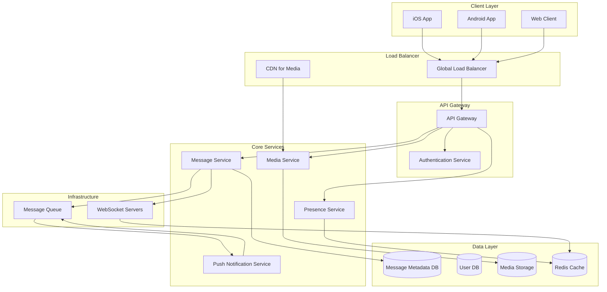
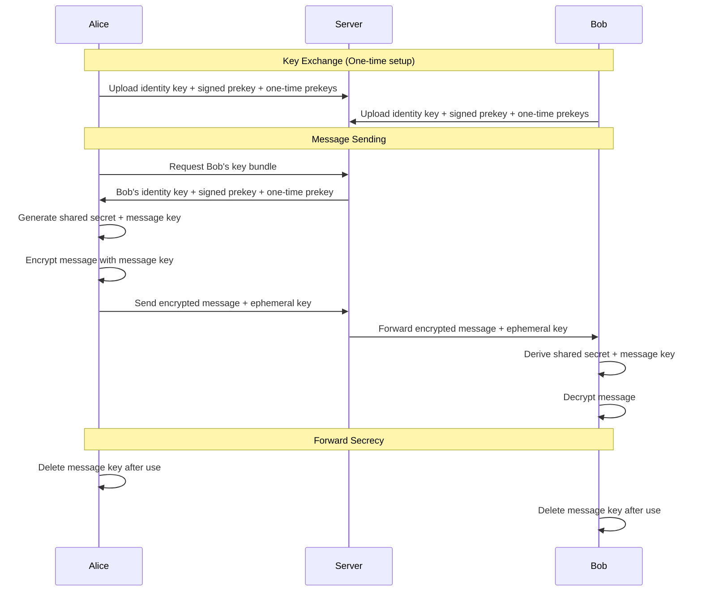
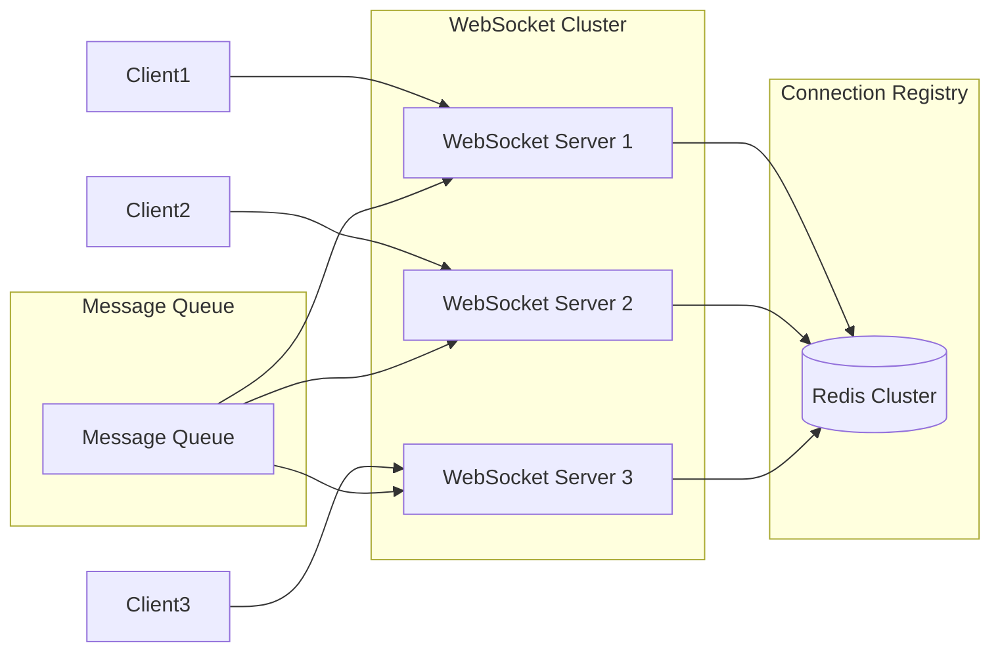
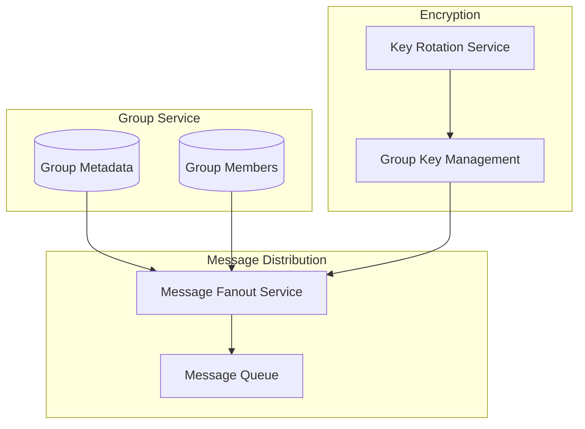
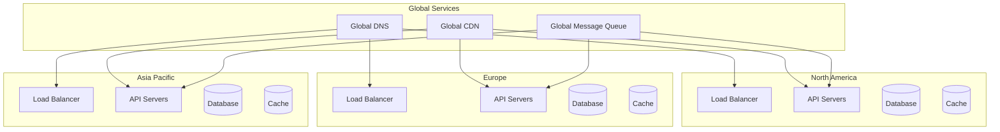

# Design WhatsApp Messaging System

## Problem Statement

Design a messaging system like WhatsApp that supports:
- Real-time messaging between users
- End-to-end encryption for security
- Group chats with up to 256 members
- Media sharing (images, videos, documents)
- Message delivery status (sent, delivered, read)
- Online/offline presence indicators
- Support for 2+ billion users globally

### Business Context

WhatsApp is one of the world's most popular messaging apps, handling over 100 billion messages daily. The system must prioritize security, reliability, and performance while maintaining a simple user experience.

### User Stories

- As a user, I want to send messages instantly to my contacts
- As a user, I want my messages to be secure and private
- As a user, I want to know when my messages are delivered and read
- As a user, I want to share photos and videos with friends
- As a user, I want to participate in group conversations

## Requirements Clarification

### Functional Requirements

1. **Core Messaging**
   - Send and receive text messages in real-time
   - Support for group chats (up to 256 members)
   - Message history and persistence
   - Message search functionality

2. **Security & Privacy**
   - End-to-end encryption for all messages
   - Forward secrecy for message keys
   - No message storage on servers (only metadata)
   - User authentication and authorization

3. **Media & Files**
   - Share images, videos, documents, and voice messages
   - Media compression and optimization
   - Media encryption and secure transfer

4. **Status & Presence**
   - Message delivery status (sent, delivered, read)
   - Online/offline presence indicators
   - Typing indicators
   - Last seen timestamps

5. **User Management**
   - User registration with phone number verification
   - Contact discovery and management
   - User profiles and settings
   - Block and report functionality

### Non-Functional Requirements

1. **Scale**
   - Support 2+ billion registered users
   - Handle 100+ billion messages per day
   - Support 1+ billion concurrent users
   - 99.9% uptime availability

2. **Performance**
   - Message delivery latency < 100ms
   - Media upload/download < 5 seconds
   - App startup time < 2 seconds
   - Efficient battery usage on mobile

3. **Security**
   - End-to-end encryption for all communications
   - Protection against man-in-the-middle attacks
   - Secure key exchange and management
   - Data privacy compliance (GDPR, etc.)

### Constraints

- Messages encrypted end-to-end (server cannot read content)
- Mobile-first design with limited bandwidth considerations
- Global deployment across multiple regions
- Integration with existing phone number system
- Compliance with various international regulations

### Assumptions

- Users have smartphones with internet connectivity
- Phone numbers are unique identifiers for users
- Most conversations are 1-on-1 (80%) vs group chats (20%)
- Average message size is 100 bytes (text)
- Average media file size is 2MB
- Users check messages multiple times per day

## Capacity Estimation

### User Metrics

```
Total Users: 2 billion
Daily Active Users (DAU): 1.5 billion (75%)
Concurrent Users: 500 million (peak)
Messages per user per day: 50
Group chat participation: 30% of users
```

### Message Volume

```
Daily Messages: 1.5B users × 50 messages = 75 billion messages/day
Peak QPS: 75B / (24 × 3600) × 3 = ~2.6 million messages/second
Group Messages: 75B × 0.3 = 22.5 billion group messages/day
Media Messages: 75B × 0.2 = 15 billion media messages/day
```

### Storage Requirements

```
Message Metadata (per message): 200 bytes
Daily Metadata: 75B × 200 bytes = 15 TB/day
Annual Metadata: 15 TB × 365 = 5.5 PB/year

Media Storage (per day): 15B × 2MB = 30 PB/day
Media Storage (annual): 30 PB × 365 = 11 EB/year
```

### Bandwidth Requirements

```
Peak Message Traffic: 2.6M messages/sec × 200 bytes = 520 MB/sec
Peak Media Traffic: 500K media/sec × 2MB = 1 TB/sec
Total Peak Bandwidth: ~1 TB/sec (ingress + egress)
```

## High-Level Architecture



## Detailed Component Design

### 1. Message Service

**Responsibilities:**
- Handle message routing and delivery
- Manage message metadata (encrypted)
- Coordinate with encryption service
- Handle group message distribution

**API Design:**
```json
POST /api/v1/messages
{
  "recipient_id": "user123",
  "encrypted_content": "base64_encrypted_message",
  "message_type": "text|image|video|document",
  "group_id": "group456", // optional for group messages
  "client_message_id": "client_uuid"
}

Response:
{
  "message_id": "msg_789",
  "timestamp": "2024-01-15T10:30:00Z",
  "status": "sent"
}
```

**Message Flow:**
1. Client encrypts message with recipient's public key
2. Message service receives encrypted message
3. Store message metadata (sender, recipient, timestamp)
4. Route message to recipient's connected devices
5. Send push notification if recipient offline
6. Update delivery status

### 2. End-to-End Encryption System

**Signal Protocol Implementation:**



**Key Management:**
- **Identity Keys**: Long-term Ed25519 keys for user identity
- **Signed Prekeys**: Medium-term keys signed by identity key
- **One-time Prekeys**: Short-term keys for perfect forward secrecy
- **Message Keys**: Ephemeral keys derived for each message

### 3. Real-time Communication

**WebSocket Connection Management:**



**Connection Registry Schema:**
```json
{
  "user_id": "user123",
  "connections": [
    {
      "device_id": "device_abc",
      "server_id": "ws_server_1",
      "connection_id": "conn_xyz",
      "last_seen": "2024-01-15T10:30:00Z",
      "status": "online"
    }
  ]
}
```

### 4. Group Chat System

**Group Management:**



**Group Message Flow:**
1. Sender encrypts message with current group key
2. Message service receives encrypted group message
3. Fanout service retrieves group member list
4. Create individual message for each member
5. Distribute messages through message queue
6. Handle delivery status aggregation

### 5. Media Processing Pipeline

```mermaid
graph LR
    subgraph "Upload"
        Client[Client App]
        Upload[Upload Service]
    end
    
    subgraph "Processing"
        Compress[Compression Service]
        Encrypt[Encryption Service]
        Thumbnail[Thumbnail Generator]
    end
    
    subgraph "Storage"
        CDN[Global CDN]
        Storage[(Object Storage)]
    end
    
    Client --> Upload
    Upload --> Compress
    Compress --> Encrypt
    Encrypt --> Thumbnail
    Thumbnail --> Storage
    Storage --> CDN
```

**Media Processing Steps:**
1. **Upload**: Chunked upload with resumability
2. **Compression**: Optimize file size while maintaining quality
3. **Encryption**: Encrypt media with message-specific keys
4. **Thumbnails**: Generate preview images/videos
5. **Storage**: Store in geographically distributed storage
6. **CDN**: Distribute through global CDN network

## Database Design

### Message Metadata Schema

```sql
-- Messages table (metadata only, content is encrypted)
CREATE TABLE messages (
    message_id UUID PRIMARY KEY,
    sender_id BIGINT NOT NULL,
    recipient_id BIGINT, -- NULL for group messages
    group_id UUID, -- NULL for direct messages
    message_type VARCHAR(20) NOT NULL, -- text, image, video, etc.
    encrypted_content BYTEA, -- encrypted message content
    media_url VARCHAR(500), -- URL for media files
    timestamp TIMESTAMP WITH TIME ZONE DEFAULT NOW(),
    client_message_id UUID, -- for deduplication
    delivery_status VARCHAR(20) DEFAULT 'sent', -- sent, delivered, read
    created_at TIMESTAMP WITH TIME ZONE DEFAULT NOW(),
    
    INDEX idx_recipient_timestamp (recipient_id, timestamp DESC),
    INDEX idx_group_timestamp (group_id, timestamp DESC),
    INDEX idx_sender_timestamp (sender_id, timestamp DESC)
);

-- Message delivery tracking
CREATE TABLE message_delivery (
    message_id UUID,
    recipient_id BIGINT,
    device_id VARCHAR(100),
    status VARCHAR(20), -- delivered, read
    timestamp TIMESTAMP WITH TIME ZONE DEFAULT NOW(),
    
    PRIMARY KEY (message_id, recipient_id, device_id),
    FOREIGN KEY (message_id) REFERENCES messages(message_id)
);

-- Group management
CREATE TABLE groups (
    group_id UUID PRIMARY KEY,
    group_name VARCHAR(100),
    creator_id BIGINT NOT NULL,
    created_at TIMESTAMP WITH TIME ZONE DEFAULT NOW(),
    updated_at TIMESTAMP WITH TIME ZONE DEFAULT NOW(),
    group_key_version INT DEFAULT 1,
    max_members INT DEFAULT 256
);

CREATE TABLE group_members (
    group_id UUID,
    user_id BIGINT,
    role VARCHAR(20) DEFAULT 'member', -- admin, member
    joined_at TIMESTAMP WITH TIME ZONE DEFAULT NOW(),
    
    PRIMARY KEY (group_id, user_id),
    FOREIGN KEY (group_id) REFERENCES groups(group_id)
);
```

### User and Device Management

```sql
-- Users table
CREATE TABLE users (
    user_id BIGINT PRIMARY KEY,
    phone_number VARCHAR(20) UNIQUE NOT NULL,
    username VARCHAR(50),
    profile_picture_url VARCHAR(500),
    public_key BYTEA NOT NULL, -- for encryption
    identity_key BYTEA NOT NULL,
    signed_prekey BYTEA NOT NULL,
    registration_timestamp TIMESTAMP WITH TIME ZONE DEFAULT NOW(),
    last_seen TIMESTAMP WITH TIME ZONE,
    status VARCHAR(20) DEFAULT 'offline', -- online, offline, away
    
    INDEX idx_phone_number (phone_number)
);

-- Device management for multi-device support
CREATE TABLE user_devices (
    device_id VARCHAR(100) PRIMARY KEY,
    user_id BIGINT NOT NULL,
    device_type VARCHAR(20), -- ios, android, web
    push_token VARCHAR(500), -- for notifications
    public_key BYTEA NOT NULL,
    last_active TIMESTAMP WITH TIME ZONE DEFAULT NOW(),
    
    FOREIGN KEY (user_id) REFERENCES users(user_id),
    INDEX idx_user_devices (user_id)
);

-- One-time prekeys for forward secrecy
CREATE TABLE one_time_prekeys (
    key_id UUID PRIMARY KEY,
    user_id BIGINT NOT NULL,
    device_id VARCHAR(100) NOT NULL,
    prekey BYTEA NOT NULL,
    created_at TIMESTAMP WITH TIME ZONE DEFAULT NOW(),
    used_at TIMESTAMP WITH TIME ZONE,
    
    FOREIGN KEY (user_id) REFERENCES users(user_id),
    INDEX idx_user_unused_keys (user_id, used_at) WHERE used_at IS NULL
);
```

## Scaling Strategies

### 1. Database Sharding

**Sharding Strategy:**
```python
# Shard by user_id for direct messages
def get_message_shard(user_id):
    return user_id % NUM_SHARDS

# Shard by group_id for group messages  
def get_group_shard(group_id):
    return hash(group_id) % NUM_SHARDS

# Cross-shard queries handled by application layer
def get_user_messages(user_id, limit=50):
    shard = get_message_shard(user_id)
    db = get_database_connection(shard)
    return db.query("""
        SELECT * FROM messages 
        WHERE recipient_id = %s OR sender_id = %s
        ORDER BY timestamp DESC 
        LIMIT %s
    """, user_id, user_id, limit)
```

### 2. Caching Strategy

**Multi-level Caching:**
```python
# L1: Application-level cache (in-memory)
# L2: Redis cluster (distributed cache)
# L3: Database (persistent storage)

class MessageCache:
    def get_recent_messages(self, user_id, limit=20):
        # Try L1 cache first
        cache_key = f"recent_messages:{user_id}"
        messages = self.local_cache.get(cache_key)
        
        if not messages:
            # Try L2 cache (Redis)
            messages = self.redis.get(cache_key)
            
            if not messages:
                # Fallback to database
                messages = self.db.get_recent_messages(user_id, limit)
                # Cache for 5 minutes
                self.redis.setex(cache_key, 300, messages)
            
            # Cache locally for 1 minute
            self.local_cache.set(cache_key, messages, ttl=60)
        
        return messages
```

### 3. Geographic Distribution

**Regional Deployment:**


## Security Considerations

### 1. End-to-End Encryption Implementation

**Signal Protocol Components:**
```python
class SignalProtocol:
    def __init__(self):
        self.identity_key = self.generate_identity_key()
        self.signed_prekey = self.generate_signed_prekey()
        self.one_time_prekeys = self.generate_one_time_prekeys(100)
    
    def encrypt_message(self, recipient_public_key, message):
        # Generate ephemeral key pair
        ephemeral_key = self.generate_ephemeral_key()
        
        # Perform ECDH key agreement
        shared_secret = self.ecdh(ephemeral_key.private, recipient_public_key)
        
        # Derive message key using HKDF
        message_key = self.hkdf(shared_secret, "message_key")
        
        # Encrypt message with AES-256-GCM
        encrypted_message = self.aes_encrypt(message, message_key)
        
        return {
            'ephemeral_public_key': ephemeral_key.public,
            'encrypted_content': encrypted_message,
            'mac': self.hmac(encrypted_message, message_key)
        }
    
    def decrypt_message(self, sender_ephemeral_key, encrypted_data):
        # Perform ECDH with sender's ephemeral key
        shared_secret = self.ecdh(self.identity_key.private, sender_ephemeral_key)
        
        # Derive message key
        message_key = self.hkdf(shared_secret, "message_key")
        
        # Verify MAC
        if not self.verify_hmac(encrypted_data['encrypted_content'], 
                               encrypted_data['mac'], message_key):
            raise SecurityError("Message authentication failed")
        
        # Decrypt message
        return self.aes_decrypt(encrypted_data['encrypted_content'], message_key)
```

### 2. Key Management and Rotation

**Prekey Management:**
```python
class PrekeyManager:
    def __init__(self, user_id):
        self.user_id = user_id
        self.min_prekeys = 50  # Minimum prekeys to maintain
    
    def replenish_prekeys(self):
        current_count = self.get_unused_prekey_count()
        
        if current_count < self.min_prekeys:
            new_prekeys = self.generate_one_time_prekeys(100)
            self.upload_prekeys_to_server(new_prekeys)
    
    def consume_prekey(self, key_id):
        # Mark prekey as used (one-time use only)
        self.mark_prekey_used(key_id)
        
        # Trigger prekey replenishment if needed
        self.replenish_prekeys()
```

## Performance Optimizations

### 1. Message Delivery Optimization

**Batch Processing:**
```python
class MessageBatcher:
    def __init__(self, batch_size=100, flush_interval=50):  # 50ms
        self.batch_size = batch_size
        self.flush_interval = flush_interval
        self.pending_messages = []
        self.last_flush = time.time()
    
    def add_message(self, message):
        self.pending_messages.append(message)
        
        # Flush if batch is full or time interval exceeded
        if (len(self.pending_messages) >= self.batch_size or 
            time.time() - self.last_flush > self.flush_interval):
            self.flush_batch()
    
    def flush_batch(self):
        if self.pending_messages:
            self.process_message_batch(self.pending_messages)
            self.pending_messages.clear()
            self.last_flush = time.time()
```

### 2. Connection Pooling and Load Balancing

**WebSocket Load Balancing:**
```python
class WebSocketLoadBalancer:
    def __init__(self):
        self.servers = self.discover_websocket_servers()
        self.connection_counts = {}
    
    def get_optimal_server(self, user_id):
        # Consistent hashing for sticky sessions
        hash_value = hash(user_id) % len(self.servers)
        preferred_server = self.servers[hash_value]
        
        # Check server health and capacity
        if self.is_server_healthy(preferred_server):
            return preferred_server
        
        # Fallback to least loaded server
        return min(self.servers, 
                  key=lambda s: self.connection_counts.get(s, 0))
```

## Monitoring and Observability

### Key Metrics to Track

**System Metrics:**
- Message delivery latency (p50, p95, p99)
- WebSocket connection count and churn rate
- Database query performance and connection pool usage
- Cache hit rates and memory usage
- API response times and error rates

**Business Metrics:**
- Daily/Monthly Active Users (DAU/MAU)
- Messages sent per user per day
- Group chat participation rates
- Media sharing frequency
- User retention and engagement

**Security Metrics:**
- Failed authentication attempts
- Encryption/decryption performance
- Key rotation frequency
- Suspicious activity detection

### Alerting Strategy

```python
# Example monitoring configuration
ALERTS = {
    'message_delivery_latency': {
        'threshold': '500ms',
        'condition': 'p95 > threshold for 5 minutes',
        'severity': 'high'
    },
    'websocket_connection_failures': {
        'threshold': '5%',
        'condition': 'error_rate > threshold for 2 minutes',
        'severity': 'critical'
    },
    'database_connection_pool': {
        'threshold': '80%',
        'condition': 'utilization > threshold for 3 minutes',
        'severity': 'medium'
    }
}
```

## Follow-up Questions

### Technical Deep Dives

1. **How would you handle message ordering in group chats with high concurrency?**
   - Implement vector clocks or logical timestamps
   - Use consensus algorithms for total ordering
   - Consider eventual consistency with conflict resolution

2. **How would you implement message search across encrypted content?**
   - Client-side indexing with encrypted search tokens
   - Homomorphic encryption for server-side search
   - Metadata-based search (sender, timestamp, media type)

3. **How would you handle network partitions and offline scenarios?**
   - Message queuing with persistent storage
   - Conflict resolution for concurrent edits
   - Sync protocols for reconnection

### Scaling Challenges

4. **How would you optimize for regions with poor network connectivity?**
   - Implement message compression and delta sync
   - Use adaptive quality for media based on bandwidth
   - Implement store-and-forward for intermittent connectivity

5. **How would you handle celebrity users with millions of followers?**
   - Implement fan-out strategies (push vs pull)
   - Use message broadcasting and caching
   - Rate limiting and priority queuing

### Security Considerations

6. **How would you detect and prevent spam or abuse?**
   - Machine learning models for content analysis
   - Rate limiting and reputation systems
   - User reporting and moderation tools

7. **How would you handle key compromise scenarios?**
   - Implement key rotation and revocation
   - Forward secrecy to limit damage
   - Security incident response procedures

This WhatsApp-like messaging system design demonstrates the complexity of building secure, scalable real-time communication platforms while maintaining user privacy and system performance.