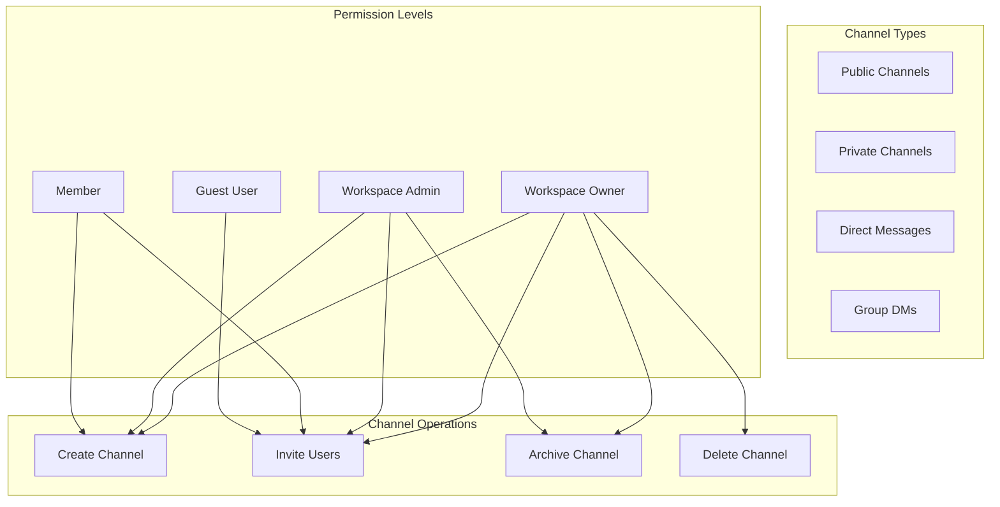
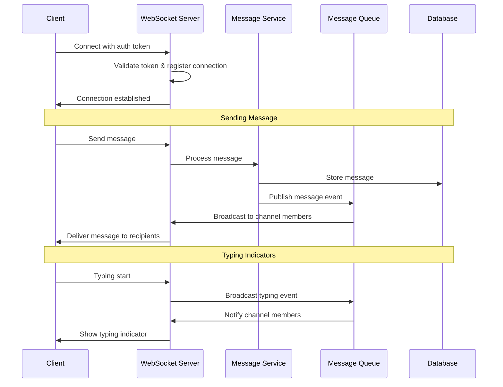
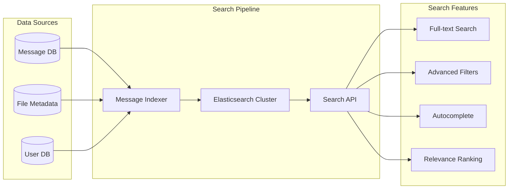
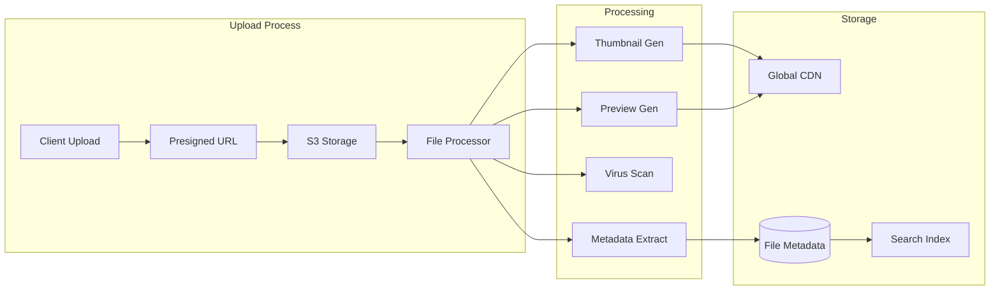
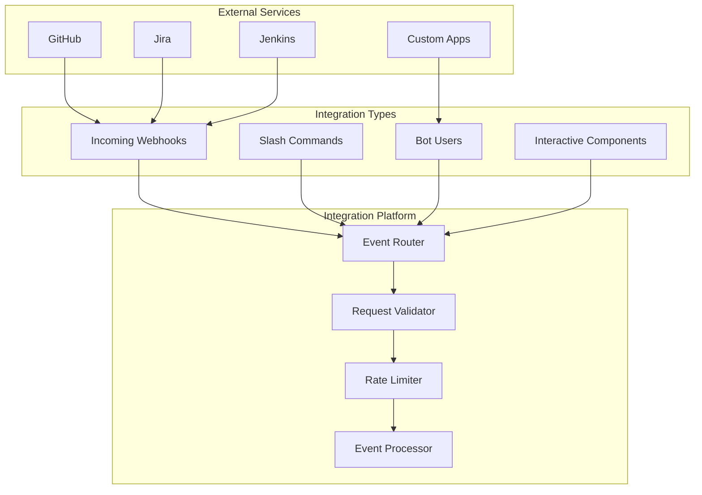

# Design Slack Team Communication System

## Problem Statement

Design a team communication platform like Slack that supports:
- Real-time messaging in channels and direct messages
- File sharing and integrations with external services
- Voice and video calls within teams
- Search across all messages and files
- Threaded conversations and message reactions
- Workspace management with different permission levels
- Support for millions of teams and users globally

### Business Context

Slack revolutionized workplace communication by organizing conversations into channels, enabling integrations, and providing powerful search capabilities. The system must handle enterprise-scale deployments while maintaining real-time responsiveness and reliability.

### User Stories

- As a team member, I want to communicate in organized channels
- As a project manager, I want to create channels for different projects
- As a developer, I want to integrate tools and receive notifications
- As an admin, I want to manage workspace permissions and settings
- As a user, I want to search through message history quickly

## Requirements Clarification

### Functional Requirements

1. **Messaging & Communication**
   - Real-time messaging in channels and DMs
   - Threaded conversations and replies
   - Message reactions and emoji support
   - Message formatting (bold, italic, code blocks)
   - Message editing and deletion

2. **Channel Management**
   - Public and private channels
   - Channel creation, archiving, and management
   - User invitation and permission management
   - Channel topics and descriptions

3. **File Sharing & Media**
   - File upload and sharing (documents, images, videos)
   - File preview and thumbnail generation
   - Integration with cloud storage (Google Drive, Dropbox)
   - Screen sharing and video calls

4. **Search & Discovery**
   - Full-text search across messages and files
   - Advanced search filters (date, user, channel)
   - Message indexing and relevance ranking
   - Search result highlighting

5. **Integrations & Bots**
   - Third-party app integrations (GitHub, Jira, etc.)
   - Custom bot development and deployment
   - Webhook support for external notifications
   - Slash commands and interactive elements

6. **Workspace Management**
   - Multi-workspace support for organizations
   - User roles and permissions (admin, member, guest)
   - Workspace settings and customization
   - Single Sign-On (SSO) integration

### Non-Functional Requirements

1. **Scale**
   - Support 10+ million teams globally
   - Handle 500+ million messages per day
   - Support workspaces with 500,000+ members
   - 99.99% uptime availability

2. **Performance**
   - Message delivery latency < 100ms
   - Search response time < 200ms
   - File upload speed > 10 MB/s
   - Real-time typing indicators

3. **Security**
   - Enterprise-grade security and compliance
   - Data encryption in transit and at rest
   - Audit logs and compliance reporting
   - GDPR and SOC 2 compliance
##
# Constraints

- Enterprise customers require on-premises deployment options
- Integration with existing enterprise identity systems
- Compliance with various industry regulations
- Support for multiple time zones and languages

### Assumptions

- Most teams have 10-50 members (80% of workspaces)
- Average message length is 50 characters
- 20% of messages include file attachments
- Users are active during business hours in their timezone
- Search queries are frequent (10% of user actions)

## Capacity Estimation

### User Metrics

```
Total Teams: 10 million
Average Team Size: 25 members
Total Users: 250 million
Daily Active Users: 50 million (20%)
Concurrent Users: 5 million (peak)
Messages per user per day: 100
```

### Message Volume

```
Daily Messages: 50M users × 100 messages = 5 billion messages/day
Peak QPS: 5B / (8 hours × 3600) × 3 = ~520,000 messages/second
File Uploads: 5B × 0.2 = 1 billion files/day
Search Queries: 50M users × 10 searches = 500 million searches/day
```

### Storage Requirements

```
Message Storage (per message): 500 bytes average
Daily Message Storage: 5B × 500 bytes = 2.5 TB/day
Annual Message Storage: 2.5 TB × 365 = 912 TB/year

File Storage (per day): 1B files × 5MB average = 5 PB/day
File Storage (annual): 5 PB × 365 = 1.8 EB/year

Search Index: ~30% of message storage = 274 TB/year
```

### Bandwidth Requirements

```
Peak Message Traffic: 520K messages/sec × 500 bytes = 260 MB/sec
Peak File Traffic: 100K files/sec × 5MB = 500 GB/sec
Search Traffic: 5K searches/sec × 10KB response = 50 MB/sec
Total Peak Bandwidth: ~500 GB/sec
```

## High-Level Architecture

```mermaid
graph TB
    subgraph "Client Layer"
        Desktop[Desktop App]
        Mobile[Mobile App]
        Web[Web Client]
    end
    
    subgraph "CDN & Load Balancing"
        CDN[Global CDN]
        LB[Load Balancer]
        Gateway[API Gateway]
    end
    
    subgraph "Core Services"
        MessageService[Message Service]
        ChannelService[Channel Service]
        UserService[User Service]
        SearchService[Search Service]
        FileService[File Service]
        NotificationService[Notification Service]
        IntegrationService[Integration Service]
    end
    
    subgraph "Real-time Layer"
        WebSocket[WebSocket Servers]
        MessageQueue[Message Queue]
        EventBus[Event Bus]
    end
    
    subgraph "Data Layer"
        MessageDB[(Message DB)]
        UserDB[(User DB)]
        FileStorage[(File Storage)]
        SearchIndex[(Search Index)]
        Cache[(Redis Cache)]
    end
    
    Desktop --> CDN
    Mobile --> CDN
    Web --> CDN
    
    CDN --> LB
    LB --> Gateway
    
    Gateway --> MessageService
    Gateway --> ChannelService
    Gateway --> UserService
    Gateway --> SearchService
    Gateway --> FileService
    
    MessageService --> MessageDB
    MessageService --> WebSocket
    MessageService --> MessageQueue
    
    SearchService --> SearchIndex
    FileService --> FileStorage
    
    WebSocket --> Cache
    MessageQueue --> NotificationService
    EventBus --> IntegrationService
```##
 Detailed Component Design

### 1. Message Service

**Core Responsibilities:**
- Handle message creation, editing, and deletion
- Manage threaded conversations
- Coordinate message delivery across channels
- Handle message reactions and formatting

**API Design:**
```json
POST /api/v1/messages
{
  "channel_id": "C1234567890",
  "text": "Hello team! 👋",
  "thread_ts": "1642781234.123456", // optional for threaded replies
  "attachments": [
    {
      "type": "file",
      "file_id": "F9876543210"
    }
  ],
  "formatting": {
    "bold": [[0, 5]], // "Hello" is bold
    "mentions": [
      {"user_id": "U1111111111", "start": 6, "end": 10}
    ]
  }
}

Response:
{
  "message_id": "M1642781234123456",
  "timestamp": "1642781234.123456",
  "channel_id": "C1234567890",
  "user_id": "U2222222222",
  "text": "Hello team! 👋",
  "thread_ts": null,
  "reply_count": 0,
  "reactions": [],
  "edited": false
}
```

### 2. Channel Management System

**Channel Types and Permissions:**



**Channel Schema:**
```sql
CREATE TABLE channels (
    channel_id VARCHAR(20) PRIMARY KEY,
    workspace_id VARCHAR(20) NOT NULL,
    name VARCHAR(80) NOT NULL,
    topic VARCHAR(250),
    purpose VARCHAR(250),
    is_private BOOLEAN DEFAULT FALSE,
    is_archived BOOLEAN DEFAULT FALSE,
    created_by VARCHAR(20) NOT NULL,
    created_at TIMESTAMP DEFAULT NOW(),
    updated_at TIMESTAMP DEFAULT NOW(),
    
    INDEX idx_workspace_channels (workspace_id, is_archived),
    INDEX idx_channel_name (workspace_id, name)
);

CREATE TABLE channel_members (
    channel_id VARCHAR(20),
    user_id VARCHAR(20),
    role VARCHAR(20) DEFAULT 'member', -- admin, member
    joined_at TIMESTAMP DEFAULT NOW(),
    last_read_ts DECIMAL(16,6), -- timestamp of last read message
    
    PRIMARY KEY (channel_id, user_id),
    FOREIGN KEY (channel_id) REFERENCES channels(channel_id)
);
```#
## 3. Real-time Communication System

**WebSocket Connection Management:**



**Connection Registry:**
```python
class ConnectionRegistry:
    def __init__(self):
        self.redis = Redis()
        self.connections = {}  # local server connections
    
    def register_connection(self, user_id, connection_id, server_id):
        # Store in Redis for cross-server lookup
        self.redis.hset(
            f"user_connections:{user_id}",
            connection_id,
            json.dumps({
                'server_id': server_id,
                'connected_at': time.time(),
                'channels': []
            })
        )
        
        # Store locally for fast access
        self.connections[connection_id] = {
            'user_id': user_id,
            'channels': set(),
            'last_activity': time.time()
        }
    
    def subscribe_to_channel(self, connection_id, channel_id):
        if connection_id in self.connections:
            self.connections[connection_id]['channels'].add(channel_id)
            
            # Update Redis
            user_id = self.connections[connection_id]['user_id']
            conn_data = self.redis.hget(f"user_connections:{user_id}", connection_id)
            if conn_data:
                data = json.loads(conn_data)
                data['channels'].append(channel_id)
                self.redis.hset(f"user_connections:{user_id}", connection_id, json.dumps(data))
```

### 4. Search System

**Elasticsearch-based Search Architecture:**



**Search Index Schema:**
```json
{
  "mappings": {
    "properties": {
      "message_id": {"type": "keyword"},
      "workspace_id": {"type": "keyword"},
      "channel_id": {"type": "keyword"},
      "user_id": {"type": "keyword"},
      "text": {
        "type": "text",
        "analyzer": "standard",
        "fields": {
          "keyword": {"type": "keyword"},
          "suggest": {"type": "completion"}
        }
      },
      "timestamp": {"type": "date"},
      "thread_ts": {"type": "keyword"},
      "has_attachments": {"type": "boolean"},
      "file_types": {"type": "keyword"},
      "mentions": {"type": "keyword"},
      "reactions": {"type": "keyword"},
      "channel_name": {"type": "keyword"},
      "user_name": {"type": "text"}
    }
  }
}
```**Sear
ch Query Processing:**
```python
class SearchService:
    def __init__(self):
        self.es = Elasticsearch()
    
    def search_messages(self, workspace_id, query, filters=None, limit=20):
        search_body = {
            "query": {
                "bool": {
                    "must": [
                        {"term": {"workspace_id": workspace_id}},
                        {
                            "multi_match": {
                                "query": query,
                                "fields": ["text^2", "channel_name", "user_name"],
                                "type": "best_fields",
                                "fuzziness": "AUTO"
                            }
                        }
                    ],
                    "filter": self._build_filters(filters)
                }
            },
            "highlight": {
                "fields": {
                    "text": {"pre_tags": ["<mark>"], "post_tags": ["</mark>"]}
                }
            },
            "sort": [
                {"_score": {"order": "desc"}},
                {"timestamp": {"order": "desc"}}
            ],
            "size": limit
        }
        
        return self.es.search(index="messages", body=search_body)
    
    def _build_filters(self, filters):
        filter_clauses = []
        
        if filters:
            if 'channel_id' in filters:
                filter_clauses.append({"term": {"channel_id": filters['channel_id']}})
            
            if 'user_id' in filters:
                filter_clauses.append({"term": {"user_id": filters['user_id']}})
            
            if 'date_range' in filters:
                filter_clauses.append({
                    "range": {
                        "timestamp": {
                            "gte": filters['date_range']['start'],
                            "lte": filters['date_range']['end']
                        }
                    }
                })
            
            if 'has_attachments' in filters:
                filter_clauses.append({"term": {"has_attachments": filters['has_attachments']}})
        
        return filter_clauses
```

### 5. File Storage and Processing

**File Upload Pipeline:**



**File Processing Service:**
```python
class FileProcessor:
    def __init__(self):
        self.s3 = boto3.client('s3')
        self.thumbnail_generator = ThumbnailGenerator()
        self.virus_scanner = VirusScanner()
        self.metadata_extractor = MetadataExtractor()
    
    def process_file(self, file_id, s3_key, file_type):
        try:
            # Download file for processing
            file_content = self.s3.get_object(Bucket='slack-files', Key=s3_key)
            
            # Virus scan
            if not self.virus_scanner.is_safe(file_content):
                self.mark_file_as_malicious(file_id)
                return
            
            # Generate thumbnails for images/videos
            if file_type in ['image', 'video']:
                thumbnail_url = self.thumbnail_generator.create_thumbnail(
                    file_content, file_type
                )
                self.update_file_metadata(file_id, {'thumbnail_url': thumbnail_url})
            
            # Extract metadata
            metadata = self.metadata_extractor.extract(file_content, file_type)
            self.update_file_metadata(file_id, metadata)
            
            # Generate preview for documents
            if file_type == 'document':
                preview_url = self.generate_document_preview(file_content)
                self.update_file_metadata(file_id, {'preview_url': preview_url})
            
            # Mark as processed
            self.mark_file_as_processed(file_id)
            
        except Exception as e:
            self.mark_file_as_failed(file_id, str(e))
            raise
```#
## 6. Integration Platform

**Webhook and Bot Framework:**



**Integration Event Processing:**
```python
class IntegrationService:
    def __init__(self):
        self.event_router = EventRouter()
        self.rate_limiter = RateLimiter()
        self.message_service = MessageService()
    
    def process_webhook(self, app_id, webhook_data):
        # Validate webhook signature
        if not self.validate_webhook_signature(app_id, webhook_data):
            raise SecurityError("Invalid webhook signature")
        
        # Rate limiting
        if not self.rate_limiter.allow_request(app_id):
            raise RateLimitError("Rate limit exceeded")
        
        # Route to appropriate handler
        event_type = webhook_data.get('type')
        handler = self.event_router.get_handler(app_id, event_type)
        
        if handler:
            return handler.process(webhook_data)
        else:
            raise ValueError(f"No handler for event type: {event_type}")
    
    def process_slash_command(self, command, user_id, channel_id, text):
        # Find registered command handler
        handler = self.get_command_handler(command)
        
        if not handler:
            return {"text": f"Unknown command: {command}"}
        
        # Execute command
        response = handler.execute(user_id, channel_id, text)
        
        # Post response to channel if needed
        if response.get('response_type') == 'in_channel':
            self.message_service.post_message(
                channel_id=channel_id,
                text=response['text'],
                user_id='bot'
            )
        
        return response
```

## Database Design

### Message Storage Schema

```sql
-- Messages table with partitioning by date
CREATE TABLE messages (
    message_id VARCHAR(20) PRIMARY KEY,
    workspace_id VARCHAR(20) NOT NULL,
    channel_id VARCHAR(20) NOT NULL,
    user_id VARCHAR(20) NOT NULL,
    text TEXT,
    timestamp DECIMAL(16,6) NOT NULL, -- Unix timestamp with microseconds
    thread_ts DECIMAL(16,6), -- Parent message timestamp for threads
    reply_count INT DEFAULT 0,
    edited_at TIMESTAMP,
    deleted_at TIMESTAMP,
    message_type VARCHAR(20) DEFAULT 'message', -- message, file_share, etc.
    
    INDEX idx_channel_timestamp (channel_id, timestamp DESC),
    INDEX idx_thread_messages (thread_ts, timestamp ASC),
    INDEX idx_user_messages (user_id, timestamp DESC),
    INDEX idx_workspace_messages (workspace_id, timestamp DESC)
) PARTITION BY RANGE (YEAR(FROM_UNIXTIME(timestamp))) (
    PARTITION p2023 VALUES LESS THAN (2024),
    PARTITION p2024 VALUES LESS THAN (2025),
    PARTITION p2025 VALUES LESS THAN (2026)
);

-- Message reactions
CREATE TABLE message_reactions (
    message_id VARCHAR(20),
    user_id VARCHAR(20),
    emoji VARCHAR(50),
    created_at TIMESTAMP DEFAULT NOW(),
    
    PRIMARY KEY (message_id, user_id, emoji),
    FOREIGN KEY (message_id) REFERENCES messages(message_id)
);

-- Message attachments
CREATE TABLE message_attachments (
    attachment_id VARCHAR(20) PRIMARY KEY,
    message_id VARCHAR(20) NOT NULL,
    file_id VARCHAR(20),
    attachment_type VARCHAR(20), -- file, link, etc.
    metadata JSON,
    
    FOREIGN KEY (message_id) REFERENCES messages(message_id),
    INDEX idx_message_attachments (message_id)
);
```### Wo
rkspace and User Management

```sql
-- Workspaces
CREATE TABLE workspaces (
    workspace_id VARCHAR(20) PRIMARY KEY,
    name VARCHAR(80) NOT NULL,
    domain VARCHAR(100) UNIQUE,
    created_at TIMESTAMP DEFAULT NOW(),
    plan_type VARCHAR(20) DEFAULT 'free', -- free, pro, enterprise
    settings JSON,
    
    INDEX idx_domain (domain)
);

-- Workspace members
CREATE TABLE workspace_members (
    workspace_id VARCHAR(20),
    user_id VARCHAR(20),
    role VARCHAR(20) DEFAULT 'member', -- owner, admin, member, guest
    status VARCHAR(20) DEFAULT 'active', -- active, deactivated, pending
    joined_at TIMESTAMP DEFAULT NOW(),
    invited_by VARCHAR(20),
    
    PRIMARY KEY (workspace_id, user_id),
    FOREIGN KEY (workspace_id) REFERENCES workspaces(workspace_id),
    INDEX idx_user_workspaces (user_id)
);

-- Users
CREATE TABLE users (
    user_id VARCHAR(20) PRIMARY KEY,
    email VARCHAR(255) UNIQUE NOT NULL,
    username VARCHAR(50),
    display_name VARCHAR(80),
    avatar_url VARCHAR(500),
    timezone VARCHAR(50),
    status VARCHAR(20) DEFAULT 'active',
    created_at TIMESTAMP DEFAULT NOW(),
    last_active_at TIMESTAMP,
    
    INDEX idx_email (email),
    INDEX idx_username (username)
);
```

## Scaling Strategies

### 1. Database Sharding

**Sharding by Workspace:**
```python
class WorkspaceSharding:
    def __init__(self, num_shards=64):
        self.num_shards = num_shards
    
    def get_shard(self, workspace_id):
        # Consistent hashing based on workspace_id
        return hash(workspace_id) % self.num_shards
    
    def get_database_connection(self, workspace_id):
        shard_id = self.get_shard(workspace_id)
        return self.connection_pool.get_connection(f"shard_{shard_id}")
    
    def execute_query(self, workspace_id, query, params):
        db = self.get_database_connection(workspace_id)
        return db.execute(query, params)
```

### 2. Message Archival Strategy

**Hot/Warm/Cold Storage:**
```python
class MessageArchival:
    def __init__(self):
        self.hot_storage = MySQLCluster()  # Last 30 days
        self.warm_storage = PostgreSQL()   # 30 days - 1 year
        self.cold_storage = S3()          # > 1 year
    
    def get_messages(self, channel_id, start_time, end_time):
        messages = []
        
        # Check hot storage first
        if self.is_recent(start_time, days=30):
            messages.extend(
                self.hot_storage.get_messages(channel_id, start_time, end_time)
            )
        
        # Check warm storage if needed
        if self.overlaps_timerange(start_time, end_time, days_ago=30, days_ago_end=365):
            messages.extend(
                self.warm_storage.get_messages(channel_id, start_time, end_time)
            )
        
        # Check cold storage if needed
        if self.is_older_than(start_time, days=365):
            messages.extend(
                self.cold_storage.get_messages(channel_id, start_time, end_time)
            )
        
        return sorted(messages, key=lambda m: m.timestamp)
```

### 3. Caching Strategy

**Multi-level Caching:**
```python
class SlackCacheManager:
    def __init__(self):
        self.l1_cache = {}  # In-memory cache
        self.l2_cache = Redis()  # Distributed cache
        self.l3_cache = Memcached()  # Large object cache
    
    def get_channel_messages(self, channel_id, limit=50):
        cache_key = f"channel_messages:{channel_id}:{limit}"
        
        # L1: Check in-memory cache
        messages = self.l1_cache.get(cache_key)
        if messages:
            return messages
        
        # L2: Check Redis
        messages = self.l2_cache.get(cache_key)
        if messages:
            self.l1_cache[cache_key] = messages
            return messages
        
        # L3: Check Memcached
        messages = self.l3_cache.get(cache_key)
        if messages:
            self.l2_cache.setex(cache_key, 300, messages)  # 5 min TTL
            self.l1_cache[cache_key] = messages
            return messages
        
        # Fallback to database
        messages = self.database.get_channel_messages(channel_id, limit)
        
        # Cache at all levels
        self.l3_cache.set(cache_key, messages, ttl=3600)  # 1 hour
        self.l2_cache.setex(cache_key, 300, messages)     # 5 min
        self.l1_cache[cache_key] = messages               # No TTL
        
        return messages
```## Pe
rformance Optimizations

### 1. Message Delivery Optimization

**Fan-out Strategies:**
```python
class MessageFanout:
    def __init__(self):
        self.message_queue = MessageQueue()
        self.websocket_manager = WebSocketManager()
    
    def deliver_message(self, message, channel_id):
        # Get channel members
        members = self.get_channel_members(channel_id)
        
        if len(members) < 100:
            # Small channels: immediate push
            self.push_to_members(message, members)
        else:
            # Large channels: queue-based delivery
            self.queue_message_delivery(message, members)
    
    def push_to_members(self, message, members):
        for member in members:
            # Check if user is online
            if self.websocket_manager.is_user_online(member.user_id):
                self.websocket_manager.send_message(member.user_id, message)
            else:
                # Queue for when user comes online
                self.queue_offline_message(member.user_id, message)
    
    def queue_message_delivery(self, message, members):
        # Batch members into groups for processing
        batch_size = 50
        for i in range(0, len(members), batch_size):
            batch = members[i:i + batch_size]
            self.message_queue.publish('message_delivery', {
                'message': message,
                'members': batch
            })
```

### 2. Search Performance Optimization

**Search Result Caching:**
```python
class SearchCache:
    def __init__(self):
        self.redis = Redis()
        self.elasticsearch = Elasticsearch()
    
    def search(self, workspace_id, query, filters=None):
        # Create cache key from query parameters
        cache_key = self.create_cache_key(workspace_id, query, filters)
        
        # Check cache first
        cached_results = self.redis.get(cache_key)
        if cached_results:
            return json.loads(cached_results)
        
        # Execute search
        results = self.elasticsearch.search(workspace_id, query, filters)
        
        # Cache results for 5 minutes
        self.redis.setex(cache_key, 300, json.dumps(results))
        
        return results
    
    def create_cache_key(self, workspace_id, query, filters):
        # Create deterministic cache key
        filter_str = json.dumps(filters or {}, sort_keys=True)
        return f"search:{workspace_id}:{hash(query)}:{hash(filter_str)}"
```

## Security Considerations

### 1. Authentication and Authorization

**Multi-factor Authentication:**
```python
class AuthenticationService:
    def __init__(self):
        self.jwt_manager = JWTManager()
        self.mfa_service = MFAService()
        self.session_manager = SessionManager()
    
    def authenticate_user(self, email, password, mfa_token=None):
        # Verify credentials
        user = self.verify_credentials(email, password)
        if not user:
            raise AuthenticationError("Invalid credentials")
        
        # Check if MFA is required
        if user.mfa_enabled:
            if not mfa_token:
                return {'requires_mfa': True, 'user_id': user.id}
            
            if not self.mfa_service.verify_token(user.id, mfa_token):
                raise AuthenticationError("Invalid MFA token")
        
        # Generate JWT token
        token = self.jwt_manager.create_token(user.id, user.workspaces)
        
        # Create session
        session = self.session_manager.create_session(user.id, token)
        
        return {
            'token': token,
            'session_id': session.id,
            'user': user.to_dict()
        }
```

### 2. Data Privacy and Compliance

**GDPR Compliance:**
```python
class DataPrivacyService:
    def __init__(self):
        self.encryption_service = EncryptionService()
        self.audit_logger = AuditLogger()
    
    def export_user_data(self, user_id, workspace_id):
        """Export all user data for GDPR compliance"""
        self.audit_logger.log('data_export_requested', user_id, workspace_id)
        
        data = {
            'user_profile': self.get_user_profile(user_id),
            'messages': self.get_user_messages(user_id, workspace_id),
            'files': self.get_user_files(user_id, workspace_id),
            'channel_memberships': self.get_channel_memberships(user_id, workspace_id)
        }
        
        # Encrypt exported data
        encrypted_data = self.encryption_service.encrypt(json.dumps(data))
        
        return encrypted_data
    
    def delete_user_data(self, user_id, workspace_id):
        """Delete user data while preserving message history"""
        self.audit_logger.log('data_deletion_requested', user_id, workspace_id)
        
        # Anonymize messages (keep content but remove user association)
        self.anonymize_user_messages(user_id, workspace_id)
        
        # Delete user profile and personal data
        self.delete_user_profile(user_id, workspace_id)
        
        # Remove from channels
        self.remove_from_all_channels(user_id, workspace_id)
        
        self.audit_logger.log('data_deletion_completed', user_id, workspace_id)
```## Monitor
ing and Observability

### Key Metrics

**System Health Metrics:**
```python
METRICS = {
    'message_delivery_latency': {
        'type': 'histogram',
        'description': 'Time from message send to delivery',
        'buckets': [10, 50, 100, 200, 500, 1000, 2000, 5000]  # milliseconds
    },
    'websocket_connections': {
        'type': 'gauge',
        'description': 'Number of active WebSocket connections'
    },
    'search_response_time': {
        'type': 'histogram',
        'description': 'Search query response time',
        'buckets': [50, 100, 200, 500, 1000, 2000]  # milliseconds
    },
    'file_upload_success_rate': {
        'type': 'counter',
        'description': 'File upload success/failure rate'
    },
    'integration_webhook_errors': {
        'type': 'counter',
        'description': 'Integration webhook processing errors'
    }
}
```

**Business Metrics:**
```python
BUSINESS_METRICS = {
    'daily_active_users': 'Number of users active in last 24 hours',
    'messages_per_user_per_day': 'Average messages sent per user per day',
    'channel_activity': 'Messages per channel per day',
    'search_queries_per_user': 'Search queries per user per day',
    'file_shares_per_day': 'Files shared per day',
    'integration_usage': 'Integration API calls per day'
}
```

## Follow-up Questions

### Technical Deep Dives

1. **How would you handle message ordering in high-traffic channels?**
   - Implement vector clocks for distributed ordering
   - Use timestamp-based ordering with conflict resolution
   - Consider eventual consistency for very large channels

2. **How would you implement real-time collaborative editing for messages?**
   - Operational Transformation (OT) algorithms
   - Conflict-free Replicated Data Types (CRDTs)
   - WebSocket-based real-time synchronization

3. **How would you optimize search for very large workspaces?**
   - Implement search result pagination and streaming
   - Use search-as-you-type with debouncing
   - Pre-compute popular search results

### Scaling Challenges

4. **How would you handle a workspace with 100,000+ members?**
   - Implement hierarchical channel structures
   - Use message sampling for large channels
   - Optimize notification delivery with batching

5. **How would you ensure message delivery during network partitions?**
   - Implement message queuing with persistence
   - Use eventual consistency with conflict resolution
   - Provide offline mode with sync on reconnection

### Integration and Extensibility

6. **How would you design a plugin system for third-party integrations?**
   - Sandboxed execution environment
   - Rate limiting and resource quotas
   - Standardized API contracts and webhooks

7. **How would you implement cross-workspace communication?**
   - Federated identity and authentication
   - Message routing between workspaces
   - Privacy and security considerations

This Slack-like team communication system design demonstrates the complexity of building enterprise-grade collaboration platforms that must handle real-time communication, powerful search, and extensive integrations while maintaining security and performance at scale.