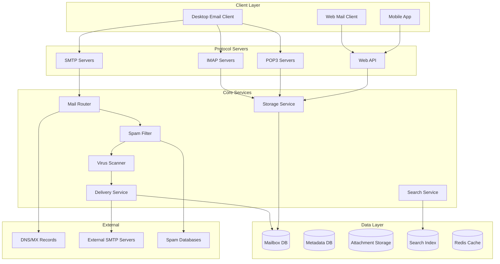
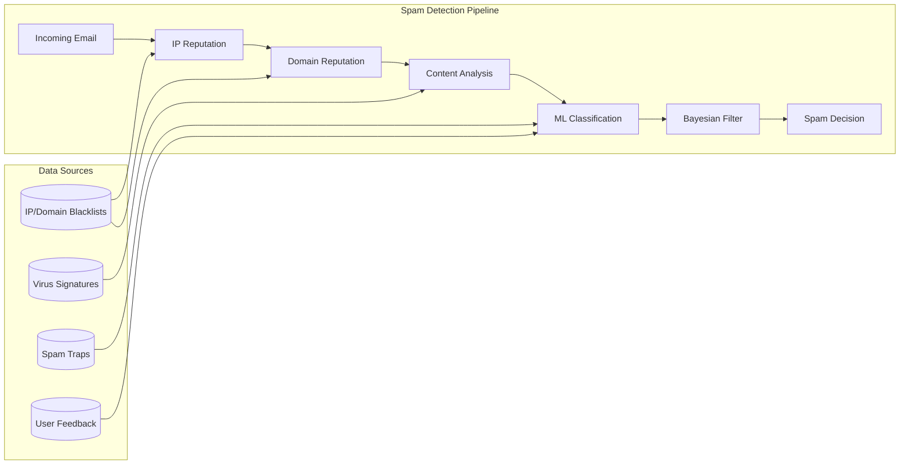
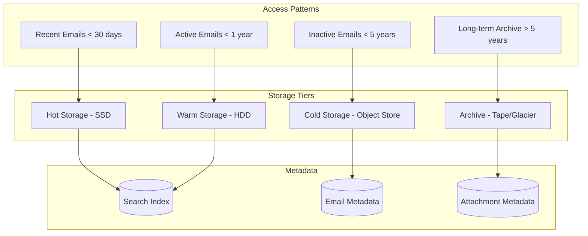
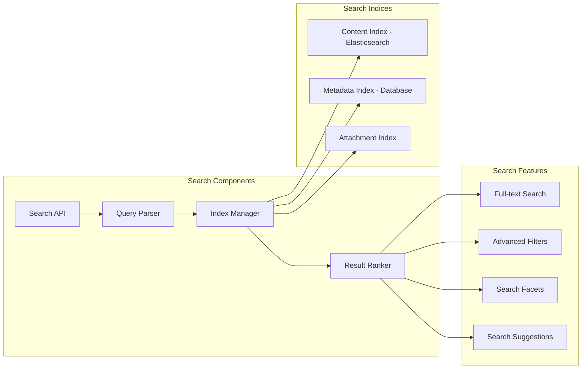
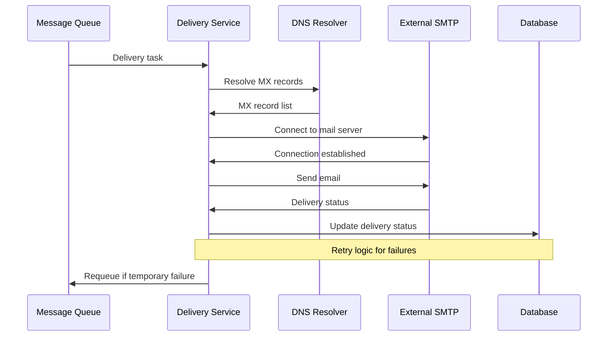

# Design Email System

## Problem Statement

Design a scalable email system that supports:
- Sending and receiving emails globally
- Spam detection and filtering
- Email storage and organization (folders, labels)
- Search across email content and attachments
- Support for multiple email protocols (SMTP, IMAP, POP3)
- Attachment handling and virus scanning
- Support for billions of users and emails daily

### Business Context

Email remains one of the most critical communication systems globally, handling trillions of messages annually. The system must provide reliable delivery, robust spam protection, and efficient storage while maintaining compatibility with existing email standards and protocols.

### User Stories

- As a user, I want to send and receive emails reliably
- As a user, I want protection from spam and malicious content
- As a user, I want to organize and search through my emails
- As a user, I want to access my email from multiple devices
- As an admin, I want to manage email policies and security

## Requirements Clarification

### Functional Requirements

1. **Email Delivery**
   - Send and receive emails via SMTP protocol
   - Support for multiple recipients (To, CC, BCC)
   - Email queuing and retry mechanisms
   - Delivery status notifications (DSN)
   - Support for email forwarding and aliases

2. **Email Storage & Access**
   - IMAP and POP3 protocol support
   - Email folder organization and labels
   - Email search and filtering
   - Email archiving and retention policies
   - Multi-device synchronization

3. **Spam & Security**
   - Real-time spam detection and filtering
   - Virus and malware scanning
   - Phishing detection and prevention
   - Email encryption support (S/MIME, PGP)
   - Blacklist and whitelist management

4. **Attachments & Media**
   - File attachment support (up to 25MB)
   - Virus scanning for attachments
   - Image and document preview
   - Attachment compression and optimization
   - Large file handling via cloud links

5. **User Management**
   - User authentication and authorization
   - Domain management and DNS configuration
   - Email quota management
   - User preferences and settings
   - Multi-domain support

### Non-Functional Requirements

1. **Scale**
   - Support 1+ billion email accounts
   - Handle 300+ billion emails per day
   - Support 100+ million concurrent users
   - 99.9% email delivery success rate

2. **Performance**
   - Email delivery latency < 30 seconds
   - IMAP response time < 200ms
   - Search response time < 500ms
   - 99.99% uptime availability

3. **Security**
   - End-to-end encryption support
   - Data encryption at rest and in transit
   - Compliance with privacy regulations
   - Audit logging and monitoring

### Constraints

- Must comply with email standards (RFC 5321, RFC 5322)
- Integration with existing DNS and MX record systems
- Support for legacy email clients and protocols
- Compliance with anti-spam regulations (CAN-SPAM, GDPR)

### Assumptions

- Average email size is 75KB including attachments
- 80% of emails are legitimate, 20% are spam
- Users check email 10-15 times per day
- 30% of emails include attachments
- Most users have < 10GB of email storage## 
Capacity Estimation

### User Metrics

```
Total Email Accounts: 1 billion
Daily Active Users: 500 million (50%)
Emails per user per day: 50 received, 10 sent
Peak concurrent users: 50 million
Average email size: 75KB
```

### Email Volume

```
Daily Emails Received: 500M users × 50 emails = 25 billion emails/day
Daily Emails Sent: 500M users × 10 emails = 5 billion emails/day
Total Daily Volume: 30 billion emails/day
Peak QPS: 30B / (24 × 3600) × 3 = ~1 million emails/second
```

### Storage Requirements

```
Daily Email Storage: 30B emails × 75KB = 2.25 PB/day
Annual Email Storage: 2.25 PB × 365 = 821 PB/year
Attachment Storage: 30B × 0.3 × 2MB = 18 PB/day (attachments)
Total Annual Storage: ~7 EB/year
```

### Bandwidth Requirements

```
Peak Email Traffic: 1M emails/sec × 75KB = 75 GB/sec
IMAP/POP3 Traffic: 50M users × 1KB/sec = 50 GB/sec
Attachment Downloads: 10M downloads/sec × 2MB = 20 TB/sec
Total Peak Bandwidth: ~20 TB/sec
```

## High-Level Architecture



## Detailed Component Design

### 1. SMTP Server and Mail Router

**SMTP Server Implementation:**
```python
class SMTPServer:
    def __init__(self):
        self.mail_router = MailRouter()
        self.rate_limiter = RateLimiter()
        self.auth_service = AuthService()
    
    def handle_mail_from(self, sender_email, client_ip):
        # Rate limiting based on sender and IP
        if not self.rate_limiter.allow_sender(sender_email, client_ip):
            return "421 Rate limit exceeded"
        
        # Validate sender domain
        if not self.validate_sender_domain(sender_email):
            return "550 Invalid sender domain"
        
        return "250 OK"
    
    def handle_rcpt_to(self, recipient_email):
        # Check if recipient exists
        if not self.recipient_exists(recipient_email):
            return "550 User not found"
        
        # Check recipient quota
        if not self.check_recipient_quota(recipient_email):
            return "452 Mailbox full"
        
        return "250 OK"
    
    def handle_data(self, email_data, sender, recipients):
        try:
            # Parse email
            email = self.parse_email(email_data)
            
            # Route email through processing pipeline
            result = self.mail_router.route_email(email, sender, recipients)
            
            if result.success:
                return f"250 Message accepted for delivery: {result.message_id}"
            else:
                return f"550 {result.error_message}"
                
        except Exception as e:
            return f"451 Temporary failure: {str(e)}"
```

**Mail Router:**
```python
class MailRouter:
    def __init__(self):
        self.spam_filter = SpamFilter()
        self.virus_scanner = VirusScanner()
        self.delivery_service = DeliveryService()
        self.message_queue = MessageQueue()
    
    def route_email(self, email, sender, recipients):
        # Generate unique message ID
        message_id = self.generate_message_id()
        
        # Spam filtering
        spam_score = self.spam_filter.check_email(email, sender)
        if spam_score > SPAM_THRESHOLD:
            return RoutingResult(False, "Message rejected as spam")
        
        # Virus scanning
        if not self.virus_scanner.scan_email(email):
            return RoutingResult(False, "Message contains malware")
        
        # Route to local or external delivery
        for recipient in recipients:
            if self.is_local_domain(recipient):
                self.queue_local_delivery(message_id, email, recipient, spam_score)
            else:
                self.queue_external_delivery(message_id, email, recipient)
        
        return RoutingResult(True, message_id=message_id)
    
    def queue_local_delivery(self, message_id, email, recipient, spam_score):
        delivery_task = {
            'message_id': message_id,
            'email': email,
            'recipient': recipient,
            'spam_score': spam_score,
            'delivery_type': 'local'
        }
        self.message_queue.publish('local_delivery', delivery_task)
    
    def queue_external_delivery(self, message_id, email, recipient):
        delivery_task = {
            'message_id': message_id,
            'email': email,
            'recipient': recipient,
            'delivery_type': 'external',
            'retry_count': 0
        }
        self.message_queue.publish('external_delivery', delivery_task)
```

### 2. Spam Detection System

**Multi-layered Spam Detection:**



**Spam Filter Implementation:**
```python
class SpamFilter:
    def __init__(self):
        self.ip_reputation = IPReputationService()
        self.domain_reputation = DomainReputationService()
        self.content_analyzer = ContentAnalyzer()
        self.ml_classifier = MLSpamClassifier()
        self.bayesian_filter = BayesianFilter()
    
    def check_email(self, email, sender_ip):
        spam_score = 0.0
        
        # IP reputation check (weight: 0.2)
        ip_score = self.ip_reputation.get_score(sender_ip)
        spam_score += ip_score * 0.2
        
        # Domain reputation check (weight: 0.15)
        sender_domain = self.extract_domain(email.sender)
        domain_score = self.domain_reputation.get_score(sender_domain)
        spam_score += domain_score * 0.15
        
        # Content analysis (weight: 0.25)
        content_features = self.content_analyzer.analyze(email)
        content_score = self.calculate_content_score(content_features)
        spam_score += content_score * 0.25
        
        # ML classification (weight: 0.3)
        ml_features = self.extract_ml_features(email, sender_ip)
        ml_score = self.ml_classifier.predict(ml_features)
        spam_score += ml_score * 0.3
        
        # Bayesian filter (weight: 0.1)
        bayesian_score = self.bayesian_filter.classify(email.content)
        spam_score += bayesian_score * 0.1
        
        return min(spam_score, 1.0)  # Cap at 1.0
    
    def extract_ml_features(self, email, sender_ip):
        return {
            'sender_ip': sender_ip,
            'sender_domain': self.extract_domain(email.sender),
            'subject_length': len(email.subject),
            'body_length': len(email.body),
            'attachment_count': len(email.attachments),
            'html_to_text_ratio': self.calculate_html_ratio(email.body),
            'suspicious_links': self.count_suspicious_links(email.body),
            'caps_ratio': self.calculate_caps_ratio(email.subject + email.body),
            'exclamation_count': email.body.count('!'),
            'time_of_day': datetime.now().hour,
            'sender_in_contacts': self.is_sender_in_contacts(email.sender)
        }
```

### 3. Email Storage System

**Hierarchical Storage Architecture:**



**Email Storage Schema:**
```sql
-- Email metadata table (sharded by user_id)
CREATE TABLE emails (
    email_id BIGINT PRIMARY KEY,
    user_id BIGINT NOT NULL,
    folder_id INT DEFAULT 1, -- 1=Inbox, 2=Sent, 3=Drafts, etc.
    message_id VARCHAR(255) UNIQUE, -- RFC 5322 Message-ID
    thread_id BIGINT, -- For conversation threading
    sender VARCHAR(255) NOT NULL,
    recipients TEXT, -- JSON array of recipients
    subject VARCHAR(998), -- RFC 5322 limit
    body_preview VARCHAR(500), -- First 500 chars for quick display
    flags INT DEFAULT 0, -- Bit flags: read, starred, deleted, etc.
    spam_score DECIMAL(3,2) DEFAULT 0.00,
    size_bytes INT NOT NULL,
    attachment_count INT DEFAULT 0,
    created_at TIMESTAMP DEFAULT NOW(),
    updated_at TIMESTAMP DEFAULT NOW(),
    
    INDEX idx_user_folder_date (user_id, folder_id, created_at DESC),
    INDEX idx_user_thread (user_id, thread_id),
    INDEX idx_message_id (message_id),
    INDEX idx_sender (sender),
    FULLTEXT INDEX idx_subject (subject)
) PARTITION BY HASH(user_id) PARTITIONS 64;

-- Email body storage (separate table for large content)
CREATE TABLE email_bodies (
    email_id BIGINT PRIMARY KEY,
    body_text TEXT,
    body_html LONGTEXT,
    headers TEXT, -- Full email headers
    storage_tier ENUM('hot', 'warm', 'cold', 'archive') DEFAULT 'hot',
    storage_location VARCHAR(500), -- S3 key or file path for cold storage
    
    FOREIGN KEY (email_id) REFERENCES emails(email_id)
);

-- Attachment metadata
CREATE TABLE attachments (
    attachment_id BIGINT PRIMARY KEY,
    email_id BIGINT NOT NULL,
    filename VARCHAR(255) NOT NULL,
    content_type VARCHAR(100),
    size_bytes INT NOT NULL,
    storage_location VARCHAR(500), -- S3 key or file path
    virus_scan_status ENUM('pending', 'clean', 'infected') DEFAULT 'pending',
    created_at TIMESTAMP DEFAULT NOW(),
    
    FOREIGN KEY (email_id) REFERENCES emails(email_id),
    INDEX idx_email_attachments (email_id)
);

-- User folders and labels
CREATE TABLE folders (
    folder_id INT AUTO_INCREMENT PRIMARY KEY,
    user_id BIGINT NOT NULL,
    name VARCHAR(100) NOT NULL,
    parent_folder_id INT,
    folder_type ENUM('system', 'user') DEFAULT 'user',
    created_at TIMESTAMP DEFAULT NOW(),
    
    UNIQUE KEY unique_user_folder (user_id, name),
    FOREIGN KEY (parent_folder_id) REFERENCES folders(folder_id)
);
```### 4.
 IMAP Server Implementation

**IMAP Protocol Handler:**
```python
class IMAPServer:
    def __init__(self):
        self.storage_service = EmailStorageService()
        self.auth_service = AuthService()
        self.cache = RedisCache()
    
    def handle_login(self, username, password):
        user = self.auth_service.authenticate(username, password)
        if not user:
            return "NO Authentication failed"
        
        # Create session
        session = IMAPSession(user.id, user.email)
        return f"OK {username} authenticated", session
    
    def handle_select(self, session, folder_name):
        # Get folder info
        folder = self.storage_service.get_folder(session.user_id, folder_name)
        if not folder:
            return "NO Folder not found"
        
        # Get folder statistics
        stats = self.get_folder_stats(session.user_id, folder.id)
        
        session.selected_folder = folder
        
        return f"""OK [READ-WRITE] {folder_name} selected
* {stats.total_messages} EXISTS
* {stats.recent_messages} RECENT
* OK [UNSEEN {stats.first_unseen}] Message {stats.first_unseen} is first unseen
* OK [UIDVALIDITY {folder.uid_validity}] UIDs valid
* OK [UIDNEXT {stats.next_uid}] Predicted next UID"""
    
    def handle_fetch(self, session, sequence_set, items):
        if not session.selected_folder:
            return "BAD No folder selected"
        
        # Parse sequence set (e.g., "1:10", "1,3,5", "*")
        message_numbers = self.parse_sequence_set(sequence_set, session.selected_folder)
        
        responses = []
        for msg_num in message_numbers:
            email = self.storage_service.get_email_by_sequence(
                session.user_id, session.selected_folder.id, msg_num
            )
            
            if email:
                response = self.build_fetch_response(email, items)
                responses.append(f"* {msg_num} FETCH {response}")
        
        responses.append("OK FETCH completed")
        return "\r\n".join(responses)
    
    def build_fetch_response(self, email, items):
        response_parts = []
        
        for item in items:
            if item == "FLAGS":
                flags = self.get_email_flags(email)
                response_parts.append(f"FLAGS ({flags})")
            
            elif item == "ENVELOPE":
                envelope = self.build_envelope(email)
                response_parts.append(f"ENVELOPE {envelope}")
            
            elif item == "BODY[]":
                body = self.get_email_body(email)
                response_parts.append(f"BODY[] {{{len(body)}}}\r\n{body}")
            
            elif item.startswith("BODY[HEADER"):
                headers = self.get_email_headers(email)
                response_parts.append(f"BODY[HEADER] {{{len(headers)}}}\r\n{headers}")
        
        return f"({' '.join(response_parts)})"
```

### 5. Search System

**Email Search Architecture:**



**Search Service Implementation:**
```python
class EmailSearchService:
    def __init__(self):
        self.elasticsearch = Elasticsearch()
        self.database = DatabaseConnection()
        self.cache = RedisCache()
    
    def search_emails(self, user_id, query, filters=None, limit=50, offset=0):
        # Parse search query
        parsed_query = self.parse_search_query(query)
        
        # Build Elasticsearch query
        es_query = {
            "query": {
                "bool": {
                    "must": [
                        {"term": {"user_id": user_id}},
                        {
                            "multi_match": {
                                "query": parsed_query.text,
                                "fields": [
                                    "subject^3",
                                    "body_text^2", 
                                    "sender^2",
                                    "recipients"
                                ],
                                "type": "best_fields",
                                "fuzziness": "AUTO"
                            }
                        }
                    ],
                    "filter": self.build_filters(filters)
                }
            },
            "highlight": {
                "fields": {
                    "subject": {},
                    "body_text": {"fragment_size": 150}
                }
            },
            "sort": [
                {"_score": {"order": "desc"}},
                {"created_at": {"order": "desc"}}
            ],
            "from": offset,
            "size": limit
        }
        
        # Execute search
        results = self.elasticsearch.search(
            index=f"emails_{user_id % 10}",  # Shard by user
            body=es_query
        )
        
        # Format results
        return self.format_search_results(results)
    
    def build_filters(self, filters):
        filter_clauses = []
        
        if filters:
            if 'folder' in filters:
                filter_clauses.append({"term": {"folder_name": filters['folder']}})
            
            if 'sender' in filters:
                filter_clauses.append({"term": {"sender": filters['sender']}})
            
            if 'has_attachments' in filters:
                filter_clauses.append({"range": {"attachment_count": {"gt": 0}}})
            
            if 'date_range' in filters:
                filter_clauses.append({
                    "range": {
                        "created_at": {
                            "gte": filters['date_range']['start'],
                            "lte": filters['date_range']['end']
                        }
                    }
                })
            
            if 'is_unread' in filters:
                filter_clauses.append({"term": {"is_read": False}})
        
        return filter_clauses
    
    def parse_search_query(self, query):
        # Parse advanced search syntax
        # Examples: 
        # - "from:john@example.com subject:meeting"
        # - "has:attachment before:2024-01-01"
        # - "in:inbox is:unread important"
        
        parsed = SearchQuery()
        
        # Extract special operators
        operators = re.findall(r'(\w+):([^\s]+)', query)
        for operator, value in operators:
            if operator == 'from':
                parsed.sender = value
            elif operator == 'to':
                parsed.recipient = value
            elif operator == 'subject':
                parsed.subject = value
            elif operator == 'in':
                parsed.folder = value
            elif operator == 'before':
                parsed.before_date = value
            elif operator == 'after':
                parsed.after_date = value
            elif operator == 'has':
                if value == 'attachment':
                    parsed.has_attachments = True
            elif operator == 'is':
                if value == 'unread':
                    parsed.is_unread = True
                elif value == 'starred':
                    parsed.is_starred = True
        
        # Remove operators from text search
        text_query = re.sub(r'\w+:[^\s]+', '', query).strip()
        parsed.text = text_query
        
        return parsed
```

### 6. Delivery Service

**Email Delivery Pipeline:**



**Delivery Service Implementation:**
```python
class EmailDeliveryService:
    def __init__(self):
        self.dns_resolver = DNSResolver()
        self.smtp_pool = SMTPConnectionPool()
        self.delivery_tracker = DeliveryTracker()
        self.retry_queue = RetryQueue()
    
    def deliver_email(self, delivery_task):
        try:
            recipient_domain = self.extract_domain(delivery_task.recipient)
            
            # Resolve MX records
            mx_records = self.dns_resolver.get_mx_records(recipient_domain)
            if not mx_records:
                return self.handle_delivery_failure(
                    delivery_task, "No MX records found", permanent=True
                )
            
            # Try delivery to each MX server in priority order
            for mx_record in sorted(mx_records, key=lambda x: x.priority):
                try:
                    result = self.attempt_delivery(delivery_task, mx_record.hostname)
                    if result.success:
                        return self.handle_delivery_success(delivery_task, result)
                    elif result.permanent_failure:
                        return self.handle_delivery_failure(
                            delivery_task, result.error, permanent=True
                        )
                except TemporaryFailure as e:
                    continue  # Try next MX server
            
            # All MX servers failed - temporary failure
            return self.handle_delivery_failure(
                delivery_task, "All MX servers failed", permanent=False
            )
            
        except Exception as e:
            return self.handle_delivery_failure(
                delivery_task, str(e), permanent=False
            )
    
    def attempt_delivery(self, delivery_task, mx_hostname):
        # Get SMTP connection from pool
        smtp_conn = self.smtp_pool.get_connection(mx_hostname)
        
        try:
            # SMTP conversation
            smtp_conn.mail_from(delivery_task.sender)
            smtp_conn.rcpt_to(delivery_task.recipient)
            response = smtp_conn.data(delivery_task.email_content)
            
            # Parse SMTP response
            if response.code == 250:
                return DeliveryResult(success=True, message_id=response.message_id)
            elif response.code in [550, 551, 553]:  # Permanent failures
                return DeliveryResult(
                    success=False, 
                    permanent_failure=True, 
                    error=response.message
                )
            else:  # Temporary failures
                raise TemporaryFailure(response.message)
                
        finally:
            self.smtp_pool.return_connection(mx_hostname, smtp_conn)
    
    def handle_delivery_failure(self, delivery_task, error, permanent=False):
        if permanent:
            # Send bounce message to sender
            self.send_bounce_message(delivery_task, error)
            self.delivery_tracker.mark_failed(delivery_task.message_id, error)
        else:
            # Schedule retry with exponential backoff
            retry_delay = self.calculate_retry_delay(delivery_task.retry_count)
            self.retry_queue.schedule_retry(delivery_task, retry_delay)
        
        return DeliveryResult(success=False, error=error)
    
    def calculate_retry_delay(self, retry_count):
        # Exponential backoff: 1min, 5min, 15min, 1hr, 4hr, 24hr
        delays = [60, 300, 900, 3600, 14400, 86400]
        return delays[min(retry_count, len(delays) - 1)]
```## Scali
ng Strategies

### 1. Database Sharding

**User-based Sharding:**
```python
class EmailSharding:
    def __init__(self, num_shards=128):
        self.num_shards = num_shards
    
    def get_shard(self, user_id):
        return user_id % self.num_shards
    
    def get_database_connection(self, user_id):
        shard_id = self.get_shard(user_id)
        return self.connection_pool.get_connection(f"email_shard_{shard_id}")
    
    def get_emails(self, user_id, folder_id, limit=50):
        db = self.get_database_connection(user_id)
        return db.query("""
            SELECT * FROM emails 
            WHERE user_id = %s AND folder_id = %s 
            ORDER BY created_at DESC 
            LIMIT %s
        """, user_id, folder_id, limit)
```

### 2. Storage Tiering

**Automated Data Lifecycle Management:**
```python
class EmailStorageTiering:
    def __init__(self):
        self.hot_storage = MySQLCluster()
        self.warm_storage = PostgreSQL()
        self.cold_storage = S3()
        self.archive_storage = Glacier()
    
    def tier_emails(self):
        # Move emails based on age and access patterns
        
        # Hot to Warm (30 days old)
        hot_emails = self.hot_storage.get_emails_older_than(days=30)
        for email in hot_emails:
            self.move_to_warm_storage(email)
        
        # Warm to Cold (1 year old)
        warm_emails = self.warm_storage.get_emails_older_than(days=365)
        for email in warm_emails:
            self.move_to_cold_storage(email)
        
        # Cold to Archive (5 years old)
        cold_emails = self.cold_storage.get_emails_older_than(days=1825)
        for email in cold_emails:
            self.move_to_archive_storage(email)
    
    def move_to_cold_storage(self, email):
        # Compress and store in S3
        compressed_content = self.compress_email(email)
        s3_key = f"emails/{email.user_id}/{email.email_id}"
        
        self.cold_storage.put_object(s3_key, compressed_content)
        
        # Update metadata with storage location
        self.update_storage_location(email.email_id, 'cold', s3_key)
        
        # Remove from warm storage
        self.warm_storage.delete_email_body(email.email_id)
```

### 3. Caching Strategy

**Multi-level Email Caching:**
```python
class EmailCacheManager:
    def __init__(self):
        self.l1_cache = {}  # In-memory cache for hot emails
        self.l2_cache = Redis()  # Distributed cache for metadata
        self.l3_cache = Memcached()  # Large object cache for email bodies
    
    def get_email(self, email_id):
        # L1: Check in-memory cache
        email = self.l1_cache.get(email_id)
        if email:
            return email
        
        # L2: Check Redis for metadata
        metadata = self.l2_cache.hgetall(f"email_meta:{email_id}")
        if metadata:
            # L3: Get body from Memcached
            body = self.l3_cache.get(f"email_body:{email_id}")
            if body:
                email = self.reconstruct_email(metadata, body)
                self.l1_cache[email_id] = email
                return email
        
        # Fallback to database
        email = self.database.get_email(email_id)
        if email:
            # Cache at all levels
            self.cache_email(email)
        
        return email
    
    def cache_email(self, email):
        # L1: Cache complete email object
        self.l1_cache[email.email_id] = email
        
        # L2: Cache metadata in Redis
        metadata = {
            'sender': email.sender,
            'subject': email.subject,
            'created_at': email.created_at.isoformat(),
            'size_bytes': email.size_bytes,
            'flags': email.flags
        }
        self.l2_cache.hmset(f"email_meta:{email.email_id}", metadata)
        self.l2_cache.expire(f"email_meta:{email.email_id}", 3600)  # 1 hour
        
        # L3: Cache body in Memcached
        if email.body_text or email.body_html:
            body_data = {
                'text': email.body_text,
                'html': email.body_html
            }
            self.l3_cache.set(f"email_body:{email.email_id}", body_data, ttl=1800)  # 30 min
```

## Security Considerations

### 1. Email Encryption

**S/MIME and PGP Support:**
```python
class EmailEncryptionService:
    def __init__(self):
        self.smime_handler = SMIMEHandler()
        self.pgp_handler = PGPHandler()
        self.key_store = KeyStore()
    
    def encrypt_email(self, email, recipient_email, encryption_type='smime'):
        # Get recipient's public key
        public_key = self.key_store.get_public_key(recipient_email, encryption_type)
        if not public_key:
            raise EncryptionError(f"No {encryption_type} key found for {recipient_email}")
        
        if encryption_type == 'smime':
            return self.smime_handler.encrypt(email, public_key)
        elif encryption_type == 'pgp':
            return self.pgp_handler.encrypt(email, public_key)
        else:
            raise ValueError(f"Unsupported encryption type: {encryption_type}")
    
    def decrypt_email(self, encrypted_email, recipient_email):
        # Detect encryption type
        encryption_type = self.detect_encryption_type(encrypted_email)
        
        # Get recipient's private key
        private_key = self.key_store.get_private_key(recipient_email, encryption_type)
        if not private_key:
            raise DecryptionError(f"No private key found for {recipient_email}")
        
        if encryption_type == 'smime':
            return self.smime_handler.decrypt(encrypted_email, private_key)
        elif encryption_type == 'pgp':
            return self.pgp_handler.decrypt(encrypted_email, private_key)
```

### 2. Anti-Phishing Measures

**Phishing Detection System:**
```python
class PhishingDetector:
    def __init__(self):
        self.url_analyzer = URLAnalyzer()
        self.domain_reputation = DomainReputationService()
        self.ml_classifier = PhishingMLClassifier()
    
    def analyze_email(self, email):
        phishing_score = 0.0
        
        # URL analysis
        urls = self.extract_urls(email.body_html or email.body_text)
        for url in urls:
            url_risk = self.url_analyzer.analyze_url(url)
            phishing_score += url_risk.score
        
        # Domain spoofing detection
        sender_domain = self.extract_domain(email.sender)
        if self.is_domain_spoofing(sender_domain, email.reply_to):
            phishing_score += 0.3
        
        # Content analysis
        content_features = self.extract_content_features(email)
        ml_score = self.ml_classifier.predict(content_features)
        phishing_score += ml_score
        
        # Check against known phishing patterns
        pattern_score = self.check_phishing_patterns(email)
        phishing_score += pattern_score
        
        return min(phishing_score, 1.0)
    
    def extract_content_features(self, email):
        return {
            'urgency_words': self.count_urgency_words(email.subject + email.body_text),
            'suspicious_attachments': self.has_suspicious_attachments(email.attachments),
            'sender_reputation': self.domain_reputation.get_score(
                self.extract_domain(email.sender)
            ),
            'grammar_errors': self.count_grammar_errors(email.body_text),
            'caps_ratio': self.calculate_caps_ratio(email.subject),
            'request_personal_info': self.requests_personal_info(email.body_text),
            'fake_login_links': self.has_fake_login_links(email.body_html)
        }
```

## Performance Optimizations

### 1. IMAP Performance

**Connection Pooling and Caching:**
```python
class IMAPOptimizer:
    def __init__(self):
        self.connection_pool = IMAPConnectionPool()
        self.folder_cache = FolderCache()
        self.message_cache = MessageCache()
    
    def optimize_folder_list(self, user_id):
        # Cache folder structure
        cache_key = f"folders:{user_id}"
        folders = self.folder_cache.get(cache_key)
        
        if not folders:
            folders = self.database.get_user_folders(user_id)
            self.folder_cache.set(cache_key, folders, ttl=3600)
        
        return folders
    
    def optimize_message_fetch(self, user_id, folder_id, sequence_set):
        # Batch message fetching
        messages = []
        cache_hits = []
        cache_misses = []
        
        for seq_num in sequence_set:
            cache_key = f"msg:{user_id}:{folder_id}:{seq_num}"
            cached_msg = self.message_cache.get(cache_key)
            
            if cached_msg:
                cache_hits.append(cached_msg)
            else:
                cache_misses.append(seq_num)
        
        # Fetch missing messages in batch
        if cache_misses:
            db_messages = self.database.get_messages_batch(
                user_id, folder_id, cache_misses
            )
            
            # Cache fetched messages
            for msg in db_messages:
                cache_key = f"msg:{user_id}:{folder_id}:{msg.sequence_num}"
                self.message_cache.set(cache_key, msg, ttl=1800)
            
            messages.extend(db_messages)
        
        messages.extend(cache_hits)
        return sorted(messages, key=lambda m: m.sequence_num)
```

### 2. Search Performance

**Search Index Optimization:**
```python
class SearchOptimizer:
    def __init__(self):
        self.elasticsearch = Elasticsearch()
        self.search_cache = SearchCache()
    
    def optimize_search_index(self):
        # Use separate indices per user shard for better performance
        for shard_id in range(10):
            index_name = f"emails_shard_{shard_id}"
            
            # Configure index settings for performance
            settings = {
                "number_of_shards": 3,
                "number_of_replicas": 1,
                "refresh_interval": "30s",  # Reduce refresh frequency
                "index.max_result_window": 50000,
                "analysis": {
                    "analyzer": {
                        "email_analyzer": {
                            "type": "custom",
                            "tokenizer": "standard",
                            "filter": ["lowercase", "stop", "snowball"]
                        }
                    }
                }
            }
            
            self.elasticsearch.indices.put_settings(
                index=index_name, 
                body={"settings": settings}
            )
    
    def cache_popular_searches(self, user_id, query):
        # Cache frequently searched queries
        cache_key = f"search:{user_id}:{hash(query)}"
        
        # Check if this is a popular search pattern
        search_count = self.search_cache.incr(f"search_count:{hash(query)}")
        
        if search_count > 10:  # Popular search
            # Pre-compute and cache results
            results = self.elasticsearch.search(user_id, query)
            self.search_cache.set(cache_key, results, ttl=300)  # 5 min cache
        
        return self.search_cache.get(cache_key)
```## 
Monitoring and Observability

### Key Metrics

**System Health Metrics:**
```python
EMAIL_METRICS = {
    'email_delivery_latency': {
        'type': 'histogram',
        'description': 'Time from SMTP accept to delivery',
        'buckets': [1, 5, 15, 30, 60, 300, 900, 3600]  # seconds
    },
    'spam_detection_accuracy': {
        'type': 'gauge',
        'description': 'Spam detection true positive rate'
    },
    'imap_response_time': {
        'type': 'histogram',
        'description': 'IMAP command response time',
        'buckets': [10, 50, 100, 200, 500, 1000, 2000]  # milliseconds
    },
    'search_query_latency': {
        'type': 'histogram',
        'description': 'Email search response time',
        'buckets': [50, 100, 200, 500, 1000, 2000, 5000]  # milliseconds
    },
    'storage_utilization': {
        'type': 'gauge',
        'description': 'Storage utilization by tier (hot/warm/cold)'
    },
    'delivery_success_rate': {
        'type': 'counter',
        'description': 'Email delivery success/failure rate'
    }
}
```

**Business Metrics:**
```python
BUSINESS_METRICS = {
    'daily_email_volume': 'Total emails processed per day',
    'spam_rate': 'Percentage of emails classified as spam',
    'user_engagement': 'Average emails read per user per day',
    'storage_growth': 'Daily storage growth rate',
    'search_usage': 'Search queries per user per day',
    'mobile_vs_desktop': 'Email access by client type'
}
```

## Follow-up Questions

### Technical Deep Dives

1. **How would you handle email threading and conversation grouping?**
   - Implement RFC 5256 THREAD extension
   - Use Message-ID and In-Reply-To headers for threading
   - Handle broken threading with subject-based fallback

2. **How would you implement email rules and filters?**
   - Server-side Sieve scripting language support
   - Real-time rule processing during delivery
   - User-friendly rule builder interface

3. **How would you handle large attachments efficiently?**
   - Implement chunked upload with resumability
   - Use cloud storage links for files > 25MB
   - Implement attachment deduplication

### Scaling Challenges

4. **How would you handle email delivery to millions of recipients?**
   - Implement mailing list optimization with VERP
   - Use delivery rate limiting per domain
   - Implement feedback loops for bounce handling

5. **How would you optimize storage for users with TB of email?**
   - Implement intelligent archiving policies
   - Use compression and deduplication
   - Provide storage analytics and cleanup tools

### Security and Compliance

6. **How would you implement email retention policies?**
   - Automated deletion based on age and legal requirements
   - Legal hold functionality for litigation
   - Audit trails for compliance reporting

7. **How would you handle email in regulated industries?**
   - Implement message-level encryption
   - Provide detailed audit logs
   - Support for compliance standards (SOX, HIPAA, etc.)

This email system design demonstrates the complexity of building a reliable, secure, and scalable email platform that can handle billions of messages while providing robust spam protection and efficient storage management.