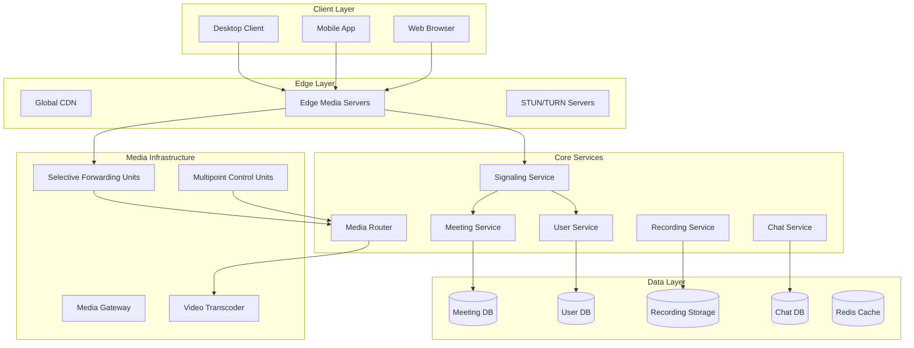
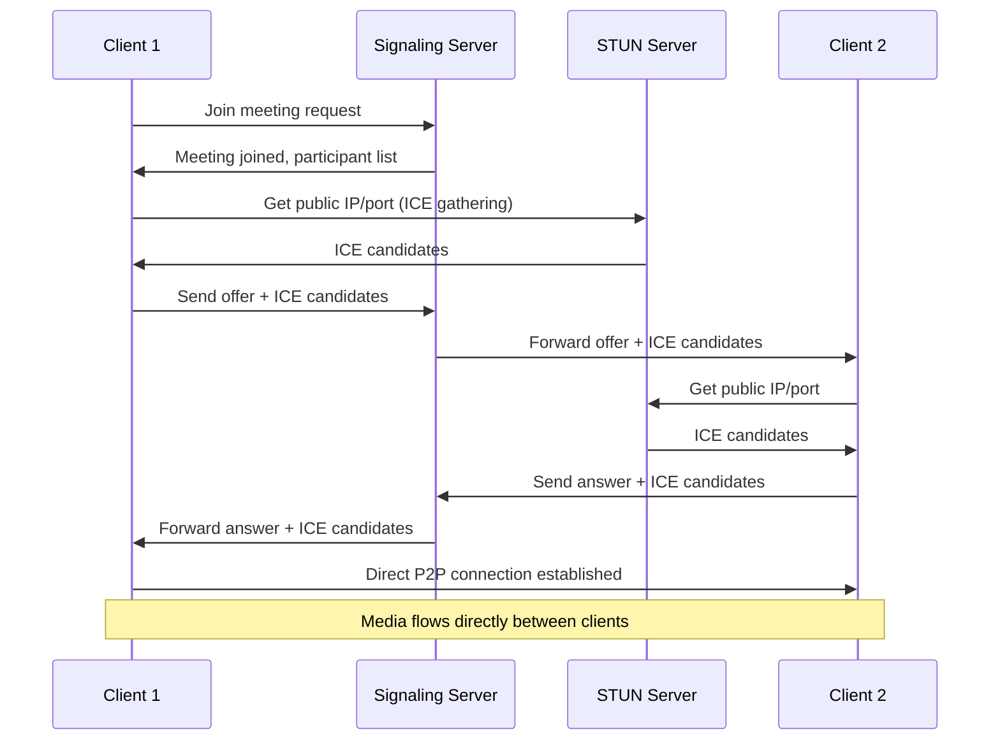
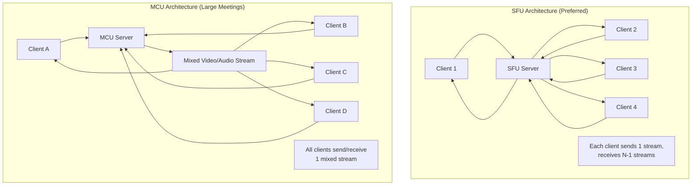
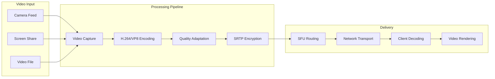
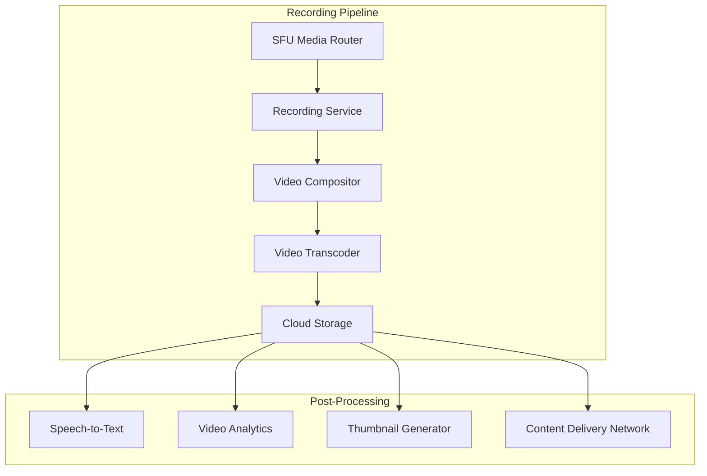
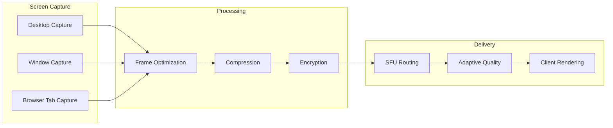
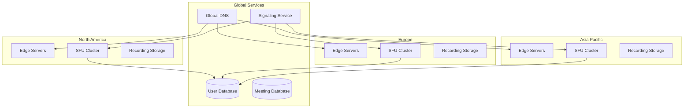

# Design Zoom Video Conferencing System

## Problem Statement

Design a video conferencing system like Zoom that supports:
- High-quality video and audio calls for up to 1000 participants
- Screen sharing and collaborative features
- Recording and playback capabilities
- Real-time chat during meetings
- Scheduling and calendar integration
- Mobile and desktop client support
- Global deployment with low latency
- Support for millions of concurrent meetings

### Business Context

Video conferencing became essential for remote work, education, and communication. The system must provide reliable, high-quality video/audio with minimal latency while scaling to support millions of simultaneous meetings globally.

### User Stories

- As a user, I want to join video calls with high quality and low latency
- As a host, I want to manage meeting participants and settings
- As a presenter, I want to share my screen and collaborate in real-time
- As an organization, I want to record meetings for later review
- As a developer, I want to integrate video calling into my application

## Requirements Clarification

### Functional Requirements

1. **Video/Audio Calling**
   - High-definition video (up to 1080p) and crystal-clear audio
   - Support for 1-on-1 calls and group meetings (up to 1000 participants)
   - Adaptive bitrate based on network conditions
   - Audio/video muting and camera controls
   - Virtual backgrounds and filters

2. **Meeting Management**
   - Meeting scheduling with calendar integration
   - Meeting rooms with unique IDs and passwords
   - Waiting rooms and admission controls
   - Host controls (mute participants, remove users, etc.)
   - Breakout rooms for smaller group discussions

3. **Screen Sharing & Collaboration**
   - Full screen or application-specific sharing
   - Remote control capabilities
   - Whiteboard and annotation tools
   - File sharing during meetings
   - Real-time collaborative editing

4. **Recording & Playback**
   - Cloud and local recording options
   - Automatic transcription and closed captions
   - Recording management and sharing
   - Playback with seek and speed controls
   - Recording analytics and engagement metrics

5. **Chat & Messaging**
   - Real-time text chat during meetings
   - Private messaging between participants
   - File and link sharing in chat
   - Chat history and search
   - Emoji reactions and polls

6. **Integration & APIs**
   - Calendar integration (Google, Outlook, etc.)
   - Single Sign-On (SSO) support
   - REST APIs for third-party integrations
   - SDK for embedding video calls
   - Webhook notifications for events

### Non-Functional Requirements

1. **Scale**
   - Support 500+ million meeting participants daily
   - Handle 10+ million concurrent meetings
   - Support meetings with up to 1000 participants
   - 99.99% uptime availability

2. **Performance**
   - Video latency < 150ms globally
   - Audio latency < 100ms
   - Meeting join time < 5 seconds
   - Screen sharing latency < 200ms

3. **Quality**
   - Adaptive video quality (240p to 1080p)
   - Audio quality up to 48kHz stereo
   - Packet loss recovery and error correction
   - Network congestion handling

### Constraints

- Must work across different network conditions (3G to fiber)
- Support for various devices (mobile, desktop, web browsers)
- Compliance with privacy regulations (GDPR, HIPAA)
- Integration with existing enterprise systems

### Assumptions

- Average meeting duration is 30 minutes
- 70% of meetings have 2-5 participants
- 20% of meetings are recorded
- Peak usage during business hours (9 AM - 5 PM)
- Users have cameras and microphones available## Cap
acity Estimation

### User Metrics

```
Total Registered Users: 500 million
Daily Active Users: 100 million (20%)
Peak Concurrent Users: 50 million
Average Meeting Duration: 30 minutes
Meetings per user per day: 3
Peak Concurrent Meetings: 10 million
```

### Meeting Volume

```
Daily Meetings: 100M users × 3 meetings = 300 million meetings/day
Peak Meeting Creation Rate: 300M / (8 hours × 3600) × 3 = ~31,000 meetings/second
Average Participants per Meeting: 4
Peak Concurrent Participants: 10M meetings × 4 participants = 40 million
```

### Bandwidth Requirements

```
Video Bitrate per Participant:
- 1080p: 2.5 Mbps
- 720p: 1.5 Mbps  
- 480p: 0.8 Mbps
- 240p: 0.3 Mbps

Audio Bitrate: 64 kbps per participant

Peak Video Traffic: 40M participants × 1.5 Mbps (avg) = 60 Tbps
Peak Audio Traffic: 40M participants × 64 kbps = 2.56 Tbps
Total Peak Bandwidth: ~63 Tbps (ingress + egress)
```

### Storage Requirements

```
Recording Storage:
- 20% of meetings recorded = 60 million recordings/day
- Average recording size: 500 MB (30 min meeting)
- Daily Recording Storage: 60M × 500 MB = 30 PB/day
- Annual Recording Storage: 30 PB × 365 = 11 EB/year

Metadata Storage:
- Meeting metadata: 10 KB per meeting
- Daily Metadata: 300M × 10 KB = 3 TB/day
```

## High-Level Architecture



## Detailed Component Design

### 1. WebRTC and Signaling

**WebRTC Connection Establishment:**



**Signaling Service Implementation:**
```python
class SignalingService:
    def __init__(self):
        self.websocket_manager = WebSocketManager()
        self.meeting_service = MeetingService()
        self.ice_servers = ICEServerManager()
    
    async def handle_join_meeting(self, user_id, meeting_id, websocket):
        # Validate meeting and user permissions
        meeting = await self.meeting_service.get_meeting(meeting_id)
        if not meeting or not self.can_join_meeting(user_id, meeting):
            await websocket.send_json({
                'type': 'error',
                'message': 'Cannot join meeting'
            })
            return
        
        # Add participant to meeting
        participant = await self.meeting_service.add_participant(
            meeting_id, user_id, websocket
        )
        
        # Send ICE server configuration
        ice_config = await self.ice_servers.get_config()
        await websocket.send_json({
            'type': 'ice_servers',
            'servers': ice_config
        })
        
        # Notify existing participants
        await self.notify_participant_joined(meeting_id, participant)
        
        # Send existing participants to new user
        existing_participants = await self.meeting_service.get_participants(meeting_id)
        await websocket.send_json({
            'type': 'participants',
            'participants': existing_participants
        })
    
    async def handle_webrtc_offer(self, sender_id, target_id, offer):
        # Forward WebRTC offer to target participant
        target_ws = await self.websocket_manager.get_connection(target_id)
        if target_ws:
            await target_ws.send_json({
                'type': 'webrtc_offer',
                'sender_id': sender_id,
                'offer': offer
            })
    
    async def handle_webrtc_answer(self, sender_id, target_id, answer):
        # Forward WebRTC answer to original sender
        target_ws = await self.websocket_manager.get_connection(target_id)
        if target_ws:
            await target_ws.send_json({
                'type': 'webrtc_answer',
                'sender_id': sender_id,
                'answer': answer
            })
    
    async def handle_ice_candidate(self, sender_id, target_id, candidate):
        # Forward ICE candidate for connection establishment
        target_ws = await self.websocket_manager.get_connection(target_id)
        if target_ws:
            await target_ws.send_json({
                'type': 'ice_candidate',
                'sender_id': sender_id,
                'candidate': candidate
            })
```

### 2. Media Routing Architecture

**Selective Forwarding Unit (SFU) vs Multipoint Control Unit (MCU):**



**SFU Implementation:**
```python
class SelectiveForwardingUnit:
    def __init__(self):
        self.participants = {}
        self.media_streams = {}
        self.bandwidth_monitor = BandwidthMonitor()
    
    async def add_participant(self, participant_id, media_connection):
        self.participants[participant_id] = {
            'connection': media_connection,
            'subscriptions': set(),
            'publishing': False,
            'bandwidth_limit': self.calculate_bandwidth_limit(participant_id)
        }
        
        # Subscribe to existing streams
        for stream_id in self.media_streams:
            await self.subscribe_to_stream(participant_id, stream_id)
    
    async def publish_stream(self, participant_id, stream_data):
        stream_id = f"{participant_id}_video"
        
        # Store stream metadata
        self.media_streams[stream_id] = {
            'publisher': participant_id,
            'type': 'video',
            'quality_layers': self.extract_quality_layers(stream_data),
            'subscribers': set()
        }
        
        # Forward to all other participants
        for other_id in self.participants:
            if other_id != participant_id:
                await self.forward_stream(stream_id, other_id, stream_data)
    
    async def forward_stream(self, stream_id, subscriber_id, stream_data):
        subscriber = self.participants.get(subscriber_id)
        if not subscriber:
            return
        
        # Adaptive bitrate based on subscriber's bandwidth
        available_bandwidth = self.bandwidth_monitor.get_bandwidth(subscriber_id)
        optimal_layer = self.select_quality_layer(stream_id, available_bandwidth)
        
        # Transcode if necessary
        if optimal_layer != stream_data.quality:
            stream_data = await self.transcode_stream(stream_data, optimal_layer)
        
        # Forward to subscriber
        await subscriber['connection'].send_media(stream_data)
        
        # Track subscription
        self.media_streams[stream_id]['subscribers'].add(subscriber_id)
        subscriber['subscriptions'].add(stream_id)
    
    def select_quality_layer(self, stream_id, available_bandwidth):
        stream = self.media_streams[stream_id]
        quality_layers = stream['quality_layers']
        
        # Select highest quality that fits bandwidth
        for quality in ['1080p', '720p', '480p', '240p']:
            if quality in quality_layers:
                required_bandwidth = self.get_bandwidth_requirement(quality)
                if available_bandwidth >= required_bandwidth:
                    return quality
        
        return '240p'  # Fallback to lowest quality
```

### 3. Video Processing Pipeline

**Real-time Video Processing:**



**Video Encoder Service:**
```python
class VideoEncoderService:
    def __init__(self):
        self.encoders = {
            'h264': H264Encoder(),
            'vp8': VP8Encoder(),
            'vp9': VP9Encoder(),
            'av1': AV1Encoder()
        }
        self.quality_profiles = self.load_quality_profiles()
    
    async def encode_video_stream(self, raw_video, target_qualities, codec='h264'):
        encoder = self.encoders[codec]
        encoded_streams = {}
        
        for quality in target_qualities:
            profile = self.quality_profiles[quality]
            
            # Configure encoder settings
            encoder_config = {
                'width': profile['width'],
                'height': profile['height'],
                'bitrate': profile['bitrate'],
                'framerate': profile['framerate'],
                'keyframe_interval': profile['keyframe_interval']
            }
            
            # Encode video stream
            encoded_stream = await encoder.encode(raw_video, encoder_config)
            encoded_streams[quality] = encoded_stream
        
        return encoded_streams
    
    def load_quality_profiles(self):
        return {
            '1080p': {
                'width': 1920, 'height': 1080,
                'bitrate': 2500000, 'framerate': 30,
                'keyframe_interval': 2
            },
            '720p': {
                'width': 1280, 'height': 720,
                'bitrate': 1500000, 'framerate': 30,
                'keyframe_interval': 2
            },
            '480p': {
                'width': 854, 'height': 480,
                'bitrate': 800000, 'framerate': 30,
                'keyframe_interval': 2
            },
            '240p': {
                'width': 426, 'height': 240,
                'bitrate': 300000, 'framerate': 15,
                'keyframe_interval': 2
            }
        }
    
    async def adaptive_bitrate_control(self, stream_id, network_stats):
        # Adjust encoding bitrate based on network conditions
        packet_loss = network_stats.packet_loss_rate
        rtt = network_stats.round_trip_time
        bandwidth = network_stats.available_bandwidth
        
        if packet_loss > 0.05:  # 5% packet loss
            # Reduce bitrate and increase keyframe frequency
            await self.adjust_encoder_settings(stream_id, {
                'bitrate_multiplier': 0.8,
                'keyframe_interval': 1
            })
        elif rtt > 200:  # High latency
            # Reduce resolution to maintain low latency
            await self.adjust_encoder_settings(stream_id, {
                'resolution_step_down': True
            })
        elif bandwidth < 500000:  # Low bandwidth
            # Switch to lower quality profile
            await self.switch_quality_profile(stream_id, '240p')
```### 4. 
Recording System

**Cloud Recording Architecture:**



**Recording Service Implementation:**
```python
class RecordingService:
    def __init__(self):
        self.active_recordings = {}
        self.compositor = VideoCompositor()
        self.transcoder = VideoTranscoder()
        self.storage = CloudStorage()
        self.transcription = SpeechToTextService()
    
    async def start_recording(self, meeting_id, recording_config):
        recording_id = self.generate_recording_id()
        
        # Initialize recording session
        recording_session = {
            'recording_id': recording_id,
            'meeting_id': meeting_id,
            'start_time': datetime.utcnow(),
            'config': recording_config,
            'participants': [],
            'audio_streams': {},
            'video_streams': {},
            'status': 'recording'
        }
        
        self.active_recordings[recording_id] = recording_session
        
        # Start capturing media streams
        await self.start_media_capture(recording_id, meeting_id)
        
        return recording_id
    
    async def capture_media_stream(self, recording_id, participant_id, stream_data):
        recording = self.active_recordings.get(recording_id)
        if not recording:
            return
        
        # Store raw media data
        if stream_data.type == 'video':
            recording['video_streams'][participant_id] = stream_data
        elif stream_data.type == 'audio':
            recording['audio_streams'][participant_id] = stream_data
        
        # Trigger real-time composition if enabled
        if recording['config'].get('real_time_composition'):
            await self.compose_frame(recording_id)
    
    async def compose_frame(self, recording_id):
        recording = self.active_recordings[recording_id]
        
        # Get active video streams
        video_streams = recording['video_streams']
        audio_streams = recording['audio_streams']
        
        # Compose video layout
        layout_config = recording['config']['layout']
        composed_frame = await self.compositor.compose_frame(
            video_streams, layout_config
        )
        
        # Mix audio streams
        mixed_audio = await self.compositor.mix_audio(audio_streams)
        
        # Write to recording file
        await self.write_recording_frame(recording_id, composed_frame, mixed_audio)
    
    async def stop_recording(self, recording_id):
        recording = self.active_recordings.get(recording_id)
        if not recording:
            return
        
        recording['status'] = 'processing'
        recording['end_time'] = datetime.utcnow()
        
        # Finalize recording file
        raw_recording_path = await self.finalize_recording(recording_id)
        
        # Start post-processing pipeline
        await self.start_post_processing(recording_id, raw_recording_path)
        
        # Clean up active recording
        del self.active_recordings[recording_id]
    
    async def start_post_processing(self, recording_id, raw_file_path):
        # Transcode to multiple formats
        transcoding_tasks = [
            self.transcode_video(raw_file_path, 'mp4', '1080p'),
            self.transcode_video(raw_file_path, 'mp4', '720p'),
            self.transcode_video(raw_file_path, 'webm', '720p')
        ]
        
        transcoded_files = await asyncio.gather(*transcoding_tasks)
        
        # Generate thumbnails
        thumbnails = await self.generate_thumbnails(raw_file_path)
        
        # Extract audio for transcription
        audio_file = await self.extract_audio(raw_file_path)
        transcript = await self.transcription.transcribe(audio_file)
        
        # Upload to cloud storage
        storage_urls = await self.upload_recording_files(
            recording_id, transcoded_files, thumbnails, transcript
        )
        
        # Update recording metadata
        await self.update_recording_metadata(recording_id, {
            'status': 'completed',
            'files': storage_urls,
            'transcript': transcript,
            'duration': self.calculate_duration(raw_file_path)
        })
```

### 5. Screen Sharing System

**Screen Sharing Implementation:**



**Screen Share Service:**
```python
class ScreenShareService:
    def __init__(self):
        self.screen_capturer = ScreenCapturer()
        self.frame_optimizer = FrameOptimizer()
        self.encoder = ScreenShareEncoder()
    
    async def start_screen_share(self, participant_id, share_config):
        # Initialize screen capture
        capture_source = share_config['source']  # desktop, window, or browser_tab
        
        if capture_source == 'desktop':
            capturer = await self.screen_capturer.capture_desktop(
                share_config.get('display_id', 0)
            )
        elif capture_source == 'window':
            capturer = await self.screen_capturer.capture_window(
                share_config['window_id']
            )
        elif capture_source == 'browser_tab':
            capturer = await self.screen_capturer.capture_browser_tab(
                share_config['tab_id']
            )
        
        # Start capture loop
        await self.start_capture_loop(participant_id, capturer, share_config)
    
    async def capture_and_process_frame(self, participant_id, capturer, config):
        # Capture frame
        raw_frame = await capturer.capture_frame()
        
        # Optimize frame for screen sharing
        optimized_frame = await self.frame_optimizer.optimize_screen_frame(
            raw_frame, config
        )
        
        # Encode with screen-optimized settings
        encoded_frame = await self.encoder.encode_screen_frame(
            optimized_frame, {
                'optimize_for_text': config.get('optimize_for_text', True),
                'motion_detection': config.get('motion_detection', True),
                'lossless_regions': config.get('lossless_regions', [])
            }
        )
        
        # Send to SFU for distribution
        await self.send_to_sfu(participant_id, encoded_frame)
    
    class FrameOptimizer:
        async def optimize_screen_frame(self, frame, config):
            # Detect motion regions
            motion_regions = await self.detect_motion(frame)
            
            # Identify text regions for lossless encoding
            text_regions = await self.detect_text_regions(frame)
            
            # Apply different compression strategies
            optimized_frame = frame.copy()
            
            # High quality for text regions
            for region in text_regions:
                optimized_frame = await self.apply_lossless_compression(
                    optimized_frame, region
                )
            
            # Motion-optimized compression for changing regions
            for region in motion_regions:
                optimized_frame = await self.apply_motion_compression(
                    optimized_frame, region
                )
            
            # Static region compression for unchanged areas
            static_regions = self.get_static_regions(frame, motion_regions)
            for region in static_regions:
                optimized_frame = await self.apply_static_compression(
                    optimized_frame, region
                )
            
            return optimized_frame
```

### 6. Chat System

**Real-time Chat Implementation:**
```python
class MeetingChatService:
    def __init__(self):
        self.websocket_manager = WebSocketManager()
        self.message_store = MessageStore()
        self.moderation = ContentModerationService()
    
    async def send_message(self, meeting_id, sender_id, message_data):
        # Validate message
        if not self.validate_message(message_data):
            raise ValueError("Invalid message format")
        
        # Content moderation
        moderation_result = await self.moderation.check_content(
            message_data['text']
        )
        if moderation_result.blocked:
            raise ValueError("Message blocked by content filter")
        
        # Create message object
        message = {
            'message_id': self.generate_message_id(),
            'meeting_id': meeting_id,
            'sender_id': sender_id,
            'text': message_data['text'],
            'timestamp': datetime.utcnow().isoformat(),
            'type': message_data.get('type', 'text'),
            'attachments': message_data.get('attachments', []),
            'reply_to': message_data.get('reply_to'),
            'reactions': {}
        }
        
        # Store message
        await self.message_store.store_message(message)
        
        # Broadcast to meeting participants
        await self.broadcast_message(meeting_id, message)
        
        return message
    
    async def broadcast_message(self, meeting_id, message):
        # Get meeting participants
        participants = await self.get_meeting_participants(meeting_id)
        
        # Send to all connected participants
        for participant_id in participants:
            websocket = await self.websocket_manager.get_connection(participant_id)
            if websocket:
                await websocket.send_json({
                    'type': 'chat_message',
                    'message': message
                })
    
    async def add_reaction(self, meeting_id, message_id, user_id, emoji):
        # Get message
        message = await self.message_store.get_message(message_id)
        if not message or message['meeting_id'] != meeting_id:
            raise ValueError("Message not found")
        
        # Add reaction
        if emoji not in message['reactions']:
            message['reactions'][emoji] = []
        
        if user_id not in message['reactions'][emoji]:
            message['reactions'][emoji].append(user_id)
        
        # Update stored message
        await self.message_store.update_message(message_id, message)
        
        # Broadcast reaction update
        await self.broadcast_reaction_update(meeting_id, message_id, message['reactions'])
```## Databas
e Design

### Meeting and User Management

```sql
-- Users table
CREATE TABLE users (
    user_id BIGINT PRIMARY KEY,
    email VARCHAR(255) UNIQUE NOT NULL,
    display_name VARCHAR(100),
    avatar_url VARCHAR(500),
    timezone VARCHAR(50),
    created_at TIMESTAMP DEFAULT NOW(),
    last_active TIMESTAMP,
    subscription_type VARCHAR(20) DEFAULT 'basic', -- basic, pro, enterprise
    
    INDEX idx_email (email)
);

-- Meetings table
CREATE TABLE meetings (
    meeting_id VARCHAR(20) PRIMARY KEY,
    host_user_id BIGINT NOT NULL,
    title VARCHAR(200),
    description TEXT,
    scheduled_start TIMESTAMP,
    scheduled_end TIMESTAMP,
    actual_start TIMESTAMP,
    actual_end TIMESTAMP,
    meeting_password VARCHAR(50),
    waiting_room_enabled BOOLEAN DEFAULT TRUE,
    recording_enabled BOOLEAN DEFAULT FALSE,
    max_participants INT DEFAULT 100,
    status VARCHAR(20) DEFAULT 'scheduled', -- scheduled, active, ended
    created_at TIMESTAMP DEFAULT NOW(),
    
    FOREIGN KEY (host_user_id) REFERENCES users(user_id),
    INDEX idx_host_meetings (host_user_id, scheduled_start),
    INDEX idx_meeting_status (status, scheduled_start)
);

-- Meeting participants
CREATE TABLE meeting_participants (
    meeting_id VARCHAR(20),
    user_id BIGINT,
    joined_at TIMESTAMP,
    left_at TIMESTAMP,
    role VARCHAR(20) DEFAULT 'participant', -- host, co-host, participant
    is_muted BOOLEAN DEFAULT FALSE,
    video_enabled BOOLEAN DEFAULT TRUE,
    screen_sharing BOOLEAN DEFAULT FALSE,
    
    PRIMARY KEY (meeting_id, user_id, joined_at),
    FOREIGN KEY (meeting_id) REFERENCES meetings(meeting_id),
    FOREIGN KEY (user_id) REFERENCES users(user_id)
);

-- Meeting recordings
CREATE TABLE recordings (
    recording_id VARCHAR(20) PRIMARY KEY,
    meeting_id VARCHAR(20) NOT NULL,
    title VARCHAR(200),
    duration_seconds INT,
    file_size_bytes BIGINT,
    storage_location VARCHAR(500),
    transcript_location VARCHAR(500),
    thumbnail_url VARCHAR(500),
    status VARCHAR(20) DEFAULT 'processing', -- processing, completed, failed
    created_at TIMESTAMP DEFAULT NOW(),
    
    FOREIGN KEY (meeting_id) REFERENCES meetings(meeting_id),
    INDEX idx_meeting_recordings (meeting_id, created_at)
);
```

### Chat and Messages

```sql
-- Meeting chat messages
CREATE TABLE chat_messages (
    message_id VARCHAR(20) PRIMARY KEY,
    meeting_id VARCHAR(20) NOT NULL,
    sender_id BIGINT NOT NULL,
    message_text TEXT NOT NULL,
    message_type VARCHAR(20) DEFAULT 'text', -- text, file, poll
    reply_to_message_id VARCHAR(20),
    timestamp TIMESTAMP DEFAULT NOW(),
    edited_at TIMESTAMP,
    deleted_at TIMESTAMP,
    
    FOREIGN KEY (meeting_id) REFERENCES meetings(meeting_id),
    FOREIGN KEY (sender_id) REFERENCES users(user_id),
    FOREIGN KEY (reply_to_message_id) REFERENCES chat_messages(message_id),
    INDEX idx_meeting_messages (meeting_id, timestamp)
);

-- Message reactions
CREATE TABLE message_reactions (
    message_id VARCHAR(20),
    user_id BIGINT,
    emoji VARCHAR(10),
    created_at TIMESTAMP DEFAULT NOW(),
    
    PRIMARY KEY (message_id, user_id, emoji),
    FOREIGN KEY (message_id) REFERENCES chat_messages(message_id),
    FOREIGN KEY (user_id) REFERENCES users(user_id)
);

-- File attachments in chat
CREATE TABLE chat_attachments (
    attachment_id VARCHAR(20) PRIMARY KEY,
    message_id VARCHAR(20) NOT NULL,
    filename VARCHAR(255),
    file_size_bytes INT,
    content_type VARCHAR(100),
    storage_location VARCHAR(500),
    
    FOREIGN KEY (message_id) REFERENCES chat_messages(message_id)
);
```

## Scaling Strategies

### 1. Geographic Distribution

**Global Media Server Deployment:**



**Regional Routing Strategy:**
```python
class GlobalMediaRouter:
    def __init__(self):
        self.regions = {
            'us-east': {'latency_weight': 0.4, 'capacity_weight': 0.6},
            'us-west': {'latency_weight': 0.4, 'capacity_weight': 0.6},
            'eu-central': {'latency_weight': 0.4, 'capacity_weight': 0.6},
            'asia-pacific': {'latency_weight': 0.4, 'capacity_weight': 0.6}
        }
        self.capacity_monitor = CapacityMonitor()
        self.latency_monitor = LatencyMonitor()
    
    def select_optimal_region(self, participant_locations):
        # Calculate geographic center of participants
        center_lat, center_lon = self.calculate_geographic_center(participant_locations)
        
        region_scores = {}
        for region_id, region_config in self.regions.items():
            # Get region coordinates
            region_lat, region_lon = self.get_region_coordinates(region_id)
            
            # Calculate distance-based latency score
            distance = self.calculate_distance(
                center_lat, center_lon, region_lat, region_lon
            )
            latency_score = 1.0 / (1.0 + distance / 1000)  # Normalize by 1000km
            
            # Get current capacity utilization
            capacity_utilization = self.capacity_monitor.get_utilization(region_id)
            capacity_score = 1.0 - capacity_utilization
            
          
```y')idth_anomalid, 'bandwicipant_ty(partcious_activisuspilf.flag_it se  awa          :
    omalous()e.is_andwidth_usagif ban         )
   ant_id(participagedth_usdwi.get_ban await selfh_usage =bandwidt      rns
      usage patteth andwid Monitor b     #               

    connection')'rapid_re_id, participantctivity(cious_asuspif.flag_   await sel         te
    numi per ections reconn10:  # 10ate > ection_rif reconn         
   nt_id)e(participan_rat_reconnectiolf.gete = await seection_rat     reconn     
  ck)tential attactions (ponnecore rapid Check for #      
      icipants:d in part_intpacior parti       f  
 
      g_id)etinicipants(meting_part_mee self.get awaitcipants =       partiities
 ctivsuspicious aonitor for   # M  
    ):ng_idelf, meetiurity(sing_secmeetf monitor_ync de    ased'}
    
us': 'approvatrn {'stetu     r 
   )
        activity"iouse to suspiced dus denir("AccesurityErroraise Sec          > 0.8:
  abuse_score   if )
      user_idheck_user(r.cctoteuse_dewait self.abcore = ae_s    abus
    use patternsk for ab  # Chec 
      m'}
       ting_roo': 'wai {'status     return
       )er_id us_id,tinging_room(meewaitto_.add_wait self    a
        _id:ng.host= meeti_id ! and userenabledng_room_eeting.waiti    if mm
    rooing ck wait       # Che        
 ord")
g passwtinalid meenvityError("Ise Securai   r            ssword):
 g_id, paord(meetin_passwfy_meetingit self.veri awaf not        i  equired:
  assword_r.p if meeting  
       
      red")sword requi"Meeting pasrityError(se Secuai  r
          rd:not passwod and uired_reqng.passworti  if mee   ord
   assw png requiresck if meeti # Che     
         ")
 und not fo"MeetingError(tyriaise Secu     r       :
ing not meet  ifid)
      ting_eeting(mself.get_meeawait ng = eti meils
       ting deta  # Get mee    
   
       )empts"n atto many joior("To SecurityErr   raise        r_id):
 (useoin_jllow_meetingte_limiter.ait self.ra  if not awa
      ttemptsoin ar meeting j foitinglim     # Rate e):
   Nonord=swg_id, pasetin, meiduser_lf, ses(esmeeting_accef validate_   async d()
    
 torseDetectector = Abulf.abuse_de     seter()
   mir = RateLite_limite    self.ra
    uthService()ice = Auth_serv  self.alf):
      __(sef __init:
    deityServiceeetingSecurclass Mon
`pythurity:**
``ting Sec**Mee

nticationd Authen Control a Access## 2.
```

#d, new_key)ipant_irticicipant(paparte_key_to_f.distributait sel     aw
       )           
 ipant_idrtic_key, pa  new_master           
   nt_key(articipa_priveger.de_mana.keywait selfew_key = a          npants:
  particiipant_id in r partic    fog_id)
    eetinipants(mticng_parget_meeti await self.s =ipant     partic  
      )
   _key(astergenerate_mmanager..key_wait selfr_key = a_maste    newcrecy
    orward ser fes foery 30 minut keys evteota # R       ting_id):
self, meeion_keys(ryptncdef rotate_e
    async m
    ted_streaencryp  return   )
      y
      _keantparticipta,    stream_da
         crypt(.enhandlerself.srtp_await m = ed_streacrypt en
       ryptionmedia enc-time realTP for  SR # Use       key):
nt_rticipapaam_data, elf, strea_stream(sdi_meryptf encc de  
    asynys
  icipant_ke part  return    
      key)
    id, ant_ip(particrticipanty_to_pa_kestributelf.diait se  aw
          ys.items():ant_keparticipid, key in cipant_rtifor pa         securely
e keysistribut       # D    
    nt_key
 articipapant_id] = p[particiant_keysicippart          
           )   
rticipant_idpaer_key,     mast            nt_key(
e_participanager.derivy_mait self.ke = awaipant_keyticar p           icipants:
_id in partparticipant     for  {}
    =nt_keys participa  
     keyst anive particip  # Der  
          r_key()
  asterate_mgenekey_manager.f.= await sel_key  master
       er keyng mastnerate meeti       # Gepants):
  partici_id,elf, meetingcryption(s_entup_meetingseync def     asr()
    
le SRTPHand_handler =  self.srtp  )
    ger(er = KeyManaanaglf.key_m    se   lf):
 se_(_init_
    def _ncryption:lass MediaE`python
cation:**
`` Implementiondia Encrypttion

**Med Encrypo-EnEnd-t 1. 

###siderationsConurity  Sec
```

##s_buffers()am.comprestret s  awai      
    reams:active_stam in in  for stre     
 0]ivity > 3s.last_acts if s in stream for streams = [sinactive_         data
eamnactive strpress i   # Com
     )
        ollection(ce_garbage_canager.forlf.process_mit se     awa  urces
 nused resoollect u Garbage c
        #     ')
   llr_size('smat_buffeeam.sestr     await     s:
   stream in stream        for s
fer size Reduce buf      #eams):
   strage(self,mory_usze_meptimidef oasync    
     original
 # 80% of.8)  n(0esolutio_rreducem.t strea  awai           :
   .7 > 0otion_levelf stream.m         int
   otion conte-m for highe resolutionuced # R            
         ')
  stet('ultrafaing_prest_encodstream.set ai  aw
          g preseter encodinfastse      # U        
          
 econdsEvery 4 s# erval(4)  keyframe_intset_ stream.       await     uency
frame frequce key Red #        eams:
   m in str   for streams):
     f, streaxity(selcomplece_encoding_nc def redusy   
    ams)
 e_streaivct_usage(amorytimize_melf.op   await se  age
       e memory ustimizOp         # y usage
   memor.9:  # High > 0mory _me current       if     
 
   _streams)y(activeomplexitcoding_cf.reduce_ent sel        awai    lexity
ncoding compe e # Reduc
            usageigh CPU85:  # H > 0.purrent_c     if cu
       ()
    sage_utor.getmemory_moniit self.mory = awa  current_me()
      sage_uettor.g.cpu_monielfwait s= acurrent_cpu 
        ams):tive_stref, acsources(selding_renco optimize_e def
    async()
    essManagerger = Procs_manaeself.proc   s
     tor() MemoryMonior =nitory_moself.mem
        nitor()CPUMor = cpu_monito self.):
       init__(self __efager:
    dsourceManss Rethon
cla```pynt:**
nagemece MaurReso

**tionOptimizand Memory . CPU a``

### 22.5Mbps
`o 300kbps t500000))  # bitrate, 2(optimal_min, 0000rn max(30    retu           

 actor* latency_floss_factor dth * 0.7 * le_bandwite = availabimal_bitra      optble)
  ilava0% of a(7width usage  bandative   # Conserv    
     000)
    t - 100) / 17, 1.0 - (rtx(0.= maor _fact     latencyy
   latench  for higce bitrate   # Redu   
       * 10))
   packet_loss 1.0 - (ax(0.5, ctor = mloss_fa       ss
 cket lo based on pa bitrateuce  # Red 
      ime
       d_trip_tstats.rounrk_rtt = netwo  te
      ket_loss_raats.pac network_stet_loss =  packh
      ts.bandwidtork_sta= netwidth _bandwble   availa   tats):
  _slf, networktrate(seimal_bi_optate calcul    defity)
    
get_qualid, tar(stream_tyquali.change_llerontrolity_cquait self.         awaality:
   current_qu_quality != arget if t        
)
       ate_bitrrate(optimal_bit_forlect_quality.selflity = searget_qua)
        t_idy(streamitt_qualurrenet_ctroller.guality_con self.qaitty = awnt_qualiurre
        cdeo qualityjust vi Ad   #    
     
    s)stattwork_bitrate(neoptimal_.calculate_ = selfmal_bitratepti       ol bitrate
 timaate opul Calc
        #    nt_id)
    ticipa_stats(paronitor.getwork_mt self.netawai= ork_stats etw
        nonsk conditiworent nett curr Ge      #d):
  m_i, streaidnt_f, participality(seleam_quaize_strdef optim async   ()
    
 ontrollerr = QualityCy_controlle.qualit        selfMonitor()
= Networkrk_monitor netwo     self.   
self):f __init__( de
   troller:rateConitiveBs Adapt
clasonpyth**
```rol:te Cont Bitradaptiveion

**AOptimizatth  1. Bandwid

###mizationsptirformance O

## PeTrue)
```, reverse=art']std_dule m: m['sche=lambda, keyeetingsll_morted(a  return s   
      
     d(results).exteneetings      all_m
      rd_results:sharesults in     for s
     sort resultrge and   # Me        
s)
     taskio.gather(*ait asyncresults = awshard_  
        sk)
      d(taks.appen tas       id)
    d, user_r_iuse   """,         
 _start DESCY scheduled ORDER B                   )
          %s
   = E user_idipants WHERing_partic FROM meetting_id  SELECT mee              
    ting_id IN (= %s OR meer_id t_useERE hos       WH         gs 
eetin * FROM mLECT     SE     
      e("""utk = db.exec      tas     )
 _id}"ard_{shardmeeting_shnection(f"pool.get_connection_self.con    db =    ds):
     .num_sharn range(self ihard_id     for ss = []
   task          
     s = []
 ting     all_meetings
   er's meerds for usss all shary acro      # Que  _id):
s(self, userr_meeting_usegetdef sync  a
   ime'])
    t_t'stara[ate'], dtl'], data['ti['host_iddataeeting_id,  m   """,s)
     , %s, %s, % VALUES (%s         _start)
  scheduledtitle, ser_id, g_id, host_umeetineetings (SERT INTO mIN          ""
  ecute("wait db.ex   aard
     te shropria in app # Store      
  )
       eeting_idction(monnet_database_cdb = self.ge    data):
    ting_id, , meeta(selfe_meeting_daync def stor  as
     d_id}")
 d_{sharing_sharetection(f"meet_connon_pool.gonnectiself.c return      ting_id)
  _shard(mee = self.get_idrdha
        seeting_id):ion(self, mase_connectef get_datab 
    dards
   .num_shd) % selfmeeting_in hash(  retur
      eting data meashing for hntnsiste # Use cod):
       meeting_ishard(self, get_    def ards
    
sh= num_hards   self.num_s     ds=32):
 sharnum_f, _(self __init_
    deng:dingDataSharMeetiss thon
cla
```pying:**Shardbased 
**Meeting-
ardingtabase Sh Da

### 3.tance)
```gency_ins emermeeting_id,ting(meef.migrate_await sel              _sfu()
  gencyaunch_emerf.lit selnce = awacy_instaergen         em  e
     new instanc: launch mergency     # E
           se:      el)
      stance healthy_in(meeting_id,e_meeting.migrat self await      
         ance:y_instif health              
    
              )   ]
 stance_idin[failed_ exclude=ing_id,        meet(
        nstance_sfu_ialthyind_heait self.f= awstance  healthy_in          
 _meetings: in affectedting_idfor mees
        cey instanthings to heal meette     # Migra   
   
     d)_instance_iedtance(failinsings_on_meetlf.get_ await seetings =meected_        aff instance
on failedtings et mee   # G   e_id):
  stancled_ine(self, faiilurfu_fandle_shanc def    asy)
    
 stanceinion_id, new_tion(reggraf.gradual_miait sel      awtance
  inso new etings tgrate meadually mi      # Gr 
  )
       ew_instance, negion_idance(rr_sfu_instlf.registe await secer
       ad balanster with lo  # Regi 
      d)
       _igioninstance(rech_sfu_r.launauto_scaleself.= await _instance    newtance
     new SFU insh  # Launc):
       , region_id_up(selfalenc def sc   asy
    
 region_id)e_down(.scalt self       awai:
     00)on > 6atioad.dur_l    current
          0.3 andn < tilizatio.memory_uload   current_       and 
     0.3 zation <_utili.cpuurrent_loadif (c       el minutes
 0% for 10load < 3n if  # Scale dow   
       )
     egion_ide_up(rt self.scalawai          .8:
  ization > 0_utilryd.memourrent_loa0.8 or c > utilizationd.cpu_nt_loa   if curre
     80%p if load > ale u    # Sc   
    
     on_id)n_load(regi.get_regioormonitlf.load_ait seload = awnt_rre
        cu_id): regionself,ter(lus_sfu_cc def scale    asyner()
    
 = AutoScalerlf.auto_scal
        seMonitor()oadonitor = Lelf.load_m
        s= {}s _instancelf.sfu se:
       t__(self)def __inir:
    UScaleon
class SF``pyth**
`ling:U Scaynamic SF*Dng

*alanciLoad Bd ling an SFU Sca2.

### e
```nstancurn sfu_iret              
       })

   nts()oie.get_endpu_instancs': sfia_endpoint  'med         id,
 fu_instance.nstance': ssfu_i          'd,
  n': region_iregio        '
    id, {ing(meeting_ng_routtite_meeupda     self.on
   ng informating routi meetiUpdate # 
            ng_id)
   eetie(mte_instanclocar.alste= sfu_clu_instance 
        sfuegion_id)fu_cluster(rself.get_scluster =    sfu_egion
     elected r in sU resourceste SF    # Alloca:
    d)_id, regiong_itinelf, meeion(sing_to_regmeetroute_
    def )
    s.getscoreregion_ey=n_scores, kregioreturn max(   
     est score high withct regionSele
        #    
     al_score= tot_id] res[region region_sco              
           )
        eight']
  apacity_wg['cregion_confie * ty_scoraci        cap       '] +
 ncy_weightlateion_config['re * regency_sco      lat         
 l_score = (     tota
       ghted scoreweie   # Calculat## Mo
nitoring and Observability

### Key Metrics

**System Performance Metrics:**
```python
VIDEO_METRICS = {
    'video_latency': {
        'type': 'histogram',
        'description': 'End-to-end video latency',
        'buckets': [50, 100, 150, 200, 300, 500, 1000]  # milliseconds
    },
    'audio_latency': {
        'type': 'histogram', 
        'description': 'End-to-end audio latency',
        'buckets': [20, 50, 100, 150, 200, 300, 500]  # milliseconds
    },
    'packet_loss_rate': {
        'type': 'gauge',
        'description': 'Media packet loss percentage'
    },
    'video_quality_score': {
        'type': 'gauge',
        'description': 'Average video quality score (1-5)'
    },
    'meeting_join_time': {
        'type': 'histogram',
        'description': 'Time to join meeting',
        'buckets': [1, 2, 3, 5, 10, 15, 30]  # seconds
    },
    'concurrent_meetings': {
        'type': 'gauge',
        'description': 'Number of active meetings'
    },
    'sfu_cpu_utilization': {
        'type': 'gauge',
        'description': 'SFU server CPU usage percentage'
    }
}
```

**Business Metrics:**
```python
BUSINESS_METRICS = {
    'daily_meeting_minutes': 'Total meeting minutes per day',
    'average_meeting_duration': 'Average meeting length',
    'meeting_completion_rate': 'Percentage of meetings that end normally',
    'user_engagement_score': 'User participation and interaction metrics',
    'recording_usage': 'Percentage of meetings recorded',
    'screen_share_usage': 'Percentage of meetings with screen sharing'
}
```

## Follow-up Questions

### Technical Deep Dives

1. **How would you handle network congestion and packet loss?**
   - Implement Forward Error Correction (FEC)
   - Use adaptive bitrate with multiple quality layers
   - Implement packet retransmission for critical frames
   - Use redundant encoding for audio

2. **How would you optimize for mobile devices with limited resources?**
   - Implement hardware-accelerated encoding/decoding
   - Use lower resolution and frame rates on mobile
   - Optimize battery usage with efficient codecs
   - Implement background mode with audio-only

3. **How would you handle very large meetings (10,000+ participants)?**
   - Use MCU architecture for large meetings
   - Implement view-based rendering (only show active speakers)
   - Use cascaded SFU architecture
   - Implement participant sampling and pagination

### Scaling Challenges

4. **How would you ensure global low latency?**
   - Deploy edge servers in major cities worldwide
   - Use anycast routing for optimal path selection
   - Implement intelligent traffic routing based on real-time latency
   - Use dedicated fiber connections between data centers

5. **How would you handle sudden traffic spikes (10x normal load)?**
   - Implement auto-scaling with pre-warmed instances
   - Use queue-based meeting admission control
   - Implement graceful degradation (audio-only fallback)
   - Use cloud bursting to additional regions

### Security and Privacy

6. **How would you prevent meeting bombing and unauthorized access?**
   - Implement waiting rooms with host approval
   - Use meeting passwords and unique meeting IDs
   - Implement rate limiting for meeting joins
   - Add CAPTCHA for suspicious join attempts

7. **How would you ensure compliance with privacy regulations?**
   - Implement data residency controls
   - Provide granular consent management
   - Implement automatic data deletion policies
   - Provide audit trails for compliance reporting

This Zoom-like video conferencing system design demonstrates the complexity of building real-time communication platforms that must handle high-quality media streaming, global scale, and strict latency requirements while maintaining security and reliability.