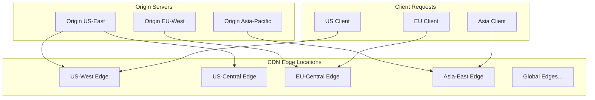
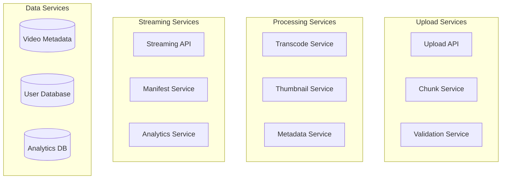

# Design YouTube Video Streaming Platform

## Problem Statement

Design a video streaming platform like YouTube that allows users to upload, process, store, and stream videos globally. The system should handle billions of users, millions of video uploads daily, and provide fast, reliable video streaming with adaptive quality.

### Business Context

YouTube serves over 2 billion logged-in monthly users, with over 500 hours of video uploaded every minute. The platform needs to:
- Support global video upload and streaming
- Provide fast video processing and multiple quality options
- Deliver content efficiently worldwide through CDN
- Handle massive scale with high availability

### User Stories

- As a content creator, I want to upload videos and have them processed quickly
- As a viewer, I want to stream videos with minimal buffering and appropriate quality
- As a mobile user, I want adaptive streaming based on my network conditions
- As a global user, I want fast video loading regardless of my location

## Requirements Clarification

### Functional Requirements

1. **Video Upload**: Users can upload videos in various formats (MP4, AVI, MOV, etc.)
2. **Video Processing**: Automatic transcoding to multiple resolutions and formats
3. **Video Streaming**: Adaptive bitrate streaming with quality selection
4. **Video Management**: Basic metadata, thumbnails, and video information
5. **Global Delivery**: Fast video delivery worldwide through CDN
6. **Search**: Basic video search and discovery functionality

### Non-Functional Requirements

1. **Scale**: 2 billion users, 500 hours uploaded per minute, 1 billion hours watched daily
2. **Availability**: 99.9% uptime for streaming, 99% for uploads
3. **Performance**: 
   - Video start time < 2 seconds globally
   - Upload processing completion within 1 hour for standard videos
   - Support for 4K, 1080p, 720p, 480p, 360p resolutions
4. **Storage**: Petabytes of video content with redundancy
5. **Bandwidth**: Efficient content delivery to minimize costs

### Constraints

- Global user base with varying network conditions
- Multiple device types (mobile, desktop, smart TV, etc.)
- Various video formats and quality requirements
- Cost optimization for storage and bandwidth
- Content delivery latency requirements

### Assumptions

- Users are authenticated (simplified user management)
- Basic content moderation exists
- Payment and monetization systems are separate
- Focus on core video functionality

## Capacity Estimation

### User Metrics

```
Daily Active Users (DAU): 2 billion
Upload Users: 10 million daily (0.5% of DAU)
Average videos per uploader: 2 per day
Total daily uploads: 20 million videos
Average video size: 500 MB
Average video duration: 10 minutes
```

### Storage Requirements

```
Daily Upload Storage:
20M videos × 500 MB = 10 PB per day

With multiple resolutions (4K, 1080p, 720p, 480p, 360p):
Storage multiplier: ~3x (different compression ratios)
Daily storage: 30 PB

Annual storage: 30 PB × 365 = 10,950 PB (~11 EB)

With 3x replication: 33 EB total storage needed
```

### Bandwidth Requirements

```
Video Streaming:
- Peak concurrent viewers: 100 million
- Average bitrate: 2 Mbps (adaptive streaming)
- Peak bandwidth: 100M × 2 Mbps = 200 Tbps

Video Upload:
- Peak concurrent uploads: 50,000
- Average upload bitrate: 10 Mbps
- Upload bandwidth: 50K × 10 Mbps = 500 Gbps
```

### Processing Requirements

```
Video Transcoding:
- 20M videos per day
- 5 resolution formats per video
- Processing time: 2x video duration (10 min video = 20 min processing)
- Total processing time: 20M × 5 × 20 min = 2 billion minutes daily
- Required processing cores: ~23,000 cores (assuming 24/7 operation)
```

## High-Level Architecture

```mermaid
graph TB
    subgraph "Client Layer"
        Web[Web Browser]
        Mobile[Mobile App]
        TV[Smart TV]
    end
    
    subgraph "CDN Layer"
        CDN[Global CDN Network]
        Edge[Edge Servers]
    end
    
    subgraph "Load Balancer"
        LB[Load Balancer]
    end
    
    subgraph "API Gateway"
        Gateway[API Gateway]
    end
    
    subgraph "Application Services"
        Upload[Upload Service]
        Stream[Streaming Service]
        Metadata[Metadata Service]
        Search[Search Service]
        User[User Service]
    end
    
    subgraph "Processing Pipeline"
        Queue[Message Queue]
        Transcode[Transcoding Service]
        Thumbnail[Thumbnail Service]
    end
    
    subgraph "Storage Layer"
        VideoStore[Video Storage]
        MetaDB[(Metadata DB)]
        Cache[(Cache Layer)]
    end
    
    subgraph "Analytics"
        Analytics[Analytics Service]
        Metrics[(Metrics DB)]
    end
    
    Web --> CDN
    Mobile --> CDN
    TV --> CDN
    CDN --> Edge
    Edge --> LB
    LB --> Gateway
    
    Gateway --> Upload
    Gateway --> Stream
    Gateway --> Metadata
    Gateway --> Search
    Gateway --> User
    
    Upload --> Queue
    Queue --> Transcode
    Queue --> Thumbnail
    
    Transcode --> VideoStore
    Thumbnail --> VideoStore
    
    Stream --> VideoStore
    Stream --> Cache
    Metadata --> MetaDB
    Search --> MetaDB
    
    Upload --> Analytics
    Stream --> Analytics
    Analytics --> Metrics
```

## Detailed Component Design

### 1. Video Upload Service

**Responsibilities:**
- Handle video file uploads with resumable upload support
- Validate video formats and file sizes
- Generate unique video IDs and initial metadata
- Trigger video processing pipeline

**API Design:**
```
POST /api/v1/videos/upload/initiate
{
  "filename": "my_video.mp4",
  "filesize": 524288000,
  "content_type": "video/mp4",
  "metadata": {
    "title": "My Video Title",
    "description": "Video description",
    "tags": ["tag1", "tag2"]
  }
}

Response:
{
  "video_id": "abc123",
  "upload_url": "https://upload.youtube.com/upload/abc123",
  "chunk_size": 8388608
}

PUT /api/v1/videos/upload/abc123/chunk/1
Content-Range: bytes 0-8388607/524288000
[Binary video data]
```

**Implementation Details:**
- Use chunked upload for large files (8MB chunks)
- Store chunks in temporary storage (S3 with lifecycle policies)
- Implement upload resumption using Range headers
- Validate file integrity using checksums
- Rate limiting per user to prevent abuse

### 2. Video Processing Pipeline

**Transcoding Service:**
```python
# Simplified transcoding workflow
class VideoTranscoder:
    def __init__(self):
        self.resolutions = [
            {"name": "4K", "width": 3840, "height": 2160, "bitrate": "15000k"},
            {"name": "1080p", "width": 1920, "height": 1080, "bitrate": "5000k"},
            {"name": "720p", "width": 1280, "height": 720, "bitrate": "2500k"},
            {"name": "480p", "width": 854, "height": 480, "bitrate": "1000k"},
            {"name": "360p", "width": 640, "height": 360, "bitrate": "600k"}
        ]
    
    def process_video(self, video_id, input_path):
        # Extract video metadata
        metadata = self.extract_metadata(input_path)
        
        # Generate thumbnail
        thumbnail_path = self.generate_thumbnail(input_path)
        
        # Transcode to multiple resolutions
        output_paths = []
        for resolution in self.resolutions:
            if self.should_transcode_resolution(metadata, resolution):
                output_path = self.transcode_resolution(
                    input_path, resolution, video_id
                )
                output_paths.append(output_path)
        
        # Upload to storage
        self.upload_processed_videos(video_id, output_paths, thumbnail_path)
        
        # Update metadata
        self.update_video_metadata(video_id, metadata, output_paths)
        
        return {"status": "success", "resolutions": len(output_paths)}
```

**Processing Pipeline Architecture:**


### 3. Video Streaming Service

**Adaptive Bitrate Streaming:**
```javascript
// HLS (HTTP Live Streaming) manifest generation
class HLSManifestGenerator {
    generateMasterPlaylist(videoId, availableResolutions) {
        let manifest = "#EXTM3U\n#EXT-X-VERSION:3\n\n";
        
        availableResolutions.forEach(resolution => {
            manifest += `#EXT-X-STREAM-INF:BANDWIDTH=${resolution.bitrate},RESOLUTION=${resolution.width}x${resolution.height}\n`;
            manifest += `${videoId}/${resolution.name}/playlist.m3u8\n`;
        });
        
        return manifest;
    }
    
    generateResolutionPlaylist(videoId, resolution, segments) {
        let manifest = "#EXTM3U\n#EXT-X-VERSION:3\n";
        manifest += `#EXT-X-TARGETDURATION:${segments.targetDuration}\n`;
        manifest += "#EXT-X-PLAYLIST-TYPE:VOD\n\n";
        
        segments.forEach((segment, index) => {
            manifest += `#EXTINF:${segment.duration},\n`;
            manifest += `${videoId}/${resolution.name}/segment_${index}.ts\n`;
        });
        
        manifest += "#EXT-X-ENDLIST\n";
        return manifest;
    }
}
```

**Streaming API:**
```
GET /api/v1/videos/{video_id}/stream
Response: 302 Redirect to CDN URL

GET /api/v1/videos/{video_id}/manifest.m3u8
Response: HLS master playlist

GET /api/v1/videos/{video_id}/{resolution}/playlist.m3u8
Response: Resolution-specific playlist

GET /api/v1/videos/{video_id}/{resolution}/segment_{n}.ts
Response: Video segment binary data
```

### 4. Content Delivery Network (CDN)

**CDN Architecture:**


**CDN Optimization Strategies:**
- **Intelligent Caching**: Cache popular content at edge locations
- **Predictive Pre-loading**: Pre-load trending videos to edge servers
- **Geographic Routing**: Route users to nearest edge location
- **Bandwidth Optimization**: Compress video segments for mobile users
- **Cache Invalidation**: Efficient cache updates for new content

### 5. Database Design

**Video Metadata Schema:**
```sql
-- Videos table
CREATE TABLE videos (
    video_id VARCHAR(20) PRIMARY KEY,
    user_id BIGINT NOT NULL,
    title VARCHAR(255) NOT NULL,
    description TEXT,
    duration_seconds INT,
    upload_timestamp TIMESTAMP,
    processing_status ENUM('uploading', 'processing', 'ready', 'failed'),
    view_count BIGINT DEFAULT 0,
    like_count BIGINT DEFAULT 0,
    privacy_setting ENUM('public', 'unlisted', 'private'),
    created_at TIMESTAMP DEFAULT CURRENT_TIMESTAMP,
    updated_at TIMESTAMP DEFAULT CURRENT_TIMESTAMP ON UPDATE CURRENT_TIMESTAMP,
    
    INDEX idx_user_id (user_id),
    INDEX idx_upload_timestamp (upload_timestamp),
    INDEX idx_processing_status (processing_status)
);

-- Video files table (for different resolutions)
CREATE TABLE video_files (
    file_id BIGINT AUTO_INCREMENT PRIMARY KEY,
    video_id VARCHAR(20) NOT NULL,
    resolution ENUM('4K', '1080p', '720p', '480p', '360p'),
    file_path VARCHAR(500) NOT NULL,
    file_size BIGINT,
    bitrate INT,
    codec VARCHAR(50),
    created_at TIMESTAMP DEFAULT CURRENT_TIMESTAMP,
    
    FOREIGN KEY (video_id) REFERENCES videos(video_id),
    UNIQUE KEY unique_video_resolution (video_id, resolution),
    INDEX idx_video_id (video_id)
);

-- Video analytics table (partitioned by date)
CREATE TABLE video_analytics (
    analytics_id BIGINT AUTO_INCREMENT PRIMARY KEY,
    video_id VARCHAR(20) NOT NULL,
    user_id BIGINT,
    event_type ENUM('view', 'like', 'share', 'comment'),
    timestamp TIMESTAMP DEFAULT CURRENT_TIMESTAMP,
    session_id VARCHAR(50),
    device_type VARCHAR(50),
    location VARCHAR(100),
    
    INDEX idx_video_timestamp (video_id, timestamp),
    INDEX idx_user_timestamp (user_id, timestamp)
) PARTITION BY RANGE (UNIX_TIMESTAMP(timestamp)) (
    PARTITION p_2024_01 VALUES LESS THAN (UNIX_TIMESTAMP('2024-02-01')),
    PARTITION p_2024_02 VALUES LESS THAN (UNIX_TIMESTAMP('2024-03-01')),
    -- Additional partitions...
);
```

## Scaling the Design

### Horizontal Scaling Strategies

**1. Service Decomposition:**


**2. Database Scaling:**

*Sharding Strategy:*
```python
class VideoShardingStrategy:
    def __init__(self, num_shards=1000):
        self.num_shards = num_shards
    
    def get_shard(self, video_id):
        # Use consistent hashing based on video_id
        hash_value = hashlib.md5(video_id.encode()).hexdigest()
        return int(hash_value[:8], 16) % self.num_shards
    
    def get_database_connection(self, video_id):
        shard_id = self.get_shard(video_id)
        return self.shard_connections[shard_id]
```

*Read Replicas for Analytics:*
- Master-slave replication for video metadata
- Separate analytics database for view counts and metrics
- Time-series databases for real-time analytics

**3. Caching Strategy:**

*Multi-Level Caching:*
```python
class VideoCache:
    def __init__(self):
        self.l1_cache = Redis()  # Hot video metadata
        self.l2_cache = Memcached()  # Video file locations
        self.cdn_cache = CDN()  # Video content
    
    def get_video_metadata(self, video_id):
        # L1 Cache (Redis) - Hot metadata
        metadata = self.l1_cache.get(f"video:{video_id}")
        if metadata:
            return metadata
        
        # L2 Cache (Memcached) - Warm metadata
        metadata = self.l2_cache.get(f"video:{video_id}")
        if metadata:
            self.l1_cache.set(f"video:{video_id}", metadata, ttl=3600)
            return metadata
        
        # Database fallback
        metadata = self.database.get_video(video_id)
        self.l2_cache.set(f"video:{video_id}", metadata, ttl=86400)
        self.l1_cache.set(f"video:{video_id}", metadata, ttl=3600)
        return metadata
```

### Performance Optimizations

**1. Video Processing Optimization:**
- **Parallel Processing**: Process multiple resolutions simultaneously
- **GPU Acceleration**: Use GPU-based transcoding for faster processing
- **Smart Transcoding**: Only transcode resolutions that will be watched
- **Incremental Processing**: Process popular videos first

**2. Streaming Optimization:**
- **Adaptive Bitrate**: Automatically adjust quality based on network conditions
- **Preloading**: Preload next video segments for smooth playback
- **Compression**: Use modern codecs (H.265, AV1) for better compression
- **Edge Computing**: Process video analytics at edge locations

**3. Storage Optimization:**
- **Tiered Storage**: Hot (SSD), Warm (HDD), Cold (Glacier) storage tiers
- **Compression**: Compress older, less-watched videos
- **Deduplication**: Remove duplicate video content
- **Geographic Distribution**: Store popular content in multiple regions

## Security Considerations

### Content Security
- **DRM Protection**: Digital rights management for premium content
- **Watermarking**: Add invisible watermarks to track piracy
- **Access Control**: Token-based access to video streams
- **Content Validation**: Scan uploads for malicious content

### Infrastructure Security
- **API Rate Limiting**: Prevent abuse of upload and streaming APIs
- **Authentication**: Secure user authentication and authorization
- **Encryption**: Encrypt video content in transit and at rest
- **Network Security**: VPC, firewalls, and DDoS protection

## Monitoring and Analytics

### Key Metrics
```python
class VideoMetrics:
    def track_upload_metrics(self):
        return {
            "upload_success_rate": "99.5%",
            "average_processing_time": "15 minutes",
            "processing_queue_length": 1500,
            "storage_utilization": "75%"
        }
    
    def track_streaming_metrics(self):
        return {
            "video_start_time": "1.2 seconds",
            "buffering_ratio": "0.5%",
            "cdn_hit_ratio": "95%",
            "concurrent_viewers": 50000000
        }
    
    def track_business_metrics(self):
        return {
            "daily_uploads": 20000000,
            "daily_views": 5000000000,
            "user_engagement": "12 minutes average",
            "popular_resolutions": {"1080p": "45%", "720p": "30%", "480p": "25%"}
        }
```

### Alerting System
- **Upload Failures**: Alert when upload success rate drops below 99%
- **Processing Delays**: Alert when processing queue exceeds threshold
- **Streaming Issues**: Alert on high buffering rates or CDN failures
- **Storage Capacity**: Alert when storage utilization exceeds 80%

## Follow-up Questions

### Technical Deep Dives
1. **How would you handle live streaming in addition to video uploads?**
2. **How would you implement a recommendation system for video discovery?**
3. **How would you handle copyright detection and content moderation?**
4. **How would you optimize costs for storing billions of videos?**

### Scaling Scenarios
1. **How would you handle a viral video that gets 100M views in an hour?**
2. **How would you expand to support 4K and 8K video streaming globally?**
3. **How would you implement real-time video analytics and A/B testing?**
4. **How would you handle disaster recovery for critical video content?**

### Business Requirements
1. **How would you implement monetization through ads without affecting UX?**
2. **How would you support multiple content creators and revenue sharing?**
3. **How would you implement content personalization and user preferences?**
4. **How would you handle different regional content restrictions and compliance?**

## Summary

This YouTube-like video streaming platform design demonstrates:

- **Scalable Architecture**: Microservices handling billions of users and videos
- **Efficient Processing**: Parallel transcoding pipeline with multiple resolutions
- **Global Distribution**: CDN optimization for worldwide content delivery
- **Performance Optimization**: Multi-level caching and adaptive streaming
- **Cost Management**: Tiered storage and intelligent content placement

The system balances performance, scalability, and cost while providing a smooth user experience for both content creators and viewers globally.