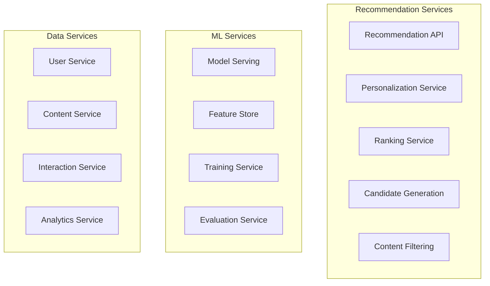

# Design Netflix Recommendation Engine

## Problem Statement

Design a recommendation system for Netflix that can suggest personalized content to 200+ million subscribers worldwide. The system should provide accurate, diverse, and real-time recommendations while handling massive scale and incorporating multiple data sources including viewing history, user preferences, content metadata, and social signals.

### Business Context

Netflix's recommendation system drives 80% of viewer engagement and is crucial for user retention. The system needs to:
- Provide personalized recommendations for each user
- Handle diverse content types (movies, TV shows, documentaries, etc.)
- Adapt to changing user preferences in real-time
- Support multiple recommendation contexts (homepage, search, post-watch)
- Scale to hundreds of millions of users globally

### User Stories

- As a Netflix user, I want to see personalized movie and show recommendations on my homepage
- As a viewer, I want recommendations to adapt based on my recent viewing behavior
- As a user, I want diverse recommendations that help me discover new content
- As a family account holder, I want different recommendations for different profiles

## Requirements Clarification

### Functional Requirements

1. **Personalized Recommendations**: Generate user-specific content recommendations
2. **Multiple Recommendation Types**: 
   - Homepage rows (trending, because you watched, new releases)
   - Post-watch recommendations (what to watch next)
   - Search result ranking
   - Category-based recommendations
3. **Real-time Adaptation**: Update recommendations based on recent user activity
4. **Content Discovery**: Help users find new content they might enjoy
5. **Multi-profile Support**: Different recommendations for different user profiles
6. **A/B Testing**: Support experimentation with different recommendation algorithms

### Non-Functional Requirements

1. **Scale**: 200+ million users, 15,000+ titles, billions of interactions daily
2. **Performance**: 
   - Recommendation generation < 100ms
   - Real-time updates within 5 minutes of user activity
   - 99.9% availability for recommendation service
3. **Accuracy**: Improve user engagement metrics (watch time, completion rate)
4. **Diversity**: Avoid filter bubbles, provide content variety
5. **Freshness**: Include new content and adapt to trending items
6. **Global**: Support multiple languages, regions, and cultural preferences

### Constraints

- Cold start problem for new users and new content
- Data privacy and user consent requirements
- Content licensing restrictions by region
- Limited user feedback (implicit signals mostly)
- Real-time processing requirements

### Assumptions

- User authentication and profile management exist
- Content metadata and catalog management are available
- User interaction tracking is implemented
- Focus on recommendation algorithms and infrastructure#
# Capacity Estimation

### User and Content Metrics

```
Active Users: 200 million
Daily Active Users: 100 million (50% of total)
Average sessions per user per day: 2
Average recommendations shown per session: 50
Daily recommendation requests: 100M × 2 × 50 = 10 billion

Content Catalog:
- Total titles: 15,000
- New titles added daily: 50
- Content metadata updates: 1,000 daily

User Interactions:
- Daily views: 500 million
- Daily ratings: 10 million
- Daily searches: 100 million
- Daily profile switches: 50 million
```

### Data Storage Requirements

```
User Profiles:
- 200M users × 4 profiles avg × 1KB = 800 GB

Viewing History:
- 500M daily views × 365 days × 100 bytes = 18.25 TB annually
- With 3 years retention: ~55 TB

User Preferences & Features:
- 200M users × 10KB features = 2 TB

Content Features:
- 15K titles × 50KB features = 750 MB

Interaction Events:
- 10B daily events × 200 bytes = 2 TB daily
- With 30 days retention: 60 TB

Total Storage: ~120 TB (with replication: ~360 TB)
```

### Compute Requirements

```
Real-time Recommendations:
- 10B requests per day = 115,740 QPS average
- Peak traffic (3x average): 347,220 QPS
- Processing time per request: 50ms
- Required compute capacity: ~17,361 cores

Model Training:
- Daily batch training: 4 hours
- Real-time model updates: continuous
- Feature extraction: 2 hours daily
- A/B testing: 10% additional capacity

ML Infrastructure:
- Training clusters: 1,000 GPU hours daily
- Inference clusters: 500 CPU cores
- Feature stores: 100 TB memory cache
```

## High-Level Architecture

```mermaid
graph TB
    subgraph "Client Layer"
        Web[Web App]
        Mobile[Mobile Apps]
        TV[Smart TV Apps]
    end
    
    subgraph "API Gateway"
        Gateway[API Gateway]
        Auth[Authentication]
    end
    
    subgraph "Recommendation Services"
        RecAPI[Recommendation API]
        Personalization[Personalization Service]
        Ranking[Ranking Service]
        ABTest[A/B Testing Service]
    end
    
    subgraph "ML Pipeline"
        FeatureStore[Feature Store]
        ModelServing[Model Serving]
        Training[Training Pipeline]
        Evaluation[Model Evaluation]
    end
    
    subgraph "Data Processing"
        EventStream[Event Streaming]
        FeatureEng[Feature Engineering]
        DataPipeline[Data Pipeline]
    end
    
    subgraph "Storage Layer"
        UserDB[(User Database)]
        ContentDB[(Content Database)]
        InteractionDB[(Interaction Database)]
        ModelStore[(Model Store)]
        Cache[(Cache Layer)]
    end
    
    Web --> Gateway
    Mobile --> Gateway
    TV --> Gateway
    
    Gateway --> Auth
    Gateway --> RecAPI
    
    RecAPI --> Personalization
    RecAPI --> Ranking
    RecAPI --> ABTest
    
    Personalization --> FeatureStore
    Ranking --> ModelServing
    
    ModelServing --> ModelStore
    FeatureStore --> Cache
    
    EventStream --> FeatureEng
    FeatureEng --> DataPipeline
    DataPipeline --> Training
    
    Training --> ModelStore
    Training --> Evaluation
```## De
tailed Component Design

### 1. Recommendation API Service

**Core API Endpoints:**
```python
from typing import List, Dict, Optional
from dataclasses import dataclass

@dataclass
class RecommendationRequest:
    user_id: str
    profile_id: str
    context: str  # homepage, post_watch, search, category
    num_recommendations: int = 20
    content_types: List[str] = None  # movie, series, documentary
    exclude_watched: bool = True

@dataclass
class RecommendationResponse:
    recommendations: List[Dict]
    recommendation_id: str
    algorithm_version: str
    explanation: Optional[str] = None

class RecommendationAPI:
    def __init__(self):
        self.personalization_service = PersonalizationService()
        self.ranking_service = RankingService()
        self.ab_testing_service = ABTestingService()
        self.cache = RedisCache()
    
    async def get_recommendations(self, request: RecommendationRequest) -> RecommendationResponse:
        # Check cache first
        cache_key = f"rec:{request.user_id}:{request.profile_id}:{request.context}"
        cached_result = await self.cache.get(cache_key)
        if cached_result:
            return cached_result
        
        # Get A/B testing configuration
        ab_config = await self.ab_testing_service.get_config(request.user_id)
        
        # Generate candidate recommendations
        candidates = await self.personalization_service.generate_candidates(
            request, ab_config
        )
        
        # Rank and filter recommendations
        ranked_recommendations = await self.ranking_service.rank_candidates(
            candidates, request, ab_config
        )
        
        # Prepare response
        response = RecommendationResponse(
            recommendations=ranked_recommendations[:request.num_recommendations],
            recommendation_id=self.generate_recommendation_id(),
            algorithm_version=ab_config.algorithm_version
        )
        
        # Cache result
        await self.cache.set(cache_key, response, ttl=300)  # 5 minutes
        
        return response
```

**API Endpoints:**
```
GET /api/v1/recommendations/homepage
Parameters: user_id, profile_id, num_rows, row_size

GET /api/v1/recommendations/post-watch
Parameters: user_id, profile_id, watched_content_id, num_recommendations

GET /api/v1/recommendations/search
Parameters: user_id, profile_id, query, num_results

POST /api/v1/recommendations/feedback
Body: {user_id, profile_id, content_id, action, timestamp}
```

### 2. Machine Learning Pipeline

**Feature Engineering:**
```python
class FeatureEngineering:
    def __init__(self):
        self.user_features = UserFeatureExtractor()
        self.content_features = ContentFeatureExtractor()
        self.interaction_features = InteractionFeatureExtractor()
    
    def extract_user_features(self, user_id: str, profile_id: str) -> Dict:
        """Extract user and profile-specific features"""
        return {
            # Demographic features
            "age_group": self.user_features.get_age_group(user_id),
            "country": self.user_features.get_country(user_id),
            "language_preference": self.user_features.get_language(profile_id),
            
            # Behavioral features
            "viewing_time_patterns": self.user_features.get_viewing_patterns(profile_id),
            "genre_preferences": self.user_features.get_genre_preferences(profile_id),
            "device_preferences": self.user_features.get_device_usage(profile_id),
            
            # Engagement features
            "completion_rate": self.user_features.get_completion_rate(profile_id),
            "binge_watching_tendency": self.user_features.get_binge_tendency(profile_id),
            "discovery_openness": self.user_features.get_discovery_score(profile_id),
            
            # Recency features
            "last_watched_genre": self.user_features.get_recent_genre(profile_id),
            "last_session_time": self.user_features.get_last_session(profile_id),
            "days_since_last_watch": self.user_features.get_days_since_watch(profile_id)
        }
```**Recom
mendation Algorithms:**

*1. Collaborative Filtering:*
```python
class CollaborativeFiltering:
    def __init__(self):
        self.user_item_matrix = None
        self.user_similarity_matrix = None
        self.item_similarity_matrix = None
    
    def train_user_based_cf(self, interactions):
        """Train user-based collaborative filtering"""
        # Create user-item interaction matrix
        self.user_item_matrix = self.create_interaction_matrix(interactions)
        
        # Calculate user similarity using cosine similarity
        self.user_similarity_matrix = cosine_similarity(self.user_item_matrix)
    
    def get_recommendations(self, user_id: str, num_recommendations: int = 20) -> List[str]:
        """Get recommendations for a user"""
        user_idx = self.get_user_index(user_id)
        
        # Get all content that user hasn't watched
        unwatched_content = self.get_unwatched_content(user_id)
        
        # Predict ratings for unwatched content
        predictions = []
        for content_id in unwatched_content:
            predicted_rating = self.predict_user_based(user_id, content_id)
            predictions.append((content_id, predicted_rating))
        
        # Sort by predicted rating and return top N
        predictions.sort(key=lambda x: x[1], reverse=True)
        return [content_id for content_id, _ in predictions[:num_recommendations]]
```

*2. Deep Learning Model:*
```python
import tensorflow as tf
from tensorflow.keras import layers, Model

class DeepRecommendationModel:
    def __init__(self, num_users, num_items, embedding_dim=128):
        self.num_users = num_users
        self.num_items = num_items
        self.embedding_dim = embedding_dim
        self.model = self.build_model()
    
    def build_model(self):
        # User inputs
        user_input = layers.Input(shape=(), name='user_id')
        user_embedding = layers.Embedding(self.num_users, self.embedding_dim)(user_input)
        user_vec = layers.Flatten()(user_embedding)
        
        # Item inputs
        item_input = layers.Input(shape=(), name='item_id')
        item_embedding = layers.Embedding(self.num_items, self.embedding_dim)(item_input)
        item_vec = layers.Flatten()(item_embedding)
        
        # Feature inputs
        user_features = layers.Input(shape=(50,), name='user_features')
        item_features = layers.Input(shape=(30,), name='item_features')
        context_features = layers.Input(shape=(10,), name='context_features')
        
        # Concatenate all features
        concat = layers.Concatenate()([
            user_vec, item_vec, user_features, item_features, context_features
        ])
        
        # Deep neural network
        dense1 = layers.Dense(512, activation='relu')(concat)
        dropout1 = layers.Dropout(0.3)(dense1)
        dense2 = layers.Dense(256, activation='relu')(dropout1)
        dropout2 = layers.Dropout(0.3)(dense2)
        dense3 = layers.Dense(128, activation='relu')(dropout2)
        
        # Output layer
        output = layers.Dense(1, activation='sigmoid', name='rating')(dense3)
        
        model = Model(
            inputs=[user_input, item_input, user_features, item_features, context_features],
            outputs=output
        )
        
        model.compile(
            optimizer='adam',
            loss='binary_crossentropy',
            metrics=['accuracy', 'precision', 'recall']
        )
        
        return model
```

### 3. Real-time Feature Store

**Feature Store Architecture:**
```python
class FeatureStore:
    def __init__(self):
        self.online_store = Redis()  # Low-latency feature serving
        self.offline_store = Cassandra()  # Historical feature storage
        self.feature_pipeline = KafkaStreams()  # Real-time feature updates
    
    async def get_user_features(self, user_id: str, profile_id: str) -> Dict:
        """Get real-time user features"""
        cache_key = f"user_features:{user_id}:{profile_id}"
        
        # Try online store first
        features = await self.online_store.hgetall(cache_key)
        if features:
            return self.deserialize_features(features)
        
        # Fallback to offline store
        features = await self.offline_store.get_user_features(user_id, profile_id)
        
        # Cache in online store
        await self.online_store.hmset(cache_key, self.serialize_features(features))
        await self.online_store.expire(cache_key, 3600)  # 1 hour TTL
        
        return features
    
    async def update_user_features(self, user_id: str, profile_id: str, 
                                 interaction_event: Dict):
        """Update user features based on new interaction"""
        # Real-time feature updates
        current_features = await self.get_user_features(user_id, profile_id)
        
        # Update features based on interaction
        updated_features = self.compute_feature_updates(current_features, interaction_event)
        
        # Update online store
        cache_key = f"user_features:{user_id}:{profile_id}"
        await self.online_store.hmset(cache_key, self.serialize_features(updated_features))
        
        # Send to offline store for batch processing
        await self.feature_pipeline.send_update(user_id, profile_id, updated_features)
```## Scaling
 the Design

### Horizontal Scaling Strategies

**1. Microservices Architecture:**


**2. Data Partitioning:**

*User-based Sharding:*
```python
class UserSharding:
    def __init__(self, num_shards=1000):
        self.num_shards = num_shards
    
    def get_shard(self, user_id: str) -> int:
        return hash(user_id) % self.num_shards
    
    def get_database_connection(self, user_id: str):
        shard_id = self.get_shard(user_id)
        return self.shard_connections[shard_id]
```

**3. Caching Strategy:**

*Multi-level Caching:*
```python
class RecommendationCache:
    def __init__(self):
        self.l1_cache = LocalCache()  # In-memory cache
        self.l2_cache = Redis()       # Distributed cache
        self.l3_cache = CDN()         # Edge cache
    
    async def get_recommendations(self, cache_key: str):
        # L1 Cache - Local memory (fastest)
        result = self.l1_cache.get(cache_key)
        if result:
            return result
        
        # L2 Cache - Redis (fast)
        result = await self.l2_cache.get(cache_key)
        if result:
            self.l1_cache.set(cache_key, result, ttl=300)
            return result
        
        return None
```

## Model Training and Evaluation

### Training Pipeline

**Batch Training:**
```python
class TrainingPipeline:
    def __init__(self):
        self.data_loader = DataLoader()
        self.feature_engineer = FeatureEngineering()
        self.model_trainer = ModelTrainer()
        self.model_evaluator = ModelEvaluator()
    
    async def run_daily_training(self):
        """Run daily model training pipeline"""
        # Extract training data
        training_data = await self.data_loader.get_training_data(
            start_date=datetime.now() - timedelta(days=30),
            end_date=datetime.now()
        )
        
        # Feature engineering
        features = await self.feature_engineer.process_training_data(training_data)
        
        # Split data
        train_features, val_features, test_features = self.split_data(features)
        
        # Train models
        models = {}
        for model_type in ['collaborative_filtering', 'deep_learning', 'matrix_factorization']:
            model = await self.model_trainer.train_model(
                model_type, train_features, val_features
            )
            models[model_type] = model
        
        # Evaluate models
        evaluation_results = {}
        for model_type, model in models.items():
            metrics = await self.model_evaluator.evaluate_model(model, test_features)
            evaluation_results[model_type] = metrics
        
        # Select best model
        best_model = self.select_best_model(evaluation_results)
        
        # Deploy model
        await self.deploy_model(best_model)
        
        return evaluation_results
```

### Evaluation Metrics

**Offline Metrics:**
```python
class OfflineEvaluation:
    def calculate_metrics(self, predictions: List[float], ground_truth: List[float]) -> Dict:
        return {
            # Accuracy metrics
            "rmse": self.calculate_rmse(predictions, ground_truth),
            "mae": self.calculate_mae(predictions, ground_truth),
            "precision_at_k": self.calculate_precision_at_k(predictions, ground_truth, k=10),
            "recall_at_k": self.calculate_recall_at_k(predictions, ground_truth, k=10),
            "ndcg_at_k": self.calculate_ndcg_at_k(predictions, ground_truth, k=10),
            
            # Diversity metrics
            "intra_list_diversity": self.calculate_diversity(predictions),
            "coverage": self.calculate_catalog_coverage(predictions),
            "novelty": self.calculate_novelty(predictions),
            
            # Business metrics
            "click_through_rate": self.calculate_ctr(predictions, ground_truth),
            "conversion_rate": self.calculate_conversion_rate(predictions, ground_truth)
        }
```

## Follow-up Questions

### Technical Deep Dives
1. **How would you handle the cold start problem for new users and new content?**
2. **How would you implement real-time personalization that adapts within a single session?**
3. **How would you handle recommendation explainability and transparency?**
4. **How would you implement multi-armed bandit algorithms for exploration vs exploitation?**

### Scaling Scenarios
1. **How would you scale the system to handle 1 billion users?**
2. **How would you implement cross-platform recommendations (mobile, TV, web)?**
3. **How would you handle recommendations for shared accounts and multiple profiles?**
4. **How would you implement global recommendations with regional content restrictions?**

### Business Requirements
1. **How would you incorporate business objectives (revenue, engagement) into recommendations?**
2. **How would you handle seasonal trends and trending content in recommendations?**
3. **How would you implement recommendation diversity to avoid filter bubbles?**
4. **How would you measure and optimize the business impact of recommendations?**

## Summary

This Netflix recommendation engine design demonstrates:

- **Scalable ML Pipeline**: Real-time feature engineering and model serving at massive scale
- **Multiple Algorithm Support**: Collaborative filtering, deep learning, and hybrid approaches
- **Real-time Personalization**: Immediate adaptation to user behavior and preferences
- **A/B Testing Framework**: Continuous experimentation and optimization
- **Privacy and Security**: GDPR compliance and secure data handling
- **Business Impact**: Focus on engagement, retention, and content discovery

The system balances accuracy, diversity, and performance while providing personalized experiences that drive user engagement and business value.