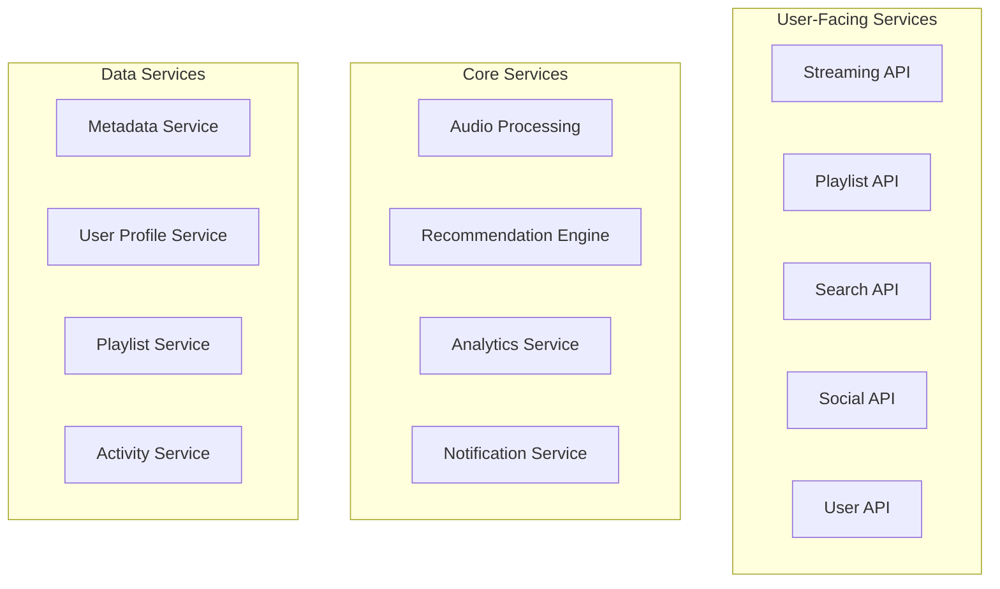

# Design Spotify Music Streaming Platform

## Problem Statement

Design a music streaming platform like Spotify that allows users to stream music, create playlists, discover new songs, and share music with friends. The system should handle millions of concurrent users, provide high-quality audio streaming, personalized recommendations, and social features while managing a catalog of tens of millions of songs.

### Business Context

Spotify serves over 400 million users with 180 million premium subscribers, streaming over 4 billion hours of music monthly. The platform needs to:
- Provide seamless music streaming with minimal buffering
- Offer personalized music discovery and recommendations
- Support social features like playlist sharing and collaborative playlists
- Handle massive music catalog with licensing and royalty management
- Deliver high-quality audio with adaptive bitrate streaming

### User Stories

- As a music lover, I want to stream songs instantly with high audio quality
- As a user, I want personalized playlists and music recommendations
- As a social user, I want to share playlists and see what friends are listening to
- As a mobile user, I want offline music downloads for areas with poor connectivity
- As an artist, I want my music to be discoverable and properly attributed

## Requirements Clarification

### Functional Requirements

1. **Music Streaming**: Stream songs with adaptive quality based on network conditions
2. **Music Discovery**: Search songs, artists, albums, and playlists
3. **Playlist Management**: Create, edit, and share playlists
4. **Personalization**: Personalized recommendations and auto-generated playlists
5. **Social Features**: Follow friends, share music, collaborative playlists
6. **Offline Mode**: Download songs for offline listening (premium feature)
7. **Audio Quality**: Multiple quality options (96kbps to 320kbps)

### Non-Functional Requirements

1. **Scale**: 400 million users, 100 million concurrent streams, 70+ million songs
2. **Performance**: 
   - Song start time < 1 second
   - 99.9% uptime for streaming service
   - Support for 100,000+ concurrent streams per song
3. **Audio Quality**: Lossless audio support, adaptive bitrate streaming
4. **Storage**: Petabytes of audio content with global distribution
5. **Bandwidth**: Efficient streaming to minimize data usage and costs
6. **Real-time**: Real-time social features and collaborative playlists

### Constraints

- Music licensing restrictions by region and label
- Royalty payment calculations and reporting
- Copyright protection and piracy prevention
- Mobile data usage optimization
- Battery life optimization for mobile devices

### Assumptions

- User authentication and subscription management exist
- Payment processing and subscription billing are separate systems
- Music licensing and content acquisition are handled separately
- Focus on core streaming and social features#
# Capacity Estimation

### User and Content Metrics

```
Total Users: 400 million
Premium Users: 180 million (45%)
Daily Active Users: 200 million (50%)
Concurrent Users (Peak): 100 million
Average listening time per user: 2.5 hours daily
Songs in catalog: 70 million
New songs added daily: 60,000

Streaming Metrics:
- Daily streams: 200M users × 2.5 hours × 20 songs/hour = 10 billion streams
- Peak concurrent streams: 100 million
- Average song duration: 3.5 minutes
- Songs per user per day: 50
```

### Storage Requirements

```
Audio Storage:
- 70M songs × 4 quality levels × average 8MB = 2.24 PB
- With metadata and artwork: ~2.5 PB
- With 3x replication across regions: 7.5 PB

User Data:
- 400M users × 10KB profile data = 4 TB
- Playlist data: 400M users × 50 playlists × 1KB = 20 TB
- Listening history: 10B daily streams × 100 bytes × 365 days = 365 TB

Recommendation Data:
- User preferences: 400M users × 5KB = 2 TB
- Song features: 70M songs × 2KB = 140 GB
- Interaction matrix: ~50 TB (sparse)

Total Storage: ~8 PB (with replication and backups)
```

### Bandwidth Requirements

```
Audio Streaming:
- Peak concurrent streams: 100 million
- Average bitrate: 160 kbps (adaptive streaming)
- Peak bandwidth: 100M × 160 kbps = 16 Tbps

Upload Bandwidth (new content):
- 60K new songs daily × 30MB average = 1.8 TB daily
- Peak upload: ~200 Mbps

CDN Requirements:
- Global distribution across 50+ regions
- Edge caching for popular songs
- Adaptive bitrate streaming support
```

### Compute Requirements

```
Streaming Service:
- 10B daily streams = 115,740 requests/second average
- Peak: 347,220 requests/second (3x average)
- Processing time per request: 10ms
- Required cores: ~3,472 cores

Recommendation Engine:
- Real-time recommendations: 200M DAU × 100 recommendations = 20B daily
- Batch processing: 4 hours daily for model training
- Feature extraction: 2 hours daily

Search and Discovery:
- Search queries: 500 million daily
- Elasticsearch cluster: 100 nodes
- Real-time indexing for new content
```

## High-Level Architecture

```mermaid
graph TB
    subgraph "Client Applications"
        Mobile[Mobile Apps]
        Web[Web Player]
        Desktop[Desktop App]
        Smart[Smart Speakers]
    end
    
    subgraph "CDN & Edge"
        CDN[Global CDN]
        Edge[Edge Servers]
    end
    
    subgraph "API Gateway"
        Gateway[API Gateway]
        Auth[Authentication]
        RateLimit[Rate Limiting]
    end
    
    subgraph "Core Services"
        StreamingAPI[Streaming API]
        PlaylistAPI[Playlist API]
        SearchAPI[Search API]
        SocialAPI[Social API]
        RecommendationAPI[Recommendation API]
    end
    
    subgraph "Data Processing"
        AudioProcessor[Audio Processing]
        MetadataProcessor[Metadata Processing]
        AnalyticsProcessor[Analytics Processing]
    end
    
    subgraph "Storage Systems"
        AudioStorage[Audio Storage]
        MetadataDB[(Metadata DB)]
        UserDB[(User Database)]
        PlaylistDB[(Playlist DB)]
        AnalyticsDB[(Analytics DB)]
        Cache[(Cache Layer)]
    end
    
    subgraph "ML & Recommendations"
        RecommendationEngine[Recommendation Engine]
        PersonalizationService[Personalization Service]
        FeatureStore[Feature Store]
    end
    
    Mobile --> CDN
    Web --> CDN
    Desktop --> CDN
    Smart --> CDN
    
    CDN --> Edge
    Edge --> Gateway
    
    Gateway --> Auth
    Gateway --> RateLimit
    Gateway --> StreamingAPI
    Gateway --> PlaylistAPI
    Gateway --> SearchAPI
    Gateway --> SocialAPI
    Gateway --> RecommendationAPI
    
    StreamingAPI --> AudioStorage
    StreamingAPI --> Cache
    
    PlaylistAPI --> PlaylistDB
    SearchAPI --> MetadataDB
    SocialAPI --> UserDB
    RecommendationAPI --> RecommendationEngine
    
    AudioProcessor --> AudioStorage
    MetadataProcessor --> MetadataDB
    AnalyticsProcessor --> AnalyticsDB
    
    RecommendationEngine --> FeatureStore
    PersonalizationService --> FeatureStore
```## Deta
iled Component Design

### 1. Audio Streaming Service

**Streaming API:**
```python
from typing import Optional, Dict, List
from dataclasses import dataclass
from enum import Enum

class AudioQuality(Enum):
    LOW = "96kbps"
    NORMAL = "160kbps"
    HIGH = "320kbps"
    LOSSLESS = "1411kbps"

@dataclass
class StreamRequest:
    user_id: str
    song_id: str
    quality: AudioQuality
    device_id: str
    position: int = 0  # Resume position in seconds

@dataclass
class StreamResponse:
    stream_url: str
    duration: int
    quality: AudioQuality
    format: str
    expires_at: int

class AudioStreamingService:
    def __init__(self):
        self.cdn_manager = CDNManager()
        self.audio_storage = AudioStorage()
        self.user_service = UserService()
        self.analytics = StreamingAnalytics()
    
    async def get_stream_url(self, request: StreamRequest) -> StreamResponse:
        # Validate user subscription and permissions
        user = await self.user_service.get_user(request.user_id)
        if not self.can_stream_quality(user, request.quality):
            request.quality = self.get_max_allowed_quality(user)
        
        # Check regional licensing
        if not await self.is_song_available_in_region(request.song_id, user.region):
            raise SongNotAvailableError("Song not available in your region")
        
        # Get optimal CDN endpoint
        cdn_endpoint = await self.cdn_manager.get_optimal_endpoint(
            user.location, request.song_id, request.quality
        )
        
        # Generate signed streaming URL
        stream_url = await self.generate_signed_url(
            cdn_endpoint, request.song_id, request.quality, request.user_id
        )
        
        # Track streaming event
        await self.analytics.track_stream_start(request)
        
        # Get song metadata
        song_metadata = await self.get_song_metadata(request.song_id)
        
        return StreamResponse(
            stream_url=stream_url,
            duration=song_metadata.duration,
            quality=request.quality,
            format="mp3",  # or "ogg", "aac" based on client support
            expires_at=int(time.time()) + 3600  # 1 hour expiry
        )
    
    def can_stream_quality(self, user: User, quality: AudioQuality) -> bool:
        """Check if user subscription allows requested quality"""
        if user.subscription_type == "free":
            return quality in [AudioQuality.LOW, AudioQuality.NORMAL]
        elif user.subscription_type == "premium":
            return quality != AudioQuality.LOSSLESS
        elif user.subscription_type == "hifi":
            return True
        return False
```

**Adaptive Bitrate Streaming:**
```python
class AdaptiveBitrateStreaming:
    def __init__(self):
        self.quality_ladder = [
            {"bitrate": 96, "quality": "low"},
            {"bitrate": 160, "quality": "normal"},
            {"bitrate": 320, "quality": "high"}
        ]
    
    async def get_adaptive_stream(self, song_id: str, user_context: Dict) -> Dict:
        """Generate adaptive streaming manifest"""
        # Analyze user's network conditions
        network_speed = await self.estimate_network_speed(user_context)
        device_capabilities = await self.get_device_capabilities(user_context)
        
        # Select appropriate quality levels
        available_qualities = self.select_quality_levels(
            network_speed, device_capabilities, user_context["subscription"]
        )
        
        # Generate HLS manifest
        manifest = self.generate_hls_manifest(song_id, available_qualities)
        
        return {
            "manifest_url": f"/api/v1/stream/{song_id}/manifest.m3u8",
            "manifest_content": manifest,
            "default_quality": self.select_default_quality(available_qualities, network_speed)
        }
    
    def generate_hls_manifest(self, song_id: str, qualities: List[Dict]) -> str:
        """Generate HLS master playlist"""
        manifest = "#EXTM3U\n#EXT-X-VERSION:3\n\n"
        
        for quality in qualities:
            manifest += f"#EXT-X-STREAM-INF:BANDWIDTH={quality['bitrate']*1000},CODECS=\"mp4a.40.2\"\n"
            manifest += f"{song_id}/{quality['quality']}/playlist.m3u8\n"
        
        return manifest
```

### 2. Playlist Management System

**Playlist Service:**
```python
@dataclass
class Playlist:
    playlist_id: str
    name: str
    description: str
    owner_id: str
    is_public: bool
    is_collaborative: bool
    songs: List[str]  # List of song IDs
    followers: List[str]  # List of user IDs
    created_at: datetime
    updated_at: datetime

class PlaylistService:
    def __init__(self):
        self.playlist_db = PlaylistDatabase()
        self.user_service = UserService()
        self.notification_service = NotificationService()
        self.cache = RedisCache()
    
    async def create_playlist(self, user_id: str, name: str, 
                            description: str = "", is_public: bool = True) -> Playlist:
        """Create a new playlist"""
        playlist = Playlist(
            playlist_id=self.generate_playlist_id(),
            name=name,
            description=description,
            owner_id=user_id,
            is_public=is_public,
            is_collaborative=False,
            songs=[],
            followers=[],
            created_at=datetime.now(),
            updated_at=datetime.now()
        )
        
        # Save to database
        await self.playlist_db.save_playlist(playlist)
        
        # Cache playlist
        await self.cache.set(f"playlist:{playlist.playlist_id}", playlist, ttl=3600)
        
        return playlist
    
    async def add_song_to_playlist(self, playlist_id: str, song_id: str, 
                                 user_id: str, position: Optional[int] = None) -> bool:
        """Add song to playlist"""
        # Get playlist
        playlist = await self.get_playlist(playlist_id)
        
        # Check permissions
        if not await self.can_modify_playlist(playlist, user_id):
            raise PermissionDeniedError("Cannot modify this playlist")
        
        # Add song at specified position or end
        if position is None:
            playlist.songs.append(song_id)
        else:
            playlist.songs.insert(position, song_id)
        
        playlist.updated_at = datetime.now()
        
        # Update database
        await self.playlist_db.update_playlist(playlist)
        
        # Update cache
        await self.cache.set(f"playlist:{playlist_id}", playlist, ttl=3600)
        
        # Notify collaborators if collaborative playlist
        if playlist.is_collaborative:
            await self.notify_collaborators(playlist, user_id, "song_added", song_id)
        
        return True
    
    async def get_user_playlists(self, user_id: str) -> List[Playlist]:
        """Get all playlists for a user"""
        # Check cache first
        cache_key = f"user_playlists:{user_id}"
        cached_playlists = await self.cache.get(cache_key)
        if cached_playlists:
            return cached_playlists
        
        # Get from database
        playlists = await self.playlist_db.get_user_playlists(user_id)
        
        # Cache result
        await self.cache.set(cache_key, playlists, ttl=1800)
        
        return playlists
    
    async def make_collaborative(self, playlist_id: str, user_id: str) -> bool:
        """Make playlist collaborative"""
        playlist = await self.get_playlist(playlist_id)
        
        # Only owner can make playlist collaborative
        if playlist.owner_id != user_id:
            raise PermissionDeniedError("Only owner can make playlist collaborative")
        
        playlist.is_collaborative = True
        playlist.updated_at = datetime.now()
        
        await self.playlist_db.update_playlist(playlist)
        await self.cache.delete(f"playlist:{playlist_id}")
        
        return True
```

### 3. Music Discovery and Search

**Search Service:**
```python
from elasticsearch import AsyncElasticsearch
from typing import List, Dict, Optional

class MusicSearchService:
    def __init__(self):
        self.es_client = AsyncElasticsearch()
        self.cache = RedisCache()
        self.analytics = SearchAnalytics()
    
    async def search(self, query: str, user_id: str, filters: Dict = None, 
                    limit: int = 20, offset: int = 0) -> Dict:
        """Search for songs, artists, albums, and playlists"""
        # Check cache for popular queries
        cache_key = f"search:{hash(query)}:{hash(str(filters))}:{offset}:{limit}"
        cached_result = await self.cache.get(cache_key)
        if cached_result:
            await self.analytics.track_search(user_id, query, "cache_hit")
            return cached_result
        
        # Build Elasticsearch query
        search_query = self.build_search_query(query, filters, user_id)
        
        # Execute search
        response = await self.es_client.search(
            index=["songs", "artists", "albums", "playlists"],
            body=search_query,
            size=limit,
            from_=offset
        )
        
        # Process results
        results = self.process_search_results(response, user_id)
        
        # Cache results for popular queries
        if self.is_popular_query(query):
            await self.cache.set(cache_key, results, ttl=300)
        
        # Track search analytics
        await self.analytics.track_search(user_id, query, "success", len(results["songs"]))
        
        return results
    
    def build_search_query(self, query: str, filters: Dict, user_id: str) -> Dict:
        """Build Elasticsearch query with personalization"""
        # Base multi-match query
        base_query = {
            "query": {
                "bool": {
                    "should": [
                        {
                            "multi_match": {
                                "query": query,
                                "fields": [
                                    "title^3",      # Boost song titles
                                    "artist^2",     # Boost artist names
                                    "album^1.5",    # Boost album names
                                    "lyrics"        # Include lyrics
                                ],
                                "type": "best_fields",
                                "fuzziness": "AUTO"
                            }
                        },
                        {
                            # Personalization boost based on user preferences
                            "function_score": {
                                "query": {"match_all": {}},
                                "functions": [
                                    {
                                        "filter": {"terms": {"genre": self.get_user_preferred_genres(user_id)}},
                                        "weight": 1.5
                                    },
                                    {
                                        "filter": {"terms": {"artist_id": self.get_user_favorite_artists(user_id)}},
                                        "weight": 2.0
                                    }
                                ],
                                "score_mode": "multiply"
                            }
                        }
                    ]
                }
            },
            "highlight": {
                "fields": {
                    "title": {},
                    "artist": {},
                    "lyrics": {"fragment_size": 100}
                }
            },
            "aggs": {
                "genres": {"terms": {"field": "genre"}},
                "artists": {"terms": {"field": "artist"}},
                "release_years": {"terms": {"field": "release_year"}}
            }
        }
        
        # Apply filters
        if filters:
            filter_clauses = []
            if "genre" in filters:
                filter_clauses.append({"terms": {"genre": filters["genre"]}})
            if "year_range" in filters:
                filter_clauses.append({
                    "range": {
                        "release_year": {
                            "gte": filters["year_range"]["from"],
                            "lte": filters["year_range"]["to"]
                        }
                    }
                })
            if "duration_range" in filters:
                filter_clauses.append({
                    "range": {
                        "duration": {
                            "gte": filters["duration_range"]["min"],
                            "lte": filters["duration_range"]["max"]
                        }
                    }
                })
            
            if filter_clauses:
                base_query["query"]["bool"]["filter"] = filter_clauses
        
        return base_query
```### 4. P
ersonalization and Recommendation Engine

**Music Recommendation System:**
```python
class MusicRecommendationEngine:
    def __init__(self):
        self.collaborative_filtering = CollaborativeFiltering()
        self.content_based = ContentBasedFiltering()
        self.deep_learning_model = DeepMusicModel()
        self.feature_store = MusicFeatureStore()
        self.user_profile_service = UserProfileService()
    
    async def get_personalized_recommendations(self, user_id: str, 
                                            context: str = "discover") -> List[Dict]:
        """Generate personalized music recommendations"""
        # Get user profile and listening history
        user_profile = await self.user_profile_service.get_profile(user_id)
        listening_history = await self.get_recent_listening_history(user_id, days=30)
        
        # Generate candidates from different algorithms
        cf_candidates = await self.collaborative_filtering.get_recommendations(
            user_id, num_candidates=100
        )
        
        cb_candidates = await self.content_based.get_recommendations(
            user_profile, listening_history, num_candidates=100
        )
        
        dl_candidates = await self.deep_learning_model.predict_preferences(
            user_id, context, num_candidates=100
        )
        
        # Combine and rank candidates
        combined_candidates = self.combine_candidates([
            (cf_candidates, 0.4),    # 40% weight for collaborative filtering
            (cb_candidates, 0.3),    # 30% weight for content-based
            (dl_candidates, 0.3)     # 30% weight for deep learning
        ])
        
        # Apply diversity and freshness filters
        final_recommendations = await self.apply_diversity_filters(
            combined_candidates, user_profile, context
        )
        
        return final_recommendations[:50]  # Return top 50 recommendations
    
    async def generate_discover_weekly(self, user_id: str) -> List[str]:
        """Generate Discover Weekly playlist"""
        # Get user's music taste profile
        taste_profile = await self.analyze_user_taste(user_id)
        
        # Find similar users
        similar_users = await self.find_similar_users(user_id, taste_profile)
        
        # Get songs liked by similar users but not heard by target user
        candidate_songs = await self.get_unheard_songs_from_similar_users(
            user_id, similar_users
        )
        
        # Score songs based on multiple factors
        scored_songs = []
        for song_id in candidate_songs:
            score = await self.calculate_song_score(
                song_id, user_id, taste_profile, similar_users
            )
            scored_songs.append((song_id, score))
        
        # Sort by score and apply diversity
        scored_songs.sort(key=lambda x: x[1], reverse=True)
        diverse_songs = self.apply_genre_diversity(scored_songs, max_per_genre=3)
        
        return [song_id for song_id, _ in diverse_songs[:30]]
    
    async def calculate_song_score(self, song_id: str, user_id: str, 
                                 taste_profile: Dict, similar_users: List[str]) -> float:
        """Calculate recommendation score for a song"""
        song_features = await self.feature_store.get_song_features(song_id)
        
        # Content-based score
        content_score = self.calculate_content_similarity(song_features, taste_profile)
        
        # Collaborative score
        collab_score = self.calculate_collaborative_score(song_id, similar_users)
        
        # Popularity score (with diminishing returns)
        popularity_score = min(song_features["popularity"] / 100, 0.8)
        
        # Freshness score (boost newer songs slightly)
        freshness_score = self.calculate_freshness_score(song_features["release_date"])
        
        # Combine scores
        final_score = (
            content_score * 0.4 +
            collab_score * 0.3 +
            popularity_score * 0.2 +
            freshness_score * 0.1
        )
        
        return final_score
```

**Audio Feature Analysis:**
```python
class AudioFeatureAnalyzer:
    def __init__(self):
        self.audio_processor = AudioProcessor()
        self.ml_models = AudioMLModels()
    
    async def extract_audio_features(self, song_id: str, audio_file_path: str) -> Dict:
        """Extract comprehensive audio features from song"""
        # Load audio file
        audio_data = await self.audio_processor.load_audio(audio_file_path)
        
        # Extract basic features
        basic_features = {
            "duration": self.audio_processor.get_duration(audio_data),
            "tempo": self.audio_processor.get_tempo(audio_data),
            "key": self.audio_processor.get_key(audio_data),
            "time_signature": self.audio_processor.get_time_signature(audio_data)
        }
        
        # Extract advanced features using ML models
        advanced_features = {
            "danceability": await self.ml_models.predict_danceability(audio_data),
            "energy": await self.ml_models.predict_energy(audio_data),
            "valence": await self.ml_models.predict_valence(audio_data),  # Positivity
            "acousticness": await self.ml_models.predict_acousticness(audio_data),
            "instrumentalness": await self.ml_models.predict_instrumentalness(audio_data),
            "liveness": await self.ml_models.predict_liveness(audio_data),
            "speechiness": await self.ml_models.predict_speechiness(audio_data)
        }
        
        # Extract spectral features
        spectral_features = {
            "spectral_centroid": self.audio_processor.get_spectral_centroid(audio_data),
            "spectral_rolloff": self.audio_processor.get_spectral_rolloff(audio_data),
            "mfcc": self.audio_processor.get_mfcc(audio_data),  # Mel-frequency cepstral coefficients
            "chroma": self.audio_processor.get_chroma(audio_data)
        }
        
        # Combine all features
        all_features = {**basic_features, **advanced_features, **spectral_features}
        
        # Store features
        await self.feature_store.store_song_features(song_id, all_features)
        
        return all_features
```

### 5. Social Features

**Social Music Service:**
```python
class SocialMusicService:
    def __init__(self):
        self.user_service = UserService()
        self.playlist_service = PlaylistService()
        self.activity_service = ActivityService()
        self.notification_service = NotificationService()
    
    async def follow_user(self, follower_id: str, followee_id: str) -> bool:
        """Follow another user"""
        # Check if already following
        if await self.is_following(follower_id, followee_id):
            return False
        
        # Add follow relationship
        await self.user_service.add_follow_relationship(follower_id, followee_id)
        
        # Send notification
        await self.notification_service.send_notification(
            followee_id, 
            f"User {follower_id} started following you",
            "follow"
        )
        
        # Track activity
        await self.activity_service.track_activity(
            follower_id, "follow", {"target_user": followee_id}
        )
        
        return True
    
    async def share_song(self, user_id: str, song_id: str, 
                        target_users: List[str], message: str = "") -> bool:
        """Share a song with friends"""
        # Get song details
        song = await self.get_song_details(song_id)
        
        # Create share activity
        share_activity = {
            "type": "song_share",
            "user_id": user_id,
            "song_id": song_id,
            "message": message,
            "timestamp": datetime.now()
        }
        
        # Send to target users
        for target_user in target_users:
            await self.activity_service.add_activity_to_feed(target_user, share_activity)
            
            # Send push notification
            await self.notification_service.send_push_notification(
                target_user,
                f"{user_id} shared a song with you: {song['title']} by {song['artist']}",
                {"song_id": song_id, "shared_by": user_id}
            )
        
        return True
    
    async def get_friend_activity(self, user_id: str, limit: int = 50) -> List[Dict]:
        """Get recent activity from friends"""
        # Get user's friends
        friends = await self.user_service.get_friends(user_id)
        
        # Get recent activities from friends
        activities = []
        for friend_id in friends:
            friend_activities = await self.activity_service.get_user_activities(
                friend_id, limit=10, activity_types=["song_play", "playlist_create", "song_like"]
            )
            activities.extend(friend_activities)
        
        # Sort by timestamp and limit
        activities.sort(key=lambda x: x["timestamp"], reverse=True)
        return activities[:limit]
    
    async def create_collaborative_playlist(self, creator_id: str, name: str, 
                                          collaborators: List[str]) -> str:
        """Create a collaborative playlist"""
        # Create playlist
        playlist = await self.playlist_service.create_playlist(
            creator_id, name, is_collaborative=True
        )
        
        # Add collaborators
        for collaborator_id in collaborators:
            await self.playlist_service.add_collaborator(playlist.playlist_id, collaborator_id)
            
            # Send invitation notification
            await self.notification_service.send_notification(
                collaborator_id,
                f"{creator_id} invited you to collaborate on playlist '{name}'",
                "playlist_collaboration",
                {"playlist_id": playlist.playlist_id}
            )
        
        return playlist.playlist_id
```

## Scaling the Design

### Horizontal Scaling Strategies

**1. Microservices Architecture:**


**2. Database Sharding:**

*User-based Sharding:*
```python
class UserDataSharding:
    def __init__(self, num_shards=1000):
        self.num_shards = num_shards
    
    def get_user_shard(self, user_id: str) -> int:
        return hash(user_id) % self.num_shards
    
    def get_playlist_shard(self, playlist_id: str) -> int:
        # Shard playlists by owner to keep user data together
        owner_id = self.extract_owner_from_playlist_id(playlist_id)
        return self.get_user_shard(owner_id)
```

*Content-based Partitioning:*
```python
class ContentPartitioning:
    def partition_songs_by_popularity(self, song_id: str) -> str:
        popularity_score = self.get_song_popularity(song_id)
        if popularity_score > 0.9:
            return "hot_songs"      # Most popular songs
        elif popularity_score > 0.7:
            return "warm_songs"     # Moderately popular
        else:
            return "cold_songs"     # Less popular songs
    
    def partition_by_genre(self, song_id: str) -> str:
        genre = self.get_primary_genre(song_id)
        return f"genre_{genre.lower().replace(' ', '_')}"
```

**3. Caching Strategy:**

*Multi-level Audio Caching:*
```python
class AudioCachingStrategy:
    def __init__(self):
        self.edge_cache = EdgeCache()      # CDN edge locations
        self.regional_cache = RegionalCache()  # Regional data centers
        self.origin_storage = OriginStorage()  # Primary storage
    
    async def get_audio_stream(self, song_id: str, quality: str, user_location: str):
        # Try edge cache first (closest to user)
        edge_url = await self.edge_cache.get_stream_url(song_id, quality, user_location)
        if edge_url:
            return edge_url
        
        # Try regional cache
        regional_url = await self.regional_cache.get_stream_url(song_id, quality, user_location)
        if regional_url:
            # Pre-populate edge cache
            await self.edge_cache.prefetch(song_id, quality, user_location)
            return regional_url
        
        # Fallback to origin storage
        origin_url = await self.origin_storage.get_stream_url(song_id, quality)
        
        # Populate caches asynchronously
        asyncio.create_task(self.populate_caches(song_id, quality, user_location))
        
        return origin_url
```

### Performance Optimizations

**1. Audio Streaming Optimization:**
```python
class StreamingOptimization:
    def __init__(self):
        self.preloader = AudioPreloader()
        self.compressor = AudioCompressor()
        self.quality_adapter = QualityAdapter()
    
    async def optimize_streaming_experience(self, user_id: str, current_song: str):
        """Optimize streaming for better user experience"""
        # Preload next songs in queue
        next_songs = await self.get_user_queue(user_id)
        for song_id in next_songs[:3]:  # Preload next 3 songs
            await self.preloader.preload_song(song_id, user_id)
        
        # Adapt quality based on network conditions
        network_quality = await self.measure_network_quality(user_id)
        optimal_quality = self.quality_adapter.get_optimal_quality(network_quality)
        
        # Compress audio for mobile users on cellular
        if await self.is_mobile_cellular(user_id):
            await self.compressor.enable_mobile_compression(user_id)
    
    async def predictive_caching(self, user_id: str):
        """Predictively cache songs user is likely to play"""
        # Get user's listening patterns
        listening_patterns = await self.analyze_listening_patterns(user_id)
        
        # Predict next songs using ML model
        predicted_songs = await self.predict_next_songs(user_id, listening_patterns)
        
        # Cache predicted songs at edge locations
        user_location = await self.get_user_location(user_id)
        for song_id in predicted_songs:
            await self.edge_cache.prefetch(song_id, user_location)
```

**2. Real-time Features:**
```python
class RealTimeFeatures:
    def __init__(self):
        self.websocket_manager = WebSocketManager()
        self.activity_stream = ActivityStream()
        self.collaborative_sync = CollaborativeSync()
    
    async def handle_real_time_collaboration(self, playlist_id: str, user_id: str, action: Dict):
        """Handle real-time collaborative playlist updates"""
        # Validate action
        if not await self.validate_collaboration_action(playlist_id, user_id, action):
            return
        
        # Apply action to playlist
        await self.apply_playlist_action(playlist_id, action)
        
        # Broadcast to all collaborators
        collaborators = await self.get_playlist_collaborators(playlist_id)
        for collaborator_id in collaborators:
            if collaborator_id != user_id:  # Don't send to action originator
                await self.websocket_manager.send_to_user(
                    collaborator_id,
                    {
                        "type": "playlist_update",
                        "playlist_id": playlist_id,
                        "action": action,
                        "user": user_id
                    }
                )
    
    async def sync_listening_session(self, session_id: str, participants: List[str]):
        """Synchronize listening session across multiple users"""
        session_state = await self.get_session_state(session_id)
        
        for participant_id in participants:
            await self.websocket_manager.send_to_user(
                participant_id,
                {
                    "type": "session_sync",
                    "session_id": session_id,
                    "current_song": session_state["current_song"],
                    "position": session_state["position"],
                    "is_playing": session_state["is_playing"]
                }
            )
```

## Follow-up Questions

### Technical Deep Dives
1. **How would you handle offline music downloads and synchronization?**
2. **How would you implement real-time collaborative playlists with conflict resolution?**
3. **How would you optimize audio quality while minimizing bandwidth usage?**
4. **How would you handle music licensing and royalty calculations at scale?**

### Scaling Scenarios
1. **How would you handle a viral song that gets 100M streams in a day?**
2. **How would you implement cross-platform synchronization (mobile, desktop, web, smart speakers)?**
3. **How would you scale the recommendation system to handle 1 billion users?**
4. **How would you implement global music distribution with regional licensing restrictions?**

### Business Requirements
1. **How would you implement freemium features and subscription tiers?**
2. **How would you handle artist royalty payments and analytics?**
3. **How would you implement social features while maintaining user privacy?**
4. **How would you measure and optimize user engagement and retention?**

## Summary

This Spotify music streaming platform design demonstrates:

- **Scalable Audio Streaming**: Adaptive bitrate streaming with global CDN distribution
- **Personalized Discovery**: ML-powered recommendations and personalized playlists
- **Social Music Experience**: Collaborative playlists and social sharing features
- **Real-time Collaboration**: Live playlist editing and synchronized listening sessions
- **Performance Optimization**: Predictive caching and network-adaptive streaming
- **Global Scale**: Handling hundreds of millions of users and billions of streams

The system balances audio quality, personalization, and social features while providing a seamless music streaming experience across all devices and network conditions.