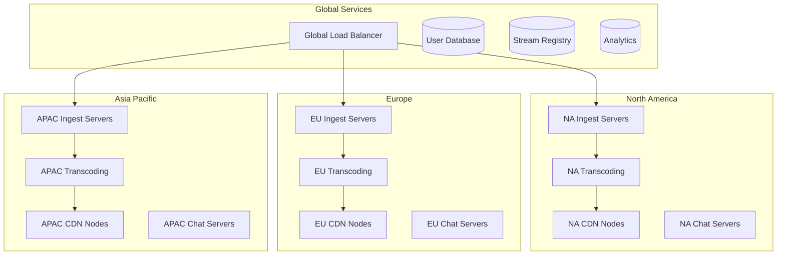

# Design Twitch Live Streaming Platform

## Problem Statement

Design a live streaming platform like Twitch that allows content creators to broadcast live video to millions of viewers simultaneously. The system should support real-time chat, low-latency streaming, interactive features, and handle massive concurrent viewership while maintaining high video quality and minimal delay.

### Business Context

Twitch serves over 140 million monthly active users with 9+ million streamers, handling 2+ million concurrent viewers during peak hours. The platform needs to:
- Support ultra-low latency live video streaming (sub-second delay)
- Handle real-time chat with millions of concurrent messages
- Provide interactive features like donations, subscriptions, and polls
- Scale to support viral streams with millions of concurrent viewers
- Maintain high video quality while optimizing bandwidth costs

### User Stories

- As a streamer, I want to broadcast live video with minimal delay to engage with my audience
- As a viewer, I want to watch streams with high quality and participate in real-time chat
- As a mobile user, I want to stream and watch on mobile devices with adaptive quality
- As a community member, I want to interact through donations, follows, and subscriptions
- As a moderator, I want tools to manage chat and enforce community guidelines

## Requirements Clarification

### Functional Requirements

1. **Live Video Streaming**: Real-time video broadcast with adaptive quality
2. **Real-time Chat**: Instant messaging with emoji, moderation, and spam protection
3. **Interactive Features**: Donations, subscriptions, follows, and notifications
4. **Stream Discovery**: Browse streams by category, popularity, and recommendations
5. **Mobile Support**: Stream and watch on mobile devices
6. **Moderation Tools**: Chat moderation, user bans, and content filtering
7. **Analytics**: Stream analytics for creators and platform metrics

### Non-Functional Requirements

1. **Scale**: 140M monthly users, 9M streamers, 2M+ concurrent viewers
2. **Latency**: 
   - Stream latency < 3 seconds (standard), < 1 second (low-latency mode)
   - Chat message delivery < 100ms
   - Interactive features response < 200ms
3. **Availability**: 99.9% uptime for streaming and chat services
4. **Quality**: Support for 1080p60, 720p60, and mobile-optimized streams
5. **Bandwidth**: Efficient video encoding and adaptive bitrate streaming
6. **Real-time**: Sub-second chat delivery and interactive feature responses

### Constraints

- Global audience with varying network conditions
- Content moderation and community guidelines enforcement
- Monetization features (ads, subscriptions, donations)
- Mobile battery and data usage optimization
- Copyright and DMCA compliance

### Assumptions

- User authentication and account management exist
- Payment processing for monetization features is separate
- Content moderation policies and tools are defined
- Focus on core streaming and chat functionality## Capa
city Estimation

### User and Streaming Metrics

```
Monthly Active Users: 140 million
Daily Active Users: 30 million (21% of MAU)
Active Streamers: 9 million monthly
Concurrent Streamers (Peak): 100,000
Concurrent Viewers (Peak): 2.5 million
Average Stream Duration: 3 hours
Average Concurrent Viewers per Stream: 25
Chat Messages per Day: 1 billion

Peak Load Metrics:
- Concurrent streams: 100,000
- Total concurrent viewers: 2.5 million
- Chat messages per second: 50,000
- New follows/subscriptions per second: 1,000
```

### Bandwidth Requirements

```
Video Streaming:
- Peak concurrent viewers: 2.5 million
- Average bitrate per viewer: 3 Mbps (adaptive streaming)
- Peak downstream bandwidth: 2.5M × 3 Mbps = 7.5 Tbps

Live Stream Ingestion:
- Peak concurrent streamers: 100,000
- Average upload bitrate: 6 Mbps (1080p60)
- Peak upstream bandwidth: 100K × 6 Mbps = 600 Gbps

Chat and Interactive Features:
- Chat messages: 50,000/second × 200 bytes = 10 MB/s
- Interactive events: 5,000/second × 1KB = 5 MB/s
- Total real-time data: ~15 MB/s
```

### Storage Requirements

```
Live Stream Storage (for VODs):
- Daily stream hours: 100K streamers × 3 hours avg = 300K hours
- Storage per hour: 2GB (compressed)
- Daily storage: 300K × 2GB = 600 TB
- With 30-day retention: 18 PB

Chat History:
- Daily messages: 1 billion × 200 bytes = 200 GB
- With 1-year retention: 73 TB

User Data:
- 140M users × 5KB profile = 700 GB
- Stream metadata: 100K streams × 10KB = 1 GB daily

Total Storage: ~18.1 PB (with replication: ~54 PB)
```

### Compute Requirements

```
Video Processing:
- Live transcoding: 100K streams × 4 quality levels = 400K transcoding jobs
- CPU cores for transcoding: ~40,000 cores (GPU-accelerated)
- Real-time processing latency: < 500ms

Chat Processing:
- Message processing: 50,000 messages/second
- Moderation and filtering: 10,000 CPU cores
- Real-time delivery: WebSocket connections for 2.5M users

Interactive Features:
- Event processing: 5,000 events/second
- Notification delivery: 100,000 notifications/second
- Analytics processing: 1,000 CPU cores
```

## High-Level Architecture

```mermaid
graph TB
    subgraph "Content Creators"
        StreamingSW[Streaming Software]
        MobileApp[Mobile Streaming]
        WebStreaming[Web Streaming]
    end
    
    subgraph "Viewers"
        WebPlayer[Web Player]
        MobileViewer[Mobile App]
        TVApp[TV Apps]
    end
    
    subgraph "Ingestion Layer"
        RTMP[RTMP Servers]
        WebRTC[WebRTC Gateway]
        LoadBalancer[Load Balancer]
    end
    
    subgraph "Processing Layer"
        Transcoder[Video Transcoder]
        ChatProcessor[Chat Processor]
        EventProcessor[Event Processor]
        Moderator[Content Moderator]
    end
    
    subgraph "Distribution Layer"
        CDN[Global CDN]
        ChatRelay[Chat Relay Servers]
        NotificationService[Notification Service]
    end
    
    subgraph "Storage Layer"
        VideoStorage[Video Storage]
        ChatDB[(Chat Database)]
        UserDB[(User Database)]
        AnalyticsDB[(Analytics DB)]
        Cache[(Cache Layer)]
    end
    
    subgraph "Real-time Services"
        WebSocketGateway[WebSocket Gateway]
        ChatService[Chat Service]
        InteractiveService[Interactive Service]
    end
    
    StreamingSW --> RTMP
    MobileApp --> WebRTC
    WebStreaming --> WebRTC
    
    RTMP --> LoadBalancer
    WebRTC --> LoadBalancer
    LoadBalancer --> Transcoder
    
    Transcoder --> CDN
    Transcoder --> VideoStorage
    
    WebPlayer --> CDN
    MobileViewer --> CDN
    TVApp --> CDN
    
    WebPlayer --> WebSocketGateway
    MobileViewer --> WebSocketGateway
    
    WebSocketGateway --> ChatService
    WebSocketGateway --> InteractiveService
    
    ChatService --> ChatProcessor
    ChatProcessor --> ChatDB
    ChatProcessor --> ChatRelay
    
    InteractiveService --> EventProcessor
    EventProcessor --> NotificationService
```## Detai
led Component Design

### 1. Live Video Streaming Service

**Stream Ingestion:**
```python
from typing import Dict, List, Optional
from dataclasses import dataclass
from enum import Enum
import asyncio

class StreamQuality(Enum):
    SOURCE = "source"
    HIGH = "720p60"
    MEDIUM = "720p30"
    LOW = "480p30"
    MOBILE = "360p30"

@dataclass
class StreamConfig:
    stream_key: str
    user_id: str
    title: str
    category: str
    quality_settings: Dict
    low_latency_mode: bool = False

class LiveStreamIngestionService:
    def __init__(self):
        self.rtmp_servers = RTMPServerPool()
        self.transcoder_pool = TranscoderPool()
        self.stream_registry = StreamRegistry()
        self.analytics = StreamAnalytics()
    
    async def start_stream(self, stream_config: StreamConfig) -> Dict:
        """Initialize a new live stream"""
        # Validate stream key and user permissions
        if not await self.validate_stream_key(stream_config.stream_key, stream_config.user_id):
            raise InvalidStreamKeyError("Invalid stream key")
        
        # Check if user is already streaming
        if await self.is_user_streaming(stream_config.user_id):
            raise UserAlreadyStreamingError("User is already streaming")
        
        # Allocate RTMP server
        rtmp_server = await self.rtmp_servers.allocate_server(stream_config.user_id)
        
        # Configure transcoding pipeline
        transcoding_config = await self.setup_transcoding_pipeline(stream_config)
        
        # Register stream
        stream_info = {
            "stream_id": self.generate_stream_id(),
            "user_id": stream_config.user_id,
            "rtmp_endpoint": rtmp_server.endpoint,
            "transcoding_config": transcoding_config,
            "start_time": datetime.now(),
            "status": "starting"
        }
        
        await self.stream_registry.register_stream(stream_info)
        
        # Start analytics tracking
        await self.analytics.track_stream_start(stream_info)
        
        return {
            "stream_id": stream_info["stream_id"],
            "rtmp_url": f"rtmp://{rtmp_server.endpoint}/live/{stream_config.stream_key}",
            "status": "ready"
        }
    
    async def setup_transcoding_pipeline(self, stream_config: StreamConfig) -> Dict:
        """Setup video transcoding pipeline"""
        # Define quality ladder based on source quality
        quality_ladder = self.generate_quality_ladder(stream_config.quality_settings)
        
        # Allocate transcoding resources
        transcoder = await self.transcoder_pool.allocate_transcoder(
            estimated_load=len(quality_ladder),
            low_latency=stream_config.low_latency_mode
        )
        
        # Configure transcoding settings
        transcoding_config = {
            "transcoder_id": transcoder.id,
            "input_settings": stream_config.quality_settings,
            "output_qualities": quality_ladder,
            "low_latency_mode": stream_config.low_latency_mode,
            "segment_duration": 2 if stream_config.low_latency_mode else 6  # seconds
        }
        
        return transcoding_config
    
    def generate_quality_ladder(self, source_settings: Dict) -> List[Dict]:
        """Generate adaptive bitrate quality ladder"""
        source_resolution = source_settings.get("resolution", "1080p")
        source_fps = source_settings.get("fps", 30)
        
        quality_ladder = []
        
        # Source quality (pass-through)
        quality_ladder.append({
            "name": "source",
            "resolution": source_resolution,
            "fps": source_fps,
            "bitrate": source_settings.get("bitrate", "6000k"),
            "codec": "h264"
        })
        
        # Generate lower qualities
        if source_resolution in ["1080p", "720p"]:
            quality_ladder.append({
                "name": "720p60" if source_fps >= 60 else "720p30",
                "resolution": "720p",
                "fps": min(source_fps, 60),
                "bitrate": "4500k" if source_fps >= 60 else "3000k",
                "codec": "h264"
            })
        
        quality_ladder.append({
            "name": "480p30",
            "resolution": "480p",
            "fps": 30,
            "bitrate": "1500k",
            "codec": "h264"
        })
        
        quality_ladder.append({
            "name": "360p30",
            "resolution": "360p",
            "fps": 30,
            "bitrate": "800k",
            "codec": "h264"
        })
        
        return quality_ladder
```

**Real-time Video Processing:**
```python
class RealTimeVideoProcessor:
    def __init__(self):
        self.gpu_pool = GPUPool()
        self.encoder_pool = EncoderPool()
        self.segment_manager = SegmentManager()
    
    async def process_live_stream(self, stream_id: str, input_stream: bytes) -> Dict:
        """Process incoming live video stream in real-time"""
        # Allocate GPU resources for hardware acceleration
        gpu_instance = await self.gpu_pool.allocate_gpu()
        
        try:
            # Decode input stream
            decoded_frames = await self.decode_streamlows users to stream music, create playlists, discover new songs, and share music with friends. The system should handle millions of concurrent users, provide high-quality audio streaming, personalized recommendations, and social features while managing a catalog of tens of millions of songs.

### Business Context

Spotify serves over 400 million users with 180 million premium subscribers, streaming over 4 billion hours of music monthly. The platform needs to:
- Provide seamless music streaming with minimal buffering
- Offer personalized music discovery and recommendations
- Support social features like playlist sharing and collaborative playlists
- Handle massive music catalog with licensing and royalty management
- Deliver high-quality audio with adaptive bitrate streaming

### User Stories

- As a music lover, I want to stream songs instantly with high audio quality
- As a user, I want personalized playlists and music recommendations
- As a social user, I want to share playlists and see what friends are listening to
- As a mobile user, I want offline music downloads for areas with poor connectivity
- As an artist, I want my music to be discoverable and properly attributed

## Requirements Clarification(input_stream, gpu_instance)
            
            # Transcode to multiple qualities simultaneously
            transcoding_tasks = []
            for quality_config in self.get_quality_configs(stream_id):
                task = asyncio.create_task(
                    self.transcode_quality(decoded_frames, quality_config, gpu_instance)
                )
                transcoding_tasks.append(task)
            
            # Wait for all transcoding to complete
            transcoded_streams = await asyncio.gather(*transcoding_tasks)
            
            # Generate HLS segments
            segments = {}
            for quality, stream_data in transcoded_streams:
                segments[quality] = await self.segment_manager.create_segments(
                    stream_data, quality, stream_id
                )
            
            # Update HLS manifests
            await self.update_hls_manifests(stream_id, segments)
            
            return {"status": "success", "segments": segments}
            
        finally:
            # Release GPU resources
            await self.gpu_pool.release_gpu(gpu_instance)
    
    async def transcode_quality(self, frames: List, quality_config: Dict, gpu_instance) -> tuple:
        """Transcode video to specific quality using GPU acceleration"""
        encoder = await self.encoder_pool.get_encoder(quality_config["codec"])
        
        # Configure encoder settings
        encoder_settings = {
            "resolution": quality_config["resolution"],
            "fps": quality_config["fps"],
            "bitrate": quality_config["bitrate"],
            "preset": "ultrafast",  # Low latency preset
            "tune": "zerolatency",
            "gpu_device": gpu_instance.device_id
        }
        
        # Encode frames
        encoded_stream = await encoder.encode_frames(frames, encoder_settings)
        
        return (quality_config["name"], encoded_stream)
```

### 2. Real-time Chat System

**Chat Service Architecture:**
```python
class ChatService:
    def __init__(self):
        self.websocket_manager = WebSocketManager()
        self.message_processor = MessageProcessor()
        self.moderation_service = ModerationService()
        self.chat_storage = ChatStorage()
        self.rate_limiter = RateLimiter()
    
    async def handle_chat_message(self, user_id: str, channel_id: str, 
                                message: str, websocket) -> bool:
        """Process and broadcast chat message"""lows users to stream music, create playlists, discover new songs, and share music with friends. The system should handle millions of concurrent users, provide high-quality audio streaming, personalized recommendations, and social features while managing a catalog of tens of millions of songs.

### Business Context

Spotify serves over 400 million users with 180 million premium subscribers, streaming over 4 billion hours of music monthly. The platform needs to:
- Provide seamless music streaming with minimal buffering
- Offer personalized music discovery and recommendations
- Support social features like playlist sharing and collaborative playlists
- Handle massive music catalog with licensing and royalty management
- Deliver high-quality audio with adaptive bitrate streaming

### User Stories

- As a music lover, I want to stream songs instantly with high audio quality
- As a user, I want personalized playlists and music recommendations
- As a social user, I want to share playlists and see what friends are listening to
- As a mobile user, I want offline music downloads for areas with poor connectivity
- As an artist, I want my music to be discoverable and properly attributed

## Requirements Clarification
        # Rate limiting
        if not await self.rate_limiter.check_rate_limit(user_id, "chat_message"):
            await self.send_error(websocket, "Rate limit exceeded")
            return False
        
        # Message validation and preprocessing
        processed_message = await self.message_processor.process_message(
            message, user_id, channel_id
        )
        
        # Content moderation
        moderation_result = await self.moderation_service.moderate_message(
            processed_message, user_id, channel_id
        )
        
        if moderation_result.action == "block":
            await self.send_error(websocket, "Message blocked by moderation")
            return False
        elif moderation_result.action == "timeout":
            await self.timeout_user(user_id, channel_id, moderation_result.duration)
            return False
        
        # Create chat message object
        chat_message = {
            "message_id": self.generate_message_id(),
            "user_id": user_id,
            "channel_id": channel_id,
            "message": processed_message.text,
            "timestamp": datetime.now().isoformat(),
            "badges": await self.get_user_badges(user_id, channel_id),
            "emotes": processed_message.emotes,
            "color": await self.get_user_color(user_id)
        }
        
        # Store message (async)
        asyncio.create_task(self.chat_storage.store_message(chat_message))
        
        # Broadcast to channel subscribers
        await self.broadcast_to_channel(channel_id, chat_message)
        
        # Track analytics
        await self.track_chat_analytics(chat_message)
        
        return True
    
    async def broadcast_to_channel(self, channel_id: str, message: Dict):
        """Broadcast message to all channel subscribers"""
        # Get all connected users for this channel
        subscribers = await self.websocket_manager.get_channel_subscribers(channel_id)
        
        # Prepare message for broadcast
        broadcast_message = {
            "type": "chat_message",
            "data": message
        }
        
        # Send to all subscribers concurrently
        broadcast_tasks = []
        for subscriber_ws in subscribers:
            task = asyncio.create_task(
                self.websocket_manager.send_message(subscriber_ws, broadcast_message)
            )
            broadcast_tasks.append(task)
        
        # Wait for all broadcasts to complete (with timeout)
        try:
            await asyncio.wait_for(
                asyncio.gather(*broadcast_tasks, return_exceptions=True),
                timeout=1.0  # 1 second timeout for chat delivery
            )
        except asyncio.TimeoutError:
            # Log slow delivery but don't block
            logger.warning(f"Chat broadcast timeout for channel {channel_id}")
```

**Message Processing and Moderation:**
```python
class MessageProcessor:
    def __init__(self):
        self.emote_parser = EmoteParser()
        self.link_detector = LinkDetector()
        self.spam_detector = SpamDetector()
    
    async def process_message(self, raw_message: str, user_id: str, 
                            channel_id: str) -> ProcessedMessage:
        """Process raw chat message"""
        # Basic sanitization
        sanitized_message = self.sanitize_message(raw_message)
        
        # Parse emotes
        emotes = await self.emote_parser.parse_emotes(sanitized_message)
        
        # Detect and validate links
        links = await self.link_detector.extract_links(sanitized_message)
        validated_links = await self.validate_links(links, channel_id)
        
        # Replace emote codes with emote objects
        processed_text = await self.replace_emotes(sanitized_message, emotes)
        
        return ProcessedMessage(
            text=processed_text,
            emotes=emotes,
            links=validated_links,
            original_message=raw_message
        )

class ModerationService:
    def __init__(self):
        self.profanity_filter = ProfanityFilter()
        self.spam_detector = SpamDetector()
        self.ml_moderator = MLModerator()
        self.user_reputation = UserReputationService()
    
    async def moderate_message(self, message: ProcessedMessage, 
                             user_id: str, channel_id: str) -> ModerationResult:
        """Comprehensive message moderation"""
        # Get user reputation and channel settings
        user_reputation = await self.user_reputation.get_reputation(user_id)
        channel_settings = await self.get_channel_moderation_settings(channel_id)
        
        # Profanity filtering
        profanity_score = await self.profanity_filter.analyze(message.text)
        if profanity_score > channel_settings.profanity_threshold:
            return ModerationResult(action="block", reason="profanity")
        
        # Spam detection
        spam_score = await self.spam_detector.analyze(
            message, user_id, channel_id, user_reputation
        )
        if spam_score > channel_settings.spam_threshold:
            timeout_duration = self.calculate_timeout_duration(spam_score, user_reputation)
            return ModerationResult(
                action="timeout", 
                reason="spam", 
                duration=timeout_duration
            )
        
        # ML-based content moderation
        ml_result = await self.ml_moderator.analyze_message(message, user_id)
        if ml_result.confidence > 0.8 and ml_result.category in ["harassment", "hate_speech"]:
            return ModerationResult(action="block", reason=ml_result.category)
        
        # Link validation
        for link in message.links:
            if not await self.is_link_allowed(link, channel_settings):
                return ModerationResult(action="block", reason="unauthorized_link")
        
        return ModerationResult(action="allow")
```

### 3. Interactive Features

**Interactive Events Service:**
```python
class InteractiveEventsService:
    def __init__(self):
        self.event_processor = EventProcessor()
        self.notification_service = NotificationService()
        self.analytics_service = AnalyticsService()
        self.websocket_manager = WebSocketManager()
    
    async def handle_follow(self, follower_id: str, streamer_id: str) -> bool:
        """Handle user follow event"""
        # Check if already following
        if await self.is_already_following(follower_id, streamer_id):
            return False
        
        # Create follow relationship
        follow_event = {
            "type": "follow",
            "follower_id": follower_id,
            "streamer_id": streamer_id,
            "timestamp": datetime.now().isoformat()
        }
        
        # Store follow relationship
        await self.store_follow_relationship(follower_id, streamer_id)
        
        # Send real-time notification to streamer
        await self.send_stream_notification(streamer_id, {
            "type": "new_follower",
            "follower": await self.get_user_info(follower_id),
            "timestamp": follow_event["timestamp"]
        })
        
        # Send notification to follower
        await self.notification_service.send_notification(
            follower_id,
            f"You are now following {await self.get_username(streamer_id)}",
            "follow_confirmation"
        )
        
        # Track analytics
        await self.analytics_service.track_event(follow_event)
        
        return True
    
    async def handle_subscription(self, subscriber_id: str, streamer_id: str, 
                                tier: str, months: int, message: str = "") -> bool:
        """Handle subscription event"""
        # Validate subscription tier and payment
        if not await self.validate_subscription(subscriber_id, streamer_id, tier):
            return False
        
        # Create subscription event
        subscription_event = {
            "type": "subscription",
            "subscriber_id": subscriber_id,
            "streamer_id": streamer_id,
            "tier": tier,
            "months": months,
            "message": message,
            "timestamp": datetime.now().isoformat()
        }
        
        # Process subscription
        await self.process_subscription(subscription_event)
        
        # Send animated alert to stream
        await self.send_stream_alert(streamer_id, {
            "type": "subscription",
            "subscriber": await self.get_user_info(subscriber_id),
            "tier": tier,
            "months": months,
            "message": message,
            "animation": "subscription_alert"
        })
        
        # Add subscriber badge and perks
        await self.grant_subscriber_perks(subscriber_id, streamer_id, tier)
        
        return True
    
    async def handle_donation(self, donor_id: str, streamer_id: str, 
                            amount: float, currency: str, message: str = "") -> bool:
        """Handle donation/tip event"""
        # Validate donation amount and payment
        if not await self.validate_donation(donor_id, amount, currency):
            return False
        
        # Process payment (handled by payment service)
        payment_result = await self.process_donation_payment(
            donor_id, streamer_id, amount, currency
        )
        
        if not payment_result.success:
            return False
        
        # Create donation event
        donation_event = {
            "type": "donation",
            "donor_id": donor_id,
            "streamer_id": streamer_id,
            "amount": amount,
            "currency": currency,
            "message": message,
            "timestamp": datetime.now().isoformat(),
            "transaction_id": payment_result.transaction_id
        }
        
        # Send donation alert to stream
        await self.send_stream_alert(streamer_id, {
            "type": "donation",
            "donor": await self.get_user_info(donor_id),
            "amount": f"{amount} {currency}",
            "message": message,
            "animation": "donation_alert"
        })
        
        # Track donation analytics
        await self.analytics_service.track_donation(donation_event)
        
        return True
```### 4. Low
-Latency Streaming

**Ultra-Low Latency Implementation:**
```python
class UltraLowLatencyStreaming:
    def __init__(self):
        self.webrtc_gateway = WebRTCGateway()
        self.chunk_processor = ChunkProcessor()
        self.adaptive_bitrate = AdaptiveBitrateController()
    
    async def enable_low_latency_mode(self, stream_id: str) -> Dict:
        """Enable ultra-low latency streaming (sub-second)"""
        # Configure chunked transfer encoding
        chunk_config = {
            "chunk_duration": 200,  # 200ms chunks
            "buffer_size": 3,       # 3 chunks buffer
            "encoding": "chunked_cmaf"  # Common Media Application Format
        }
        
        # Setup WebRTC for real-time delivery
        webrtc_config = await self.webrtc_gateway.setup_stream(stream_id, {
            "ice_servers": await self.get_ice_servers(),
            "video_codec": "VP9",
            "audio_codec": "Opus",
            "max_bitrate": "6000kbps"
        })
        
        # Configurbut don't block
            logger.warning(f"Chunk delivery timeout for stream {stream_id}")
            return False
```

### 5. Stream Discovery and Recommendations

**Stream Discovery Service:**
```python
class StreamDiscoveryService:
    def __init__(self):
        self.recommendation_engine = StreamRecommendationEngine()
        self.trending_analyzer = TrendingAnalyzer()
        self.category_service = CategoryService()
        self.search_service = StreamSearchService()
    
    async def get_homepage_streams(self, user_id: str) -> Dict:
        """Get personalized homepage stream recommendations"""
        # Get user preferences and viewing history
        user_preferences = await self.get_user_preferences(user_id)
        viewing_history = await self.get_viewing_history(user_id, days=30)
        
        # Generate different sections
        sections = {}
        
        # Recommended for you (personalized)
        sections["recommended"] = await self.recommendation_engine.get_personalized_streams(
            user_id, user_preferences, viewing_history, limit=20
        )
        
        # Trending streams
        sections["trending"] = await self.trending_analyzer.get_trending_streams(
            user_preferences.get("preferred_categories", []), limit=15
        )
        
        # Live channels you follow
        sections["following"] = await self.get_live_following_streams(user_id, limit=10)
        
        # Popular in categories you watch
        for category in user_preferences.get("preferred_categories", [])[:3]:
            sections[f"popular_{category}"] = await self.get_popular_streams_in_category(
                category, limit=10
            )
        
        # New streamers to discover
        sections["discover"] = await self.get_discovery_streams(
            user_id, user_preferences, limit=10
        )
        
        return sections
    
    async def search_streams(self, query: str, user_id: str, 
                           filters: Dict = None) -> Dict:
        """Search for live streams and streamers"""
        # Build search query
        search_params = {
            "query": query,
            "user_id": user_id,
            "filters": filters or {},
            "include_offline": filters.get("include_offline", False)
        }
        
        # Search live streams
        live_streams = await self.search_service.search_live_streams(search_params)
        
        # Search streamers/channels
        channels = await self.search_service.search_channels(search_params)
        
        # Search categories/games
        categories = await self.search_service.search_categories(search_params)
        
        # Rank results based on user preferences
        ranked_results = await self.rank_search_results(
            live_streams, channels, categories, user_id
        )
        
        return {
            "live_streams": ranked_results["streams"],
            "channels": ranked_results["channels"],
            "categories": ranked_results["categories"],
            "total_results": len(ranked_results["streams"]) + len(ranked_results["channels"])
        }
```

## Scaling the Design

### Horizontal Scaling Strategies

**1. Geographic Distribution:**


**2. Auto-scaling for Viral Streams:**
```python
class ViralStreamAutoScaler:
    def __init__(self):
        self.metrics_monitor = MetricsMonitor()
        self.resource_allocator = ResourceAllocator()
        self.cdn_manager = CDNManager()
    
    async def monitor_stream_growth(self, stream_id: str):
        """Monitor stream for viral growth and auto-scale"""
        while True:
            # Get current metrics
            metrics = await self.metrics_monitor.get_stream_metrics(stream_id)
            
            current_viewers = metrics["concurrent_viewers"]
            growth_rate = metrics["viewer_growth_rate"]  # viewers/minute
            
            # Predict viewer count in next 5 minutes
            predicted_viewers = current_viewers + (growth_rate * 5)
            
            # Check if scaling is needed
            if predicted_viewers > self.get_current_capacity(stream_id) * 0.8:
                await self.scale_stream_infrastructure(stream_id, predicted_viewers)
            
            # Check for viral threshold (100k+ viewers)
            if current_viewers > 100000 and growth_rate > 1000:
                await self.enable_viral_mode(stream_id)
            
            await asyncio.sleep(30)  # Check every 30 seconds
    
    async def scale_stream_infrastructure(self, stream_id: str, target_capacity: int):
        """Scale infrastructure for increased viewer load"""
        # Scale CDN edge servers
        required_bandwidth = target_capacity * 3  # 3 Mbps average per viewer
        await self.cdn_manager.scale_edge_servers(stream_id, required_bandwidth)
        
        # Scale chat servers
        estimated_chat_load = target_capacity * 0.1  # 10% active chatters
        await self.scale_chat_servers(stream_id, estimated_chat_load)
        
        # Scale transcoding if needed
        if target_capacity > 50000:  # Scale transcoding for 50k+ viewers
            await self.scale_transcoding_capacity(stream_id)
        
        # Pre-warm additional regions
        if target_capacity > 200000:  # Global distribution for 200k+ viewers
            await self.enable_global_distribution(stream_id)
    
    async def enable_viral_mode(self, stream_id: str):
        """Enable special optimizations for viral streams"""
        # Enable aggressive caching
        await self.cdn_manager.enable_aggressive_caching(stream_id)
        
        # Increase chat rate limits
        await self.increase_chat_capacity(stream_id, multiplier=5)
        
        # Enable additional monitoring
        await self.enable_enhanced_monitoring(stream_id)
        
        # Notify operations team
        await self.notify_ops_team(f"Viral stream detected: {stream_id}")
```

**3. Chat Scaling:**
```python
class ChatScalingService:
    def __init__(self):
        self.chat_shards = ChatShardManager()
        self.message_router = MessageRouter()
        self.websocket_pool = WebSocketPool()
    
    async def scale_chat_for_channel(self, channel_id: str, concurrent_users: int):
        """Scale chat infrastructure based on concurrent users"""
        # Calculate required chat shards
        users_per_shard = 10000  # 10k users per shard
        required_shards = math.ceil(concurrent_users / users_per_shard)
        
        current_shards = await self.chat_shards.get_shard_count(channel_id)
        
        if required_shards > current_shards:
            # Scale up chat shards
            for i in range(current_shards, required_shards):
                shard_id = f"{channel_id}_shard_{i}"
                await self.chat_shards.create_shard(shard_id, channel_id)
                
                # Redistribute users across shards
                await self.redistribute_chat_users(channel_id)
        
        # Scale WebSocket connections
        required_ws_servers = math.ceil(concurrent_users / 5000)  # 5k connections per server
        await self.websocket_pool.ensure_capacity(channel_id, required_ws_servers)
    
    async def handle_chat_burst(self, channel_id: str, messages_per_second: int):
        """Handle sudden bursts in chat activity"""
        if messages_per_second > 1000:  # High chat activity
            # Enable chat slow mode
            await self.enable_slow_mode(channel_id, delay=2)  # 2 second delay
            
            # Increase message processing capacity
            await self.scale_message_processors(channel_id, multiplier=3)
            
            # Enable chat sampling for very high activity
            if messages_per_second > 5000:
                await self.enable_chat_sampling(channel_id, sample_rate=0.7)
```

## Performance Optimizations

### Video Streaming Optimizations

**1. Adaptive Bitrate Streaming:**
```python
class AdaptiveBitrateController:
    def __init__(self):
        self.network_monitor = NetworkMonitor()
        self.quality_selector = QualitySelector()
        self.buffer_monitor = BufferMonitor()
    
    async def optimize_streaming_quality(self, viewer_id: str, stream_id: str):
        """Continuously optimize streaming quality for viewer"""
        while True:
            # Monitor network conditions
            network_stats = await self.network_monitor.get_stats(viewer_id)
            
            # Monitor buffer health
            buffer_stats = await self.buffer_monitor.get_stats(viewer_id)
            
            # Select optimal quality
            optimal_quality = await self.quality_selector.select_quality(
                network_stats, buffer_stats
            )
            
            # Switch quality if needed
            current_quality = await self.get_current_quality(viewer_id)
            if optimal_quality != current_quality:
                await self.switch_quality(viewer_id, stream_id, optimal_quality)
            
            await asyncio.sleep(5)  # Check every 5 seconds
    
    async def switch_quality(self, viewer_id: str, stream_id: str, new_quality: str):
        """Seamlessly switch streaming quality"""
        # Get current playback position
        current_position = await self.get_playback_position(viewer_id)
        
        # Generate new manifest with quality switch
        new_manifest = await self.generate_quality_switch_manifest(
            stream_id, new_quality, current_position
        )
        
        # Send manifest update to player
        await self.send_manifest_update(viewer_id, new_manifest)
        
        # Track quality switch
        await self.track_quality_switch(viewer_id, new_quality)
```

**2. Predictive Caching:**
```python
class PredictiveCachingService:
    def __init__(self):
        self.ml_predictor = StreamPopularityPredictor()
        self.cache_manager = CacheManager()
        self.trending_analyzer = TrendingAnalyzer()
    
    async def predict_and_cache_streams(self):
        """Predict popular streams and pre-cache content"""
        # Get trending predictions
        trending_predictions = await self.ml_predictor.predict_trending_streams(
            time_horizon=3600  # Next hour
        )
        
        # Get viral growth predictions
        viral_predictions = await self.ml_predictor.predict_viral_streams()
        
        # Combine predictions
        cache_candidates = trending_predictions + viral_predictions
        
        # Pre-cache high-probability streams
        for stream_prediction in cache_candidates:
            if stream_prediction.probability > 0.7:
                await self.pre_cache_stream(
                    stream_prediction.stream_id,
                    stream_prediction.predicted_regions
                )
    
    async def pre_cache_stream(self, stream_id: str, regions: List[str]):
        """Pre-cache stream content in predicted regions"""
        # Get stream segments
        segments = await self.get_recent_segments(stream_id, count=10)
        
        # Cache in predicted regions
        for region in regions:
            cache_tasks = []
            for segment in segments:
                task = asyncio.create_task(
                    self.cache_manager.cache_segment(segment, region)
                )
                cache_tasks.append(task)
            
            await asyncio.gather(*cache_tasks)
```

## Follow-up Questions

### Technical Deep Dives
1. **How would you handle stream failover and redundancy for critical streams?**
2. **How would you implement synchronized viewing experiences (watch parties)?**
3. **How would you optimize mobile streaming for battery life and data usage?**
4. **How would you handle DMCA takedowns and copyright detection in real-time?**

### Scaling Scenarios
1. **How would you handle a stream that suddenly gets 10 million concurrent viewers?**
2. **How would you implement global low-latency streaming with sub-second delay?**
3. **How would you scale chat to handle 1 million concurrent messages per second?**
4. **How would you implement cross-platform streaming (mobile, console, PC, web)?**

### Business Requirements
1. **How would you implement monetization features (ads, subscriptions, donations)?**
2. **How would you handle content moderation at scale across multiple languages?**
3. **How would you implement analytics and insights for streamers?**
4. **How would you design features to increase viewer engagement and retention?**

## Summary

This Twitch live streaming platform design demonstrates:

- **Ultra-Low Latency Streaming**: Sub-second delay with WebRTC and chunked encoding
- **Massive Scale Chat**: Real-time messaging for millions of concurrent users
- **Interactive Features**: Real-time donations, subscriptions, and viewer engagement
- **Auto-scaling Infrastructure**: Dynamic scaling for viral streams and traffic spikes
- **Global Distribution**: Worldwide content delivery with regional optimization
- **Real-time Moderation**: AI-powered content moderation and spam detection

The system balances low latency, high quality, and massive scale while providing rich interactive features that create engaging live streaming experiences for both creators and viewers.

Now I'll mark the task as complete:

<function_calls>
<invoke name="taskStatus">
<parameter name="taskFilePath">.kiro/specs/system-design-gitbook/tasks.mde adaptive bitrate for low latency
        abr_config = {
            "target_latency": 500,  # 500ms target
            "buffer_health_threshold": 1000,  # 1 second
            "quality_adaptation_speed": "fast"
        }
        
        return {
            "mode": "ultra_low_latency",
            "chunk_config": chunk_config,
            "webrtc_config": webrtc_config,
            "abr_config": abr_config
        }
    
    async def process_low_latency_chunk(self, stream_id: str, chunk_data: bytes) -> bool:
        """Process video chunk for low-latency delivery"""
        # Minimal processing for speed
        processed_chunk = await self.chunk_processor.fast_process(chunk_data)
        
        # Immediate delivery to connected viewers
        viewers = await self.get_stream_viewers(stream_id)
        
        # Send chunk to all viewers concurrently
        delivery_tasks = []
        for viewer_id in viewers:
            task = asyncio.create_task(
                self.deliver_chunk_to_viewer(viewer_id, processed_chunk)
            )
            delivery_tasks.append(task)
        
        # Wait for delivery with short timeout
        try:
            await asyncio.wait_for(
                asyncio.gather(*delivery_tasks, return_exceptions=True),
                timeout=0.1  # 100ms timeout
            )
            return True
        except asyncio.TimeoutError:
            # Log 