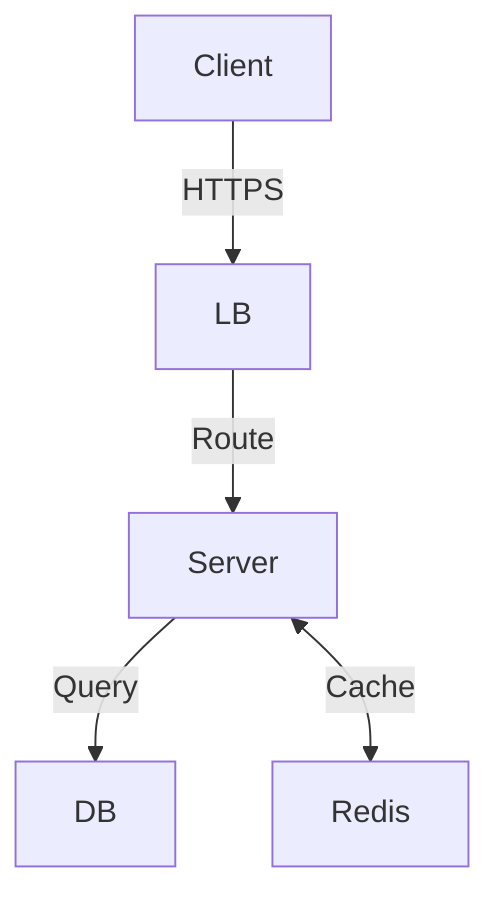
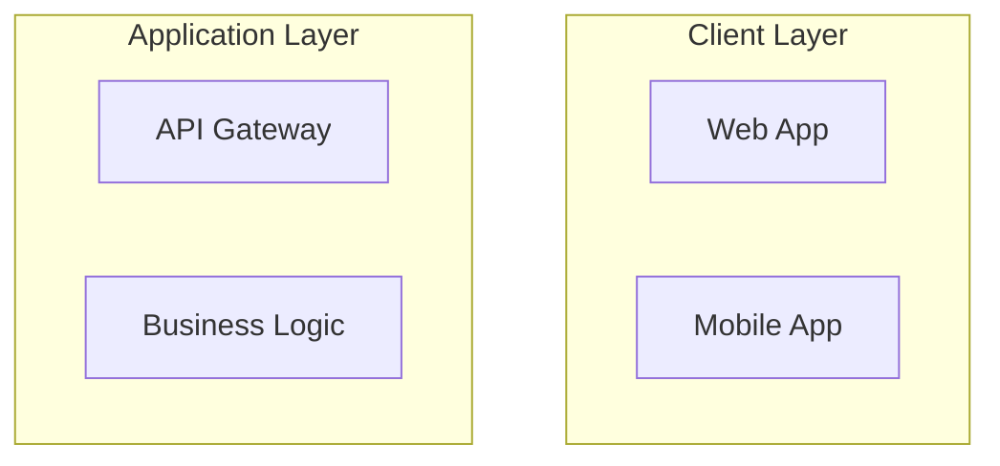

# System Design Problem Templates

This directory contains standardized templates for creating consistent, high-quality system design interview problems and solutions. The templates support both learning and interview preparation use cases.

## Template Files

### Core Templates

#### 1. `interview-problem-template.md`
**Purpose**: Complete template for system design interview problems
**Use Case**: Creating new interview problems with consistent structure
**Features**:
- Standardized metadata section
- Requirements clarification framework
- Capacity estimation tables
- Architecture design sections
- Scaling considerations
- Assessment criteria

#### 2. `capacity-estimation-calculator.md`
**Purpose**: Formulas and methods for system capacity planning
**Use Case**: Calculating realistic system requirements
**Features**:
- User and traffic estimation formulas
- Data storage calculation methods
- Bandwidth estimation templates
- Cost estimation frameworks
- Quick reference formulas
- Common benchmarks and ratios

#### 3. `architecture-diagram-templates.md`
**Purpose**: Mermaid diagram templates for common architectural patterns
**Use Case**: Creating consistent, professional system diagrams
**Features**:
- High-level architecture patterns
- Data flow sequence diagrams
- Database design diagrams
- Caching architecture patterns
- Message queue architectures
- Deployment diagrams
- Monitoring and observability diagrams

### Supporting Files

#### 4. `template-usage-guide.md`
**Purpose**: Comprehensive guide for using all templates effectively
**Use Case**: Learning how to adapt templates for different problems
**Features**:
- Step-by-step usage instructions
- Problem-specific adaptations
- Interview timing strategies
- Common mistakes to avoid
- Advanced techniques

#### 5. `problem-metadata-schema.yaml`
**Purpose**: Standardized schema for problem metadata
**Use Case**: Ensuring consistent problem classification and searchability
**Features**:
- Structured metadata format
- Validation schema
- Classification taxonomy
- Quality metrics
- Relationship mapping

## Quick Start Guide

### Creating a New Problem

1. **Copy the Base Template**
   ```bash
   cp templates/interview-problem-template.md problems/your-problem-name.md
   ```

2. **Fill in Metadata**
   - Set difficulty level and company tags
   - Add relevant technology tags
   - Estimate time requirements

3. **Customize Problem Statement**
   - Write clear business context
   - Define specific requirements
   - Set realistic scale parameters

4. **Use Capacity Calculator**
   - Reference `capacity-estimation-calculator.md`
   - Fill in realistic numbers with calculations
   - Show your work step-by-step

5. **Add Architecture Diagrams**
   - Choose appropriate templates from `architecture-diagram-templates.md`
   - Customize with specific technologies
   - Ensure diagrams match your solution

### Template Customization Examples

#### Social Media Platform
```markdown
# Adaptations needed:
- Emphasize read-heavy workload (100:1 ratio)
- Include CDN and caching strategies
- Add real-time notification systems
- Consider viral content scenarios
- Plan for content moderation
```

#### E-commerce System
```markdown
# Adaptations needed:
- Include payment processing flows
- Add inventory management components
- Consider order processing workflows
- Include fraud detection systems
- Plan for peak shopping events
```

#### Real-time System
```markdown
# Adaptations needed:
- Emphasize low-latency requirements
- Include WebSocket connections
- Add message queue systems
- Consider geographic distribution
- Plan for connection management
```

## Template Structure Philosophy

### Standardization Benefits
- **Consistency**: All problems follow the same structure
- **Completeness**: No important sections are missed
- **Comparability**: Easy to compare different solutions
- **Searchability**: Consistent metadata enables better search
- **Quality**: Built-in assessment criteria ensure high standards

### Flexibility Maintained
- **Customizable Sections**: Adapt content to specific problems
- **Optional Components**: Include only relevant sections
- **Multiple Approaches**: Support different solution strategies
- **Scalable Detail**: Start simple, add complexity as needed

## Metadata Schema Usage

### Problem Classification
```yaml
# Example metadata structure
problemMetadata:
  title: "Design a Chat System"
  difficulty: "Medium"
  companies: ["Meta", "Google", "Microsoft"]
  tags: ["real-time", "websockets", "messaging", "scaling"]
  scale:
    users:
      dailyActive: "50 million"
      peakConcurrent: "5 million"
    traffic:
      requestsPerSecond: "100K QPS"
```

### Quality Tracking
```yaml
# Quality metrics for continuous improvement
qualityMetrics:
  popularity: 4.5
  difficulty_rating: 7.2
  completion_rate: 0.78
  satisfaction_score: 4.3
```

## Diagram Template Usage

### Choosing the Right Diagram Type

#### High-Level Architecture
- Use for: Initial system overview
- Shows: Major components and their relationships
- Detail Level: High-level, focuses on system boundaries

#### Sequence Diagrams
- Use for: Data flow and interaction patterns
- Shows: Step-by-step process flows
- Detail Level: Medium, focuses on component interactions

#### Database Diagrams
- Use for: Data model and storage architecture
- Shows: Tables, relationships, sharding strategies
- Detail Level: Detailed, focuses on data structure

### Mermaid Best Practices

#### Consistent Styling
```mermaid
graph TB
    %% Use consistent node shapes
    Client[Client App]          %% Rectangle for applications
    LB{Load Balancer}          %% Diamond for decision points
    DB[(Database)]             %% Cylinder for databases
    Cache((Cache))             %% Circle for cache systems
```

#### Clear Relationships


#### Logical Grouping


## Capacity Estimation Best Practices

### Start with Assumptions
```markdown
## Key Assumptions
- 100M registered users
- 20% daily active (20M DAU)
- Average 5 sessions per day per user
- 50 requests per session on average
- 80/20 read/write ratio
```

### Show Calculations
```markdown
## Traffic Calculation
Daily Requests = 20M users × 5 sessions × 50 requests = 5B requests/day
Average QPS = 5B ÷ 86,400 seconds = 57,870 QPS
Peak QPS = 57,870 × 3 (peak factor) = 173,610 QPS
```

### Validate Results
```markdown
## Sanity Check
- 173K QPS is reasonable for a large social media platform
- Comparable to Twitter's reported peak traffic
- Within range of modern infrastructure capabilities
```

## Assessment Integration

### Learning Objectives Mapping
Each template includes sections that map to specific learning objectives:
- **Requirements Gathering**: Problem statement and clarification
- **System Design**: Architecture and component design
- **Scaling Strategy**: Bottleneck analysis and solutions
- **Communication**: Clear explanations and diagrams

### Evaluation Rubrics
Templates include built-in assessment criteria:
- **Technical Accuracy**: Correct use of technologies and patterns
- **Scalability Considerations**: Appropriate scaling strategies
- **Trade-off Analysis**: Understanding of design decisions
- **Communication Clarity**: Clear explanations and diagrams

## Maintenance and Updates

### Version Control
- All templates are versioned using semantic versioning
- Changes are tracked in the metadata schema
- Regular reviews ensure templates stay current

### Community Contributions
- Templates can be improved based on user feedback
- New patterns and technologies are added regularly
- Industry best practices are incorporated

### Quality Assurance
- Templates are reviewed by system design experts
- Real interview feedback is incorporated
- Accuracy is validated against production systems

## Integration with GitBook

### Enhanced Search
Templates enable advanced search capabilities:
- Search by difficulty level
- Filter by company or technology
- Find problems by scale requirements
- Discover related problems

### Progress Tracking
Metadata supports learning analytics:
- Track completion rates by difficulty
- Identify knowledge gaps
- Recommend next problems
- Monitor learning progress

### Interactive Features
Templates support GitBook's interactive elements:
- Embedded calculators for capacity estimation
- Interactive diagrams with zoom and pan
- Progressive disclosure of solution details
- Integrated quizzes and assessments

## Future Enhancements

### Planned Improvements
- AI-powered problem generation using templates
- Automated diagram generation from text descriptions
- Real-time collaboration on problem solutions
- Integration with coding interview platforms

### Template Extensions
- Industry-specific templates (fintech, healthcare, gaming)
- Role-specific templates (frontend, backend, full-stack)
- Company-specific adaptations
- Difficulty progression paths

## Getting Help

### Resources
- Review the `template-usage-guide.md` for detailed instructions
- Check existing problems for examples of template usage
- Refer to the metadata schema for proper classification
- Use the diagram templates for consistent visualizations

### Best Practices
- Always start with the problem template structure
- Use realistic numbers in capacity estimations
- Include multiple solution approaches when relevant
- Validate your solution against the assessment criteria
- Keep diagrams simple and focused

### Common Issues
- **Template Rigidity**: Remember templates are starting points, not rigid requirements
- **Over-engineering**: Start simple and add complexity gradually
- **Missing Context**: Always adapt templates to the specific problem context
- **Poor Time Management**: Use time estimates to pace your solution development