# Architecture Diagram Templates with Mermaid

## Overview
This document provides standardized Mermaid diagram templates for system design interviews. These templates cover common architectural patterns and can be customized for specific problems.

## High-Level Architecture Templates

### 1. Basic Web Application Architecture
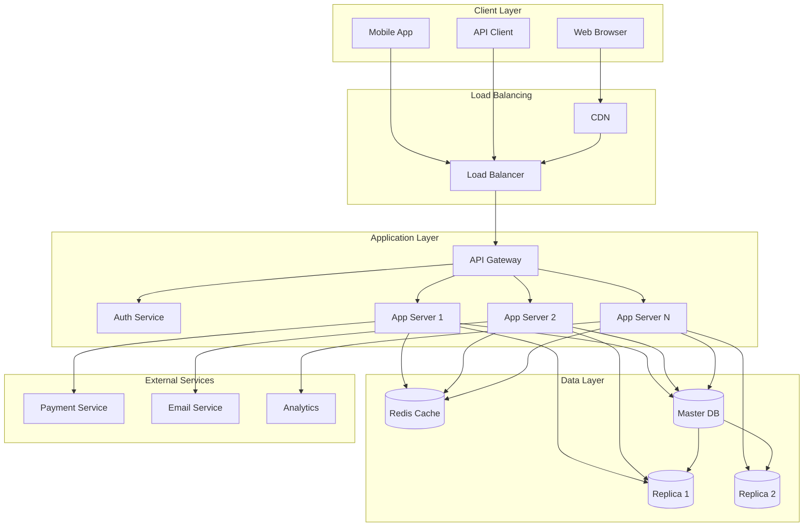

### 2. Microservices Architecture
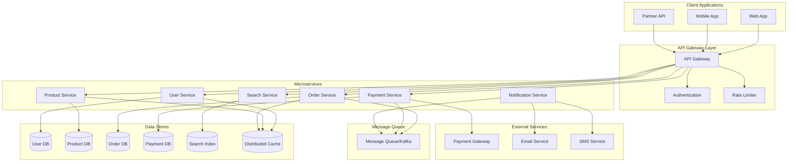

### 3. Event-Driven Architecture
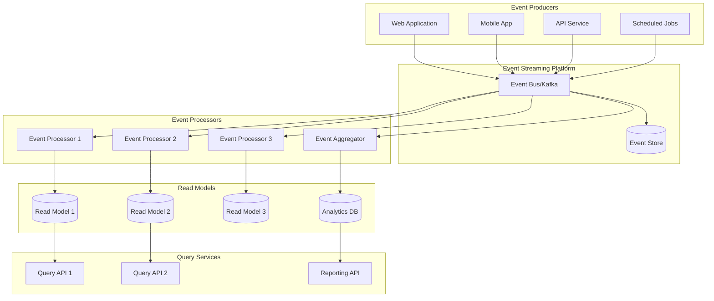

## Data Flow Sequence Diagrams

### 1. User Authentication Flow
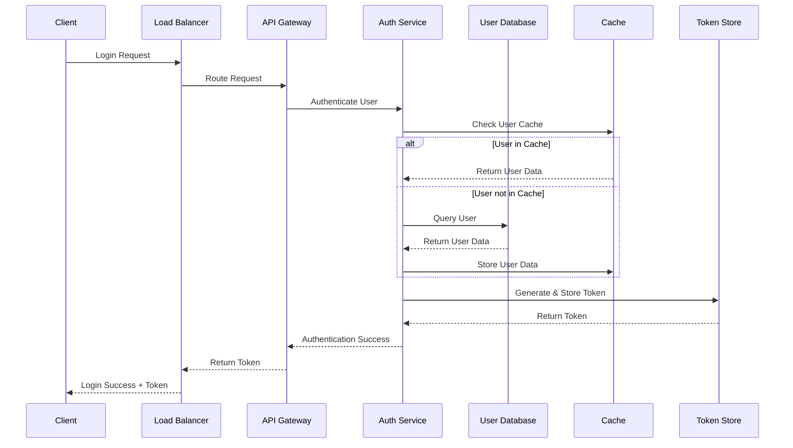

### 2. Data Write Flow with Caching
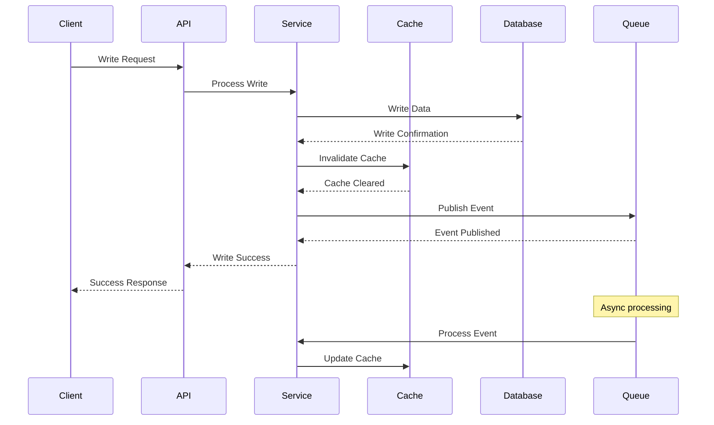

### 3. Read-Heavy System Flow
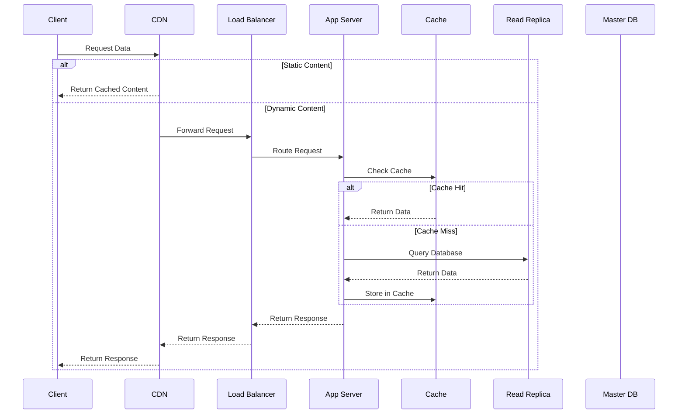

## Database Design Diagrams

### 1. Database Sharding Architecture
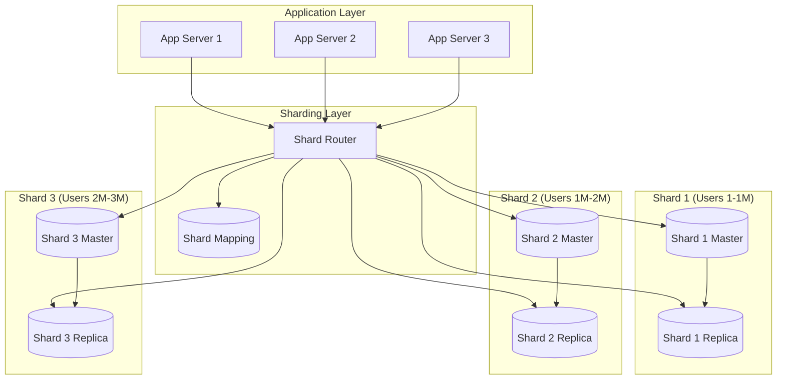

### 2. Master-Slave Replication
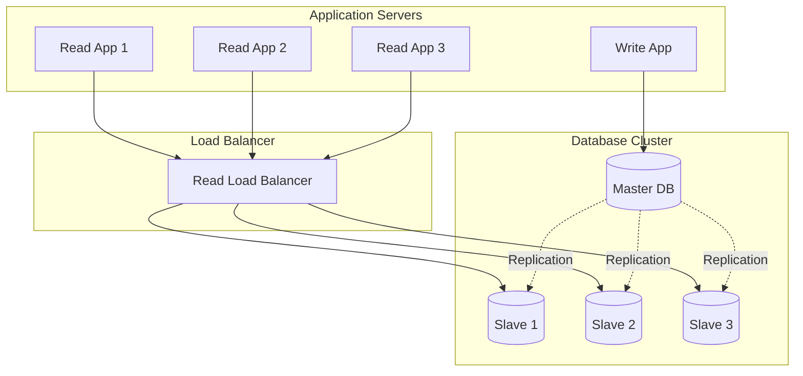

## Caching Architecture Diagrams

### 1. Multi-Level Caching
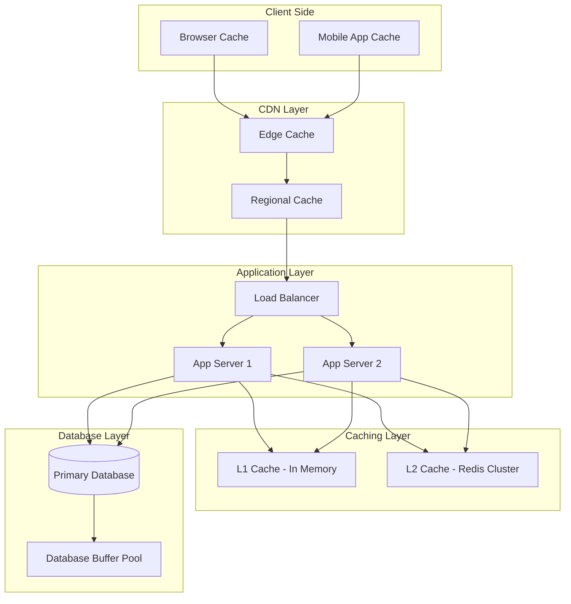

### 2. Cache-Aside Pattern
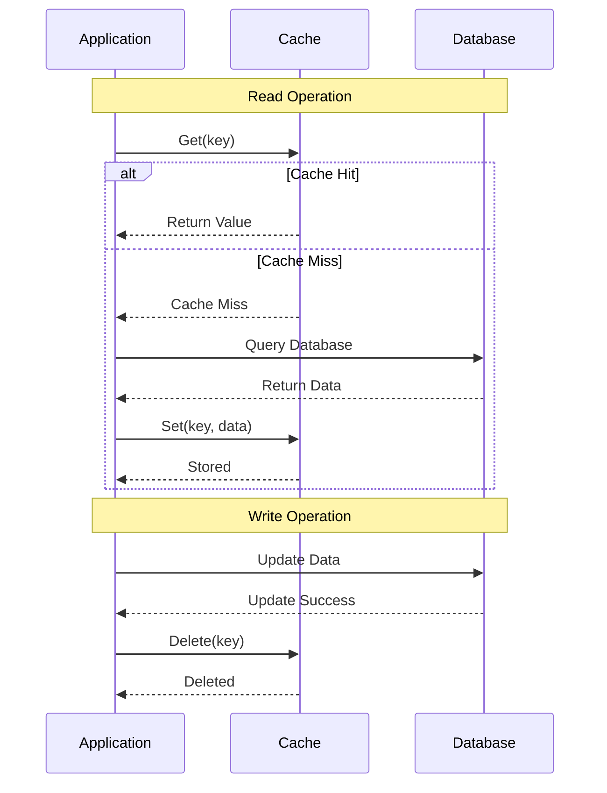

## Message Queue Architectures

### 1. Pub/Sub Pattern
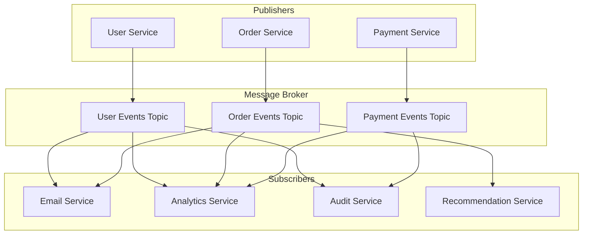

### 2. Event Sourcing Pattern
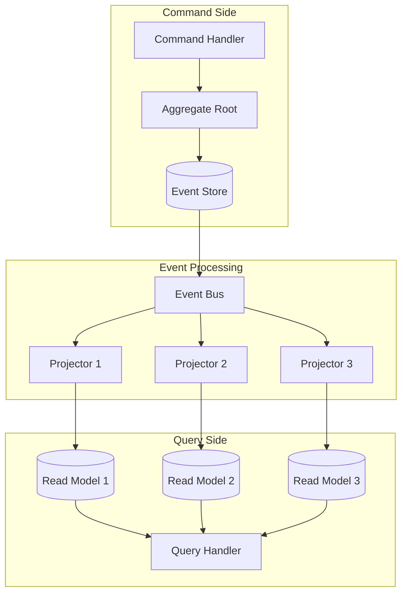

## Deployment Architecture Diagrams

### 1. Multi-Region Deployment
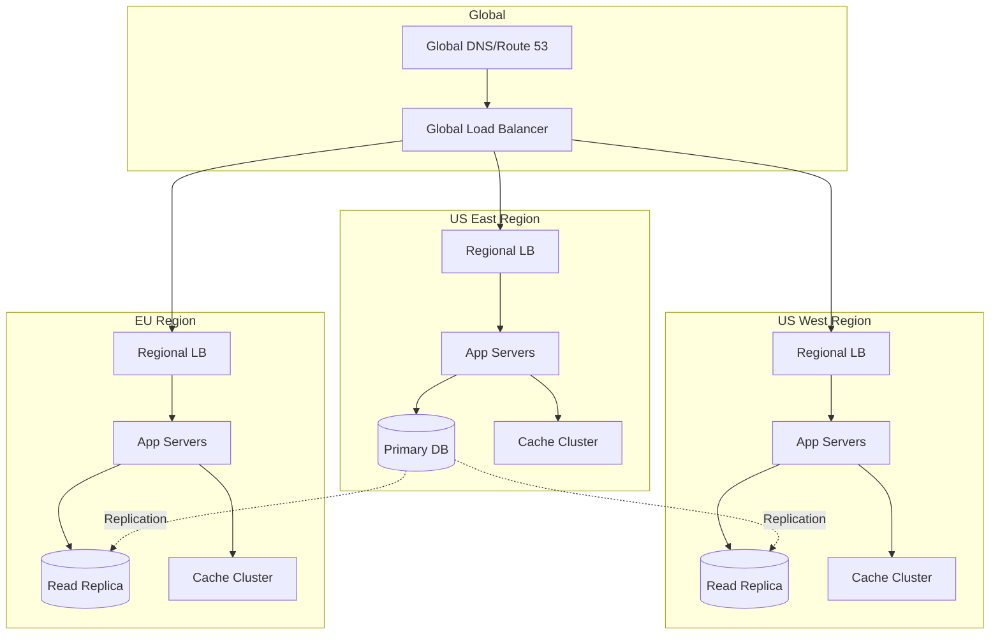

### 2. Container Orchestration
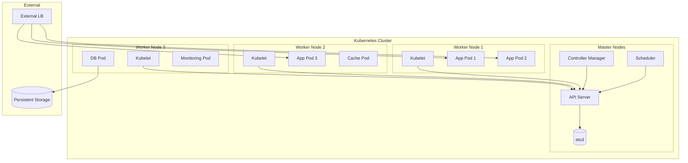

## Monitoring and Observability

### 1. Observability Stack
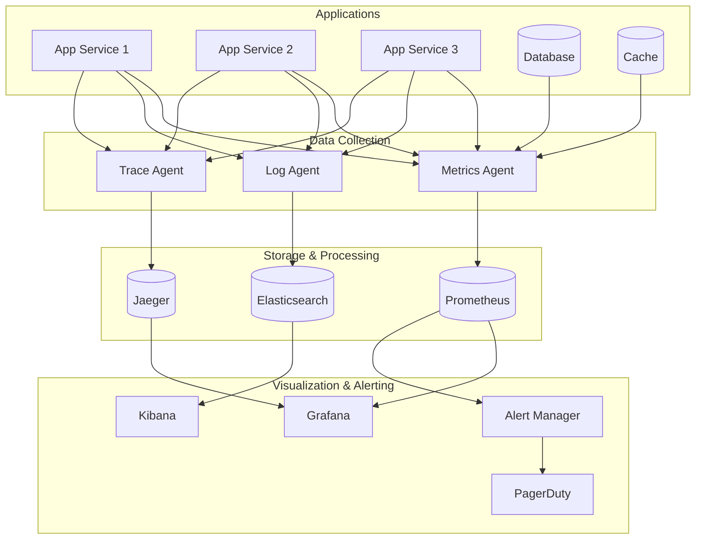

## Template Usage Guidelines

### Choosing the Right Template
1. **Basic Web App**: Simple CRUD applications, small to medium scale
2. **Microservices**: Complex applications with multiple domains
3. **Event-Driven**: Real-time systems, high scalability requirements
4. **Multi-Region**: Global applications, disaster recovery needs

### Customization Tips
1. **Replace Generic Names**: Use domain-specific service names
2. **Add Specific Components**: Include relevant technologies (Redis, Kafka, etc.)
3. **Show Data Flow**: Add arrows to indicate data direction
4. **Include Metrics**: Add capacity numbers where relevant
5. **Color Coding**: Use colors to group related components

### Best Practices
1. **Start Simple**: Begin with high-level architecture
2. **Progressive Detail**: Add detail in subsequent diagrams
3. **Consistent Naming**: Use consistent service and component names
4. **Clear Relationships**: Make connections and dependencies obvious
5. **Readable Layout**: Ensure diagrams are easy to follow

### Common Patterns to Include
- Load balancing and failover
- Caching at multiple levels
- Database replication and sharding
- Asynchronous processing
- Monitoring and logging
- Security boundaries
- Scaling bottlenecks and solutions