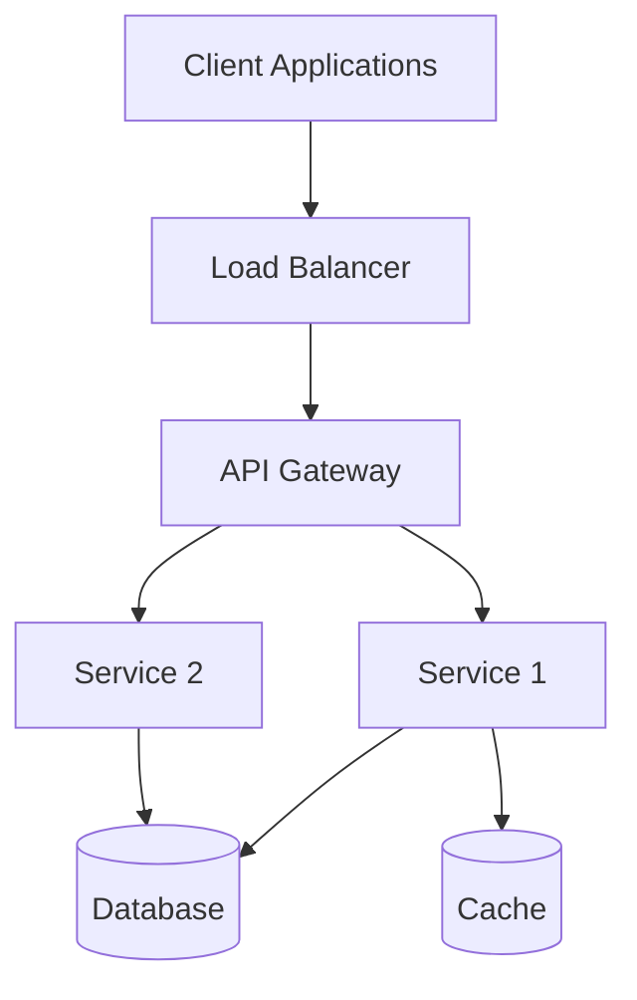
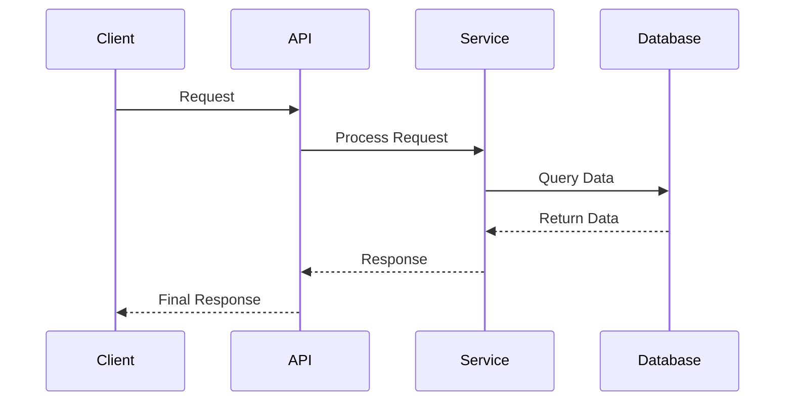

# [Problem Title] - System Design Interview Problem

## Metadata
- **Difficulty**: [Beginner/Easy/Medium/Hard/Expert]
- **Companies**: [Google, Meta, Amazon, Netflix, etc.]
- **Tags**: [distributed-systems, caching, databases, etc.]
- **Estimated Time**: 
  - Reading: [X] minutes
  - Solving: [X] minutes
  - Total: [X] minutes
- **Last Updated**: [Date]
- **Version**: [1.0]
- **Popularity**: [1-5 stars]

## Problem Statement

### Business Context
[Describe the real-world business scenario and why this system is needed]

### Core Problem
[Clear, concise problem statement - what system needs to be designed]

### User Stories
- As a [user type], I want [functionality], so that [benefit]
- As a [user type], I want [functionality], so that [benefit]

## Requirements Clarification

### Functional Requirements
- [ ] [Requirement 1]
- [ ] [Requirement 2]
- [ ] [Requirement 3]

### Non-Functional Requirements
- **Scale**: [Number of users, requests per second, data volume]
- **Performance**: [Latency requirements, throughput expectations]
- **Availability**: [Uptime requirements, disaster recovery needs]
- **Consistency**: [Data consistency requirements]
- **Security**: [Authentication, authorization, data protection needs]

### Constraints
- [ ] [Technical constraint 1]
- [ ] [Business constraint 1]
- [ ] [Resource constraint 1]

### Assumptions
- [ ] [Assumption 1]
- [ ] [Assumption 2]

## Capacity Estimation

### User Metrics
| Metric | Value | Calculation |
|--------|-------|-------------|
| Total Users | [X] | [Source/assumption] |
| Daily Active Users (DAU) | [X] | [X% of total users] |
| Peak Concurrent Users | [X] | [X% of DAU] |
| User Growth Rate | [X%] per year | [Market research/assumption] |

### Traffic Metrics
| Metric | Value | Calculation |
|--------|-------|-------------|
| Requests per Day | [X] | [DAU × avg requests per user] |
| Requests per Second (Average) | [X] | [Daily requests ÷ 86400] |
| Peak QPS | [X] | [Average QPS × peak factor] |
| Read:Write Ratio | [X:Y] | [Based on use case analysis] |

### Data Metrics
| Metric | Value | Calculation |
|--------|-------|-------------|
| Data per User | [X] KB/MB | [Based on feature analysis] |
| Total Data Storage | [X] GB/TB | [Users × data per user] |
| Daily Data Growth | [X] GB | [New users + existing user growth] |
| 5-Year Storage Projection | [X] TB | [Current + 5 years of growth] |

### Bandwidth Estimation
| Metric | Value | Calculation |
|--------|-------|-------------|
| Average Request Size | [X] KB | [API payload analysis] |
| Average Response Size | [X] KB | [Response payload analysis] |
| Peak Bandwidth | [X] Mbps | [Peak QPS × (request + response size)] |

## High-Level System Design

### Architecture Overview
[Brief description of the overall architecture approach]



### Core Components
1. **[Component 1]**: [Brief description and responsibility]
2. **[Component 2]**: [Brief description and responsibility]
3. **[Component 3]**: [Brief description and responsibility]

### Data Flow
[Describe the main data flow through the system]



## Detailed Component Design

### API Design
```yaml
# Example API endpoints
POST /api/v1/[resource]
GET /api/v1/[resource]/{id}
PUT /api/v1/[resource]/{id}
DELETE /api/v1/[resource]/{id}
```

### Database Design

#### Schema Design
```sql
-- Example table structure
CREATE TABLE [table_name] (
    id BIGINT PRIMARY KEY,
    [field1] VARCHAR(255) NOT NULL,
    [field2] TIMESTAMP DEFAULT CURRENT_TIMESTAMP,
    created_at TIMESTAMP DEFAULT CURRENT_TIMESTAMP,
    updated_at TIMESTAMP DEFAULT CURRENT_TIMESTAMP ON UPDATE CURRENT_TIMESTAMP
);
```

#### Indexing Strategy
- **Primary Index**: [Description]
- **Secondary Indexes**: [List and rationale]
- **Composite Indexes**: [For complex queries]

### Caching Strategy
- **Cache Levels**: [Browser, CDN, Application, Database]
- **Cache Patterns**: [Cache-aside, Write-through, etc.]
- **Cache Keys**: [Key naming strategy]
- **TTL Strategy**: [Time-to-live for different data types]

## Scaling the Design

### Bottleneck Analysis
1. **[Bottleneck 1]**: [Description and impact]
   - **Solution**: [Scaling approach]
   - **Trade-offs**: [Pros and cons]

2. **[Bottleneck 2]**: [Description and impact]
   - **Solution**: [Scaling approach]
   - **Trade-offs**: [Pros and cons]

### Horizontal Scaling Strategies
- **Database Sharding**: [Sharding key and strategy]
- **Service Partitioning**: [How to split services]
- **Load Distribution**: [Load balancing approach]

### Performance Optimizations
- **Database Optimizations**: [Indexing, query optimization]
- **Caching Optimizations**: [Multi-level caching strategy]
- **Network Optimizations**: [CDN, compression, etc.]

## Advanced Considerations

### Security & Privacy
- **Authentication**: [OAuth, JWT, etc.]
- **Authorization**: [RBAC, permissions model]
- **Data Protection**: [Encryption at rest and in transit]
- **Privacy Compliance**: [GDPR, CCPA considerations]

### Monitoring & Observability
- **Key Metrics**: [What to monitor]
- **Alerting**: [Alert conditions and thresholds]
- **Logging**: [What to log and log levels]
- **Distributed Tracing**: [Request flow tracking]

### Disaster Recovery
- **Backup Strategy**: [What, when, where to backup]
- **Failover Mechanisms**: [Automatic vs manual failover]
- **Recovery Time Objectives**: [RTO and RPO targets]

## Follow-up Questions

### Technical Deep Dives
- How would you handle [specific technical challenge]?
- What happens if [failure scenario] occurs?
- How would you optimize for [specific requirement]?

### Design Variations
- How would the design change for [different scale]?
- What if we had [different constraints]?
- How would you adapt this for [different use case]?

### Real-World Considerations
- How would you handle gradual rollout?
- What metrics would you track post-launch?
- How would you handle schema migrations?

## Learning Objectives

### Concepts Covered
- [ ] [Concept 1]
- [ ] [Concept 2]
- [ ] [Concept 3]

### Technologies Discussed
- [ ] [Technology 1]
- [ ] [Technology 2]
- [ ] [Technology 3]

### Design Patterns Applied
- [ ] [Pattern 1]
- [ ] [Pattern 2]
- [ ] [Pattern 3]

## Assessment Criteria

### Excellent Answer Includes
- [ ] Clear problem understanding and requirement gathering
- [ ] Realistic capacity estimation with proper calculations
- [ ] Well-structured high-level design with appropriate components
- [ ] Detailed component design with proper interfaces
- [ ] Thoughtful scaling strategies and bottleneck analysis
- [ ] Security and reliability considerations
- [ ] Clear communication and diagram usage

### Common Mistakes to Avoid
- [ ] Jumping to detailed design without clarifying requirements
- [ ] Unrealistic capacity estimations or missing calculations
- [ ] Over-engineering or under-engineering the solution
- [ ] Ignoring non-functional requirements
- [ ] Poor communication or unclear explanations
- [ ] Not considering failure scenarios or edge cases

### Interview Tips
- Start with clarifying questions - don't assume requirements
- Think out loud and explain your reasoning
- Use diagrams to communicate complex ideas
- Consider trade-offs and alternative approaches
- Ask for feedback and be open to suggestions
- Manage your time effectively across all sections

## Related Problems
- [Related Problem 1]: [Brief description of relationship]
- [Related Problem 2]: [Brief description of relationship]
- [Related Problem 3]: [Brief description of relationship]

## Additional Resources
- [Resource 1]: [Link and description]
- [Resource 2]: [Link and description]
- [Resource 3]: [Link and description]